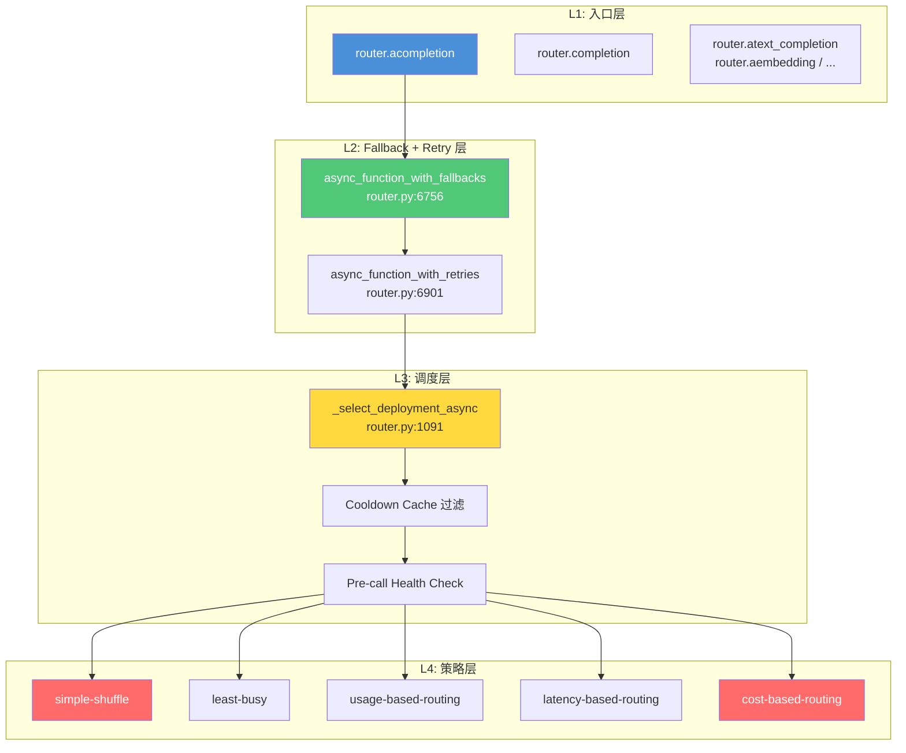
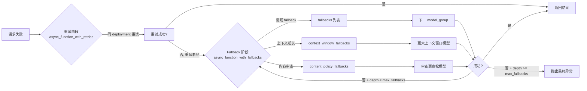
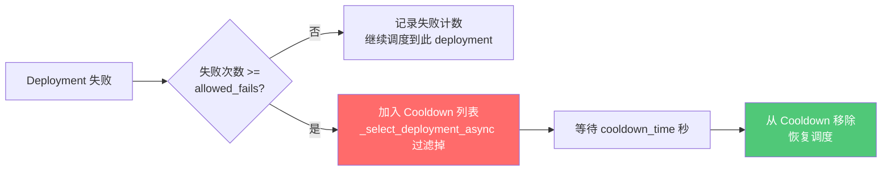

# LiteLLM 路由策略与 Fallback 机制源码剖析

> **版本**: v0.1 | **状态**: 正文  
> **源码版本**: LiteLLM v1.90.x  
> **核心文件**: `router.py`（~7200 行）、`router_strategy/`（13 个文件）、`router_utils/`（17 个文件）  
> **风格**: DDIA 式 — 每项主张均有源码行号支撑

---

## 一、引言：为什么需要路由与 Fallback

### 1.1 大模型时代的"分布式系统"问题

传统分布式系统需要负载均衡器来解决三个问题：**流量分配、故障转移、容量管理**。在大模型时代，这三个问题以更复杂的形式重现：

**流量分配**: 一个 `model="gpt-4"` 的背后可能有 10 个 deployment（不同 Provider、不同区域、不同 API Key），如何将请求分配给最合适的 deployment？

**故障转移**: 某个 deployment 可能因为 API 限流（RateLimit）、网络超时（Timeout）、内容审查拦截（ContentPolicyViolation）而失败，如何自动切换到备用 deployment？

**容量管理**: 每个 deployment 有 TPM/RPM 限额，如何在限额内最大化利用率，同时避免超限？

LiteLLM Router 的本质就是 **LLM 层的负载均衡器 + 断路器 + 降级引擎**。

### 1.2 本文范围

本文聚焦 Router 的两个核心机制：
- **路由策略**：5 种基础策略 + 4 种高级策略的源码实现
- **Fallback 机制**：Retry → 常规 Fallback → 专用 Fallback 的三层架构

不覆盖：Provider 适配（`llms/` 目录）、成本计算（`cost_calculator.py`）、Caching（`caching/` 目录）。

---

## 二、Router 整体架构

### 2.1 四层架构总览



**四层职责**：

| 层级 | 职责 | 核心文件 | 关键方法 |
|------|------|---------|---------|
| **L1 入口层** | 接收用户请求，统一参数格式 | `router.py:1851-2150` | `completion()`, `acompletion()` |
| **L2 Fallback+Retry** | 重试（同 deployment）+ 降级（换 model_group） | `router.py:6756-7200` | `async_function_with_fallbacks()`, `async_function_with_retries()` |
| **L3 调度层** | 过滤冷却 deployment → 选目标 deployment | `router.py:1091-1647` | `_select_deployment_async()` |
| **L4 策略层** | 执行具体路由策略，返回最优 deployment | `router_strategy/*.py` | 各策略的 `async_get_available_deployments()` |

### 2.2 Router 初始化关键参数

`Router.__init__`（`router.py:192-676`）接受超过 60 个参数，按功能分为 6 组：

```python
router = litellm.Router(
    # ====== 1. 模型注册 ======
    model_list=[
        {
            "model_name": "gpt-4",
            "litellm_params": {
                "model": "azure/gpt-4",
                "api_key": os.environ["AZURE_API_KEY"],
                "api_base": "https://xxx.openai.azure.com/",
            },
            "tpm": 100000,      # 每分钟 token 限额
            "rpm": 1000,         # 每分钟请求限额
            "weight": 1,         # 权重（simple-shuffle 用）
        },
        {
            "model_name": "gpt-4",  # 同名 = 同一 model_group
            "litellm_params": {
                "model": "openai/gpt-4",
                "api_key": os.environ["OPENAI_API_KEY"],
            },
        },
    ],

    # ====== 2. 路由策略 ======
    routing_strategy="latency-based-routing",  # 5 种之一
    routing_groups=[...],                       # 按模型名分组独立路由（可选）
    routing_strategy_args={"ttl": 3600},        # 策略参数

    # ====== 3. 重试 ======
    num_retries=3,                              # 同 deployment 重试次数
    retry_after=0,                              # 失败后最小等待秒数
    retry_policy=litellm.RetryPolicy(           # 按异常类型定制
        RateLimitErrorRetries=5,
        TimeoutErrorRetries=3,
        ContentPolicyViolationErrorRetries=0,
    ),

    # ====== 4. Fallback ======
    fallbacks=[
        {"gpt-4": "gpt-3.5-turbo"},             # 特定模型 fallback
        {"*": "gpt-4o-mini"},                    # 全局兜底
    ],
    max_fallbacks=5,                            # 最大 fallback 深度
    context_window_fallbacks=[                  # 上下文超长自动降级
        {"gpt-3.5-turbo": "gpt-4-turbo"}
    ],
    content_policy_fallbacks=[                  # 内容审查拦截自动降级
        {"azure-gpt-4": "openai-gpt-4"}
    ],

    # ====== 5. Cooldown ======
    allowed_fails=3,                            # 失败 N 次后进入冷却
    cooldown_time=60,                           # 冷却时长（秒）

    # ====== 6. 高可用 ======
    redis_url="redis://localhost:6379",         # 多实例共享状态
    enable_pre_call_checks=True,                # 调用前健康检查
    enable_weighted_failover=True,              # 同组内权重故障转移
)
```

**关键概念澄清**：

- **`model_name`** = 路由别名（用户看到的名字）。相同 `model_name` 的 deployment 属于同一 **model_group**。
- **`litellm_params.model`** = 实际 Provider 模型名（如 `azure/gpt-4`、`openai/gpt-4`）。
- 路由策略在 **model_group 内**执行，选择最优 deployment；Fallback 在 **model_group 之间**执行，切换到其他 model_group。

### 2.3 请求生命周期（完整链路）

```
用户调用 router.acompletion(model="gpt-4", messages=[...])
  │
  │  L1: 入口层（router.py:2074）
  ├─ acompletion()
  │   ├─ 参数校验 + 默认值填充
  │   ├─ _update_kwargs_before_fallbacks()    # 注入 fallback 参数
  │   │
  │   │  L2: Fallback 层（router.py:6756）
  │   ├─ async_function_with_fallbacks()
  │   │   │
  │   │   │  L2: Retry 层（router.py:6901）
  │   │   ├─ async_function_with_retries()
  │   │   │   │
  │   │   │   │  L3: 调度层（router.py:1091）
  │   │   │   ├─ _select_deployment_async()
  │   │   │   │   ├─ ① Cooldown 过滤（排除冷却中 deployment）
  │   │   │   │   ├─ ② Pre-call Health Check（可选）
  │   │   │   │   │
  │   │   │   │   │  L4: 策略层（router_strategy/*.py）
  │   │   │   │   ├─ ③ Routing Strategy Engine → 选最优 deployment
  │   │   │   │   │
  │   │   │   │   └─ 返回 Deployment 对象
  │   │   │   │
  │   │   │   ├─ 调用 litellm.acompletion(deployment, ...)
  │   │   │   │
  │   │   │   └─ 成功 → 记录成功事件（更新策略状态）
  │   │   │   └─ 失败 → 重试（同 deployment，最多 num_retries 次）
  │   │   │
  │   │   └─ 重试耗尽 → 触发 Fallback
  │   │       ├─ 按异常类型查找匹配的 fallback 列表
  │   │       ├─ 对每个 fallback model_group 递归调用
  │   │       │   async_function_with_fallbacks()
  │   │       └─ 所有 fallback 耗尽 → 抛出最终异常
  │   │
  │   └─ 成功 → 添加 x-litellm-* 响应头
  │
  └─ 返回 ModelResponse
```

**关键设计洞察**: Retry 和 Fallback 是**两层独立机制**。Retry 是在**同一个 deployment** 内重复尝试（适用于瞬时故障如网络抖动）；Fallback 是**切换到不同 model_group**（适用于持久性故障如限流、内容审查）。

---

## 三、路由策略详解

### 3.1 策略注册与调度引擎

Router 启动时，`routing_strategy_init()`（`router.py:949-1089`）将字符串参数映射为具体策略实例：

```python
# router.py:949-1089 核心逻辑
def routing_strategy_init(self, routing_strategy, routing_strategy_args):
    """初始化路由策略引擎"""
    strategy_map = {
        "simple-shuffle":       self._init_simple_shuffle,
        "least-busy":           self._init_least_busy,
        "usage-based-routing":  self._init_lowest_tpm_rpm,
        "latency-based-routing": self._init_lowest_latency,
        "cost-based-routing":   self._init_lowest_cost,
    }

    init_fn = strategy_map.get(routing_strategy)
    if not init_fn:
        raise ValueError(f"Unknown routing strategy: {routing_strategy}")

    # 初始化策略实例，注入 DualCache（In-Memory + Redis）
    init_fn(routing_strategy_args)
```

所有策略继承 `BaseRoutingStrategy`（`router_strategy/base_routing_strategy.py`），核心抽象是：

```python
class BaseRoutingStrategy(ABC):
    def __init__(self, dual_cache: DualCache, ...):
        self.dual_cache = dual_cache  # In-Memory + Redis 双缓存

    # 子类必须实现：
    # async def async_get_available_deployments(...) -> List[Deployment]
```

**双缓存架构**（`caching/caching.py`）：
- **In-Memory Cache**: 进程内，延迟 < 1ms，但多实例不共享
- **Redis Cache**: 跨实例共享，延迟 ~5ms
- **同步机制**: 后台定时任务 `_sync_in_memory_spend_with_redis()` 批量同步（`base_routing_strategy.py:75-120`）

### 3.2 simple-shuffle（默认策略）

**源码**: `router_strategy/simple_shuffle.py`（~2700 字节，最轻量）

```python
# router_strategy/simple_shuffle.py
def simple_shuffle(deployments: List[Deployment]) -> List[Deployment]:
    """
    随机打乱 deployment 列表，支持权重
    """
    import random

    # 分离有权重和无权重的 deployment
    weighted = [d for d in deployments if d.get("weight", 1) != 1]
    unweighted = [d for d in deployments if d.get("weight", 1) == 1]

    if weighted:
        # 按权重概率选择
        weights = [d["weight"] for d in weighted]
        total = sum(weights)
        # 权重归一化为概率
        probs = [w / total for w in weights]
        # 按概率打乱
        random.shuffle(weighted, lambda: random.choices(range(len(weighted)), weights=probs)[0])
    else:
        random.shuffle(unweighted)

    return weighted + unweighted
```

**特点**：
- 零状态维护：不记录历史请求，不做性能分析
- 权重感知：支持 `weight` 字段，按权重概率分配
- 适用场景：deployment 同质化（如同一区域的多 API Key 部署）

**配置示例**：

```python
router = Router(
    model_list=[
        {"model_name": "gpt-4", "litellm_params": {...}, "weight": 3},  # 3/5 概率
        {"model_name": "gpt-4", "litellm_params": {...}, "weight": 1},  # 1/5 概率
        {"model_name": "gpt-4", "litellm_params": {...}, "weight": 1},  # 1/5 概率
    ],
    routing_strategy="simple-shuffle",  # 可省略，这是默认值
)
```

### 3.3 least-busy（最少繁忙）

**源码**: `router_strategy/least_busy.py`（~9600 字节）

**原理**: 选择**当前活跃请求数最少**的 deployment。

```python
# router_strategy/least_busy.py 核心逻辑
class LeastBusyLoggingHandler(CustomLogger):
    """跟踪每个 deployment 的并发请求数"""

    def log_success_event(self, kwargs, response_obj, start_time, end_time):
        """请求成功: 递减并发计数"""
        deployment_id = kwargs["litellm_params"]["model_info"]["id"]
        key = f"leastbusy:{deployment_id}"
        self.dual_cache.in_memory_cache.async_increment(key, value=-1)

    def log_failure_event(self, kwargs, response_obj, start_time, end_time):
        """请求失败: 同样递减并发计数"""
        ...

    def get_least_busy_deployments(self, deployments):
        """返回按并发数升序排序的 deployment 列表"""
        for d in deployments:
            dep_id = d["model_info"]["id"]
            concurrency = self.dual_cache.in_memory_cache.get(f"leastbusy:{dep_id}") or 0
            d["_concurrency"] = concurrency
        return sorted(deployments, key=lambda d: d["_concurrency"])
```

**关键细节**：
- 并发计数在请求发起时 +1，成功/失败回调时 -1
- 不需要等待响应完成，只要请求发出就计数
- 适合 deployment 性能相近、需要均匀分配的场景

### 3.4 usage-based-routing（TPM/RPM 最低优先）

**源码**: `router_strategy/lowest_tpm_rpm.py` + `lowest_tpm_rpm_v2.py`

**原理**: 选择**当前分钟 TPM（Token Per Minute）/ RPM（Request Per Minute）用量最低**的 deployment。

```python
# router_strategy/lowest_tpm_rpm.py 核心逻辑
class LowestTPMLoggingHandler(CustomLogger):
    """跟踪每个 deployment 的 TPM/RPM 用量"""

    def log_success_event(self, kwargs, response_obj, start_time, end_time):
        model_group = kwargs["litellm_params"]["model_group"]
        dep_id = kwargs["litellm_params"]["model_info"]["id"]

        # 时间粒度: 日期-小时-分钟
        precise_minute = datetime.now().strftime("%Y-%m-%d-%H-%M")

        # 获取 token 数
        total_tokens = response_obj.usage.total_tokens if response_obj.usage else 0

        # 更新缓存: {model_group}_map: {dep_id: {"tpm": N, "rpm": M, "minute": "..."}}
        latency_key = f"{model_group}_map"
        current_data = self.dual_cache.in_memory_cache.get(latency_key) or {}

        if dep_id not in current_data:
            current_data[dep_id] = {}

        if current_data[dep_id].get("minute") != precise_minute:
            # 新分钟，重置计数
            current_data[dep_id] = {
                "minute": precise_minute,
                "tpm": total_tokens,
                "rpm": 1,
            }
        else:
            current_data[dep_id]["tpm"] += total_tokens
            current_data[dep_id]["rpm"] += 1

        self.dual_cache.in_memory_cache.set(latency_key, current_data)
```

**v2 改进**（`lowest_tpm_rpm_v2.py`）：
- 更精确的滑动窗口计算（不是严格按分钟切分）
- Redis Pipeline 批量同步，减少网络开销
- 支持按 `rpm` 或 `tpm` 分别排序

**适用场景**: 有 TPM/RPM 限额的部署（如 Azure OpenAI 的 tier 限制），最大化利用配额而不超限。

### 3.5 latency-based-routing（延迟最低优先）

**源码**: `router_strategy/lowest_latency.py`（~24000 字节，最复杂的策略）

**原理**: 选择**历史平均响应延迟最低**的 deployment。

```python
# router_strategy/lowest_latency.py 核心逻辑
class LowestLatencyLoggingHandler(CustomLogger):
    """跟踪每个 deployment 的响应延迟"""

    def log_success_event(self, kwargs, response_obj, start_time, end_time):
        model_group = kwargs["litellm_params"]["model_group"]
        dep_id = kwargs["litellm_params"]["model_info"]["id"]

        # 计算响应时间（毫秒）
        response_ms = end_time - start_time

        # 流式请求：使用 Time-To-First-Token (TTFT) 而非总耗时
        if kwargs.get("stream"):
            ttft = kwargs.get("completion_start_time", end_time) - start_time
            time_to_first_token = ttft

        # 存储到缓存: {model_group}_map: {dep_id: {"latency": [t1, t2, ...]}}
        latency_key = f"{model_group}_map"
        current_data = self.dual_cache.in_memory_cache.get(latency_key) or {}

        if dep_id not in current_data:
            current_data[dep_id] = {"latency": []}

        current_data[dep_id]["latency"].append(response_ms)

        # 限制历史列表大小（默认 10），防止内存膨胀
        max_size = self.routing_args.max_latency_list_size  # 默认 10
        if len(current_data[dep_id]["latency"]) > max_size:
            current_data[dep_id]["latency"] = current_data[dep_id]["latency"][-max_size:]

        self.dual_cache.in_memory_cache.set(latency_key, current_data)

    def get_lowest_latency_deployments(self, deployments):
        """返回按平均延迟升序排序的 deployment 列表"""
        model_group = ...  # 获取当前 model_group
        latency_key = f"{model_group}_map"
        data = self.dual_cache.in_memory_cache.get(latency_key) or {}

        for d in deployments:
            dep_id = d["model_info"]["id"]
            latencies = data.get(dep_id, {}).get("latency", [])
            d["_avg_latency"] = sum(latencies) / len(latencies) if latencies else float('inf')

        return sorted(deployments, key=lambda d: d["_avg_latency"])
```

**关键细节**：
- **TTFT（Time-To-First-Token）**: 流式请求使用首 token 延迟，而非总耗时。这更准确地反映了用户体验。
- **滑动窗口**: 默认保留最近 10 次请求的延迟数据，TTL 默认 1 小时。
- **冷启动**: 新 deployment 无历史数据时，延迟为 `inf`，排在最后，直到有足够样本。

**配置示例**：

```python
router = Router(
    model_list=[
        {"model_name": "gpt-4", "litellm_params": {"model": "azure/gpt-4", ...}},
        {"model_name": "gpt-4", "litellm_params": {"model": "openai/gpt-4", ...}},
        {"model_name": "gpt-4", "litellm_params": {"model": "vertex_ai/gpt-4", ...}},
    ],
    routing_strategy="latency-based-routing",
    routing_strategy_args={
        "ttl": 3600,                # 延迟数据 TTL（1 小时）
        "lowest_latency_buffer": 0,  # 延迟容忍缓冲（0 = 严格选最低）
    },
)
```

### 3.6 cost-based-routing（成本最低优先）

**源码**: `router_strategy/lowest_cost.py`（~12000 字节）

**原理**: 选择**单位 token 成本最低**的 deployment。

```python
# router_strategy/lowest_cost.py 核心逻辑
class LowestCostLoggingHandler(CustomLogger):
    """按成本排序 deployment"""

    def get_lowest_cost_deployments(self, deployments):
        """返回按成本升序排序的 deployment 列表"""
        from litellm import cost_per_token

        for d in deployments:
            model = d["litellm_params"]["model"]
            # 从 model_prices_and_context_window_backup.json 查价格
            input_cost, output_cost = cost_per_token(model=model, prompt_tokens=1, completion_tokens=1)
            d["_cost_per_token"] = (input_cost + output_cost) / 2

        return sorted(deployments, key=lambda d: d["_cost_per_token"])
```

**价格数据源**: `model_prices_and_context_window_backup.json`（~1.5MB，覆盖 2000+ 模型）。

### 3.7 高级路由策略

| 策略 | 源码目录 | 原理 | 适用场景 |
|------|---------|------|---------|
| **Complexity Router** | `complexity_router/` | 先由小模型评估 prompt 复杂度，再决定用哪个模型 | 简单问题用便宜模型，复杂问题用强模型 |
| **Quality Router** | `quality_router/` | 按历史输出质量评分路由 | 对输出质量有严格要求的场景 |
| **Adaptive Router** | `adaptive_router/` | 动态感知环境（负载、错误率）自动调整策略 | 环境变化频繁的场景 |
| **Auto Router** | `auto_router/` | ML 驱动的自动路由，学习历史请求模式 | 大规模生产环境 |

### 3.8 Routing Groups（分组路由）

`routing_strategy` 是全局策略，作用于所有未被显式分组的模型。`routing_groups` 允许为特定模型组指定独立策略：

```python
from litellm.types.router import RoutingGroup

router = Router(
    model_list=[
        # GPT 系列
        {"model_name": "gpt-4", "litellm_params": {"model": "openai/gpt-4", ...}},
        {"model_name": "gpt-4", "litellm_params": {"model": "azure/gpt-4", ...}},
        {"model_name": "gpt-3.5-turbo", "litellm_params": {"model": "openai/gpt-3.5-turbo", ...}},

        # Claude 系列
        {"model_name": "claude-3-opus", "litellm_params": {"model": "anthropic/claude-3-opus", ...}},
        {"model_name": "claude-3-sonnet", "litellm_params": {"model": "anthropic/claude-3-sonnet", ...}},
    ],
    # 全局默认策略
    routing_strategy="simple-shuffle",

    # GPT 系列独立使用 latency-based 策略
    routing_groups=[
        RoutingGroup(
            group_name="gpt-models",
            model_names=["gpt-4", "gpt-3.5-turbo"],
            routing_strategy="latency-based-routing",
            routing_strategy_args={"ttl": 1800},
        ),
    ],
)
```

**分组规则**：每个 deployment 最多属于一个显式 group，其余归入 "default" 组（受 `routing_strategy` 控制）。

---

## 四、Fallback 机制详解

### 4.1 Fallback 的三层架构



### 4.2 Retry 机制（同 deployment 重试）

**源码**: `router.py:6901-7175`，`async_function_with_retries()`

```python
# router.py:6901 核心签名
async def async_function_with_retries(self, *args, **kwargs):
    """
    对同一个 deployment 进行重试。
    重试次数由 num_retries 和 retry_policy 共同决定。
    """
    original_function = kwargs.pop("original_function")
    num_retries = kwargs.pop("num_retries")

    # 重试策略解析
    model_group = kwargs.get("model")
    model_group_retry_policy = kwargs.pop("model_group_retry_policy", self.model_group_retry_policy)

    _metadata["attempted_retries"] = 0
    _metadata["max_retries"] = num_retries

    try:
        # 第一次调用
        response = await self.make_call(original_function, *args, **kwargs)
        response = add_retry_headers_to_response(
            response=response, attempted_retries=0, max_retries=None
        )
        return response
    except Exception as e:
        current_attempt = 0
        original_exception = e

        # 获取该异常类型允许的重试次数
        num_retries_from_policy = _get_num_retries_from_retry_policy(
            exception=e,
            retry_policy=self.retry_policy,
            model_group_retry_policy=model_group_retry_policy,
            model_group=model_group,
        )
        # 取两者中的最大值
        num_retries = max(num_retries, num_retries_from_policy)

        while current_attempt < num_retries:
            try:
                current_attempt += 1
                _metadata["attempted_retries"] = current_attempt

                # 等待 retry_after 秒
                if self.retry_after > 0:
                    await asyncio.sleep(self.retry_after)

                response = await self.make_call(original_function, *args, **kwargs)
                response = add_retry_headers_to_response(
                    response=response, attempted_retries=current_attempt, max_retries=num_retries
                )
                return response
            except Exception as retry_e:
                last_exception = retry_e

        # 所有重试耗尽
        raise last_exception
```

**重试策略解析**（`router_utils/get_retry_from_policy.py`）：

```python
def get_num_retries_from_retry_policy(exception, retry_policy, model_group_retry_policy, model_group):
    """根据异常类型确定重试次数"""
    # 优先级: model_group_retry_policy > retry_policy > 默认值

    # 检查模型组定制策略
    if model_group in model_group_retry_policy:
        policy = model_group_retry_policy[model_group]
    else:
        policy = retry_policy or RetryPolicy()

    # 按异常类型匹配
    if isinstance(exception, litellm.RateLimitError):
        return policy.RateLimitErrorRetries or 0
    elif isinstance(exception, litellm.Timeout):
        return policy.TimeoutErrorRetries or 0
    elif isinstance(exception, litellm.ContentPolicyViolationError):
        return policy.ContentPolicyViolationErrorRetries or 0
    elif isinstance(exception, litellm.BadRequestError):
        return policy.BadRequestErrorRetries or 0
    ...
```

**RetryPolicy 默认值**（`types/router.py`）：

```python
class RetryPolicy(BaseModel):
    TimeoutErrorRetries: Optional[int] = None
    RateLimitErrorRetries: Optional[int] = None
    BadRequestErrorRetries: Optional[int] = None
    ContentPolicyViolationErrorRetries: Optional[int] = None
```

### 4.3 常规 Fallback（切换 model_group）

**源码**: `router_utils/fallback_event_handlers.py:run_async_fallback()`

```python
# router_utils/fallback_event_handlers.py 核心逻辑
async def run_async_fallback(
    litellm_router,
    *args,
    fallback_model_group: List[str],
    original_model_group: str,
    original_exception: Exception,
    fallback_depth: int,
    max_fallbacks: int,
    **kwargs,
):
    """
    递归 fallback：尝试 fallback_model_group 列表中的每个模型组。

    参数:
        fallback_model_group: fallback 模型组列表，如 ["gpt-4", "gpt-3.5-turbo"]
        fallback_depth: 当前 fallback 深度（递归层级）
        max_fallbacks: 最大 fallback 深度
    """
    # ====== 终止条件：达到最大 fallback 深度 ======
    if fallback_depth >= max_fallbacks:
        raise original_exception

    error_from_fallbacks = original_exception

    for mg in fallback_model_group:
        # 跳过原始模型组（避免死循环）
        if mg == original_model_group:
            continue

        try:
            # 记录 fallback 日志
            kwargs = litellm_router.log_retry(kwargs=kwargs, e=original_exception)
            verbose_router_logger.info(f"Falling back to model_group = {mg}")

            # 更新 model 参数
            if isinstance(mg, str):
                kwargs["model"] = mg
            elif isinstance(mg, dict):
                kwargs.update(mg)

            # 递增 fallback 深度
            fallback_depth += 1
            kwargs["fallback_depth"] = fallback_depth
            kwargs["max_fallbacks"] = max_fallbacks

            # 递归调用 async_function_with_fallbacks（支持嵌套 fallback）
            response = await litellm_router.async_function_with_fallbacks(
                *args, **kwargs
            )

            # 成功：添加 fallback 响应头
            response = add_fallback_headers_to_response(
                response=response,
                attempted_fallbacks=fallback_depth,
            )
            return response

        except Exception as fallback_e:
            error_from_fallbacks = fallback_e
            verbose_router_logger.warning(
                f"Fallback to {mg} also failed: {fallback_e}"
            )

    # 所有 fallback 都失败
    raise error_from_fallbacks
```

**Fallback 格式**（`router.py:1648-1850`，`validate_fallbacks()`）：

```python
# 格式 1: 字符串映射
fallbacks = [{"gpt-4": "gpt-3.5-turbo"}]
# → gpt-4 失败时 fallback 到 gpt-3.5-turbo

# 格式 2: 列表（多个 fallback 选项，按顺序尝试）
fallbacks = [{"gpt-4": ["gpt-3.5-turbo", "claude-sonnet"]}]
# → gpt-4 失败时先试 gpt-3.5-turbo，再试 claude-sonnet

# 格式 3: 通配符（全局兜底）
fallbacks = [{"*": "gpt-4o-mini"}]
# → 任何模型失败时都 fallback 到 gpt-4o-mini

# default_fallbacks 自动追加为通配符
# 如果设置了 default_fallbacks=["gpt-4o-mini"]
# 则实际 fallbacks 变为: [..., {"*": ["gpt-4o-mini"]}]
```

### 4.4 Context Window Fallback

**触发条件**: `ContextWindowExceededError` 异常。

```python
# router.py 中的处理逻辑
context_window_fallbacks = [
    {"gpt-3.5-turbo": "gpt-4-turbo"},    # 16K → 128K
    {"claude-sonnet": "claude-opus"},     # 200K → 200K（但更强）
]
```

**工作原理**:
1. `async_function_with_retries()` 捕获到 `ContextWindowExceededError`
2. 查 `context_window_fallbacks` 表，找到对应的 fallback model_group
3. 调用 `run_async_fallback()` 切换到新模型
4. **注意**: Context Window Fallback 不走常规 retry（因为重试无意义，必须换大窗口模型）

### 4.5 Content Policy Fallback

**触发条件**: `ContentPolicyViolationError` 异常。

```python
content_policy_fallbacks = [
    {"azure-gpt-4": "openai-gpt-4"},     # Azure 审核过严 → OpenAI 直连
    {"azure-gpt-3.5": "openai-gpt-3.5-turbo"},
]
```

**工作原理**:
1. Azure OpenAI 的内容审查（Content Filter）拦截了请求
2. 抛出 `ContentPolicyViolationError`
3. 查 `content_policy_fallbacks` 表，切换到审查更宽松的 provider

### 4.6 Fallback 的异常判定表

| 异常类型 | 触发 Retry? | 触发 Fallback? | 原因 |
|---------|:-----------:|:-------------:|------|
| `RateLimitError` | ✅ | ✅ | 限流是瞬时的，重试可能成功；换模型也可能不超限 |
| `Timeout` | ✅ | ✅ | 超时可能是网络抖动；换模型可能更快 |
| `APIConnectionError` | ✅ | ✅ | 网络问题 |
| `ContextWindowExceededError` | ❌ | ✅（专用） | 重试无意义，必须换大窗口模型 |
| `ContentPolicyViolationError` | ❌ | ✅（专用） | 重试无意义，必须换审查策略 |
| `BadRequestError` | ❌ | ❌ | 请求本身有问题，换模型也一样失败 |
| `AuthenticationError` | ❌ | ❌ | 认证问题，换模型需要新 API Key |
| `InternalServerError` | ✅ | ✅ | Provider 内部错误 |

**关键洞察**: LiteLLM 的异常分类器（`litellm_core_utils/exception_mapping_utils`）将上游 Provider 的错误码映射为统一的 LiteLLM 异常类型，然后由 Retry Policy 和 Fallback 机制分别处理。

### 4.7 enable_weighted_failover（同组内权重故障转移）

这是 v1.90 新增的功能（`router.py:370`）：

```python
router = Router(
    model_list=[
        {"model_name": "gpt-4", "litellm_params": {"model": "azure/gpt-4", ...}, "weight": 3},
        {"model_name": "gpt-4", "litellm_params": {"model": "openai/gpt-4", ...}, "weight": 1},
    ],
    routing_strategy="simple-shuffle",
    enable_weighted_failover=True,  # 新增
)
```

**工作流程**:
1. 请求首先按权重随机分配到 azure/gpt-4（权重 3/4）
2. 如果 azure/gpt-4 失败且异常可重试
3. **不是直接进入跨组 fallback**，而是先在**同 model_group 内**重新按权重分配
4. 这次可能分配到 openai/gpt-4（权重 1/3）
5. 同组内所有 deployment 都失败后，才进入跨组 fallback

**优势**: 减少不必要的跨组 fallback，优先在同组内解决。

### 4.8 Fallback 响应头（可观测性）

**源码**: `router_utils/add_retry_fallback_headers.py`

```python
def add_fallback_headers_to_response(response, attempted_fallbacks):
    """添加 fallback 次数到响应头"""
    response._hidden_params["attempted_fallbacks"] = attempted_fallbacks
    return response

def add_retry_headers_to_response(response, attempted_retries, max_retries):
    """添加重试次数到响应头"""
    response._hidden_params["attempted_retries"] = attempted_retries
    response._hidden_params["max_retries"] = max_retries
    return response
```

**响应头**：
- `x-litellm-attempted-retries`: 实际重试次数
- `x-litellm-attempted-fallbacks`: 实际 fallback 次数

可用于监控 fallback 频率，如果某个模型频繁触发 fallback，说明需要调整 fallback 链或修复底层问题。

---

## 五、Cooldown 机制（失败隔离与自动恢复）

### 5.1 Cooldown 原理



**源码**: `router_utils/cooldown_handlers.py` + `router_utils/cooldown_cache.py`

```python
# router_utils/cooldown_handlers.py
DEFAULT_COOLDOWN_TIME_SECONDS = 60

async def _async_get_cooldown_deployments(cache, model_group, current_time):
    """获取当前处于 cooldown 状态的 deployment 列表"""
    key = f"lite:cooldowndeployments:{model_group}"
    cooldown_list = await cache.async_get_cache(key) or []

    # 过滤掉已过期的 cooldown
    active_cooldowns = []
    for item in cooldown_list:
        if isinstance(item, dict):
            cooldown_time = item.get("cooldown_time", DEFAULT_COOLDOWN_TIME_SECONDS)
            cooldown_start = item.get("cooldown_start_time", 0)
            if current_time - cooldown_start < cooldown_time:
                active_cooldowns.append(item["deployment_id"])
    return active_cooldowns

async def _set_cooldown_deployments(cache, model_group, deployment_id, cooldown_time):
    """将 deployment 加入 cooldown 列表"""
    key = f"lite:cooldowndeployments:{model_group}"
    cooldown_list = await cache.async_get_cache(key) or []

    cooldown_list.append({
        "deployment_id": deployment_id,
        "cooldown_time": cooldown_time,
        "cooldown_start_time": time.time(),
    })

    await cache.async_set_cache(
        key=key,
        value=cooldown_list,
        ttl=cooldown_time * 2,  # TTL 设为 cooldown_time 的 2 倍，保证过期后自动清理
    )
```

### 5.2 Cooldown 关键参数

| 参数 | 默认值 | 说明 | 源码位置 |
|------|--------|------|---------|
| `allowed_fails` | `model_tpm * 0.01`（自动计算） | 失败 N 次后进入冷却 | `router.py:304` |
| `cooldown_time` | 60 秒 | 冷却时长 | `router.py:308` |
| `disable_cooldowns` | False | 完全禁用冷却机制 | `router.py:311` |
| `retry_after` | 0 秒 | 失败后最小重试间隔 | `router.py:295` |

**allowed_fails 自动计算逻辑**（`router.py`）：

```python
# 如果没显式设置 allowed_fails，根据 TPM 自动计算
if allowed_fails is None:
    # 默认: TPM 的 1%（最少 3 次）
    allowed_fails = max(3, int(model_tpm * 0.01))
```

### 5.3 Pre-call Health Check

**源码**: `router_utils/pre_call_checks/`

在 `_select_deployment_async()` 选 deployment **之前**执行的健康检查：

```python
# router.py: _select_deployment_async() 中的 pre-call 检查
if self.enable_pre_call_checks:
    # 1. 部署亲和性检查
    deployment_affinity_check = DeploymentAffinityCheck(...)
    healthy_deployments = deployment_affinity_check.filter(deployments)

    # 2. 模型限流检查
    rate_limit_check = ModelRateLimitingCheck(...)
    healthy_deployments = rate_limit_check.filter(healthy_deployments)

    # 3. Prompt Caching 可用性检查
    caching_check = PromptCachingDeploymentCheck(...)
    healthy_deployments = caching_check.filter(healthy_deployments)
```

**三个检查的作用**：

| 检查 | 文件 | 作用 |
|------|------|------|
| DeploymentAffinityCheck | `pre_call_checks/deployment_affinity_check.py` | 确保 deployment 与请求的区域/偏好匹配 |
| ModelRateLimitingCheck | `pre_call_checks/model_rate_limit_check.py` | 预测是否即将触发限流，提前跳过 |
| PromptCachingDeploymentCheck | `pre_call_checks/prompt_caching_deployment_check.py` | 检查 deployment 是否支持 Prompt Caching |

### 5.4 Health State Cache

**源码**: `router_utils/health_state_cache.py`

维护每个 deployment 的健康状态，支持 Redis 多实例同步：

```python
class DeploymentHealthCache:
    """
    维护 deployment 健康状态:
    - healthy: 正常调度
    - unhealthy: 失败次数接近 allowed_fails 阈值
    - cooldown: 已进入冷却，不参与调度
    """

    def record_failure(self, deployment_id, model_group):
        """记录一次失败"""
        key = f"health:{model_group}:{deployment_id}"
        failures = self.cache.get(key, 0) + 1
        self.cache.set(key, failures, ttl=self.cooldown_time * 2)

        if failures >= self.allowed_fails:
            self.set_cooldown(deployment_id, model_group)

    def is_healthy(self, deployment_id, model_group):
        """检查 deployment 是否健康"""
        key = f"health:{model_group}:{deployment_id}"
        failures = self.cache.get(key, 0)
        return failures < self.allowed_fails
```

---

## 六、源码关键路径解读

### 6.1 核心调用链路（源码行号标注）

| 步骤 | 方法 | 源码位置 | 关键逻辑 |
|------|------|---------|---------|
| 1 | `acompletion()` | `router.py:2074-2150` | 入口：参数校验 + fallback 参数注入 |
| 2 | `async_function_with_fallbacks()` | `router.py:6756-6900` | Fallback 外层包装 |
| 3 | `async_function_with_retries()` | `router.py:6901-7175` | Retry 内层包装 + 重试策略解析 |
| 4 | `make_call()` | `router.py` | 调用 `_select_deployment_async()` → 选 deployment → 调 `litellm.acompletion()` |
| 5 | `_select_deployment_async()` | `router.py:1091-1300` | Cooldown 过滤 → Pre-call 检查 → Routing Strategy |
| 6 | Routing Strategy Engine | `router_strategy/*.py` | 执行具体路由策略，返回最优 deployment 列表 |
| 7 | `run_async_fallback()` | `router_utils/fallback_event_handlers.py` | 递归 fallback |
| 8 | Cooldown 管理 | `router_utils/cooldown_handlers.py` | 失败计数 + 冷却状态维护 |

### 6.2 关键数据结构

```python
# ====== Deployment 定义 ======
# 每个 deployment 代表一个模型实例
{
    "model_name": "gpt-4",                    # 路由别名（同一 model_name = 同一 model_group）
    "litellm_params": {
        "model": "azure/gpt-4",               # 实际 Provider 模型名
        "api_key": "***",
        "api_base": "https://xxx.openai.azure.com/",
        "api_version": "2024-02-01",
    },
    "model_info": {
        "id": "unique-deployment-id",          # 唯一标识（用于 Cooldown 跟踪）
        "region": "us-east",
    },
    "tpm": 100000,                             # 每分钟 token 限额（usage-based 用）
    "rpm": 1000,                               # 每分钟请求限额
    "weight": 1,                               # 权重（simple-shuffle 用）
    "tags": ["production", "high-priority"],   # 标签（tag-based 用）
}

# ====== Fallback 格式 ======
fallbacks = [
    {"gpt-4": "gpt-3.5-turbo"},                # 字符串映射: 单个 fallback
    {"gpt-4": ["gpt-3.5-turbo", "claude"]},    # 列表: 多个 fallback，按顺序尝试
    {"*": "gpt-4o-mini"},                       # 通配符: 全局兜底
]

# ====== RetryPolicy ======
RetryPolicy(
    TimeoutErrorRetries=3,                      # 超时重试 3 次
    RateLimitErrorRetries=5,                    # 限流重试 5 次
    ContentPolicyViolationErrorRetries=0,       # 内容违规不重试
    BadRequestErrorRetries=0,                   # 请求错误不重试
)
```

---

## 七、最佳实践与陷阱

### 7.1 路由策略选型指南

| 场景 | 推荐策略 | 理由 | 不推荐 |
|------|---------|------|--------|
| 同构部署（多 API Key） | simple-shuffle | 最简单，零状态维护开销 | latency-based（无差异场景下无意义） |
| 多区域部署 | latency-based-routing | 自动选最近/最快区域 | simple-shuffle（可能选到远端区域） |
| 有 TPM/RPM 限额 | usage-based-routing | 最大化利用配额不超限 | cost-based（不关心限额） |
| 成本敏感 | cost-based-routing | 自动选最便宜的 | least-busy（不关心成本） |
| 混合负载 | least-busy | 均匀分配，防止热点 | simple-shuffle（可能热点集中） |

### 7.2 Fallback 链设计原则

**原则 1: 不要设计过长的 fallback 链**

```python
# ❌ 错误：fallback 链过长，延迟累积
fallbacks = [
    {"gpt-4": "gpt-3.5-turbo"},
    {"gpt-3.5-turbo": "claude-sonnet"},
    {"claude-sonnet": "claude-haiku"},
    {"claude-haiku": "gpt-4o-mini"},
    {"gpt-4o-mini": "gemini-flash"},
]
# 如果 gpt-4 失败，可能需要 5 次 fallback 才能得到结果，延迟 = 5 × 平均响应时间

# ✅ 正确：扁平化 fallback 链
fallbacks = [
    {"gpt-4": ["gpt-3.5-turbo", "claude-sonnet"]},  # 先试 gpt-3.5，再试 claude
]
max_fallbacks = 2  # 限制最大深度
```

**原则 2: Context Window 和 Content Policy fallback 互斥使用**

```python
# 不要混用，它们针对不同的异常类型
context_window_fallbacks = [
    {"gpt-3.5-turbo": "gpt-4-turbo"}   # 只在 ContextWindowExceededError 时触发
]
content_policy_fallbacks = [
    {"azure-gpt-4": "openai-gpt-4"}     # 只在 ContentPolicyViolationError 时触发
]
# 两者可以同时设置，不会冲突
```

**原则 3: 监控 fallback 频率**

```python
# 通过响应头监控
response = await router.acompletion(...)
attempted_fallbacks = response._hidden_params.get("attempted_fallbacks", 0)

if attempted_fallbacks > 0:
    logging.warning(f"Request required {attempted_fallbacks} fallbacks")
    # 如果某模型频繁触发 fallback，考虑:
    # 1. 调整 fallback 链顺序
    # 2. 检查底层 deployment 健康状态
    # 3. 增加 Cooldown 敏感度
```

### 7.3 常见陷阱

**陷阱 1: fallbacks 和 default_fallbacks 混用导致 fallback 链过长**

```python
# 如果同时设置了 fallbacks 和 default_fallbacks
router = Router(
    fallbacks=[{"gpt-4": "gpt-3.5-turbo"}],
    default_fallbacks=["gpt-4o-mini"],  # 自动追加为 {"*": ["gpt-4o-mini"]}
)
# 实际 fallback 链: gpt-4 → gpt-3.5-turbo → gpt-4o-mini
# 如果 gpt-3.5-turbo 也失败，会再 fallback 到 gpt-4o-mini
# 建议: 只用 fallbacks 或只用 default_fallbacks，不要混用
```

**陷阱 2: 未设置 allowed_fails 导致健康 deployment 被误冷却**

```python
# allowed_fails 默认根据 TPM 自动计算，但如果没设置 TPM:
# allowed_fails = max(3, int(model_tpm * 0.01))
# 如果 tpm=0，allowed_fails=3，意味着 3 次失败就进入 60 秒冷却

# 建议: 显式设置 allowed_fails
router = Router(
    allowed_fails=5,        # 至少允许 5 次失败
    cooldown_time=30,       # 冷却时间不要太长
)
```

**陷阱 3: 同步 completion() 不支持 enable_weighted_failover**

```python
# enable_weighted_failover 仅 async 路径支持
# 使用 sync 路径时:
router.completion(model="gpt-4", ...)  # ❌ weighted failover 不生效

# 应该使用:
await router.acompletion(model="gpt-4", ...)  # ✅ weighted failover 生效
```

**陷阱 4: Redis 未配置时多实例 Cooldown 状态不同步**

```python
# 如果部署了多个 LiteLLM Router 实例，但没配置 Redis:
router = Router(model_list=..., redis_url=None)
# 每个实例独立维护 Cooldown 状态
# 可能导致: 实例 A 已将某 deployment 冷却，但实例 B 仍在调度到它

# 建议: 多实例环境必须配置 Redis
router = Router(
    model_list=...,
    redis_url="redis://redis-cluster:6379",
)
```

**陷阱 5: ContextWindowExceededError 走专用 fallback，不走常规 retry**

```python
# 当触发 ContextWindowExceededError 时:
# - Retry: ❌ 不执行（因为重试无意义）
# - 常规 fallback: ❌ 不走 fallbacks 列表
# - Context Window Fallback: ✅ 走 context_window_fallbacks 列表

# 这意味着: 如果只设置了 fallbacks 而没有设置 context_window_fallbacks，
# 上下文超长的请求不会 fallback，直接报错。

# 建议: 如果模型可能遇到上下文超长，必须设置 context_window_fallbacks
router = Router(
    context_window_fallbacks=[
        {"gpt-3.5-turbo": "gpt-4-turbo"},
    ],
)
```

---

## 八、总结

LiteLLM Router 将分布式系统的三个经典模式迁移到了 LLM 层：

| 分布式模式 | 传统实现 | LiteLLM Router 实现 |
|-----------|---------|-------------------|
| **负载均衡** | Nginx / HAProxy | 5 种路由策略 + Routing Groups |
| **断路器** | Hystrix / Resilience4j | Cooldown 机制 + Pre-call Health Check |
| **降级引擎** | 服务降级配置 | 3 层 Fallback（Retry → 常规 → 专用） |

**核心设计公式**：

```
高可用 LLM 服务 = 路由策略（选最优）+ Cooldown（隔离故障）+ Retry（瞬时恢复）+ Fallback（持久降级）
```

**源码行数统计**：

| 文件/目录 | 行数 | 职责 |
|----------|------|------|
| `router.py` | ~7200 | Router 核心（入口 + Fallback + Retry + 调度） |
| `router_strategy/` | ~15000 | 9 种路由策略实现 |
| `router_utils/` | ~8000 | Cooldown、Fallback、Health Check 等工具 |
| **总计** | **~30000** | 完整的路由与高可用体系 |

理解这套机制，对于在生产环境中部署多模型、多 Provider 的 LLM 服务至关重要。Router 的设计哲学是：**让故障在应用层被消化，而不是透传给终端用户**。

---

> **源码版本**: LiteLLM v1.90.x | **GitHub**: https://github.com/BerriAI/litellm
