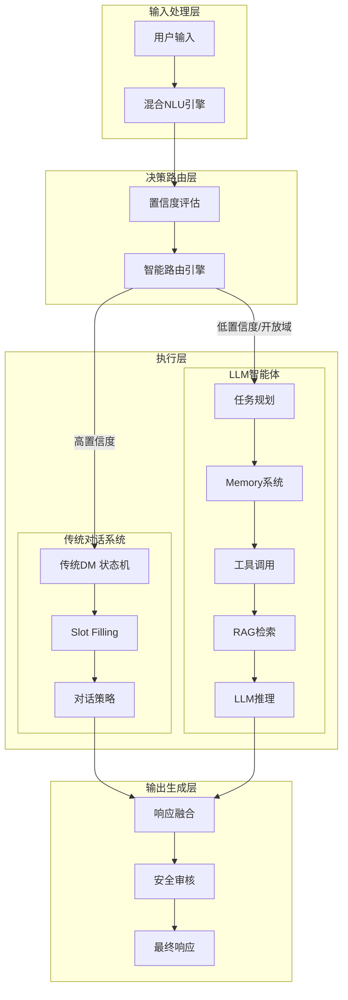
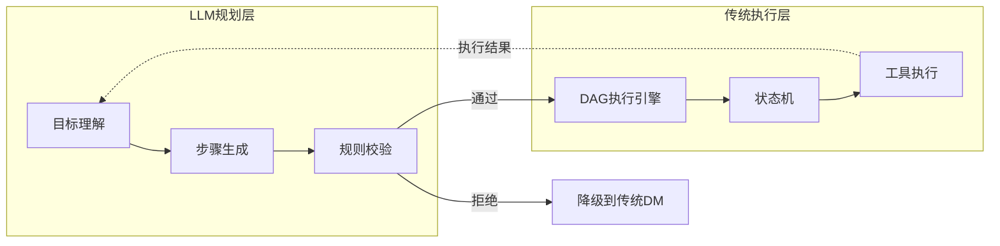
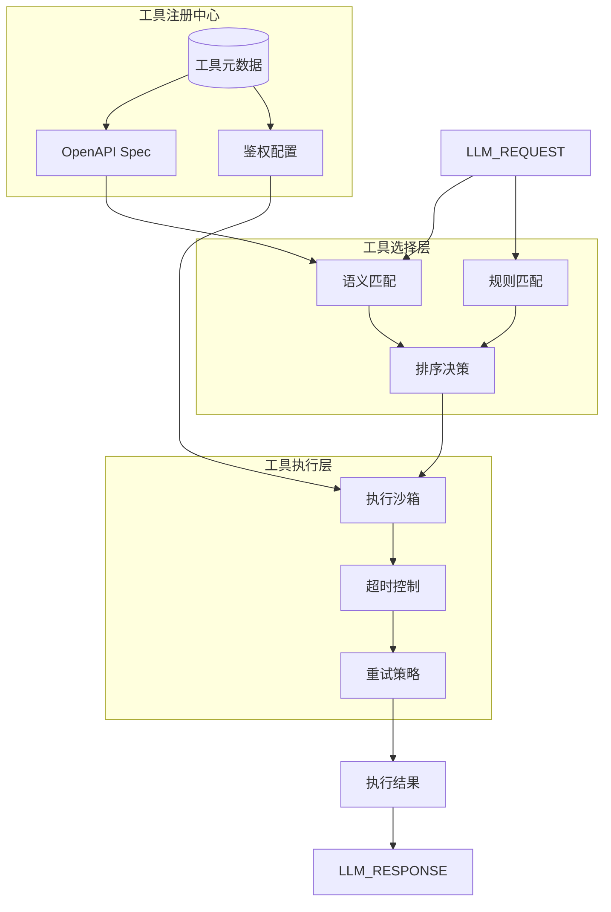
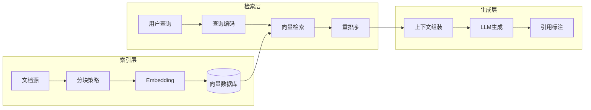
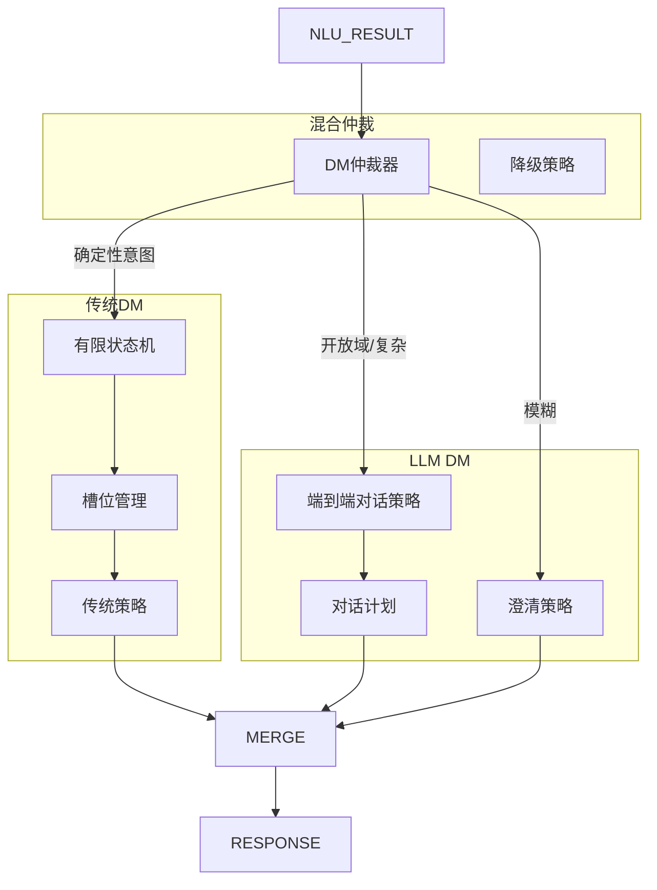

# LLM智能体与传统对话系统混合架构方案

> *"纯LLM对话像天才艺术家——创意无限但偶尔离谱；传统对话像老工程师——严谨可靠但缺乏灵活。最好的系统是两者的结合。"*

## 一、引言

传音AI开放平台目前已具备传统对话能力（语音识别、NLU、语音合成），正在引入LLM智能体能力。混合架构的核心矛盾是：

- **LLM的优势**：开放域理解、零样本泛化、复杂推理、自然对话
- **LLM的劣势**：幻觉不可控、延迟高、成本贵、难调试
- **传统系统的优势**：确定性高、延迟低、成本低、可审计
- **传统系统的劣势**：泛化差、维护成本高、无法处理长尾意图

混合架构的目标是：**在可控性（传统）和智能性（LLM）之间找到最优平衡点**。

---

## 二、总体架构设计

### 2.1 混合架构总览



### 2.2 混合路由策略

这是整个架构的"心脏"，决定每个请求走传统系统还是LLM。

```
┌─────────────────────────────────────────────────────────────┐
│                    混合路由决策树                             │
│                                                             │
│   用户输入                                                    │
│     │                                                       │
│     ▼                                                       │
│   [意图分类]──高置信度(>0.85)──▶ 传统DM（确定性执行）          │
│     │                                                       │
│     │ 低置信度                                                │
│     ▼                                                       │
│   [LLM辅助判断]                                               │
│     │                                                       │
│     ├── 明确可回答 ──▶ LLM直接回答（知识问答、闲聊）            │
│     │                                                       │
│     ├── 需要工具 ──▶ LLM任务规划 + Tool调用                   │
│     │                                                       │
│     └── 需要数据 ──▶ RAG检索 + LLM生成                        │
│                                                             │
│   所有LLM输出 → 安全审核 → 最终响应                           │
└─────────────────────────────────────────────────────────────┘
```

### 2.3 路由配置表

| 意图类型 | 路由策略 | 延迟预算 | 示例 |
|---------|---------|---------|------|
| 设备控制 | 传统DM 100% | <200ms | "打开蓝牙"、"调高音量" |
| 导航查询 | 传统DM 100% | <300ms | "导航到机场" |
| 天气查询 | 传统DM 90% / LLM 10% | <500ms | "明天天气" |
| 知识问答 | LLM + RAG 100% | <2s | "非洲最高的山是哪座" |
| 多轮闲聊 | LLM 100% | <1.5s | "讲个笑话" |
| 复杂任务 | LLM任务规划 | <5s | "帮我订一张下周五从拉各斯到内罗毕的机票" |
| 模糊意图 | LLM澄清 + 传统执行 | <3s | "那个...就是之前说的那个" |

---

## 三、核心组件详解

### 3.1 任务规划（Task Planning）

LLM智能体的核心能力是将用户的自然语言请求分解为可执行的步骤。

**混合规划架构：**



**ReAct规划模式实现：**

```python
class TaskPlanner:
    """基于ReAct模式的任务规划器"""
    
    async def plan(self, user_request: str, context: DialogueContext) -> ExecutionPlan:
        # 1. LLM生成计划（Thought → Action → Observation循环）
        prompt = self._build_react_prompt(user_request, context)
        llm_output = await self.llm.generate(prompt)
        
        # 2. 解析LLM输出为结构化计划
        raw_plan = self._parse_plan(llm_output)
        
        # 3. 规则校验（防止LLM生成危险操作）
        validated_plan = await self._validate(raw_plan)
        if not validated_plan.safe:
            return self.fallback_to_traditional(user_request)
        
        # 4. 转换为DAG执行图
        dag = self._to_dag(validated_plan)
        
        return ExecutionPlan(
            steps=dag,
            estimated_time=dag.estimated_duration(),
            required_tools=dag.required_tools(),
            fallback_plan=self.fallback_to_traditional(user_request)
        )
    
    async def _validate(self, plan: RawPlan) -> ValidatedPlan:
        """规则校验层 - 防止LLM幻觉导致的危险操作"""
        rules = [
            self._check_sensitive_operations,      # 敏感操作拦截
            self._check_tool_permissions,           # 工具权限校验
            self._check_data_access_scope,          # 数据访问范围
            self._check_rate_limits,               # 频率限制
        ]
        
        for rule in rules:
            result = await rule(plan)
            if not result.passed:
                return ValidatedPlan(safe=False, reason=result.reason)
        
        return ValidatedPlan(safe=True, steps=plan.steps)
```

### 3.2 记忆系统（Memory）

Memory是LLM智能体保持对话连贯性的关键，需要分层设计。

```
┌─────────────────────────────────────────────────────────────┐
│                    分层Memory架构                            │
├─────────────────────────────────────────────────────────────┤
│                                                             │
│  短期记忆（会话级）                                           │
│  ├── 当前对话上下文（最近N轮）                                │
│  ├── 活跃任务状态（进行中的操作）                              │
│  └── 临时变量（槽位填充值）                                   │
│       存储：Redis（TTL=会话超时）                              │
│       延迟：<5ms                                            │
│                                                             │
│  情景记忆（用户级）                                           │
│  ├── 历史对话摘要（向量化索引）                                │
│  ├── 用户偏好（语言、时区、常用服务）                           │
│  └── 重要事件记录（订单、预约、提醒）                           │
│       存储：向量数据库 + Redis                                │
│       检索延迟：<50ms                                       │
│                                                             │
│  长期记忆（知识库级）                                         │
│  ├── 领域知识（FAQ、产品手册、政策文档）                        │
│  ├── 用户画像（行为模式、兴趣标签）                             │
│  └── 全局统计（热门问题、趋势分析）                             │
│       存储：Elasticsearch + 向量数据库                         │
│       检索延迟：<200ms                                      │
│                                                             │
└─────────────────────────────────────────────────────────────┘
```

**Memory管理与压缩策略：**

```python
class MemoryManager:
    """分层Memory管理器"""
    
    async def retrieve(self, query: str, session_id: str, top_k: int = 5) -> MemoryContext:
        # 1. 短期记忆（直接读取，无需检索）
        short_term = await self.short_term_store.get(session_id)
        
        # 2. 情景记忆（向量检索）
        query_embedding = await self.embedder.encode(query)
        episodic = await self.vector_db.search(
            collection="episodic_memory",
            vector=query_embedding,
            top_k=top_k,
            filter={"user_id": self.current_user_id}
        )
        
        # 3. 长期记忆（全文检索 + 向量混合检索）
        long_term = await self.hybrid_search(
            query=query,
            collections=["faq", "product_manual", "user_profile"]
        )
        
        return MemoryContext(
            short_term=short_term,
            episodic=episodic,
            long_term=long_term
        )
    
    async def compress(self, session_id: str) -> CompressedMemory:
        """对话压缩 - 将长对话摘要为结构化记忆"""
        conversation = await self.short_term_store.get(session_id)
        
        if len(conversation.turns) < self.compression_threshold:
            return  # 对话太短，不需要压缩
        
        # LLM生成摘要
        summary = await self.llm.summarize(
            conversation=conversation,
            format="structured"  # 结构化摘要而非自由文本
        )
        
        # 存储到情景记忆
        await self.episodic_store.store(
            user_id=self.current_user_id,
            memory=summary,
            embedding=await self.embedder.encode(summary.text)
        )
        
        # 清理短期记忆（保留最近N轮）
        await self.short_term_store.trim(session_id, keep_turns=5)
```

**向量存储选型对比：**

| 方案 | 优势 | 劣势 | 适用场景 |
|------|------|------|---------|
| **Milvus** | 高性能、分布式、GPU加速 | 运维复杂 | 大规模向量检索（>1亿） |
| **Weaviate** | 自带LLM集成、RESTful | 社区规模较小 | 中等规模、快速上线 |
| **ES Dense Vector** | 与全文检索统一、混合搜索 | 向量性能不如专用DB | 已有ES基础设施的场景 |
| **Redis Vector** | 极低延迟、内存存储 | 容量受限 | 小规模热点记忆 |

**推荐方案**：传音已有Elasticsearch基础设施，短期记忆用Redis，长期记忆用ES Dense Vector做混合检索（BM25 + 向量），大规模向量检索引入Milvus。

### 3.3 工具系统（Tools / Function Calling）

工具系统是LLM与外部世界交互的桥梁。



**工具选择与执行：**

```python
class ToolOrchestrator:
    """工具编排器 - 选择、执行、结果处理"""
    
    async def execute_tool_call(self, tool_call: ToolCall) -> ToolResult:
        # 1. 查找工具定义
        tool_def = self.registry.get(tool_call.name)
        if not tool_def:
            return ToolResult(error=f"Unknown tool: {tool_call.name}")
        
        # 2. 参数校验（JSON Schema验证）
        validation = self._validate_params(tool_call.args, tool_def.schema)
        if not validation.valid:
            return ToolResult(error=f"Invalid params: {validation.errors}")
        
        # 3. 权限检查
        if not self._check_permission(tool_call.name, self.current_user):
            return ToolResult(error="Permission denied")
        
        # 4. 沙箱执行
        try:
            async with self.sandbox.timeout(tool_def.timeout):
                result = await tool_def.execute(tool_call.args)
            
            # 5. 结果后处理（截断过长输出）
            return self._post_process(result, tool_def)
            
        except TimeoutError:
            return ToolResult(error="Tool execution timeout")
        except Exception as e:
            return ToolResult(error=str(e))
    
    def select_tools(self, query: str, available_tools: List[ToolDef]) -> List[ToolDef]:
        """工具选择：语义匹配 + 规则过滤"""
        # 语义相似度
        query_embedding = self.embedder.encode(query)
        tool_embeddings = {t.name: t.embedding for t in available_tools}
        
        scores = {
            name: cosine_similarity(query_embedding, embedding)
            for name, embedding in tool_embeddings.items()
        }
        
        # 规则增强（高频工具权重提升）
        for tool in available_tools:
            if tool.name in self.popular_tools:
                scores[tool.name] *= 1.2
        
        # 返回Top-K
        return sorted(available_tools, key=lambda t: scores[t.name], reverse=True)[:3]
```

### 3.4 RAG系统（检索增强生成）

RAG是解决LLM幻觉和知识过时的关键手段。



**RAG管线实现：**

```python
class RAGPipeline:
    """检索增强生成管线"""
    
    def __init__(self, config: RAGConfig):
        self.chunker = RecursiveChunker(
            chunk_size=config.chunk_size,        # 默认512 tokens
            chunk_overlap=config.chunk_overlap,   # 默认50 tokens
            separators=["\n\n", "\n", "。", ""]
        )
        self.retriever = HybridRetriever(
            vector_weight=0.7,    # 向量检索权重
            text_weight=0.3       # BM25文本检索权重
        )
        self.reranker = CrossEncoderReranker(
            model="cross-encoder/multilingual-MiniLM",  # 多语言支持
            top_k=config.rerank_top_k
        )
    
    async def retrieve_and_generate(self, query: str) -> RAGResponse:
        # 1. 检索
        candidates = await self.retriever.search(
            query=query,
            top_k=self.config.retrieval_top_k  # 默认50
        )
        
        # 2. 重排序（Cross-Encoder精确打分）
        reranked = await self.reranker.rank(query, candidates[:20])
        
        # 3. 上下文组装（适配LLM窗口大小）
        context = self._build_context(
            query=query,
            passages=reranked[:self.config.context_top_k],  # 默认5
            max_tokens=self.config.max_context_tokens       # 默认4096
        )
        
        # 4. LLM生成
        response = await self.llm.generate(
            prompt=self._build_rag_prompt(query, context),
            temperature=0.1  # RAG场景低温度保证确定性
        )
        
        # 5. 引用标注
        return RAGResponse(
            text=response.text,
            citations=self._extract_citations(response, reranked),
            retrieval_metadata={"query": query, "passages": len(reranked)}
        )
    
    def _build_context(self, query: str, passages: List[Passage], max_tokens: int) -> str:
        """上下文组装 - 贪心填充，确保不超过LLM窗口"""
        context_parts = []
        current_tokens = 0
        
        for passage in passages:
            passage_tokens = self._count_tokens(passage.text)
            if current_tokens + passage_tokens > max_tokens:
                break
            context_parts.append(f"[{passage.id}] {passage.text}")
            current_tokens += passage_tokens
        
        return "\n\n".join(context_parts)
```

**多语言RAG优化（非洲场景）：**

```python
class MultiLingualRAG(RAGPipeline):
    """面向非洲多语言的RAG优化"""
    
    async def retrieve(self, query: str, language: str) -> List[Passage]:
        # 策略1：语言感知检索
        # 优先检索同语言文档
        same_lang_docs = await self._search_by_language(query, language)
        
        # 策略2：跨语言检索（当同语言文档不足时）
        if len(same_lang_docs) < self.min_results:
            # 将查询翻译为英语，检索英语文档
            english_query = await self.translator.translate(query, target="en")
            en_docs = await self._search_by_language(english_query, "en")
            
            # 将检索结果翻译回原语言（或保持原文+翻译对照）
            return same_lang_docs + [
                Passage(
                    text=doc.text,
                    translation=await self.translator.translate(doc.text, target=language),
                    score=doc.score * 0.8  # 跨语言结果降权
                )
                for doc in en_docs
            ]
        
        return same_lang_docs
```

### 3.5 对话管理（Dialogue Management）

对话管理是混合架构的"中枢"，协调传统DM和LLM。



**混合DM实现：**

```python
class HybridDialogueManager:
    """混合对话管理器"""
    
    async def step(self, nlu_result: NLUResult, context: DialogueContext) -> DialogueAction:
        # 决策1：传统DM可处理的确定性意图
        if nlu_result.intent in self.traditional_intents:
            return await self.traditional_dm.step(nlu_result, context)
        
        # 决策2：LLM处理的开放域对话
        if nlu_result.intent == "open_domain":
            return await self.llm_dm.step(nlu_result, context)
        
        # 决策3：传统DM置信度高，直接执行
        if nlu_result.confidence > 0.85:
            return await self.traditional_dm.step(nlu_result, context)
        
        # 决策4：置信度中等，LLM辅助理解
        if nlu_result.confidence > 0.6:
            clarified = await self.llm_dm.clarify(nlu_result, context)
            if clarified.resolved:
                return await self.traditional_dm.step(clarified.nlu, context)
            return DialogueAction(
                type="clarify",
                text=clarified.question
            )
        
        # 决策5：低置信度，LLM完全接管
        return await self.llm_dm.step(nlu_result, context)
    
    async def _handle_slot_filling(self, nlu: NLUResult, context: DialogueContext):
        """槽位填充 - 传统DM的核心能力"""
        slots = self.slot_manager.get_required_slots(nlu.intent)
        filled_slots = nlu.slots
        
        missing_slots = [s for s in slots if s.name not in filled_slots]
        
        if not missing_slots:
            # 所有槽位已填，执行
            return await self.execute_intent(nlu)
        
        # 请求用户补充槽位
        next_slot = missing_slots[0]
        return DialogueAction(
            type="ask_slot",
            slot=next_slot.name,
            prompt=f"请问{next_slot.prompt}？"
        )
```

### 3.6 NLU系统（自然语言理解）

NLU是混合路由的前置判断层。

```
┌─────────────────────────────────────────────────────────────┐
│                    混合NLU架构                               │
├─────────────────────────────────────────────────────────────┤
│                                                             │
│  输入文本 ──▶ 语言识别                                      │
│                │                                            │
│                ▼                                            │
│  ┌──────────────────────────────┐                           │
│  │  传统NLU（FastText/BERT）      │                           │
│  │  ├── Intent Classification     │                           │
│  │  ├── Slot Filling              │                           │
│  │  └── Confidence Score          │                           │
│  └──────────────┬───────────────┘                           │
│                 │                                            │
│     高置信度    │    低置信度/未知意图                         │
│     ▼           │    ▼                                       │
│  ┌──────┐   ┌──────────────────────┐                        │
│  │ 直出  │   │ LLM辅助NLU           │                        │
│  │ 结果  │   │ ├── Zero-shot分类     │                        │
│  │      │   │ ├── 复杂意图解析       │                        │
│  │      │   │ └── 歧义消解           │                        │
│  └──────┘   └──────────────────────┘                        │
│                                                             │
│  输出：统一NLUResult结构                                     │
└─────────────────────────────────────────────────────────────┘
```

**NLU融合路由：**

```python
class HybridNLU:
    """混合NLU引擎 - 传统 + LLM"""
    
    async def understand(self, text: str, context: DialogueContext) -> NLUResult:
        # 1. 传统NLU（快速、低成本）
        traditional_result = await self.traditional_nlu.predict(text)
        
        # 2. 高置信度直接返回
        if traditional_result.confidence >= self.high_confidence_threshold:
            return traditional_result
        
        # 3. 低置信度：LLM辅助
        if traditional_result.confidence < self.low_confidence_threshold:
            llm_result = await self.llm_nlu.zero_shot_classify(
                text=text,
                candidate_intents=self.intent_registry.all_intents()
            )
            
            # 融合决策
            return self._fuse_results(traditional_result, llm_result)
        
        # 4. 中等置信度：仅LLM验证
        llm_verification = await self.llm_nlu.verify(
            text=text,
            predicted_intent=traditional_result.intent
        )
        
        if llm_verification.agrees:
            return traditional_result
        else:
            # LLM不同意，使用LLM的分类
            return await self.llm_nlu.classify(text)
    
    def _fuse_results(self, traditional: NLUResult, llm: NLUResult) -> NLUResult:
        """结果融合 - 加权融合"""
        # 传统系统权重更高（更确定、更可审计）
        if traditional.intent == llm.intent:
            return NLUResult(
                intent=traditional.intent,
                confidence=max(traditional.confidence, llm.confidence) * 1.1,
                slots=self._merge_slots(traditional.slots, llm.slots)
            )
        else:
            # 意图不一致，选择置信度更高的
            if llm.confidence > traditional.confidence + 0.2:
                return llm
            return traditional
```

---

## 四、关键技术实现

### 4.1 混合路由引擎设计

```python
class HybridRouter:
    """混合路由引擎 - 核心决策组件"""
    
    def __init__(self, config: RouterConfig):
        self.intent_classifier = IntentClassifier()
        self.confidence_thresholds = {
            "traditional": 0.85,    # 高于此值走传统DM
            "llm_direct": 0.6,      # 高于此值走LLM
            "clarify": 0.4,         # 低于此值需要澄清
        }
        self.intent_mapping = self._load_intent_mapping()
    
    async def route(self, request: UserRequest) -> RouteDecision:
        # 1. 意图分类
        nlu_result = await self.nlu.understand(request.text, request.context)
        
        # 2. 规则优先（安全敏感操作必须走传统DM）
        if nlu_result.intent in SENSITIVE_INTENTS:
            return RouteDecision(
                target=Target.TRADITIONAL,
                reason="sensitive_operation",
                nlu_result=nlu_result
            )
        
        # 3. 意图路由
        route_info = self.intent_mapping.get(nlu_result.intent)
        if route_info:
            return RouteDecision(
                target=route_info.target,
                reason=f"intent_mapping:{nlu_result.intent}",
                nlu_result=nlu_result
            )
        
        # 4. 置信度路由
        if nlu_result.confidence >= self.confidence_thresholds["traditional"]:
            return RouteDecision(
                target=Target.TRADITIONAL,
                reason="high_confidence",
                nlu_result=nlu_result
            )
        elif nlu_result.confidence >= self.confidence_thresholds["llm_direct"]:
            return RouteDecision(
                target=Target.LLM,
                reason="medium_confidence",
                nlu_result=nlu_result
            )
        else:
            return RouteDecision(
                target=Target.CLARIFY,
                reason="low_confidence",
                nlu_result=nlu_result
            )
```

### 4.2 RAG重排序方案对比

| 方案 | 延迟 | 精度 | 成本 | 适用场景 |
|------|------|------|------|---------|
| **BM25** | <5ms | 中等 | 极低 | 纯关键词匹配 |
| **向量检索** | <20ms | 良好 | 低 | 语义相似 |
| **Cross-Encoder** | <100ms | 优秀 | 中 | 重排序Top-20 |
| **LLM-as-Reranker** | <500ms | 最好 | 高 | 关键场景精排 |

**推荐方案**：检索层用BM25 + 向量混合（权重0.3/0.7），重排序用Cross-Encoder，关键场景（如医疗、法律问答）用LLM精排Top-3。

### 4.3 工具调用协议统一

```yaml
# 统一工具定义格式（兼容OpenAI Function Calling和OpenAPI）
tools:
  - name: "search_weather"
    description: "查询指定城市的天气信息"
    parameters:
      type: "object"
      properties:
        city:
          type: "string"
          description: "城市名称，如 Lagos, Nairobi"
        date:
          type: "string"
          format: "date"
          description: "日期，格式 YYYY-MM-DD，默认为今天"
      required: ["city"]
    
    execution:
      endpoint: "https://api.transsion-ai.com/weather"
      method: "GET"
      timeout: 3000  # ms
      auth: "api_key"
      rate_limit: 100/minute
      cache_ttl: 1800  # 30分钟缓存
    
    response_schema:
      temperature: "number"
      humidity: "number"
      condition: "string"
      forecast: "array"
```

---

## 五、工程落地与性能优化

### 5.1 高可用架构

```
┌─────────────────────────────────────────────────────────────┐
│                    多活部署架构                               │
├─────────────────────────────────────────────────────────────┤
│                                                             │
│  可用区A                    可用区B                          │
│  ┌─────────┐               ┌─────────┐                      │
│  │ NLU服务  │◄── 同步 ──►   │ NLU服务  │                      │
│  │ DM服务   │               │ DM服务   │                      │
│  │ LLM网关  │               │ LLM网关  │                      │
│  │ Redis    │◄── 同步 ──►   │ Redis    │                      │
│  │ 向量DB   │◄── 同步 ──►   │ 向量DB   │                      │
│  └─────────┘               └─────────┘                      │
│       ▲                         ▲                           │
│       └─────────┬───────────────┘                           │
│                 │                                           │
│          ┌──────────────┐                                   │
│          │ 全局负载均衡  │                                   │
│          └──────────────┘                                   │
│                                                             │
└─────────────────────────────────────────────────────────────┘
```

### 5.2 性能指标体系

| 指标 | 目标值 | 测量方式 | 告警阈值 |
|------|--------|---------|---------|
| 传统DM P99延迟 | <200ms | Prometheus直方图 | >300ms |
| LLM首Token延迟 | <500ms | 流式计时 | >1000ms |
| RAG检索延迟 | <200ms | 检索服务计时 | >500ms |
| Memory检索延迟 | <50ms | Redis/向量DB计时 | >100ms |
| 系统可用性 | 99.9% | 健康检查 | <99.5% |
| 传统DM命中率 | >70% | 路由统计 | <60% |
| LLM幻觉率 | <5% | 后验审核 | >10% |

### 5.3 大模型推理优化

```python
class LLMOptimizer:
    """LLM推理优化 - 降低延迟和成本"""
    
    def __init__(self):
        # 1. vLLM推理引擎（PagedAttention显存优化）
        self.engine = vLLM(
            model="qwen2.5-7b",
            tensor_parallel_size=2,
            max_num_seqs=256,
            gpu_memory_utilization=0.9
        )
        
        # 2. 语义缓存（相似问题直接返回缓存结果）
        self.semantic_cache = SemanticCache(
            embedding_model="text-embedding-3-small",
            similarity_threshold=0.95,
            ttl=3600
        )
        
        # 3. 动态批处理（合并相似请求）
        self.batch_processor = DynamicBatcher(
            max_batch_size=32,
            max_wait_ms=50
        )
    
    async def generate(self, prompt: str) -> str:
        # 语义缓存命中检查
        cached = await self.semantic_cache.lookup(prompt)
        if cached:
            return cached
        
        # 动态批处理
        result = await self.batch_processor.add(prompt)
        
        # 写入缓存
        await self.semantic_cache.store(prompt, result)
        
        return result
```

### 5.4 成本优化策略

| 策略 | 节省比例 | 实现方式 |
|------|---------|---------|
| 语义缓存 | 30-40% | 高频问题直接返回缓存 |
| 小模型蒸馏 | 50-70% | 简单任务用蒸馏小模型 |
| 请求合并 | 20-30% | 批量处理相似请求 |
| 传统DM分流 | 40-60% | 确定性意图不经过LLM |
| 上下文截断 | 10-20% | 只传相关记忆，不传全量历史 |

---

## 六、传音场景适配

### 6.1 非洲多语言NLU适配

```
多语言NLU策略：
├── Tier 1（核心语言）：英语（非洲口音）、法语（非洲口音）
│   ├── 传统NLU：Fine-tuned BERT
│   ├── LLM辅助：Zero-shot分类
│   └── 意图覆盖率：>95%
├── Tier 2（重要语言）：豪萨语、斯瓦西里语
│   ├── 传统NLU：FastText + 规则
│   ├── LLM辅助：Few-shot分类
│   └── 意图覆盖率：>80%
└── Tier 3（长尾语言）：约鲁巴语、阿姆哈拉语、祖鲁语等
    ├── 传统NLU：关键词匹配
    ├── LLM辅助：Cross-lingual Zero-shot
    └── 意图覆盖率：>60%
```

### 6.2 硬件助手场景的任务规划

典型硬件助手场景的任务规划示例：

```python
# 场景："帮我导航到最近的加油站，路上播放周杰伦的歌"
plan = TaskPlan(
    goal="导航+播放音乐",
    steps=[
        # 步骤1：意图分解（LLM生成）
        Step(
            id=1,
            action="find_nearest",
            params={"category": "gas_station"},
            tool="location_service"
        ),
        # 步骤2：获取路线
        Step(
            id=2,
            action="get_route",
            params={"destination": "step1.result"},
            tool="navigation_service",
            depends_on=[1]
        ),
        # 步骤3：搜索音乐
        Step(
            id=3,
            action="search_music",
            params={"artist": "周杰伦"},
            tool="music_service"
        ),
        # 步骤4：并行执行：开始导航 + 播放音乐
        Step(
            id=4,
            action="execute_parallel",
            children=[
                Step(action="start_navigation", params={"route": "step2.result"}),
                Step(action="play_music", params={"playlist": "step3.result"})
            ],
            depends_on=[2, 3]
        )
    ]
)
```

### 6.3 开放平台第三方工具接入

传音AI开放平台已有能力可作为内置工具接入混合架构：

```yaml
builtin_tools:
  - name: "transsion_asr"
    description: "传音语音识别服务"
    endpoint: "grpc://ai.transsion.com/asr"
    
  - name: "transsion_tts"
    description: "传音语音合成服务"
    endpoint: "grpc://ai.transsion.com/tts"
    
  - name: "transsion_nlu"
    description: "传音自然语言理解"
    endpoint: "grpc://ai.transsion.com/nlu"
    
  - name: "transsion_sentiment"
    description: "传音舆情分析"
    endpoint: "grpc://ai.transsion.com/sentiment"
```

---

## 七、总结

### 混合架构核心要点

| 设计维度 | 方案选择 | 理由 |
|---------|---------|------|
| 路由策略 | 置信度阈值 + 意图映射 + 规则优先 | 兼顾确定性和灵活性 |
| Memory | 三层架构（短期/情景/长期） | 平衡延迟、容量、成本 |
| 工具调用 | 语义匹配 + JSON Schema校验 + 沙箱执行 | 安全可控的LLM外部交互 |
| RAG | BM25 + 向量混合检索 + Cross-Encoder重排 | 精度与性能的平衡 |
| DM | 传统状态机 + LLM端到端混合仲裁 | 确定性操作不走LLM |
| NLU | 传统分类 + LLM辅助验证 | 低成本覆盖长尾意图 |

### 面试金句

> *"混合架构不是传统系统和LLM的简单拼接，而是让每个系统做它最擅长的事——传统系统处理确定性，LLM处理不确定性。"*

> *"一个好的路由引擎应该像红绿灯——让确定的请求畅通无阻，让模糊的请求停下来看清楚。"*

> *"Memory不是越大越好，而是越相关越好——检索质量决定了LLM的回答质量。"*

> *"工具调用是LLM的'手'，但必须有'手套'——沙箱隔离和参数校验缺一不可。"*

> *"RAG的核心不是检索了多少文档，而是检索到了多少相关文档——重排序往往比多检索更有价值。"*

> *"在传音的非洲场景，多语言NLU不是'一个模型通吃'，而是'分层策略'——核心语言精调、重要语言Few-shot、长尾语言Zero-shot。"*

---

*本文档为面试技术方案，实际落地需结合传音现有技术栈和AI开放平台现状做进一步适配。*
