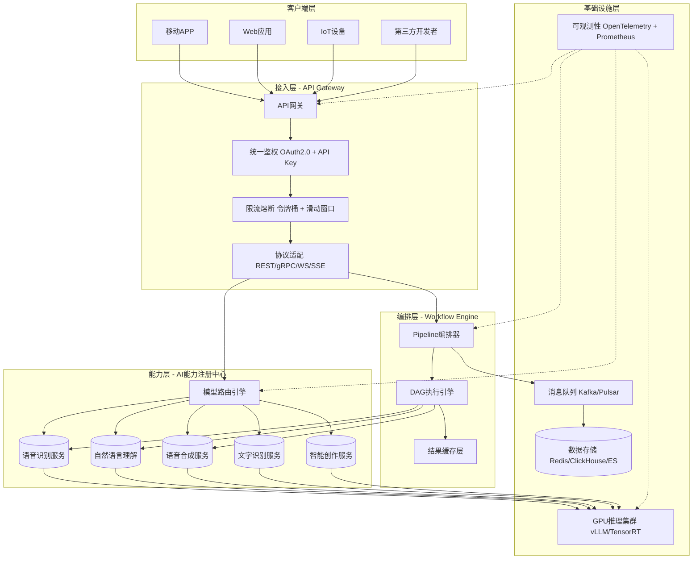
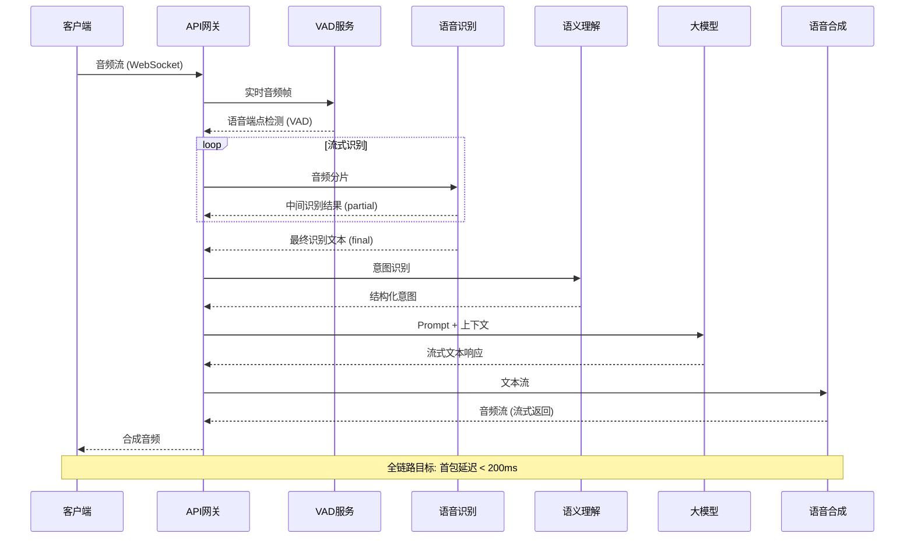
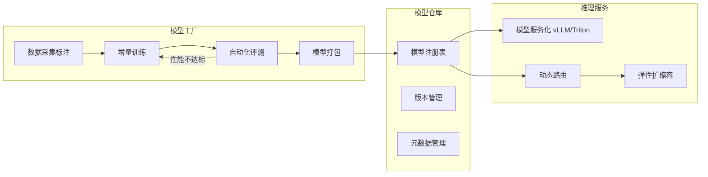
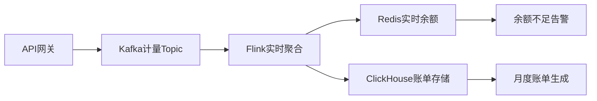
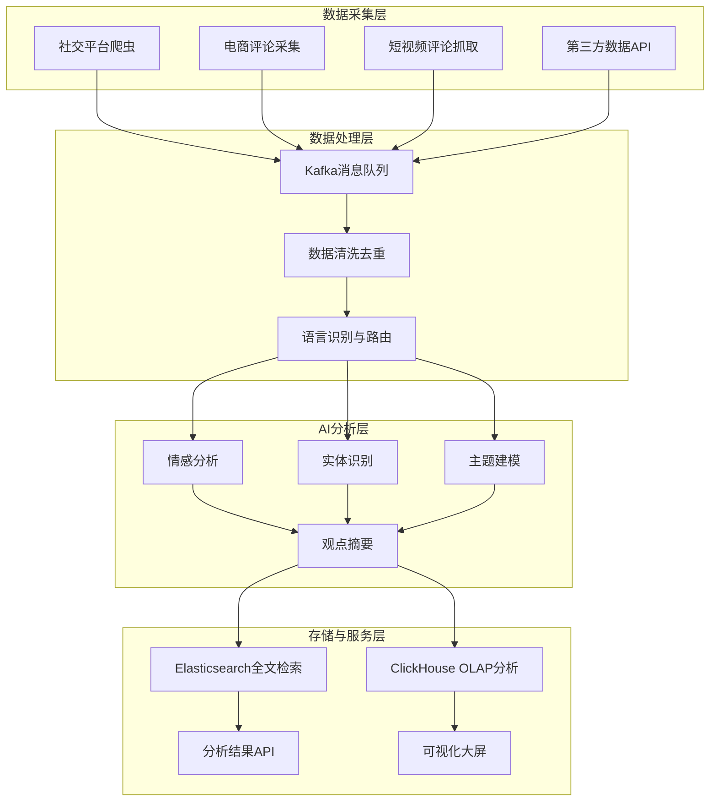

# 面向非洲本地化的AI开放平台研发方案

> *"在非洲做AI，不是把硅谷的技术翻译一遍，而是从语言、网络、设备的底层重新构建。"*

## 一、引言与背景

传音控股被称为"非洲手机之王"，2024年全球智能机出货量排名前五，非洲市场占有率超过40%。其AI开放平台（ai.transsion.com）定位为"洞悉非洲本地化需求，致力于为出海客户提供全栈AI语音能力"，目前已开放五大AI能力服务和三大解决方案。

本文站在**资深后端开发 + 大模型算法**的交叉视角，分析传音AI开放平台的现状、架构演进方向及核心技术实现方案，为面试提供系统性的技术表达框架。

---

## 二、平台现状与架构分析

### 2.1 现有能力矩阵

| 能力类别 | 子能力 | 关键特性 | 典型场景 |
|---------|--------|---------|---------|
| **语音识别** | 短语音识别 | <60秒音频，支持非洲口音英/法/豪萨/斯瓦西里语 | 语音输入、语音搜索、语音指令 |
| | 实时语音识别 | 不限时长音频流，带时间戳文字流 | 直播字幕、演讲字幕、会议记录 |
| **自然语言理解** | 词法分析 | 分词、词性标注、命名实体识别 | 搜索索引、信息抽取 |
| | 文本纠错 | 拼写/语法纠错，适配非洲语言变体 | 输入法、内容审核 |
| | 文本相似度 | 语义相似度计算 | 智能客服、去重 |
| **语音合成** | TTS | 多语言语音生成 | 语音播报、导航、无障碍 |
| **文字识别** | 屏幕OCR | 移动端屏幕文字提取 | 翻译、辅助功能 |
| **智能创作** | 文生图 | 文本驱动图像生成 | 内容创作、营销 |

### 2.2 现有解决方案

```
┌─────────────────────────────────────────────────────────────┐
│                    传音AI 解决方案矩阵                        │
├──────────────┬──────────────┬───────────────────────────────┤
│  通话降噪     │  语音交互     │  舆情分析                       │
├──────────────┼──────────────┼───────────────────────────────┤
│ 回声消除      │ 端到端链路     │ 社交平台/电商/短视频评论采集     │
│ 自动增益      │ VAD→ASR→NLU  │ 情感分析 + 观点抽取             │
│ 噪声抑制      │ →LLM→TTS     │ 用户诉求挖掘 + 效果分析          │
│ 手机通话      │ 移动设备/音箱  │ 品牌表现/用户评价/广告投放分析   │
│ 视频会议      │ 智能车载/机器人│ 实时/离线双链路分析              │
│ 网络直播      │ 全链路整合     │ 大数据 + AI联合处理              │
│ 游戏语音      │ 流畅体验       │  actionable insights          │
└──────────────┴──────────────┴───────────────────────────────┘
```

### 2.3 架构痛点识别（从外部观察推断）

通过平台现状分析，可识别以下潜在架构挑战：

1. **能力孤岛 vs 组合编排缺失**：各能力以独立API形式提供，缺少可视化的Pipeline编排能力。开发者需要自行串联ASR→NLU→TTS，增加了集成成本。

2. **多语言/口音模型的服务化治理**：非洲语言碎片化严重（仅尼日利亚就有500+语言），如何统一管理数百个模型版本、实现动态路由和灰度发布，是平台化关键。

3. **开发者生态入口薄弱**：目前仅有"登录/申请接入"，缺少自助开发者门户、SDK下载、沙箱环境、API文档等标准开放平台要素。

4. **端到端延迟优化**：语音交互场景对首包延迟极其敏感（<200ms是用户体验阈值），现有架构是否支持流式透传和边缘加速需要验证。

---

## 三、目标架构设计

### 3.1 架构升级目标

```
演进路径：API提供者 → 能力编排平台 → AI生态构建者
```

| 阶段 | 定位 | 关键指标 |
|------|------|---------|
| 当前 | 能力API提供者 | 5大能力、3个解决方案 |
| 目标V2 | 能力编排平台 | Pipeline可视化、开发者门户、SLA保障 |
| 目标V3 | AI生态构建者 | Agent Marketplace、第三方模型接入、智能路由 |

### 3.2 总体架构图



### 3.3 核心分层设计

#### 3.3.1 接入层：API网关

网关是开放平台的"门面"，承担路由、鉴权、限流、协议转换等职责。

**技术选型对比：**

| 方案 | 优势 | 劣势 | 适用场景 |
|------|------|------|---------|
| **Kong** | 插件生态丰富、Lua扩展 | Lua性能有限、学习曲线 | 快速原型、标准API管理 |
| **APISIX** | 动态热更新、etcd存储 | 相对年轻、社区规模 | 高动态路由场景 |
| **Envoy** | 高性能C++、Service Mesh原生 | 配置复杂、运维成本高 | 大规模微服务架构 |
| **自研Go网关** | 完全可控、定制SSE/WS优化 | 开发周期长 | 深度优化语音流式场景 |

**推荐方案**：以APISIX为基座，针对语音流式场景定制SSE透传插件，兼顾开发效率和性能。

**网关核心插件设计：**

```go
// SSE透传插件 - 解决语音流式输出的首包延迟问题
func (p *SSEProxyPlugin) Handle(ctx context.Context, req *http.Request) (*http.Response, error) {
    // 1. 建立后端长连接
    backendReq := cloneRequest(req)
    backendReq.Header.Set("Accept", "text/event-stream")
    
    resp, err := p.backendClient.Do(backendReq)
    if err != nil {
        return nil, err
    }
    
    // 2. 立即返回200 + Content-Type: text/event-stream 给客户端
    // 避免网关缓冲导致首包延迟
    w := ctx.ResponseWriter()
    w.WriteHeader(http.StatusOK)
    w.Header().Set("Content-Type", "text/event-stream")
    w.Header().Set("Cache-Control", "no-cache")
    w.Header().Set("Connection", "keep-alive")
    w.Header().Set("X-Accel-Buffering", "no") // Nginx关键配置
    
    // 3. 流式透传，同时注入网关级埋点
    flusher := w.(http.Flusher)
    scanner := bufio.NewScanner(resp.Body)
    for scanner.Scan() {
        line := scanner.Bytes()
        w.Write(line)
        w.Write([]byte("\n"))
        flusher.Flush() // 立即刷新，降低首包延迟
        
        // 异步记录埋点（不阻塞流）
        p.metrics.RecordChunk(len(line))
    }
    
    return nil, nil // 长连接由上游管理
}
```

#### 3.3.2 能力层：AI能力注册中心

能力层是平台的核心，负责统一管理各类AI模型和服务。

**模型注册中心设计：**

```yaml
# 模型注册表（etcd存储）
models:
  asr:
    - model_id: "asr-en-africa-v2"
      language: "en"
      variant: "africa_accent"
      version: "2.1.0"
      endpoint: "grpc://asr-en-svc:9001"
      gpu_memory: "4GB"
      qps_limit: 500
      latency_p99: "150ms"
      status: "active"
      
    - model_id: "asr-ha-v1"
      language: "ha"  # 豪萨语
      variant: "west_africa"
      version: "1.0.3"
      endpoint: "grpc://asr-ha-svc:9001"
      gpu_memory: "8GB"
      qps_limit: 100  # 小语种资源受限
      latency_p99: "300ms"
      status: "active"
      fallback_to: "asr-en-africa-v2"  # 降级策略

  nlu:
    - model_id: "nlu-sentiment-multilingual"
      languages: ["en", "fr", "ha", "sw"]
      capabilities: ["sentiment", "ner", "intent"]
      ...
```

**动态路由逻辑：**

```python
class ModelRouter:
    def route(self, request: AIRequest) -> ModelEndpoint:
        # 1. 按语言+口音匹配
        candidates = self.registry.filter(
            capability=request.capability,
            language=request.language,
            variant=request.variant
        )
        
        if not candidates:
            # 2. 降级：口音模型不可用时fallback到通用模型
            candidates = self.registry.filter(
                capability=request.capability,
                language=request.language,
                variant="default"
            )
        
        if not candidates:
            # 3. 二次降级：跨语言fallback（如斯瓦西里语→英语）
            candidates = self.get_cross_language_fallback(request)
        
        # 4. 负载均衡：按健康状态+延迟+配额选择最优实例
        return self.load_balancer.select(
            candidates,
            strategy="weighted_latency"  # 延迟感知的加权选择
        )
```

#### 3.3.3 编排层：Workflow Engine

端到端语音交互需要串联多个能力，Workflow引擎负责编排执行。

**语音交互Pipeline示例：**



---

## 四、关键技术实现

### 4.1 多语言/口音模型的统一服务化

非洲语言环境极其复杂：

| 维度 | 挑战 | 数据 |
|------|------|------|
| 语言数量 | 非洲有2000+语言，传音平台已支持主要语种 | 英/法/豪萨/斯瓦西里/约鲁巴/阿姆哈拉等 |
| 口音差异 | 同一语言的非洲口音与标准口音差异巨大 | 非洲英语WER比标准英语高30-50% |
| 数据稀缺 | 小语种训练数据严重不足 | 豪萨语公开数据集 < 500小时 |
| 持续迭代 | 新语种/新口音需求持续产生 | 每季度新增2-3个语言变体 |

**模型服务化架构：**



**A/B测试与灰度发布流程：**

```python
class ModelCanaryDeployer:
    """模型灰度发布控制器"""
    
    def deploy(self, new_model: ModelConfig, canary_ratio: float = 0.05):
        # 1. 注册新版本（不对外）
        self.registry.register(new_model, status="canary")
        
        # 2. 按流量比例切流
        self.traffic_split.set(
            model_id=new_model.id,
            ratio=canary_ratio,
            selector=self._quality_based_selector  # 优先高质量请求
        )
        
        # 3. 监控关键指标
        metrics = self.monitor.watch(
            metrics=["wer", "latency_p99", "gpu_util", "error_rate"],
            window="30m"
        )
        
        # 4. 自动化决策
        if metrics.wer < self.baseline.wer * 1.05:  # WER不恶化超过5%
            self.promote(new_model)  # 提升为正式版本
        else:
            self.rollback(new_model)  # 自动回滚
```

### 4.2 端到端语音交互Pipeline设计

**流式传输优化策略：**

| 优化点 | 技术方案 | 效果 |
|--------|---------|------|
| 首包延迟 | 网关SSE透传 + 取消缓冲 | < 200ms |
| 带宽占用 | Opus编码（6-24kbps） | 相比PCM节省95% |
| 丢包恢复 | WebRTC FEC / Jitter Buffer | 弱网可用 |
| 端到端延迟 | VAD触发 + 增量识别 + 流式合成 | 全链路 < 500ms |

**VAD（语音活动检测）前置设计：**

```python
class VADTrigger:
    """语音活动检测 - 减少无效推理请求"""
    
    def __init__(self, sample_rate=16000, threshold=0.3):
        self.threshold = threshold
        self.silence_duration = 0
        self.speech_buffer = bytearray()
        
    def process_frame(self, audio_frame: bytes) -> VADState:
        # 轻量级能量检测（不占用GPU）
        energy = self._compute_energy(audio_frame)
        
        if energy > self.threshold:
            self.silence_duration = 0
            self.speech_buffer.extend(audio_frame)
            return VADState.SPEECH
        else:
            self.silence_duration += len(audio_frame) / self.sample_rate
            if self.silence_duration > 0.5:  # 静音超过500ms
                return VADState.SILENCE
            return VADState.UNSURE
    
    def get_final_audio(self) -> bytes:
        """返回完整语音片段，触发ASR推理"""
        result = bytes(self.speech_buffer)
        self.speech_buffer.clear()
        return result
```

### 4.3 开放平台基础设施

#### 4.3.1 鉴权体系

```
┌─────────────────────────────────────────────────────────┐
│                   多层鉴权架构                           │
├──────────┬──────────────────────────────────────────────┤
│ L1: API Key  │ 每个开发者分配唯一Key，标识身份            │
│ L2: 签名验证  │ HMAC-SHA256(timestamp + body + secret)   │
│ L3: OAuth 2.0 │ 用户级授权（Authorization Code Flow）     │
│ L4: JWT      │ 短期Token，携带权限范围和配额信息          │
└──────────┴──────────────────────────────────────────────┘
```

**签名验证实现：**

```go
func VerifySignature(req *http.Request, apiSecret string) error {
    timestamp := req.Header.Get("X-Transsion-Timestamp")
    nonce := req.Header.Get("X-Transsion-Nonce")
    signature := req.Header.Get("X-Transsion-Signature")
    
    // 防重放攻击：时间戳有效期5分钟
    ts, _ := strconv.ParseInt(timestamp, 10, 64)
    if time.Now().Unix()-ts > 300 {
        return ErrExpiredTimestamp
    }
    
    // 构建签名字符串
    stringToSign := fmt.Sprintf("%s%s%s%s",
        req.Method, req.URL.Path, timestamp, nonce)
    
    // HMAC-SHA256
    mac := hmac.New(sha256.New, []byte(apiSecret))
    mac.Write([]byte(stringToSign))
    expected := hex.EncodeToString(mac.Sum(nil))
    
    if !hmac.Equal([]byte(signature), []byte(expected)) {
        return ErrInvalidSignature
    }
    
    return nil
}
```

#### 4.3.2 计费与计量

| 计费维度 | 计费单位 | 定价策略 |
|---------|---------|---------|
| 短语音识别 | 次（<60秒） | 按语言差异化定价（小语种更高） |
| 实时语音识别 | 分钟 | 按时长阶梯定价 |
| NLP调用 | 千字符 | 按复杂度分级 |
| TTS | 千字符 | 按音质分级（标准/高保真） |
| 文生图 | 张 | 按分辨率和步数定价 |

**计量流水线：**



### 4.4 舆情分析的大数据流水线

传音舆情分析解决方案涉及多源数据采集、NLP处理、结果分析，是典型的大数据+AI混合架构。



**实时处理核心逻辑：**

```python
from apache.flink.streaming.api import DataStream
from transformers import pipeline

class SentimentAnalysisJob:
    """Flink流式情感分析作业"""
    
    def __init__(self):
        # 多语言情感分析模型
        self.sentiment_analyzer = pipeline(
            "sentiment-analysis",
            model="cardiffnlp/twitter-xlm-roberta-base-sentiment"
        )
        
    def process(self, stream: DataStream[Comment]) -> DataStream[AnalysisResult]:
        return (stream
            .key_by(lambda c: c.language)  # 按语言分区
            .map(self._clean_text)           # 文本清洗
            .map(self._analyze_sentiment)    # 情感分析
            .window(TumblingEventTimeWindow(minutes=5))
            .aggregate(self._aggregate_stats)  # 窗口聚合
        )
    
    def _analyze_sentiment(self, comment: Comment) -> AnalysisResult:
        result = self.sentiment_analyzer(comment.text)[0]
        return AnalysisResult(
            comment_id=comment.id,
            sentiment=result['label'],
            confidence=result['score'],
            language=comment.language,
            timestamp=comment.created_at
        )
```

---

## 五、核心难点与解决方案

### 5.1 非洲小语种模型工程化

**挑战**：非洲小语种训练数据稀缺，模型质量难以保障。

**解决方案 - 低资源语言增量训练流水线：**

```mermaid
graph TB
    subgraph "数据层"
        RAW[原始数据采集]
        UTT[UGC语音收集（手机输入法）]
        SYN[合成数据生成（TTS回灌）]
    end
    
    subgraph "处理层"
        LABEL[众包标注平台]
        QUAL[质量过滤（交叉验证）]
        AUG[数据增强（速度扰动/噪声注入）]
    end
    
    subgraph "训练层"
        BASE[多语言基座模型]
        ADAPTER[Adapter微调（参数高效）]
        EVAL[自动化评测 WER/BLEU]
    end
    
    RAW --> LABEL
    UTT --> LABEL
    SYN --> AUG
    LABEL --> QUAL --> BASE
    AUG --> BASE
    BASE --> ADAPTER --> EVAL
    EVAL -.不达标.-> LABEL
    EVAL .达标.-> DEPLOY[部署上线]
```

**关键策略：**

1. **Adapter微调**：不训练全量参数，仅训练语言特定的Adapter层（<5%参数），大幅降低训练成本
2. **数据增强**：通过速度扰动、加噪、音高变换等手段，将有限数据扩充3-5倍
3. **众包标注**：利用传音手机用户群体，通过输入法反馈收集标注数据
4. **合成数据**：用已有TTS模型生成训练语料，回灌给ASR模型

### 5.2 高并发语音服务的稳定性

**挑战**：实时流式ASR需要维持百万级WebSocket长连接，对网关和后端服务都是巨大挑战。

**架构方案：**

```
┌──────────────────────────────────────────────────────────┐
│                   连接层架构                              │
├──────────────────────────────────────────────────────────┤
│  L7负载均衡 (NLB/HAProxy)                                │
│  ├── WebSocket连接管理 (Go原生goroutine, 10万+/节点)      │
│  ├── 心跳保活 (30s ping/pong, 自动剔除僵尸连接)            │
│  └── 优雅断线重连 (Exponential Backoff + Jitter)          │
├──────────────────────────────────────────────────────────┤
│  推理层 (GPU集群)                                         │
│  ├── vLLM PagedAttention (显存优化)                       │
│  ├── Dynamic Batching (动态批处理, 提升吞吐量3-5x)         │
│  └── Model Parallelism (大模型多卡切分)                    │
└──────────────────────────────────────────────────────────┘
```

**关键指标设计：**

| 指标 | 目标值 | 告警阈值 | 处理动作 |
|------|--------|---------|---------|
| WebSocket连接数 | 100万/集群 | >80万 | 自动扩容 |
| 首包延迟（P99） | <200ms | >300ms | 降级到轻量模型 |
| GPU利用率 | 70-85% | <30% 或 >95% | 动态调整batch size |
| 请求成功率 | >99.9% | <99.5% | 熔断+切换备用模型 |

### 5.3 安全与合规

非洲多国已有或正在制定数据保护法规：

| 国家 | 法规 | 核心要求 | 技术应对 |
|------|------|---------|---------|
| 南非 | POPIA | 个人数据跨境传输需批准 | 数据本地化存储 |
| 尼日利亚 | NDPR | 数据主体权利、安全事件72h报告 | 加密+审计日志 |
| 肯尼亚 | Data Protection Act 2019 | 数据处理者注册 | 合规审查流程 |
| 埃及 | Data Protection Law | 跨境传输限制 | 边缘节点部署 |

**数据脱敏流水线：**

```python
class DataDesensitizer:
    """语音/文本数据脱敏处理器"""
    
    def desensitize(self, data: Union[bytes, str], data_type: str) -> Any:
        if data_type == "audio":
            return self._mask_audio(data)
        elif data_type == "text":
            return self._mask_text(data)
    
    def _mask_text(self, text: str) -> str:
        """文本脱敏：手机号、邮箱、身份证等PII信息替换"""
        patterns = {
            "phone": r"\b\d{10,11}\b",
            "email": r"\b[\w.-]+@[\w.-]+\.\w+\b",
            "id_number": r"\b[A-Z0-9]{8,20}\b",
        }
        result = text
        for key, pattern in patterns.items():
            result = re.sub(pattern, f"[{key}_REDACTED]", result)
        return result
    
    def _mask_audio(self, audio: bytes) -> bytes:
        """语音脱敏：静音替换PII片段"""
        # 1. ASR识别PII位置
        # 2. 对应时间段替换为静音
        # 3. 返回脱敏后音频
        pass
```

---

## 六、演进路线图

### Phase 1: 平台化（3-6个月）

**目标**：补齐开放平台基础能力，从"API集合"升级为"标准化平台"

| 里程碑 | 交付物 | 验收标准 |
|--------|--------|---------|
| 统一API网关 | Kong/APISIX网关集群 | 支持全能力统一接入 |
| 开发者门户 | 文档、SDK、控制台 | 开发者自助接入率>80% |
| 计费系统 | 计量+账单+告警 | 计费准确率99.99% |
| 监控大盘 | Prometheus + Grafana | 核心指标可视化 |

### Phase 2: 编排化（6-12个月）

**目标**：提供Pipeline编排能力，降低开发者集成成本

| 里程碑 | 交付物 | 验收标准 |
|--------|--------|---------|
| Workflow引擎 | DAG可视化编排器 | 支持5+能力自由组合 |
| 端到端语音方案 | ASR→NLU→LLM→TTS 一体化API | 首包延迟<200ms |
| 沙箱环境 | 在线调试+Mock数据 | 开发者接入时间<1天 |
| 智能路由 | 多模型自动切换 | 请求成功率>99.9% |

### Phase 3: 生态化（12-18个月）

**目标**：构建AI能力生态，引入第三方开发者和合作伙伴

| 里程碑 | 交付物 | 验收标准 |
|--------|--------|---------|
| Agent Marketplace | 插件/智能体市场 | 上架50+插件 |
| 第三方模型接入 | 多厂商模型统一纳管 | 支持3+外部模型提供商 |
| 开发者社区 | 论坛+示例+最佳实践 | 月活开发者>1000 |
| 数据飞轮 | 用户反馈→模型迭代闭环 | 季度模型更新>2次 |

### Phase 4: 智能化（18-24个月）

**目标**：AI驱动平台自身优化

| 里程碑 | 交付物 | 验收标准 |
|--------|--------|---------|
| AI辅助开发 | Copilot式API接入助手 | 开发效率提升50% |
| 智能路由 | 基于预测的动态路由 | 成本降低20% |
| 自动模型优化 | 持续学习+自动微调 | WER季度下降5% |
| 智能运维 | AIOps异常检测 | MTTR < 10分钟 |

---

## 七、总结与面试亮点

### 7.1 方案总结

本文从传音AI开放平台现状出发，系统性地阐述了以下核心内容：

1. **现状分析**：传音AI平台已具备五大能力（语音识别、NLU、TTS、OCR、文生图）和三大解决方案（通话降噪、语音交互、舆情分析），但在开发者生态、能力编排、模型治理方面仍有升级空间。

2. **架构设计**：提出四层架构（接入层→能力层→编排层→基础设施层），核心是通过API网关统一接入、模型注册中心统一治理、Workflow引擎统一编排，实现从"能力孤岛"到"可编排平台"的跃迁。

3. **关键技术**：
   - 多语言/口音模型的动态路由与降级策略
   - SSE流式透传优化首包延迟
   - 低资源语言的增量训练与Adapter微调
   - 舆情分析的大数据实时处理流水线

4. **非洲本地化特色**：
   - 小语种数据稀缺的解决思路（合成数据+众包标注+数据增强）
   - 多语言口音适配的模型治理体系
   - 非洲多国数据合规的技术应对

### 7.2 面试亮点提炼

| 能力维度 | 展示要点 | 对应方案章节 |
|---------|---------|-------------|
| **架构设计能力** | 四层架构、分层解耦、可扩展性设计 | 第三章 |
| **大模型工程化** | 模型路由、灰度发布、vLLM推理优化 | 第四章 4.1-4.2 |
| **非洲本地化理解** | 多语言挑战、小语种训练、合规应对 | 第五章 5.1 & 5.3 |
| **高并发系统设计** | WebSocket管理、流式优化、弹性扩缩容 | 第五章 5.2 |
| **业务理解** | 舆情分析流水线、计费设计、开发者生态 | 第四章 4.3-4.4 |
| **前瞻性思考** | 从API到编排到生态的三阶段演进 | 第六章 |

### 7.3 核心金句（面试可直接引用）

> *"开放平台的本质不是把API暴露出去，而是降低别人用你API的成本。"*

> *"在非洲做AI服务，网络延迟不是技术问题，是体验问题——每增加100ms延迟，语音交互的可用率下降15%。"*

> *"小语种模型不是'有没有'的问题，是'怎么经济地做出来'的问题——Adapter微调+合成数据+众包标注，是低资源语言AI的性价比最优解。"*

> *"端到端语音交互的核心不是单个模型多准，而是全链路延迟多低——VAD前置、流式透传、增量识别，缺一不可。"*

---

*本文档为面试技术方案，实际落地需根据传音内部技术栈和基础设施做进一步适配。*
