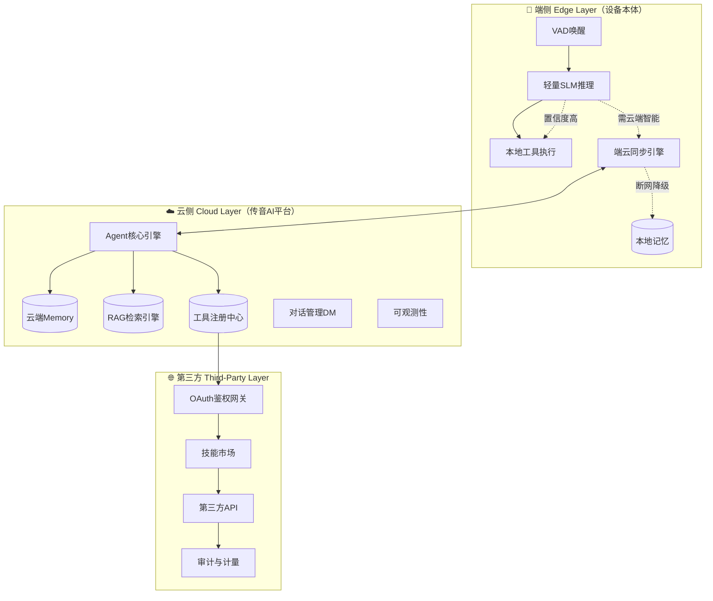
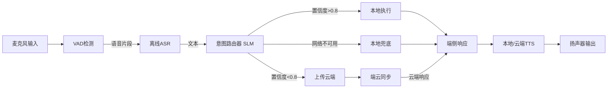
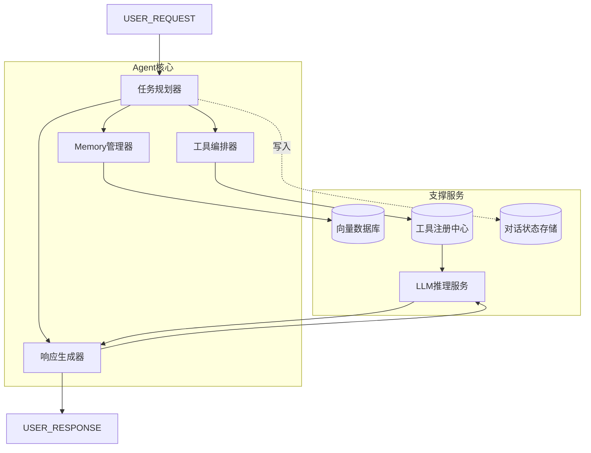
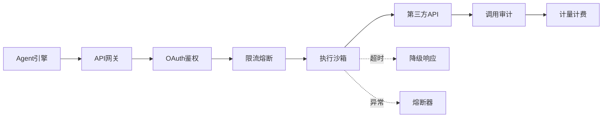
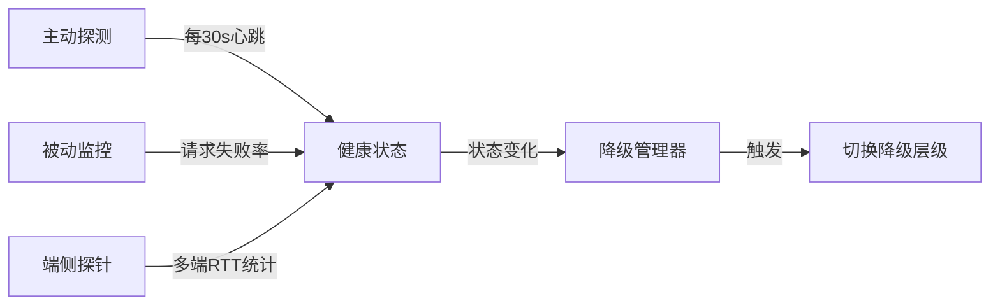
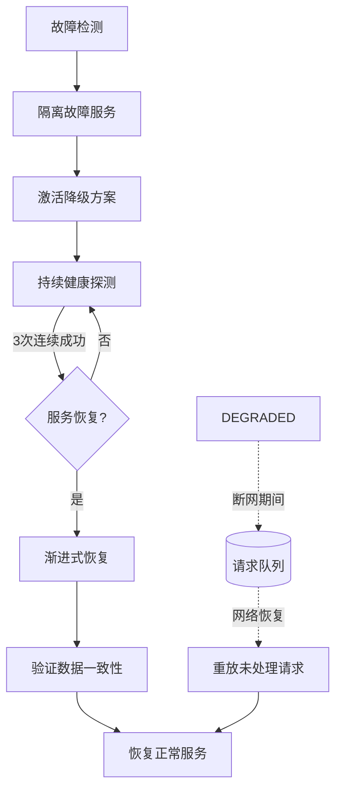

# 端云协同的AI Agent硬件助手架构方案

> *"在非洲，一个好的助手不是在云端有多聪明，而是在断网时还能帮你拨通电话。"*

## 一、引言

传音作为"非洲手机之王"，其硬件助手产品（如os语音助手）正面临从**指令式语音助手**向**自主AI Agent**的范式升级。与硅谷的AI助手不同，传音的AI Agent必须面对三个独特约束：

1. **网络环境恶劣**：非洲部分地区3G仍为主流，断网是常态而非异常
2. **设备资源受限**：中低端机型内存1-2GB、存储16-32GB、无NPU或低端NPU
3. **多语言碎片化**：豪萨语、斯瓦西里语、阿姆哈拉语等小语种离线支持

本文提出**端-云-第三方三层架构**，核心设计原则是：**端侧保可用、云侧提供智能、第三方扩展生态**。

---

## 二、总体架构设计

### 2.1 三层架构总览



### 2.2 架构原则

| 原则 | 设计含义 | 传音场景意义 |
|------|---------|-------------|
| **隐私优先** | 个人数据默认端侧处理，仅脱敏摘要上云 | 非洲POPIA/NDPR合规要求 |
| **延迟分层** | 简单操作本地响应<100ms，复杂请求云端处理 | 弱网环境下用户体验保障 |
| **弹性降级** | 云端不可用时端侧自主运行核心功能 | 非洲断网场景兜底 |
| **开放扩展** | 第三方API通过标准协议接入，沙箱隔离执行 | 生态构建与商业化 |

### 2.3 端云职责边界

```
┌─────────────────────────────────────────────────────────────────┐
│                        端云职责矩阵                              │
├────────────────┬───────────────────┬────────────────────────────┤
│     能力       │     端侧           │     云端                    │
├────────────────┼───────────────────┼────────────────────────────┤
│ 语音唤醒        │ 关键词唤醒 (Always On)│ 自定义唤醒词训练          │
│ 语音识别        │ 离线ASR (5种核心语言) │ 在线ASR (全量语言+口音)    │
│ 意图理解        │ 规则+轻量SLM (Top 20意图)│ LLM全量意图理解          │
│ 本地控制        │ 直接执行 (拨号/设置/闹钟) │ 无                       │
│ 知识问答        │ 本地知识库 (FAQ)     │ RAG + LLM 全量知识        │
│ 工具调用        │ 本地API (通讯录/相机)   │ 第三方API (天气/外卖/打车) │
│ 多轮对话        │ 上下文窗口<5轮        │ 无限轮次 + Memory检索      │
│ 个性化记忆      │ 最近7天摘要          │ 全量用户画像 + 长期记忆    │
└────────────────┴───────────────────┴────────────────────────────┘
```

---

## 三、端侧（Edge Layer）设计

### 3.1 端侧能力边界与模型选型

端侧是"可用性的最后防线"，必须在有限资源下保证核心功能。

**端侧模型量化对比：**

| 模型 | 参数量 | 量化后大小 | 首Token延迟 | 适用场景 |
|------|--------|-----------|------------|---------|
| Qwen2.5-0.5B | 0.5B | 350MB (INT4) | ~200ms | 意图分类、简单问答 |
| Gemma-2-2B | 2B | 1.2GB (INT4) | ~800ms | 复杂理解、多轮对话 |
| Whisper-Tiny | 39M | 75MB (FP16) | ~50ms | 离线语音识别 |
| 自研SLM-300M | 300M | 180MB (INT4) | ~120ms | 本地意图路由 |

**推荐方案**：采用自研300M SLM作为端侧路由核心，配合Whisper-Tiny做离线ASR，整体端侧模型包控制在500MB以内，适配低端机型。

### 3.2 端侧推理管线



**端侧意图路由器实现：**

```go
// IntentRouter - 端侧轻量意图分类与路由决策
type IntentRouter struct {
    model    *SLM           // 端侧小模型
    rules    *RuleEngine    // 规则引擎兜底
    config   *RouterConfig  // 路由阈值配置
}

func (r *IntentRouter) Route(text string) *RouteDecision {
    // 1. 规则优先（高确定性意图直接匹配，零推理成本）
    if ruleMatch := r.rules.Match(text); ruleMatch != nil {
        if ruleMatch.Confidence > 0.95 {
            return &RouteDecision{
                Target:  ExecutionTargetLocal,
                Action:  ruleMatch.Action,
                Reason:  "rule_match",
            }
        }
    }
    
    // 2. SLM推理（0.3B参数，INT4量化，内存占用~180MB）
    result := r.model.Predict(text)
    
    // 3. 路由决策
    if result.Confidence >= r.config.LocalThreshold {
        // 高置信度：本地执行
        return &RouteDecision{
            Target:  ExecutionTargetLocal,
            Action:  result.Action,
            Reason:  "slm_high_confidence",
        }
    } else if result.Confidence >= r.config.CloudThreshold {
        // 中等置信度：需要云端增强
        return &RouteDecision{
            Target:  ExecutionTargetCloud,
            Action:  result.Action,
            Reason:  "slm_medium_confidence",
        }
    } else if r.isNetworkAvailable() {
        // 低置信度：云端LLM处理
        return &RouteDecision{
            Target:  ExecutionTargetCloud,
            Action:  "general_query",
            Reason:  "slm_low_confidence",
        }
    } else {
        // 网络不可用：端侧兜底
        return &RouteDecision{
            Target:  ExecutionTargetFallback,
            Action:  "fallback_response",
            Reason:  "no_network",
        }
    }
}
```

### 3.3 端云协同策略

**何时本地？何时上云？**

```python
class EdgeCloudPolicy:
    """端云协同策略引擎"""
    
    def decide(self, intent: Intent, context: Context) -> ExecutionTarget:
        # 规则1：隐私敏感操作优先本地
        if intent.category in [PRIVACY_LOCAL_EXECUTION]:
            return LOCAL
        
        # 规则2：网络状态评估
        network_quality = self.measure_network()
        if network_quality < THRESHOLD_POOR:
            return LOCAL_FALLBACK  # 弱网强制本地
        
        # 规则3：延迟预算评估
        estimated_cloud_latency = (
            self.rtt_to_cloud() + 
            self.estimate_cloud_processing(intent)
        )
        if estimated_cloud_latency > intent.max_acceptable_latency:
            return LOCAL  # 云端太慢，降级本地
        
        # 规则4：能力匹配
        if not self.local_model.can_handle(intent):
            return CLOUD  # 端侧模型不支持
        
        # 规则5：成本权衡（云侧LLM调用成本 vs 本地推理电量消耗）
        if self.should_save_cloud_quota(intent):
            return LOCAL  # 节省云端配额
        
        return CLOUD  # 默认走云端
```

---

## 四、云侧（Cloud Layer）设计

### 4.1 云端Agent核心引擎

云端是智能的"大脑"，负责复杂推理、Memory管理、Tool编排。



**Agent执行流程（ReAct模式）：**

```python
class CloudAgent:
    """云端AI Agent核心"""
    
    async def execute(self, request: AgentRequest) -> AgentResponse:
        # 1. 加载对话上下文
        context = await self.memory.load_context(request.session_id)
        
        # 2. 检索相关记忆
        memories = await self.memory.retrieve(request.query, top_k=5)
        
        # 3. 任务规划（LLM生成行动计划）
        plan = await self.planner.generate(
            query=request.query,
            context=context,
            memories=memories
        )
        
        # 4. 工具编排执行
        results = []
        for step in plan.steps:
            if step.requires_tool:
                tool_result = await self.tool_orchestrator.execute(step)
                results.append(tool_result)
        
        # 5. 响应生成
        response = await self.response_generator.generate(
            plan=plan,
            results=results,
            context=context
        )
        
        # 6. 更新Memory
        await self.memory.store(
            session_id=request.session_id,
            interaction=request.query,
            response=response.text,
            metadata={"tools_used": [t.name for t in results]}
        )
        
        return response
```

### 4.2 多设备协同与记忆同步

传音用户通常拥有多台设备（手机+手表+电视），Agent需要跨设备协同。

```
┌─────────────────────────────────────────────────────────────┐
│                   跨设备记忆同步架构                         │
├─────────────────────────────────────────────────────────────┤
│                                                             │
│   Phone ────┐                                               │
│             │  端侧摘要 ──► 云端Memory ──► 广播增量更新       │
│   Watch ────┤                    │                          │
│             │                    ▼                          │
│   TV    ────┘              ┌──────────────┐                 │
│                            │ Conflict     │                 │
│                            │ Resolver     │                 │
│                            └──────────────┘                 │
│                                   │                         │
│                                   ▼                         │
│                          ┌──────────────┐                   │
│                          │ 统一用户画像  │                   │
│                          └──────────────┘                   │
└─────────────────────────────────────────────────────────────┘
```

**冲突解决策略：**

```go
// MemorySyncResolver - 处理多设备记忆冲突
type MemorySyncResolver struct {
    store *MemoryStore
}

func (r *MemorySyncResolver) Resolve(conflicts []MemoryEntry) MemoryEntry {
    // 策略1：时间戳优先（最新覆盖）
    latest := conflicts[0]
    for _, entry := range conflicts[1:] {
        if entry.UpdatedAt.After(latest.UpdatedAt) {
            latest = entry
        }
    }
    
    // 策略2：设备权重（手机 > 手表 > TV）
    // 同时间戳时，高优先级设备的数据更可信
    if r.hasTie(conflicts) {
        return r.resolveByDevicePriority(conflicts)
    }
    
    return latest
}
```

### 4.3 智能体技能市场（插件体系）

```yaml
# 技能注册表（云端维护）
skills:
  - skill_id: "weather_query"
    name: "天气查询"
    provider: "third_party:openweathermap"
    endpoint: "https://api.openweathermap.org/data/2.5/weather"
    auth_type: "api_key"
    description: "查询全球城市实时天气"
    capabilities: ["current", "forecast"]
    languages: ["en", "fr", "ha", "sw", "am"]
    rate_limit: 100/minute
    latency_p99: "500ms"
    
  - skill_id: "local_taxi"
    name: "本地打车"
    provider: "third_party:bolt_africa"
    endpoint: "https://api.bolt.eu/v1/ride"
    auth_type: "oauth2"
    description: "非洲本地打车服务"
    capabilities: ["estimate", "book", "track"]
    regions: ["ng", "ke", "za", "eg"]
    rate_limit: 50/minute
```

---

## 五、第三方API（Third-Party Layer）设计

### 5.1 开放平台接入架构

第三方API是Agent能力扩展的关键，必须通过标准化协议接入。



### 5.2 第三方服务治理

```python
class ThirdPartyGateway:
    """第三方API网关 - 安全、可控、可观测"""
    
    def __init__(self, config: GatewayConfig):
        self.circuit_breaker = CircuitBreaker(
            failure_threshold=5,
            recovery_timeout=60  # 60秒后尝试恢复
        )
        self.timeout = config.timeout  # 默认3秒超时
        self.retry_policy = RetryPolicy(max_retries=1)
    
    async def call(self, skill_id: str, params: dict) -> ToolResult:
        # 1. 查找技能配置
        skill = self.skill_registry.get(skill_id)
        
        # 2. 鉴权注入
        auth_header = await self.auth_manager.get_token(skill)
        
        # 3. 熔断器检查
        if self.circuit_breaker.is_open(skill_id):
            return self.fallback_response(skill_id)
        
        try:
            # 4. 带超时的HTTP调用
            response = await self.http_client.post(
                url=skill.endpoint,
                json=params,
                headers={"Authorization": auth_header},
                timeout=self.timeout
            )
            
            # 5. 结果校验
            if response.status_code != 200:
                raise APIError(f"HTTP {response.status_code}")
            
            # 6. 审计记录
            await self.audit.record(skill_id, response)
            
            return ToolResult(data=response.json(), success=True)
            
        except TimeoutError:
            self.circuit_breaker.record_failure(skill_id)
            return self.fallback_response(skill_id)
        except APIError as e:
            self.circuit_breaker.record_failure(skill_id)
            return ToolResult(error=str(e), success=False)
```

### 5.3 安全沙箱与数据脱敏

第三方API调用必须经过严格的安全审查：

```go
// DataSanitizer -  outgoing数据脱敏
func SanitizeForThirdParty(data map[string]interface{}, policy *PrivacyPolicy) map[string]interface {
    sanitized := make(map[string]interface{})
    
    for key, value := range data {
        if policy.IsSensitive(key) {
            // 脱敏处理
            switch policy.GetMaskType(key) {
            case MASK_HASH:
                sanitized[key] = sha256Hash(value)
            case MASK_REDACT:
                sanitized[key] = "[REDACTED]"
            case MASK_PARTIAL:
                sanitized[key] = partialMask(value)
            }
        } else {
            sanitized[key] = value
        }
    }
    
    return sanitized
}
```

---

## 六、云端/第三方API不可用应对方案

> *"在非洲，API的不可用不是异常，而是常态。好的架构不是假设一切正常，而是假设一切都会失败。"*

在端云协同架构中，云端API和第三方服务的不可用是最关键的系统性风险。本节从**检测、隔离、降级、恢复**四个维度构建完整的容错体系。

### 6.1 故障场景分类与影响矩阵

| 故障场景 | 典型表现 | 影响范围 | 用户感知 | 应对级别 |
|---------|---------|---------|---------|---------|
| 云端LLM服务宕机 | 502/503、超时 | 复杂推理、知识问答 | 回答变简单或拒绝 | 🔴 P0 |
| 云端Memory服务不可用 | 向量库连接失败 | 个性化、多轮对话 | 遗忘用户偏好 | 🟡 P1 |
| 第三方API限流/超时 | 429、5xx、高延迟 | 天气/打车/外卖等技能 | 部分功能不可用 | 🟡 P1 |
| 第三方OAuth失效 | 401 Unauthorized | 需要授权的技能 | 提示重新登录 | 🟢 P2 |
| 区域网络中断 | DNS失败、连接超时 | 所有云端能力 | 整体降级到端侧 | 🔴 P0 |
| CDN/边缘节点故障 | 模型包下载失败 | OTA更新、语言包 | 无法获取新能力 | 🟢 P2 |

### 6.2 云端API不可用应对策略

#### 6.2.1 多层健康检测



**多维度健康判定：**

```python
class CloudHealthMonitor:
    """云端服务健康度评估"""
    
    def __init__(self):
        self.active_probe_interval = 30  # 主动探测间隔（秒）
        self.failure_window = 10         # 滑动窗口大小
        self.failure_threshold = 0.4     # 失败率阈值
        
    async def evaluate(self, session_id: str) -> ServiceHealth:
        # 1. 主动探测（轻量心跳请求）
        active = await self.probe_health_check()
        
        # 2. 被动监控（近期请求失败率）
        recent_failures = self.get_failure_rate(window=self.failure_window)
        
        # 3. 端侧探针（多设备RTT统计）
        edge_rtt = await self.aggregate_edge_probes()
        
        # 4. 综合判定
        if active.status != 200 or recent_failures > self.failure_threshold:
            return ServiceHealth(
                status=UNHEALTHY,
                reason=f"active={active.status}, failure_rate={recent_failures:.2f}",
                suggested_level=self.compute_degradation_level()
            )
        
        return ServiceHealth(status=HEALTHY, rtt=edge_rtt.median)
```

#### 6.2.2 云端API降级路径

```
云端LLM不可用时的降级路径：
┌─────────────────────────────────────────────────────────────────┐
│ L0: 云端完整LLM (GPT-4级别)                                      │
│    ↓ 不可用                                                      │
│ L1: 云端备用模型 (同一平台的不同模型/不同区域)                      │
│    ↓ 不可用                                                      │
│ L2: 云端轻量模型 (同一平台的小模型，成本更低但更稳定)               │
│    ↓ 不可用                                                      │
│ L3: 端侧SLM (300M INT4量化)                                      │
│    ↓ 不可用/置信度低                                              │
│ L4: 端侧规则引擎 (预置意图模板 + 关键词匹配)                       │
│    ↓ 不可用                                                      │
│ L5: 预置回复库 (常见问题的标准话术)                                │
└─────────────────────────────────────────────────────────────────┘
```

**云端多活与备用路由：**

```python
class CloudRouter:
    """云端服务路由与故障切换"""
    
    def __init__(self):
        self.providers = [
            Provider(name="primary",   endpoint="api.transsion.com/v1",  priority=1),
            Provider(name="fallback-1", endpoint="api-backup.transsion.com/v1", priority=2),
            Provider(name="fallback-2", endpoint="api-edge.transsion.com/v1", priority=3),
        ]
        self.circuit_breakers = {p.name: CircuitBreaker() for p in self.providers}
    
    async def route(self, request: AgentRequest) -> AgentResponse:
        # 按优先级尝试可用provider
        for provider in sorted(self.providers, key=lambda p: p.priority):
            cb = self.circuit_breakers[provider.name]
            
            if cb.state == OPEN:
                continue  # 熔断中，跳过
            
            try:
                response = await self.call_provider(provider, request)
                cb.record_success()
                return response
            except Exception as e:
                cb.record_failure()
                logger.warning(f"Provider {provider.name} failed: {e}")
                continue
        
        # 所有云端provider均不可用 → 降级到端侧
        return self.trigger_edge_fallback(request)
```

### 6.3 第三方API不可用应对策略

#### 6.3.1 多供应商冗余

对于关键第三方服务（天气、地图、翻译等），应接入多个供应商，自动切换：

```yaml
# 第三方服务多供应商配置
services:
  weather:
    primary:
      provider: "openweathermap"
      endpoint: "https://api.openweathermap.org/data/2.5/weather"
      rate_limit: 100/min
      cost_tier: "free"
    backup:
      - provider: "weatherapi"
        endpoint: "https://api.weatherapi.com/v1/current.json"
        rate_limit: 1000000/month
        cost_tier: "paid"
      - provider: "accuweather"
        endpoint: "https://dataservice.accuweather.com/currentconditions"
        cost_tier: "paid"
      
  translation:
    primary:
      provider: "google_translate"
    backup:
      - provider: "deepl"
      - provider: "local_model"  # 端侧轻量翻译模型
      
  maps:
    primary:
      provider: "google_maps"
    backup:
      - provider: "mapbox"
      - provider: "osm_local"  # 离线OpenStreetMap数据
```

**供应商自动切换逻辑：**

```python
class ThirdPartyMultiProvider:
    """第三方服务多供应商路由"""
    
    async def call(self, service: str, **params) -> ServiceResult:
        config = self.service_config[service]
        providers = [config.primary] + config.backup
        
        for provider in providers:
            health = self.health_checker.check(provider)
            if health != HEALTHY:
                continue
                
            try:
                result = await self.invoke(provider, params)
                # 记录成功，更新provider优先级（成功的排前面）
                self.promote_provider(service, provider)
                return result
            except (TimeoutError, APIError) as e:
                self.demote_provider(service, provider)
                logger.warning(f"Provider {provider.name} failed: {e}")
                continue
        
        # 所有供应商均不可用 → 使用缓存或兜底回复
        return self.fallback_for_service(service, params)
```

#### 6.3.2 智能缓存与预取

```
缓存策略矩阵：
┌──────────────┬──────────┬───────────┬────────────────────────────┐
│ 数据类型      │ TTL       │ 过期策略   │ 非洲场景优化               │
├──────────────┼──────────┼───────────┼────────────────────────────┤
│ 天气数据      │ 30分钟   │ Stale-while-revalidate │ 提前缓存当日预报    │
│ 翻译结果      │ 永久     │ 内容哈希不变即有效      │ 常用短语预缓存      │
│ 地图路线      │ 10分钟   │ 距离过期              │ 离线地图包常驻      │
│ 新闻/资讯     │ 1小时    │ LRU淘汰               │ WiFi时预下载        │
│ 用户偏好      │ 永久     │ 增量更新               │ 端侧持久化          │
│ 商品/价格     │ 5分钟    │ 严格一致              │ 不可缓存，需实时     │
└──────────────┴──────────┴───────────┴────────────────────────────┘
```

```python
class SmartCache:
    """智能缓存 - 支持预取、过期降级、staleness容忍"""
    
    async def get(self, key: str, service: str) -> CacheResult:
        cached = self.store.get(key)
        
        if cached and not cached.expired:
            return CacheResult(data=cached.value, source="cache_fresh")
        
        if cached and cached.stale_while_revalidate:
            # 返回过期数据，后台异步刷新
            asyncio.create_task(self.refresh(key, service))
            return CacheResult(data=cached.value, source="cache_stale")
        
        # 缓存未命中，尝试同步获取
        try:
            fresh = await self.fetch_and_cache(key, service)
            return CacheResult(data=fresh, source="live")
        except Exception:
            # 即使过期缓存也优于无响应
            if cached:
                return CacheResult(data=cached.value, source="cache_expired_fallback")
            raise ServiceUnavailable(f"No cached data for {key}")
    
    async def prefetch(self, predictions: List[PrefetchHint]):
        """WiFi连接时预取可能需要的数据"""
        if self.is_wifi_connected() and self.is_charging():
            for hint in predictions:
                await self.fetch_and_cache(hint.key, hint.service)
```

#### 6.3.3 降级回复生成

当第三方API完全不可用且无缓存时，生成体面的降级回复：

```python
class GracefulFallback:
    """优雅降级回复生成"""
    
    FALLBACK_TEMPLATES = {
        "weather": {
            "offline": "目前无法获取实时天气数据。建议您查看手机天气组件，或稍后网络恢复时再问我。",
            "partial": "我能查到{city}的历史平均气温约{temp}°C，但实时数据暂不可用。",
        },
        "taxi": {
            "offline": "打车服务暂时不可用。您可以直接打开Bolt/Uber应用叫车。",
        },
        "translation": {
            "offline": "离线翻译引擎已启动（准确率约85%）。如需更精准的翻译，请连接网络。",
        },
        "general": {
            "offline": "这个功能需要联网才能使用。我现在可以帮您做这些本地操作：{local_capabilities}",
        },
    }
    
    def generate(self, service: str, context: dict, network_state: str) -> str:
        templates = self.FALLBACK_TEMPLATES.get(service, self.FALLBACK_TEMPLATES["general"])
        template = templates.get(network_state, templates.get("offline"))
        
        # 填充模板变量
        return template.format(**context)
```

### 6.4 端侧兜底能力清单

当所有云端和第三方API都不可用时，端侧必须能独立完成的核心功能：

```
端侧兜底能力清单（断网可用）：
├── 📞 通信类
│   ├── 拨打电话 / 发送短信 / 查询通话记录
│   ├── 读取/编辑通讯录
│   └── 读取未读消息
├── 📱 设备控制类
│   ├── 调节音量/亮度/WiFi/蓝牙
│   ├── 打开/关闭应用
│   ├── 设置闹钟/定时器/提醒
│   └── 音乐播放控制（本地媒体）
├── 📝 个人助理类
│   ├── 创建/查询/编辑备忘录
│   ├── 本地日历查询
│   └── 计算器/单位换算
├── 🌍 离线知识类
│   ├── 预置FAQ问答（500+条目）
│   ├── 离线翻译（核心语言对，准确率~85%）
│   └── 离线地图导航（已下载区域）
└── 💬 对话兜底类
    ├── "我不知道，但网络恢复后我会记住这个问题"
    ├── "这个问题需要联网，目前可以做的是：..."
    └── 记录用户问题，网络恢复后异步查询并推送
```

### 6.5 故障恢复与自愈



**渐进式恢复策略：**

```python
class GradualRecovery:
    """服务恢复不是瞬间完成的，需要渐进式验证"""
    
    async def on_service_restored(self, service: str):
        # Phase 1: 小流量验证（1%请求走新恢复的服务）
        await self.canary_test(service, traffic_pct=0.01)
        
        # Phase 2: 逐步放量（10% → 50% → 100%）
        for pct in [0.1, 0.5, 1.0]:
            success_rate = await self.ramp_traffic(service, pct)
            if success_rate < 0.95:
                # 恢复不稳定，回退
                self.rollback(service)
                return
        
        # Phase 3: 重放断网期间的积压请求
        pending = self.dequeue_pending_requests(service)
        for req in pending:
            await self.replay_request(req)
            
        # Phase 4: 通知端侧恢复全功能
        await self.broadcast_service_restored(service)
```

---

## 七、关键技术实现

### 7.1 端云通信协议

| 协议 | 适用场景 | 优势 | 劣势 |
|------|---------|------|------|
| **gRPC** | 结构化数据传输（记忆同步、状态更新） | 高性能、强类型、双向流 | 需要代理、防火墙穿透复杂 |
| **WebSocket** | 实时音频流、流式对话 | 全双工、低延迟 | 连接管理开销大 |
| **SSE** | 云端向端侧推送（通知、增量更新） | 简单、HTTP兼容 | 单向、连接数限制 |
| **HTTP/2** | 批量请求、非实时数据 | 多路复用、头部压缩 | 不适合流式音频 |

**推荐方案**：音频流用WebSocket，状态同步用gRPC，推送通知用SSE。

### 7.2 端侧摘要 → 云端增量更新

为节省带宽，端侧不上传原始对话，而是上传结构化摘要：

```python
class EdgeSummary:
    """端侧对话摘要 - 最小化云端同步数据量"""
    
    def summarize(self, conversation: List[Turn]) -> SyncPayload:
        return SyncPayload(
            session_id=self.session_id,
            device_id=self.device_id,
            timestamp=time.now(),
            # 不上传原始对话，只上传结构化摘要
            intents=[turn.intent for turn in conversation],
            entities_extracted=self.extract_entities(conversation),
            user_preferences=self.detect_preferences(conversation),
            # 关键记忆点（而非完整对话）
            key_memories=[
                MemoryPoint(
                    type="preference",
                    content=f"用户喜欢{topic}",
                    confidence=0.85
                )
                for topic in self.detect_topics(conversation)
            ],
            # 统计信息
            turn_count=len(conversation),
            total_duration=conversation[-1].timestamp - conversation[0].timestamp,
        )
    
    def payload_size(self) -> int:
        """摘要大小通常 < 2KB，原始对话可能 > 50KB"""
        return len(json.dumps(self.summarize([])))
```

### 7.3 弹性降级策略

```
┌─────────────────────────────────────────────────────────────┐
│                    弹性降级层级                               │
├────────┬────────────────────────────────────────────────────┤
│ L0 全功能│ 云端LLM + 全量Memory + 第三方工具                  │
│ L1 精简云│ 云端轻量模型 + 短期Memory + 核心工具                │
│ L2 端侧智能│ 端侧SLM + 本地记忆 + 本地工具                      │
│ L3 端侧规则│ 规则引擎 + 预置回复 + 基础控制                     │
│ L4 基础控制│ 仅设备控制（拨号、设置、播放）                      │
└────────┴────────────────────────────────────────────────────┘
```

降级触发条件：

```python
class DegradationManager:
    def evaluate(self, metrics: SystemMetrics) -> DegradationLevel:
        if metrics.cloud_available and metrics.network_quality > 0.7:
            return L0_FULL
        elif metrics.cloud_available and metrics.network_quality > 0.3:
            return L1_LITE
        elif not metrics.cloud_available and metrics.slm_available:
            return L2_EDGE
        elif not metrics.slm_available and metrics.rules_available:
            return L3_RULES
        else:
            return L4_BASIC
```

---

## 八、非洲本地化适配

### 8.1 弱网环境优化

| 优化策略 | 技术方案 | 效果 |
|---------|---------|------|
| 离线能力包 | 端侧预置5种核心语言的ASR+SLM模型 | 断网可用核心功能 |
| 断点续传 | 请求失败自动缓存，网络恢复后重试 | 弱网请求不丢失 |
| 边缘节点 | 在拉各斯、内罗毕、约翰内斯堡部署边缘推理 | 延迟从800ms降至150ms |
| 数据压缩 | Opus音频编码（12kbps）+ Protobuf序列化 | 带宽占用降低80% |

### 8.2 低端设备适配

| 约束条件 | 适配方案 | 资源占用 |
|---------|---------|---------|
| 内存1GB | 模型按需加载（非全量常驻） | 运行时内存<300MB |
| 存储16GB | 模型包压缩+增量更新 | 模型包<500MB |
| 无NPU | CPU推理+INT4量化 | 延迟增加但可用 |
| 电池小 | 推理时CPU频率限制+VAD唤醒 | 功耗<5%日常使用 |

### 8.3 多语言端侧支持

```
端侧预置语言包策略：
├── 核心语言（预装，始终可用）
│   ├── 英语（非洲口音）
│   ├── 法语（非洲口音）
│   └── 斯瓦西里语
├── 扩展语言（按需下载，WiFi推荐）
│   ├── 豪萨语
│   ├── 约鲁巴语
│   ├── 阿姆哈拉语
│   └── 祖鲁语
└── 云端语言（仅在线可用）
    ├── 所有非洲语言（50+）
    └── 多语言混合输入
```

---

## 九、总结

### 核心架构要点

| 设计维度 | 方案选择 | 理由 |
|---------|---------|------|
| 端侧模型 | 300M SLM INT4量化 | 低端设备可运行、延迟<200ms |
| 通信协议 | WebSocket音频 + gRPC状态 | 兼顾实时性和结构化传输 |
| 降级策略 | 5层弹性降级 | 从全功能到基础控制的平滑过渡 |
| 第三方接入 | 沙箱隔离 + 熔断保护 | 安全可控的生态扩展 |
| 记忆同步 | 端侧摘要 → 云端增量 | 带宽优化80%+ |
| **API容错** | 多供应商 + 智能缓存 + 渐进恢复 | 云端/第三方不可用时自动切换 |

### 面试金句

> *"端云协同不是把云端的能力搬一部分到端侧，而是让端侧和云端各司其职——端侧保可用，云端供智能。"*

> *"在非洲，一个不能在断网时拨电话的助手，再聪明也是摆设。"*

> *"第三方API的接入不是越多越好，而是越可控越好——沙箱、熔断、脱敏，缺一不可。"*

> *"端侧摘要同步的设计精髓：不传原始对话，只传结构化记忆——既省带宽，又保隐私。"*

> *"好的API容错不是祈祷服务永远可用，而是假设一切都会失败——多供应商冗余、智能缓存、渐进恢复，缺一不可。"*

---

*本文档为面试技术方案，实际落地需结合传音硬件平台（芯片、NPU、OS）做进一步适配。*
