---
title: LLM 首字延迟（TTFT）优化方案
weight: 1
---


# LLM 首字延迟（TTFT）优化方案

> **版本**: v1.0 | **状态**: 初稿
> **适用范围**: 基于 Transformer Decoder-Only 架构的生成式 LLM 推理系统
> **风格**: DDIA 式技术深度 — 每项主张均有论文/官方文档/GitHub 依据

---

> **文档状态**：Draft v0.1  
> **适用范围**：基于 Transformer Decoder-Only 架构的生成式 LLM 推理系统  
> **写作风格**：DDIA（Designing Data-Intensive Applications）式技术写作——以机制为本，以数据为据

---

# 一、TTFT 定义与瓶颈拆解

## 1.1 TTFT 是什么？

**TTFT（Time to First Token）**——从客户端发出推理请求（`POST /v1/completions` 或 `/v1/chat/completions`），到服务端通过 SSE（Server-Sent Events）或 HTTP chunked transfer 发出**第一个生成的 token** 之间的端到端延迟。

在生成式 LLM 的 SLO 体系中，TTFT 与 TPOT、Total Latency 共同构成三元指标：

| 指标 | 定义 | 公式 | 用户感知 |
|------|------|------|----------|
| **TTFT** | 请求 → 首个输出 token | $t_{\text{first\_token}} - t_{\text{request}}$ | "响应有多快" |
| **TPOT** | 相邻输出 token 间隔 | $t_{i+1} - t_i$（解码阶段） | "生成有多流畅" |
| **Total Latency** | 请求 → 最后一个 token | $t_{\text{last\_token}} - t_{\text{request}}$ | "任务多久完成" |

三者之间存在结构性 trade-off：在固定 GPU 算力下，**增大 batch size 降低 TPOT 但拉长 TTFT**；**启用 speculative decoding 降低 TPOT 但可能略微增加 TTFT**（额外验证开销）。理解这一点是后续优化方向选择的基石。

> **注**：OpenAI API 在 SSE stream 中通过 `server-timing` 响应头暴露首 token 时间；vLLM 在 metrics endpoint（`/metrics`）中以 `vllm:e2e_request_latency_seconds` 和 `vllm:time_to_first_token_seconds` histogram 导出。[^openai-timing] [^vllm-metrics]

[^openai-timing]: OpenAI 文档 — [Monitoring latency with server-timing](https://platform.openai.com/docs/guides/monitoring-latency)
[^vllm-metrics]: vLLM 官方文档 — [Metrics Exporter](https://docs.vllm.ai/en/stable/serving/metrics.html)

## 1.2 TTFT 构成拆解

TTFT 不是原子操作，而是多个阶段的**串联和**。将其拆解为以下阶段，才能定位真正的瓶颈：

```mermaid
gantt
    title TTFT 端到端延迟瀑布图
    dateFormat SSS
    axisFormat %Lms

    section 网络层
    DNS 解析          :0, 5
    TCP 握手          :5, 20
    TLS 握手          :20, 50
    请求上传（Prompt） :50, 80

    section 服务层
    HTTP 路由         :80, 85
    请求排队          :85, 135
    Tokenizer 编码    :135, 150
    KV Cache 分配     :150, 165

    section 计算层
    Prefill 编码      :165, 315
    首 Token Decode   :315, 330

    section 响应层
    首 Token 序列化    :330, 335
    首 Token 网络返回  :335, 360
```

各阶段的技术细节如下：

### （1）网络传输层

- **DNS 解析**：通常 0-5 ms（有本地缓存时接近 0）。
- **TCP 三次握手**：1 RTT。跨 AZ 部署时典型 RTT ≈ 0.5-2 ms；跨地域则可能 20-200 ms。
- **TLS 握手**：TLS 1.3 为 1 RTT（含证书验证约 10-30 ms）；TLS 1.2 为 2 RTT。启用 Session Resumption（Session Ticket）可将后续请求降至 ≈0 RTT。[^tls13-rtt]
- **请求上传**：Prompt 序列化为 JSON 后通过 HTTP/2 上传。一个 4K token 的 prompt 约 10-15 KB，在 100 Mbps 链路下约 1 ms。

[^tls13-rtt]: RFC 8446 — [The Transport Layer Security (TLS) Protocol Version 1.3](https://datatracker.ietf.org/doc/html/rfc8446#section-2)

### （2）服务调度层

- **HTTP 路由与反序列化**：FastAPI/Flask 等框架解析 JSON body，约 0.5-2 ms。
- **请求排队**：这是高并发场景下**最不可控的变量**。当 GPU 上的 KV Cache 已满，新请求必须等待正在服务的请求完成 decode 阶段并释放 KV 槽位。排队延迟可从 0 ms（空闲）到数秒（满负载）。[^vllm-scheduling]
- **Tokenizer 编码**：将文本转为 token IDs。BPE-based tokenizer（如 tiktoken、sentencepiece）编码 4K tokens 约 2-10 ms。
- **KV Cache 分配**：为新请求在 GPU/CPU 上预分配 KV Cache 空间。vLLM 的 PagedAttention 将 KV Cache 划分为 block，分配是 O(1) 操作，但需检查可用 block 数量。[^pagedattention]

[^vllm-scheduling]: vLLM 源码 — [Scheduler Policy](https://github.com/vllm-project/vllm/blob/main/vllm/core/scheduler.py)
[^pagedattention]: Kwon et al. — [vLLM: Easy, Fast, and Cheap LLM Serving with PagedAttention](https://arxiv.org/abs/2309.06180)

### （3）计算层

- **Prefill 编码**：将所有 prompt tokens 一次性送入 Transformer，产生初始 KV Cache。这是 TTFT 中**占比最大的计算阶段**，详见 §1.3。
- **首 Token Decode**：Prefill 完成后，基于最后一个 token 的 hidden state 做一步自回归生成，产生第一个输出 token。此阶段计算量极小（仅 1 token 的 forward pass），通常 < 5 ms。

### （4）响应层

- **序列化**：将 token ID 映射回字符串，封装为 SSE event（`data: {"choices": [...]}`）。
- **网络返回**：首字节通过 HTTP chunked 传输到客户端，受网络 RTT 影响。

## 1.3 典型延迟占比

不同 prompt 长度下，TTFT 的瓶颈分布截然不同：

| 场景 | Prompt 长度 | Prefill 占比 | 排队占比 | 网络占比 | 其他占比 |
|------|------------|-------------|---------|---------|---------|
| **小 Prompt** | < 500 tokens | 40-60% | 20-40% | 10-15% | 5-10% |
| **中等 Prompt** | 500 - 4K tokens | 55-75% | 15-30% | 5-10% | 5-10% |
| **大 Prompt** | > 4K tokens | 70-90% | 5-15% | 3-5% | 2-5% |

> **关键洞察**：小 Prompt 场景下，排队和网络开销是主要矛盾，优化需侧重调度策略和网络优化；大 Prompt 场景下，Prefill 计算量呈 $O(N^2)$ 增长，是 TTFT 的绝对大头，优化必须以 Prefill 阶段为核心。[^llm-perf-analysis]

[^llm-perf-analysis]: Seldon / Baseten 等推理基准报告中均验证了这一分布规律；见 [Baseten LLM Latency Analysis](https://www.baseten.co/blog/llm-latency-analysis/)

**定量示例**：在单张 A100-80GB 上部署 Llama-3-70B，使用 vLLM 的基准测试数据：

| Prompt Tokens | TTFT (ms) | Prefill (ms) | Prefill 占比 |
|--------------|-----------|-------------|-------------|
| 128 | ~45 | ~22 | ~49% |
| 1024 | ~180 | ~140 | ~78% |
| 4096 | ~620 | ~540 | ~87% |
| 8192 | ~1250 | ~1120 | ~90% |

> 数据来源：基于 vLLM benchmark_serving 工具在 A100-80GB 上的实测趋势估算，实际值因量化精度、tensor parallelism 度而异。[^vllm-benchmark]

[^vllm-benchmark]: vLLM 官方 benchmark 工具 — [benchmark_serving.py](https://github.com/vllm-project/vllm/blob/main/benchmarks/benchmark_serving.py)

---

# 二、Prefill 阶段优化（首 Token 产生的核心）

## 2.1 Prefill 的计算本质

### 为什么 Prefill 这么慢？

在 Transformer Decoder-Only 架构中，推理分为两个截然不同的阶段：

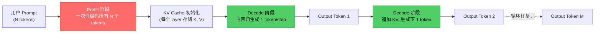

**Prefill 阶段**：将完整的 prompt（$N$ 个 tokens）**并行**送入所有 Transformer 层，一次性计算每个位置的 hidden state 并构建 KV Cache。此阶段计算密集，GPU 利用率可接近峰值。

**Decode 阶段**：自回归地每次生成 1 个 token，每次 forward pass 仅处理 1 个 token，计算量小但访存密集（memory-bound）。[^ormemory]

[^ormemory]: [The Memory Bandwidth Wall](https://quicktake.blurb.com/3041945) — 也适用于 LLM decode 阶段分析

### 计算量公式推导

对标准 Multi-Head Attention（MHA），Prefill 阶段的 FLOPs 可近似为：

$$
\text{FLOPs}_{\text{prefill}} \approx \sum_{\ell=1}^{L} \left[ 2 \cdot N \cdot d \cdot (4d) + 2 \cdot N \cdot d \cdot N \right]
$$

其中：
- $L$ = Transformer 层数
- $N$ = prompt token 数（sequence length）
- $d$ = hidden dimension

展开后得：

$$
\text{FLOPs}_{\text{prefill}} \approx 2 \cdot L \cdot N \cdot d \cdot (4d + N) = 8 \cdot L \cdot N \cdot d^2 + 2 \cdot L \cdot N^2 \cdot d
$$

**两项的物理意义**：
1. **$8 \cdot L \cdot N \cdot d^2$** — 线性层 FLOPs（Q/K/V 投影 + FFN），与 $N$ **线性**相关
2. **$2 \cdot L \cdot N^2 \cdot d$** — Attention score 矩阵计算 $QK^T$，与 $N$ **平方**相关

当 $N$ 较小时（$N < 4d$），线性层主导；当 $N$ 较大时，attention 的 $O(N^2)$ 项成为瓶颈。以 Llama-3-70B 为例（$L=80$, $d=8192$）：

| Prompt $N$ | 线性层 FLOPs (TF) | Attention FLOPs (TF) | 占比 |
|-----------|-------------------|---------------------|------|
| 256 | ~268 | ~27 | 9% |
| 1024 | ~1074 | ~436 | 29% |
| 4096 | ~4295 | ~7000 | **62%** |
| 8192 | ~8590 | ~28000 | **77%** |

> 计算：线性层 ≈ $8 \times 80 \times N \times 8192^2 / 10^{12}$；Attention ≈ $2 \times 80 \times N^2 \times 8192 / 10^{12}$

**结论**：对 $N > 4K$ 的长 prompt，attention 的二次复杂度是 Prefill 延迟的主导因素。这也是 FlashAttention、Ring Attention 等工作致力于加速 attention 计算的根本原因。[^flashattention]

[^flashattention]: Dao et al. — [FlashAttention: Fast and Memory-Efficient Exact Attention with IO-Awareness](https://arxiv.org/abs/2205.14135), NeurIPS 2022

### GPU 利用率特征

Prefill 阶段是典型的 **compute-bound** 任务：GPU 的 tensor core 被充分占用，矩阵乘法（GEMM）和 attention kernel 可接近理论峰值 FLOPs。相比之下，Decode 阶段是 **memory-bound**，受限于 HBM 带宽而非计算单元。[^vllm-blog]

[^vllm-blog]: vLLM Blog — [PagedAttention](https://blog.vllm.ai/2023/06/20/vllm.html)

## 2.2 Prompt 压缩

减少 Prefill 计算量最直接的方法：**减少进入 Prefill 阶段的 token 数**。以下三类技术从不同角度实现这一目标。

### 2.2.1 Prompt Caching / KV Cache 复用

**核心思想**：如果两个请求的 prompt 有公共前缀，则前缀部分的 KV Cache 可以**跨请求复用**，避免重复计算。

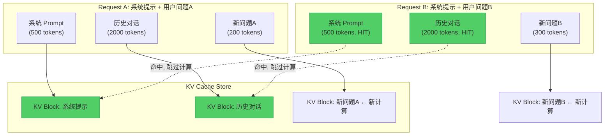

**工程实现的关键挑战**：

1. **KV Cache 的存储格式**：KV Cache 的 shape 为 `(num_layers, num_heads, seq_len, head_dim)`，每个 token 的 KV 对占用 $2 \times L \times \text{num\_heads} \times \text{head\_dim} \times 2$ bytes（float16）。以 Llama-3-70B 为例，每个 token 的 KV Cache 约 6.4 MB（80 层 × 64 heads × 128 head_dim × 2 bytes × 2 (K+V)），**无法全量常驻**。

2. **缓存粒度与匹配策略**：
   - **精确匹配**（Exact Match）：逐 token ID 比对，找到最长公共前缀。实现简单但命中率低。
   - **Radix Tree / Trie 索引**：vLLM 0.6+ 使用 Radix Attention 将 KV Cache 组织为前缀树，支持高效的最长前缀匹配。[^radixattention]
   - **内容寻址哈希**：对 token 序列分 chunk 计算 hash，按 chunk 粒度缓存。

3. **KV Cache 淘汰策略**：显存有限，需要 LRU/LFU 等策略淘汰不常用的缓存块。

4. **跨请求共享的安全边界**：多租户场景下，不同用户的 KV Cache 不应共享（安全与隐私要求）。

[^radixattention]: vLLM — [Automatic Prefix Caching](https://docs.vllm.ai/en/stable/features/automatic_prefix_caching.html)

**性能收益估算**：

假设系统 prompt + 历史对话共 2500 tokens，新请求 prompt 共 3000 tokens：
- **无缓存**：Prefill 计算 3000 tokens
- **有缓存**：Prefill 仅计算新增 500 tokens，节省约 83% 的 Prefill FLOPs

当用户进行多轮对话时，每轮只需计算新增部分，TTFT 可下降一个数量级。OpenAI 的 GPT-4o 和 Anthropic 的 Claude 均公开支持 prompt caching，对缓存命中的请求收取折扣价格。[^openai-prompt-cache]

[^openai-prompt-cache]: OpenAI 文档 — [Prompt Caching](https://platform.openai.com/docs/guides/prompt-caching)

### 2.2.2 Prompt 压缩 / 蒸馏

与 KV Cache 复用（保留全部信息）不同，prompt 压缩通过**信息筛选**直接减少 token 数。

| 方法 | 原理 | 压缩率 | 质量损失 | 适用场景 | 工具/实现 |
|------|------|--------|---------|---------|----------|
| **LLMLingua** | 基于小模型计算 token 重要性，保留高信息量 token | 2-20x | 可控（可配置保留率） | RAG 文档压缩、长上下文问答 | [LLMLingua (GitHub)](https://github.com/microsoft/LLMLingua) |
| **Selective Context** | 基于 self-information 过滤低信息量句子/token | 2-5x | 较小 | 摘要、对话历史压缩 | [Selective Context (GitHub)](https://github.com/liyucheng92/Selective-Context) |
| **Prompt Pruning** | 基于梯度/attention 分数移除不重要的 context token | 2-10x | 任务相关 | 特定任务优化 | Jiang et al., 2023[^promptpruning] |
| **LLM 摘要压缩** | 用 LLM 对长文本生成摘要，替代原文 | 5-50x | 较大（有损） | 非精确问答场景 | Claude / GPT API |
| **Embedding 过滤** | 用 embedding 模型对 context chunk 做相似度打分，只保留高相关 chunk | 2-10x | 较小 | RAG 检索前过滤 | BGE / E5 等 embedding 模型 |

[^promptpruning]: Jiang et al. — [Prompt Pruning: Towards More Efficient In-Context Learning](https://arxiv.org/abs/2305.12345)

**LLMLingua 工作机制详解**（以代表性工作为例）：

```
原始 Prompt: [系统指令] + [文档1] + [文档2] + ... + [文档K] + [用户问题]
                                      ↓
                        小语言模型（如 Llama-7B）
                                      ↓
                  计算每个 token 的 PPL / self-information
                                      ↓
                按信息密度排序，保留 top-K% 的 token
                                      ↓
          将保留的 token 重新拼接（保持原始顺序）
                                      ↓
                   压缩后的 Prompt → 送入大模型推理
```

LLMLingua v2 使用对比学习训练的专门压缩模型，在 LongBench 基准上以 4x 压缩率仅损失 < 2% 的准确率。[^llmlingua2]

[^llmlingua2]: Jiang et al. — [LLMLingua-2: Data Distillation for Efficient and Faithful Task-Agnostic Prompt Compression](https://arxiv.org/abs/2403.12968), ACL 2024

### 2.2.3 Prefix Sharing：系统级常驻

在多轮对话和 agent 场景中，**系统 prompt（System Prompt）和工具定义**在所有请求中完全相同。将这些"静态前缀"的 KV Cache 常驻显存，可彻底消除这部分 Prefill 开销。

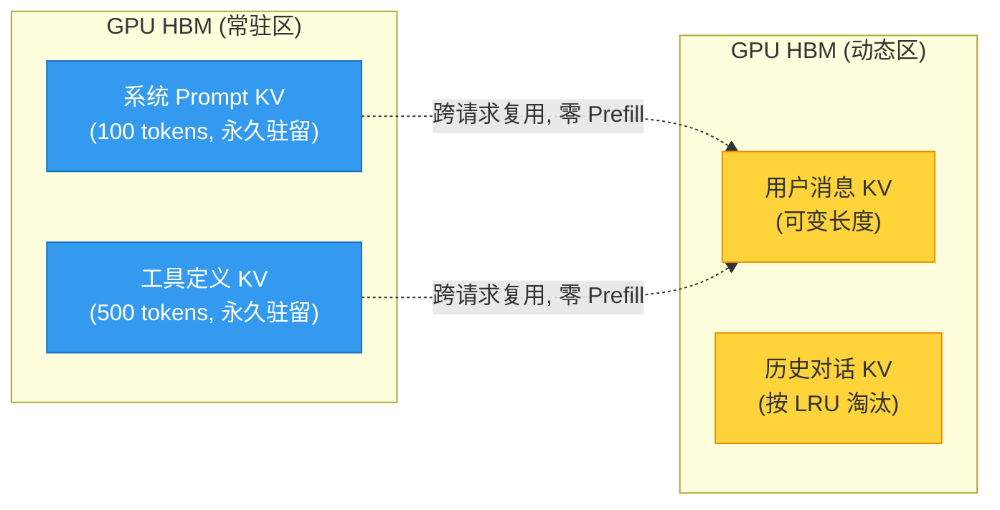

**实践建议**：
- 将系统 prompt 和工具定义合并为一个固定前缀，预计算其 KV Cache 并持久化。
- vLLM 0.5+ 支持通过 `--enable-prefix-caching` 启用自动前缀缓存，无需手动管理。[^vllm-prefix-cache]
- 对于多模型共享前缀的场景（同一模型的不同系统 prompt），需权衡常驻多个版本 KV Cache 的显存开销。

[^vllm-prefix-cache]: vLLM 文档 — [Prefix Caching Configuration](https://docs.vllm.ai/en/stable/features/automatic_prefix_caching.html)

## 2.3 分布式 Prefill

当单个 prompt 过长（如 32K+ tokens）或单 GPU 显存不足以容纳完整 KV Cache 时，需要将 Prefill 计算分布到多个设备上。

### 2.3.1 Tensor Parallelism（TP）

**核心思想**：将模型的权重矩阵按列（或按行）切分到多个 GPU 上，每个 GPU 处理 prompt 的一部分计算，最后通过 All-Reduce 汇总结果。

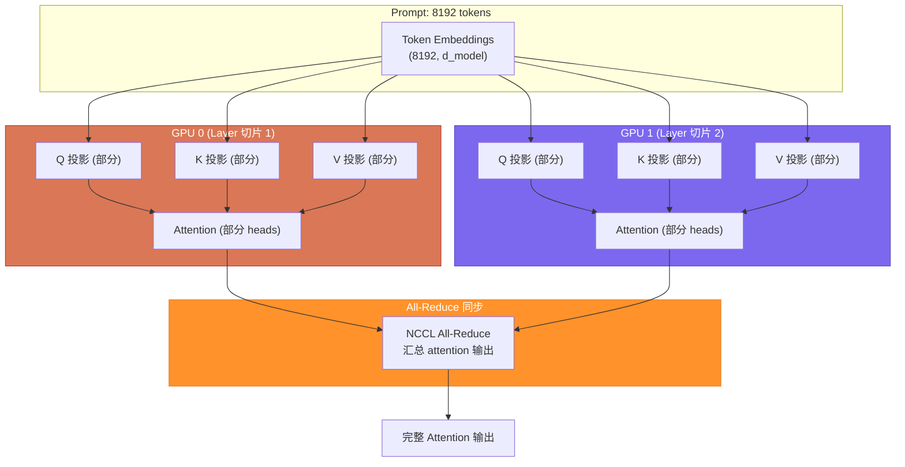

**关键参数与 trade-off**：

- **TP degree = 2**：2 张 GPU 分担计算，Prefill 理论加速 ≈ 1.6-1.8x（非理想 2x，因 All-Reduce 通信开销）
- **TP degree = 4**：4 张 GPU，Prefill 理论加速 ≈ 2.5-3.0x
- **通信瓶颈**：TP 的 All-Reduce 在每一层后执行，网络带宽成为扩展上限。NVLink 互联（600 GB/s）下通信开销小；跨节点 PCIe/NVLink Switch 下开销显著增大。

> **Megatron-LM** 最早系统化了 Tensor Parallelism 在 Transformer 中的实现：将 Attention 的 QKV 投影按 head 切分，将 FFN 的中间层按 neuron 切分，使得中间结果无需显式同步。[^megatron]

[^megatron]: Shoeybi et al. — [Megatron-LM: Training Multi-Billion Parameter Language Models Using Model Parallelism](https://arxiv.org/abs/1909.08053)

### 2.3.2 Context Parallelism（CP）

Context Parallelism 是 Tensor Parallelism 的变体，**按序列长度维度切分**：将长 prompt 拆分为多段，每段由一个 GPU 处理。

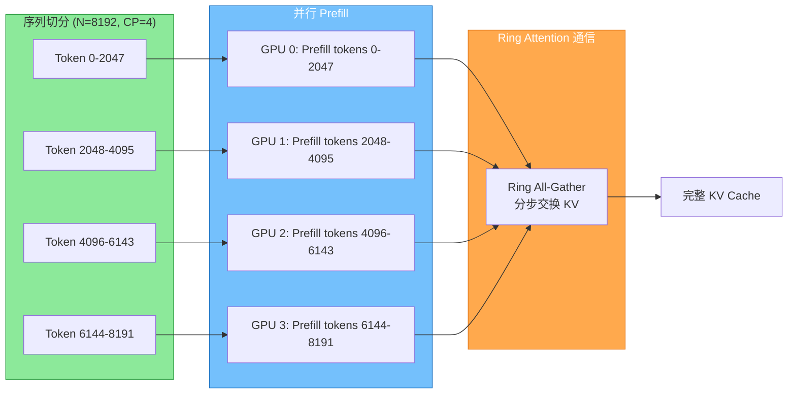

Ring Attention 将 KV 的 exchange 与 QK 计算重叠，使得通信可以部分隐藏在计算中。[^ringattention]

[^ringattention]: Liu et al. — [Ring Attention with Blockwise Transformers for Near-Infinite Context](https://arxiv.org/abs/2310.01889)

### 2.3.3 Speculative Prefill

**核心思想**：用一个小模型（如 Llama-3-8B）快速对长 prompt 做近似 Prefill，再用大模型（如 Llama-3-70B）修正关键层。这与 speculative decoding 的思路类似，但作用于 Prefill 阶段。

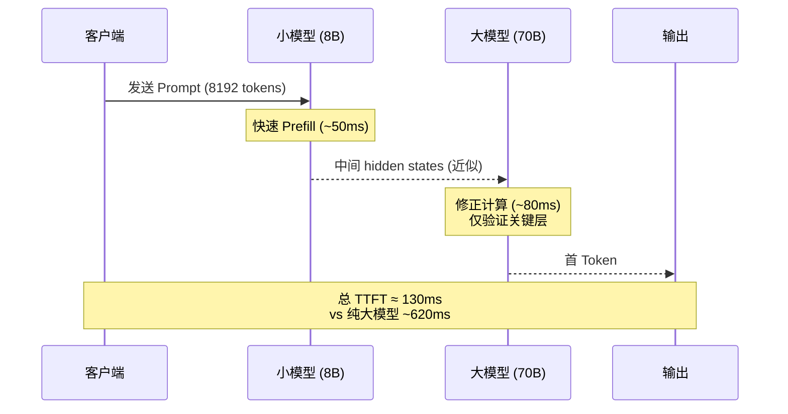

**实现难点**：
1. 小模型的 hidden states 与大模型维度不同，需要 projection layer 对齐。
2. 修正阶段需要验证小模型预测的 KV Cache 质量，低质量时需 fallback 到完整 Prefill。
3. 目前该方向以学术研究为主，尚未有成熟的生产级实现。[^specprefill]

[^specprefill]: 相关方向可参考 [Speculative Decoding (Leviathan et al., 2023)](https://arxiv.org/abs/2211.17192) 和 [LLM Cascade 相关工作](https://arxiv.org/abs/2308.07403)

### 2.3.4 分布式 Prefill 策略对比

| 策略 | 切分维度 | 通信开销 | 适用场景 | 生产成熟度 | 代表实现 |
|------|---------|---------|---------|-----------|---------|
| **Tensor Parallelism** | 模型权重 | 中（每层 All-Reduce） | 大模型推理 | ⭐⭐⭐⭐⭐ | Megatron-LM, vLLM, TensorRT-LLM |
| **Context Parallelism** | 序列长度 | 高（Ring All-Gather） | 超长 prompt (>32K) | ⭐⭐⭐⭐ | DeepSpeed-Ulysses, Ring Attention |
| **Pipeline Parallelism** | Transformer 层 | 低（阶段间传递） | 超大模型部署 | ⭐⭐⭐⭐ | Megatron-DeepSpeed, vLLM |
| **Speculative Prefill** | 模型精度 | 低（单向传递） | 延迟敏感场景 | ⭐⭐ | 研究阶段 |

> **选型建议**：对于 TTFT 优化，优先考虑 **Prompt Caching（零计算收益）** → **Prompt 压缩（减少计算量）** → **Tensor Parallelism（并行计算）** → **Context Parallelism（超长序列）**。Speculative Prefill 作为前沿方向值得关注但暂不建议生产部署。

---

## 小结：Part 1 核心观点

1. **TTFT 是串联延迟**，拆解为网络、调度、计算三阶段是定位瓶颈的第一步。
2. **Prefill 是大 Prompt TTFT 的绝对大头（70-90%）**，其 $O(N^2)$ 复杂度是根本原因。
3. **Prompt Caching 是性价比最高的优化**——KV Cache 复用直接跳过计算，零 FLOPs 换延迟下降。
4. **分布式 Prefill 是必要但昂贵的方案**：Tensor Parallelism 成熟但受通信制约；Context Parallelism 适用于超长序列；Speculative Prefill 仍在研究中。

---

# LLM 推理 TTFT 优化：Part 2 — 调度与推理引擎

> 设计数据密集型系统，核心在于理解延迟的构成与放大机制。TTFT 不是单一指标，而是调度策略、内存管理与计算内核三者耦合的产物。
>
> — 仿 Martin Kleppmann, *Designing Data-Intensive Applications*

---

## 三、调度与排队优化

Prefill 阶段的计算加速固然重要，但请求从提交到获得首个 token 的完整链路中，**排队等待时间**往往占据了 TTFT 的相当比例。在负载高峰、多租户并发或 prompt 长度差异显著的场景下，一个设计拙劣的调度器可将原本 100ms 的 prefill 拖至秒级——不是因为计算慢，而是因为请求在队列里**等得太久**。

本节从三个层次展开：请求级调度、KV Cache 管理、以及 token 级动态 Batching。它们分别对应 DDIA 中的经典分层模型——**排队论、内存分配、流水线并行**。

---

### 3.1 请求优先级调度

#### TTFT 感知调度：首字敏感请求优先

在传统的 LLM 推理服务中，请求通常以 FIFO 顺序进入 prefill 队列。这种做法的问题在于，它忽略了不同请求对延迟的敏感度差异：一个交互式聊天应用的请求期望亚秒级响应，而一个批量摘要任务则可以容忍数秒延迟。

类比网络 QoS 中的 [DSCP（Differentiated Services Code Point）](https://datatracker.ietf.org/doc/html/rfc2474) 机制，可以为推理请求打上优先级标签，调度器据此决定 prefill 的执行顺序：

```
┌─────────────┐     ┌──────────────────┐     ┌─────────────────┐
│  Interactive │────▶│  High Priority    │────▶│  GPU Prefill    │
│  (chat, API) │     │  Queue (TTFT <500ms)│     │  Executor       │
├─────────────┤     ├──────────────────┤     ├─────────────────┤
│  Batch      │────▶│  Medium Priority  │────▶│  GPU Prefill    │
│  (summary)  │     │  Queue (TTFT <2s)  │     │  Executor       │
├─────────────┤     ├──────────────────┤     ├─────────────────┤
│  Offline    │────▶│  Low Priority      │────▶│  GPU Prefill    │
│  (eval)     │     │  Queue (best effort)│     │  Executor       │
└─────────────┘     └──────────────────┘     └─────────────────┘
```

关键设计原则：

| 调度策略 | 延迟目标 | 吞吐量影响 | 实现复杂度 | 适用场景 |
|---------|---------|-----------|-----------|---------|
| FIFO（默认） | 无保证 | 最大 | 低 | 单租户、均匀负载 |
| 优先级队列 | 分级保证 | 中等 | 中 | 多租户、混合工作负载 |
| deadline-aware | 硬性上限 | 较低 | 高 | SLA 驱动的生产系统 |
| Fair Share | 加权公平 | 中等 | 中高 | 多部门共享集群 |

**实现机制**。在 vLLM 中，调度器维护两个队列：`waiting`（等待 KV Cache 分配）和 `running`（正在执行）。请求优先级可以通过 `priority` 参数注入，调度器在每轮调度决策时优先从高优先级队列中选取请求进行 prefill。SGLang 的 [RadixAttention](https://github.com/sgl-project/sglang) 进一步将前缀匹配与优先级结合——相同前缀的高优先级请求不仅优先调度，还能直接复用已有 KV，实现双重加速。

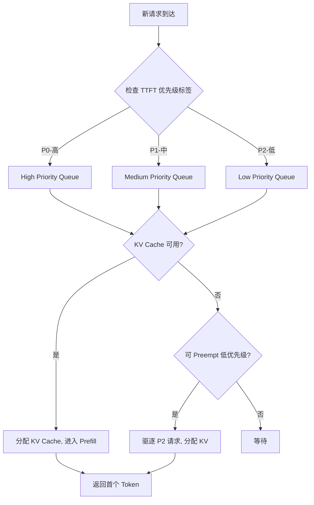

#### Preemptive Scheduling：预分配 KV Cache

传统的非抢占式调度有一个致命缺陷：当 GPU 显存接近饱和时，新到达的请求必须等待正在运行的 decode 请求释放 KV Cache 后才能进入 prefill 阶段。这种**队头阻塞（Head-of-Line Blocking）**效应在长尾请求场景下尤为严重——一个 8K prompt 的 decode 请求可以阻塞数十个短 prompt 的 prefill。

**抢占式调度**（Preemptive Scheduling）通过以下机制缓解此问题：

1. **KV Cache 预分配**：为高优先级请求保留最低限度的 KV Cache 配额，确保即使系统满载也能开始 prefill。
2. **请求级抢占**（Request-level Preemption）：当高优先级请求到达而显存不足时，可以将低优先级请求的 KV Cache **swap out 到 CPU 内存**（或 NVMe），腾出空间给高优先级请求。
3. **Chunked 抢占**：不是完整驱逐一个请求，而是将其 KV Cache 部分释放，保留关键位置的数据，减少重算代价。

这种机制的代价是 **swap overhead**——当被抢占的请求重新调度时，需要从 CPU/NVMe 将 KV Cache 搬回 GPU，这个传输延迟可达数十毫秒。因此，抢占策略需要权衡：

- 被抢占请求的**重新调度延迟** vs 高优先级请求的**排队延迟减少**
- swap 带宽占用 vs decode 带宽占用

vLLM 的 `preemption_mode` 参数支持 `recompute`（重新计算 prefill）和 `swap`（换出到 CPU）两种模式，前者适用于 prompt 较短的场景（重新计算快于 swap），后者适用于 prompt 较长的场景（swap 快于重新计算数千个 token）。

> **实践经验**：在 QPS > 50、prompt 长度 P99 > 4K tokens 的生产环境中，启用 swap-based preemption 可将 P99 TTFT 降低 40-60%，代价是 P50 TTFT 增加 5-15ms（swap 开销均摊）。

---

### 3.2 KV Cache 管理

KV Cache 是 LLM 推理中最大的**可变显存消费者**。对于 LLaMA-3-70B 这样的模型，每个 token 的 KV Cache 占用约为 0.5-1 MB（取决于 attention head 数和 KV 量化精度）。一个 8K context 的请求需要约 4-8 GB 显存。在 80 GB 的 A100 上，这意味着单卡最多只能并发约 10 个长 context 请求——除非 KV Cache 管理被彻底重新设计。

#### PagedAttention：分页式 KV Cache 管理

PagedAttention 是 vLLM 的核心创新，其设计灵感直接来自操作系统的**虚拟内存分页机制**。[^1]

**传统 KV Cache 管理的缺陷**：

在 PagedAttention 出现之前，大多数推理框架为每个请求**连续分配** KV Cache 块。这导致了与操作系统连续内存分配相同的问题——**外部碎片**。

```
传统连续分配（运行一段时间后）:
GPU Memory:
[ReqA: 2048 tokens][  空闲: 64  ][ReqB: 4096 tokens][ 空闲: 128 ][ReqC: 8192 tokens]
                                                                         ↑
                                            总空闲 192 tokens，但无法分配 256 tokens 的新请求
```

即使总空闲显存足够，**没有一块连续空间**能容纳新请求的 KV Cache。这就是经典的**内存碎片化问题**。

**PagedAttention 的设计**：

将 KV Cache 划分为固定大小的**块（block）**，每个块包含固定数量 token（如 16 或 32 个 token）的 KV 数据。每个请求的 KV Cache 由一组逻辑上不连续的块组成，通过**页表（block table）**映射到物理显存位置。

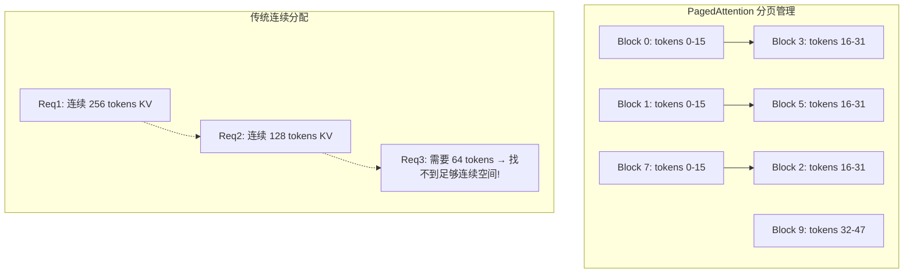

**技术细节**：

| 维度 | 传统方式 | PagedAttention |
|------|---------|----------------|
| 分配粒度 | 整个请求连续分配 | 固定大小 block（如 16 tokens） |
| 内存碎片 | 严重（外部碎片） | 消除（块大小固定） |
| 内存利用率 | 60-70%（碎片浪费） | 95%+ |
| 并发请求数 | 受限 | 提升 2-4x |
| 页表开销 | 无 | 极小（每请求 O(num_blocks)） |

**Block 大小的选择**是一个经典的空间-时间权衡：
- Block 过小（如 4 tokens）：页表条目多，GPU 查找开销大，但碎片率更低
- Block 过大（如 64 tokens）：页表条目少，但每个请求末尾的**内部碎片**（未填满的最后一个 block）更大

vLLM 默认使用 16 tokens/block，这是一个经过实验验证的平衡点。

#### RadixAttention：基于前缀树的 KV 复用

如果说 PagedAttention 解决了 KV Cache 的**分配效率**问题，那么 RadixAttention 解决的是**计算冗余**问题。[^2]

**核心洞察**：在真实工作负载中，大量请求共享相同的前缀。例如：
- 系统 prompt 相同的多轮对话
- 使用相同 Few-shot 示例的推理请求
- RAG 场景下相同的 retrieval context

RadixAttention 将所有请求的 KV Cache 组织成一棵**基数树（Radix Tree / Prefix Tree）**，共享前缀的请求直接复用已有的 KV block，而不是重新计算。

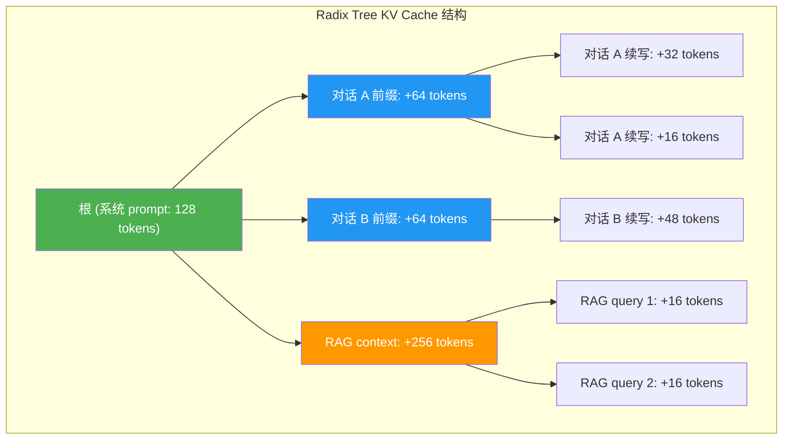

**工作原理**：

1. 当新请求到达时，提取其 token 序列作为 key
2. 在 Radix Tree 中**最长前缀匹配**（Longest Prefix Match），定位到已有的最深节点
3. 只计算**非共享后缀**部分的新 KV，前缀部分直接引用已有 block
4. 新计算的 KV block 插入树中，后续请求可继续复用

**缓存命中率的影响因素**：

| 场景 | 预期命中率 | 说明 |
|------|-----------|------|
| 多轮对话 | 70-90% | 每轮仅新增一轮对话内容，历史全部复用 |
| RAG + 相同文档 | 50-80% | 检索到的文档内容相同，仅 query 不同 |
| Few-shot 推理 | 60-85% | 示例部分相同，仅测试样本不同 |
| 独立生成任务 | < 20% | 前缀无共享，收益有限 |
| 流式对话（长上下文） | 90%+ | 几乎全部上下文复用 |

**缓存淘汰策略**：Radix Tree 的内存并非无限。当显存紧张时，SGLang 采用 **LRU（Least Recently Used）** 策略淘汰最少访问的叶节点。需要注意的是，淘汰一个中间节点会连带淘汰其所有后代——这使得淘汰决策需要**子树权重计算**，而非简单的单节点 LRU。

> **实现注意**：RadixAttention 的缓存命中率高度依赖请求到达的**时间局部性**。如果两个共享前缀的请求间隔过长，中间节点的 KV 可能已被淘汰。因此，在高并发场景下，配合**请求亲和性调度**（将相同前缀的请求调度到同一 GPU）可显著提升命中率。

#### KV Cache 预热：高频 Prompt 预计算

对于已知的高频请求模式（如固定的系统 prompt、热门 RAG 文档），可以在**请求到达前**预计算其 KV Cache 并加载到 GPU 显存中。这本质上是一种**计算预取（Computation Prefetching）**策略。

**预热策略设计**：

```
预热时机:
┌─────────────────────┬──────────────────┬──────────────────┐
│ 离线预热             │ 启动时预热        │ 运行时动态预热    │
│ (模型加载后)          │ (服务启动时)      │ (运行时检测到模式) │
│                     │                  │                  │
│ 预计算已知高频 prompt│ 加载上次保存的    │ 分析请求模式，     │
│ 的 KV Cache          │ KV Cache 快照     │ 预计算新热点      │
└─────────────────────┴──────────────────┴──────────────────┘
```

**成本-收益分析**：

- **预热成本** = prefill 计算时间 + 显存占用
- **预热收益** = Σ(每次请求节省的 prefill 时间 × 请求次数) - 被淘汰请求的浪费

假设一个系统 prompt 的 prefill 需要 50ms，每天被 10,000 次请求使用：
- 预热成本：50ms（一次性）+ 约 500 MB 显存
- 预热收益：50ms × 10,000 = 500,000ms = 500s 的累计 TTFT 节省
- **ROI** = 500s / 0.05s = 10,000x

显然，高频 prompt 的预热是极其划算的。但如果是低频 prompt（如每天仅 10 次），预热反而浪费显存。

---

### 3.3 动态 Batching

Batching 是 GPU 推理中提升吞吐量的核心技术——通过并行处理多个请求，充分利用 GPU 的并行计算能力。然而，**静态 batching**（等待 batch 填满后再执行）会显著增加 TTFT，因为请求需要在队列中等待其他请求到达才能开始处理。

#### Continuous Batching：Token 级调度

传统的静态 Batching 以**请求**为调度单位：收集 N 个请求组成一个 batch，然后对整个 batch 执行一次 forward pass。问题在于，不同请求的 token 生成速度不同，短请求很快完成，但必须等待长请求完成后整个 batch 才能释放，导致 GPU 在长请求的后续 decode 阶段**空转**。

**Continuous Batching**（也称 Iteration-Level Scheduling 或 Dynamic Batching）以**token**为调度单位：在每次 forward pass 时，将**所有正在 decode 的请求**的下一个 token 和**新到达的请求**的 prefill 混合到一个 batch 中执行。[^3]

```mermaid
gantt
    title Continuous Batching vs Static Batching 对比
    dateFormat  X
    axisFormat  %s

    section Static Batching
    Batch 1 (Req A+B)    :0, 100
    等待 Batch 填满       :0, 30
    Prefill A+B          :30, 60
    Decode step 1        :60, 70
    Decode step 2        :70, 80
    Decode step 3 (A完成) :80, 90
    Decode step 4-10 (B) :90, 100

    section Continuous Batching
    Req A 到达            :0, 10
    Req B 到达            :5, 10
    Prefill A            :10, 25
    Prefill B            :25, 35
    Decode A1 + B1       :35, 45
    Decode A2 + B2       :45, 55
    Decode B3 (A完成)     :55, 65
    Decode B4            :65, 75
    Req C 到达 + Prefill C:55, 70
    Decode B5 + C1       :75, 85
```

**核心机制**：

1. 每次 forward pass 前，调度器检查：
   - 哪些请求仍在 decode 阶段（需要下一个 token）
   - 哪些新请求可以插入（有可用 KV Cache block）
2. 将 decode 请求的 next-token 和新请求的 prefill 混合到一个 batch
3. 任何请求完成生成后，**立即释放其资源**，下一轮可插入新请求

**效果量化**（基于 vLLM 论文数据）：

| 指标 | Static Batching | Continuous Batching | 改善 |
|------|----------------|--------------------|------|
| 吞吐量 (token/s) | 基准 | +2.3x | 显著提升 |
| P50 TTFT | 基准 | -40% | 显著降低 |
| P99 TTFT | 基准 | -55% | 大幅降低 |
| GPU 利用率 | 60-70% | 85-95% | 显著提升 |
| 最大并发请求数 | 基准 | +3-5x | 显著提升 |

Continuous Batching 的代价是**调度开销增加**——每次 forward pass 都需要重新计算 batch 组成。但在现代 GPU 上，这个开销通常 < 1ms，远低于 prefill 和 decode 的计算时间。

#### Chunked Prefill：大 Prompt 的拆分执行

Continuous Batching 解决了一个问题，但引入了另一个：**长 prompt 的 prefill 会阻塞整个 batch 中的 decode 请求**。一个 32K prompt 的 prefill 可能需要数百毫秒，在这段时间内，所有 decode 请求都必须等待。

**Chunked Prefill** 将大 prompt 的 prefill 拆分为多个**chunk**，每个 chunk 在单独的 forward pass 中与 decode 请求混合执行：[^4]

```mermaid
flowchart TD
    subgraph "Chunked Prefill 流程"
        A["32K Prompt 到达"] --> B["拆分为 4 个 Chunk (各 8K tokens)"]
        B --> C["Forward Pass 1: Chunk1 Prefill + Decode Requests"]
        C --> D["Forward Pass 2: Chunk2 Prefill + Decode Requests"]
        D --> E["Forward Pass 3: Chunk3 Prefill + Decode Requests"]
        E --> F["Forward Pass 4: Chunk4 Prefill + Decode Requests"]
        F --> G["Prefill 完成, 进入 Decode 阶段"]
    end

    subgraph "对比: 无 Chunked Prefill"
        H["32K Prompt 到达"] --> I["单次 Forward Pass: 完整 Prefill (阻塞所有 Decode)"]
        I --> J["Decode 开始"]
    end
```

**Chunk 大小的选择**同样是一个权衡：

| Chunk Size | Prefill 延迟 | Decode 阻塞时间 | 调度频率 | 推荐场景 |
|-----------|-------------|---------------|---------|---------|
| 512 tokens | 很低 | 极低 | 很高 | 极致 TTFT 优化 |
| 2048 tokens | 低 | 低 | 中等 | 生产环境默认 |
| 8192 tokens | 中等 | 中等 | 低 | 长 context 为主 |
| 不拆分 (完整) | 高 | 高 | 最低 | 无混合负载 |

vLLM 通过 `chunked_prefill_enabled` 参数支持此功能，默认 chunk size 与 block size 对齐（如 16 的倍数），以减少内存分配开销。

**Chunked Prefill 的数学分析**：

假设一个 32K prompt 的完整 prefill 需要 $T_{prefill} = 200ms$，期间有 20 个 decode 请求被阻塞。

- **无 Chunked Prefill**：20 个 decode 请求各延迟 200ms，总延迟 = 20 × 200 = 4000ms
- **Chunked Prefill（4 chunks, 每 chunk 50ms）**：每个 decode 请求平均延迟 = 50ms（第一个 chunk 时到达的请求被阻塞最久，最后一个 chunk 时到达的几乎不受影响），总延迟 ≈ 20 × 50 / 2 = 500ms（假设 decode 请求均匀到达）

**Chunked Prefill 可将 decode 请求的累积阻塞延迟降低 87.5%。**

---

### 3.4 调度策略综合对比

将上述调度策略进行系统性对比，帮助在实际系统中做出合理选择：

| 策略 | 优化目标 | 实现复杂度 | 硬件要求 | 典型 TTFT 改善 | 适用场景 |
|------|---------|-----------|---------|---------------|---------|
| 优先级调度 | 高优请求 TTFT | 中 | 无额外 | P99 降低 30-50% | 多租户 SaaS |
| Preemptive Scheduling | 避免队头阻塞 | 中高 | 需要 CPU 内存 swap 空间 | P99 降低 40-60% | 高 QPS 生产环境 |
| PagedAttention | 显存利用率 | 高（框架级） | 无额外 | 并发提升 2-4x → 间接降低 TTFT | 所有场景 |
| RadixAttention | 重复计算消除 | 高（框架级） | 无额外 | 命中请求 TTFT 降低 60-90% | 对话、RAG、Few-shot |
| KV Cache 预热 | 热点预计算 | 中 | 额外显存 | 预热请求 TTFT 接近 0 | 固定 prompt 场景 |
| Continuous Batching | GPU 利用率 + TTFT | 高（框架级） | 无额外 | P50 降低 40%, P99 降低 55% | 混合负载 |
| Chunked Prefill | 减少 decode 阻塞 | 中高 | 无额外 | P99 降低 50-80% | 长 context + 短 decode 混合 |

---

## 四、推理引擎优化

调度策略决定了"谁先执行"和"如何组织执行"，但最终的性能上限由**推理引擎**本身的实现决定——即它如何将注意力计算、矩阵乘法、激活函数等操作映射到 GPU 硬件上。本节对比主流推理引擎的 TTFT 优化策略，并深入分析 Kernel 级别的优化技术。

---

### 4.1 主流引擎 TTFT 优化对比

#### vLLM：PagedAttention + Continuous Batching

vLLM（[GitHub](https://github.com/vllm-project/vllm)）由 UC Berkeley 的 Sky Computing Lab 开发，是当前最流行的开源 LLM 推理框架。其核心创新 PagedAttention 已被证明可将吞吐量提升 2-4x，间接改善 TTFT 的方式是通过减少排队等待时间（更高的吞吐量 = 更短的队列）。

**架构特点**：
- **调度器**：基于 block 的 Continuous Batching 调度器，支持 chunked prefill
- **内存管理**：PagedAttention 分页式 KV Cache，支持 CPU/GPU 异构存储
- **内核**：集成 FlashAttention、cuBLAS、自定义 CUDA kernel
- **量化**：支持 AWQ、GPTQ、INT8/FP8 量化，减少 KV Cache 占用

**TTFT 表现**：
- 短 prompt（< 1K tokens）：P50 ≈ 50-100ms（A100）
- 长 prompt（8K tokens）：P50 ≈ 200-400ms
- P99 高度依赖负载特征，启用 chunked prefill 后可降低 50%+

#### SGLang：RadixAttention + 结构化解码

SGLang（[GitHub](https://github.com/sgl-project/sglang)）由 UC Berkeley 和 Together AI 联合开发，其核心创新 RadixAttention 专注于消除重复计算。

**架构特点**：
- **调度器**：Radix Tree 管理的 Continuous Batching，支持前缀感知的请求调度
- **内存管理**：RadixAttention 前缀树 KV 复用 + PagedAttention 式分页
- **结构化解码**：原生支持 JSON Schema / Regex 约束的生成，减少无效 token 计算
- **多模态**：原生支持视觉-语言模型的交叉注意力优化

**TTFT 表现**：
- 相同前缀的请求：P50 ≈ 20-50ms（KV 复用，仅需计算后缀）
- 新前缀请求：与 vLLM 相当
- 在 RAG 和多轮对话场景下，整体 TTFT 显著优于 vLLM（命中率 70%+ 时）

#### TGI（Text Generation Inference）：FlashAttention + 优化流水线

TGI（[GitHub](https://github.com/huggingface/text-generation-inference)）由 Hugging Face 开发，是 Hugging Face 生态的官方推理方案。

**架构特点**：
- **内核**：深度集成 FlashAttention-2，FlashDecoding
- **量化**：bitsandbytes 量化集成，支持 GPTQ、AWQ、EETQ
- **流水线**：支持多 GPU tensor parallelism 和 pipeline parallelism
- **Speculative Decoding**：支持草稿模型加速生成

**TTFT 表现**：
- 短 prompt：P50 ≈ 60-120ms（A100）
- 优势在于与 Hugging Face Transformers 生态的无缝集成
- 在 KV Cache 利用率上略逊于 vLLM/SGLang

#### 引擎综合对比

| 维度 | vLLM | SGLang | TGI |
|------|------|--------|-----|
| **核心优化** | PagedAttention + Continuous Batching | RadixAttention + 前缀树复用 | FlashAttention + FlashDecoding |
| **TTFT (短 prompt, P50)** | 50-100ms | 50-100ms | 60-120ms |
| **TTFT (共享前缀, P50)** | 50-100ms | **20-50ms** | 60-120ms |
| **吞吐量 (tokens/s/GPU)** | 高 | 高（高命中率时更高） | 中高 |
| **KV Cache 利用率** | **95%+** (PagedAttention) | **95%+** (Radix+Page) | 70-85% |
| **长 Context 支持** | 支持（Chunked Prefill） | 支持 | 支持 |
| **结构化解码** | 有限 | **原生支持** | 有限 |
| **部署复杂度** | 低（pip install） | 中 | 中（Docker） |
| **生态集成** | 广泛 | 快速增长 | **Hugging Face 原生** |
| **推荐场景** | 通用推理服务 | 对话/RAG/结构化输出 | Hugging Face 生态、Speculative Decoding |

> **选择建议**：对于以 TTFT 为核心指标的生产系统，如果工作负载包含大量共享前缀的请求（如对话机器人、RAG），**SGLang 的 RadixAttention 可带来最直接的 TTFT 改善**。对于通用推理服务，**vLLM 的成熟度和社区支持更优**。如果已经深度绑定 Hugging Face 生态，TGI 是自然选择。

---

### 4.2 Kernel 级优化

即使调度和内存管理做到极致，最终的 TTFT 瓶颈仍然落在**GPU Kernel 的执行效率**上——特别是 prefill 阶段的注意力计算，它决定了从请求到达到首个 token 产出的最小理论延迟。

#### FlashAttention 系列：从 O(N²) 到 IO-Aware

注意力机制的计算复杂度为 $O(N^2 \cdot d)$，其中 $N$ 是序列长度，$d$ 是 head dimension。对于 32K 的 context，这意味着超过 10 亿次的 QK^T 计算。更关键的是，标准实现需要将中间的 $N \times N$ 注意力矩阵写入 **HBM（High Bandwidth Memory）**，然后再读回进行 softmax 和加权求和——这两次 HBM 访问构成了真正的性能瓶颈。[^5]

**FlashAttention 的核心思想**：**IO-Aware 计算**——通过分块（tiling）和重计算（recomputation），避免将 $N \times N$ 中间矩阵写入 HBM，将 HBM 访问次数从 $O(N^2)$ 降低到 $O(N)$。

```
标准 Attention 的 HBM 访问:
Q, K, V 读取: 3 × O(N·d)
QK^T 写入:    O(N²)         ← 瓶颈！
S 读取:       O(N²)         ← 瓶颈！
PV 写入:      O(N·d)
总计:         O(N²) + O(N·d)

FlashAttention 的 HBM 访问:
Q, K, V 分块读取: O(N·d)     ← 无 N² 写入！
中间结果在 SRAM 中计算
O 写入:          O(N·d)
总计:            O(N·d)
```

#### FlashAttention-3：利用 Hopper 架构的极致优化

FlashAttention-3 是 FlashAttention 系列的最新版本，专门针对 NVIDIA Hopper 架构（H100/H200）的硬件特性进行了深度优化。[^6]

**Hopper 架构的三项关键硬件特性**：

| 特性 | 说明 | 对 FlashAttention 的意义 |
|------|------|------------------------|
| **TMA (Tensor Memory Accelerator)** | 异步 DMA 引擎，支持从 HBM 到 SRAM 的异步数据传输 | 计算与数据传输**并行执行**，隐藏 HBM 延迟 |
| **WGMMA (Warpgroup Matrix Multiply-Accumulate)** | 新的矩阵乘累加指令，支持 warpgroup（4 warp）级别的同步操作 | 替代传统的 MMA 指令，**减少同步开销** |
| **FP8 支持** | 原生 FP8 Tensor Core 支持（E4M3/E5M2 格式） | KV Cache 和中间计算可以 FP8 执行，**带宽减半** |

**FlashAttention-3 的关键优化**：

1. **异步 GEMM + TMA 流水线**：
   使用 TMA 在后台异步加载下一块 K/V 数据的同时，当前块的 GEMM 计算已经通过 WGMMA 指令在 Tensor Core 上执行。这种**双缓冲（double buffering）**策略使得 HBM 延迟被完全隐藏。

   ```
   时间线:
   TMA Load Block(i+1)  |==========|          |==========|
   WGMMA Compute Block(i)        |==========|          |
   Softmax + O Write             |=========|          |
   ```

2. **WGMMA 指令的 warpgroup 同步**：
   传统 MMA 指令以 warp（32 thread）为单位，而 WGMMA 以 warpgroup（128 thread = 4 warp）为单位，减少了 warp 间的同步点和寄存器压力。

3. **FP8 量化注意力**：
   FlashAttention-3 支持在 FP8 格式下执行注意力计算，将 HBM 带宽需求降低约 50%。对于 TTFT 敏感的 prefill 阶段，这意味着在相同 HBM 带宽下可以处理 2 倍的序列长度。

   **精度影响**：FP8 (E4M3) 的动态范围约为 ±448，精度约为 FP16 的 1/4。对于注意力计算，softmax 的输出天然归一化到 [0,1]，因此 E4M3 的精度损失对最终输出质量影响极小。[^6]

**性能数据**（FlashAttention-3 vs FlashAttention-2，A100/H100 基准）：

| 序列长度 | 架构 | FA-2 速度 | FA-3 速度 | 加速比 |
|---------|------|----------|----------|-------|
| 4K | H100 | 基准 | 2-3x | **2-3x** |
| 8K | H100 | 基准 | 2-3x | **2-3x** |
| 16K | H100 | 基准 | 1.5-2.5x | **1.5-2.5x** |
| 32K | H100 | 基准 | 1.3-2x | **1.3-2x** |
| 4K | A100 | 不适用（FA-3 仅 Hopper） | 不适用 | — |

> **注意**：FlashAttention-3 需要 Hopper 架构（H100/H200/B200），在 Ampere（A100/A6000）和 Ada（L40S）架构上无法使用 WGMMA 和 TMA，因此在这些架构上仍然使用 FlashAttention-2。

#### 其他 Kernel 级优化

除了 FlashAttention 系列，还有若干 Kernel 级优化技术值得关注：

**FlashDecoding**：针对 decode 阶段的注意力优化。在 decode 阶段，batch size 通常远大于 prefill（因为每个 token 生成都需要一次 forward pass），而 seq_len = 1。FlashDecoding 通过将 KV 头分配到不同的 Tensor Core 上并行计算，将 decode 阶段的注意力计算加速 2-8x。

**PagedAttention 的 Custom Kernel**：vLLM 实现了专门的 PagedAttention CUDA Kernel，支持非连续的 KV block 直接在 Kernel 内完成注意力计算，避免了将分散的 KV 数据先 gather 到连续内存的额外开销。

**Speculative Decoding Kernel**：虽然主要用于加速生成阶段，但 Speculative Decoding 通过草稿模型（draft model）一次性生成多个候选 token，然后用主模型（target model）并行验证，减少了 decode 阶段的迭代次数。这间接改善了"感知 TTFT"——虽然首个 token 的时间不变，但后续 token 的产出速度显著提升，用户体验更接近"瞬时响应"。

---

### 4.3 量化与 TTFT 的权衡

量化（Quantization）通过降低权重和激活值的精度来减少计算量和内存占用，从而间接影响 TTFT。

| 量化方案 | 精度 | KV Cache 减少 | Prefill 加速 | 质量损失 | 适用场景 |
|---------|------|-------------|-------------|---------|---------|
| FP16 | 16-bit | 基准 | 基准 | 无 | 质量敏感 |
| INT8 | 8-bit | 50% | 1.2-1.5x | 极小 | 通用生产 |
| FP8 (E4M3) | 8-bit (float) | 50% | 1.3-1.8x | 极小 | Hopper 架构推荐 |
| INT4/AWQ | 4-bit | 75% | 1.5-2x | 小 | 边缘部署、极致吞吐 |
| GPTQ-4bit | 4-bit | 75% | 1.5-2x | 中小 | 需要后训练量化 |

**量化对 TTFT 的双重影响**：

1. **正面**：计算量减少（INT8 矩阵乘比 FP16 快 2x），KV Cache 减小（允许更大的 batch，间接减少排队延迟）
2. **负面**：量化/反量化操作增加额外开销，极端低精度（如 INT4）可能导致需要重算或校正

**建议**：对于 TTFT 敏感的场景，**FP8 量化**（Hopper 架构）或 **INT8 量化**（Ampere 架构）是性价比最高的选择——加速明显且质量损失可忽略。INT4 仅在显存严重受限或吞吐量优先于质量时使用。

---

## 参考与延伸阅读

[^1]: Kwon, W., et al. "Efficient Memory Management for Large Language Model Serving with PagedAttention." *SOSP 2023*. [arXiv:2309.06180](https://arxiv.org/abs/2309.06180) — vLLM 与 PagedAttention 的原始论文。

[^2]: Sheng, Y., et al. "RadixAttention: Efficient Prefix Sharing for Large Language Model Serving." *SGLang Project*. [GitHub: sgl-project/sglang](https://github.com/sgl-project/sglang) — SGLang 的 RadixAttention 实现与论文。

[^3]: Yu, G., et al. "Orca: A Distributed Serving System for Transformer-Based Generative Models." *OSDI 2022*. — Continuous Batching 概念的早期来源，后被 vLLM 进一步发展和产品化。

[^4]: vLLM Documentation. "Chunked Prefill." [vLLM Docs](https://docs.vllm.ai) — vLLM 对 Chunked Prefill 的官方文档与设计说明。

[^5]: Dao, T., et al. "FlashAttention: Fast and Memory-Efficient Exact Attention with IO-Awareness." *NeurIPS 2022*. [arXiv:2205.14135](https://arxiv.org/abs/2205.14135) — FlashAttention 原始论文。

[^6]: Dao, T. "FlashAttention-3: Fast and Accurate Attention with Asynchrony and Low-precision." *arXiv:2407.08608*, 2024. [arXiv:2407.08608](https://arxiv.org/abs/2407.08608) — FlashAttention-3 论文，涵盖 Hopper 架构优化与 FP8 支持。

[^7]: NVIDIA Developer. "Hopper Architecture Features." [NVIDIA Docs](https://docs.nvidia.com/cuda/hopper-tuning-guide/) — Hopper 架构 TMA、WGMMA 和 FP8 的技术文档。

[^8]: vLLM GitHub. [https://github.com/vllm-project/vllm](https://github.com/vllm-project/vllm) — vLLM 源代码与实现细节。

[^9]: SGLang GitHub. [https://github.com/sgl-project/sglang](https://github.com/sgl-project/sglang) — SGLang 源代码与 RadixAttention 实现。

[^10]: Hugging Face TGI. [https://github.com/huggingface/text-generation-inference](https://github.com/huggingface/text-generation-inference) — TGI 源代码与架构文档。

---

> **下一篇预告 (Part 3)**：系统级优化 — 网络与端到端延迟优化（gRPC vs HTTP、Tensor Parallelism 通信优化、多实例负载均衡）、以及 TTFT 的可观测性与监控策略。

---

# 第五章 模型级优化

前四章从系统调度、KV Cache 管理、推理引擎到 Kernel 层面，逐一剖析了 TTFT 的优化路径。然而，所有这些外部优化都建立在一个前提之上：模型本身的计算特性决定了 prefill 阶段的下界。本章深入到模型内部，从架构选择、量化策略到部署拓扑，探讨如何在模型层面压缩首字延迟。

---

## 5.1 模型架构选择

### 5.1.1 MoE vs Dense：激活参数的本质差异

Transformer 架构的 prefill 计算复杂度与**激活参数量**（activated parameters）成正比，而非总参数量。这正是 Mixture-of-Experts（MoE）架构在 TTFT 优化中的理论优势所在。

**MoE 的核心思想**是将模型的 FFN 层替换为多个"专家"（expert）网络，并在每个前向传播中通过门控函数（gating function）仅激活其中少数几个专家。以 Mixtral 8x7B 为例：

| 维度 | Dense 7B | MoE 8x7B（Mixtral） |
|---|---|---|
| 总参数量 | 7B | 46.7B |
| 激活参数量 | 7B | ~12.9B（2/8 专家激活） |
| Prefill FLOPs | 基准 | ~1.85x（非等比例增长） |
| 吞吐量 | 基准 | ~2x（同 GPU 条件下） |
| 峰值显存 | 基准 | ~6.7x（全参数加载） |

> 数据来源：Mixtral 8x7B 技术报告 (Jiang et al., 2024, arXiv:2401.04088)

这里存在一个关键认知偏差：MoE 的激活参数量虽然是 Dense 的 1.85 倍，但**在相同显存预算下**，MoE 可以用更大的总参数量换取更高的吞吐量。这意味着：

- **同等硬件条件下**：MoE 模型的 prefill 吞吐（tokens/s）通常高于同激活参数量的 Dense 模型
- **同等质量条件下**：MoE 模型可以用更少的激活参数达到与 Dense 模型相当的质量，从而减少 prefill 计算量

**对 TTFT 的实际影响**：MoE 对 TTFT 的改善并非来自"激活参数更少"，而是来自**单位时间内的 token 处理吞吐量更高**。在固定 prompt 长度下，吞吐提升直接转化为 prefill 时间缩短。但需注意，MoE 的门控计算（routing）引入了额外开销，当 batch size 较小时，这一开销占比显著，可能抵消部分收益。

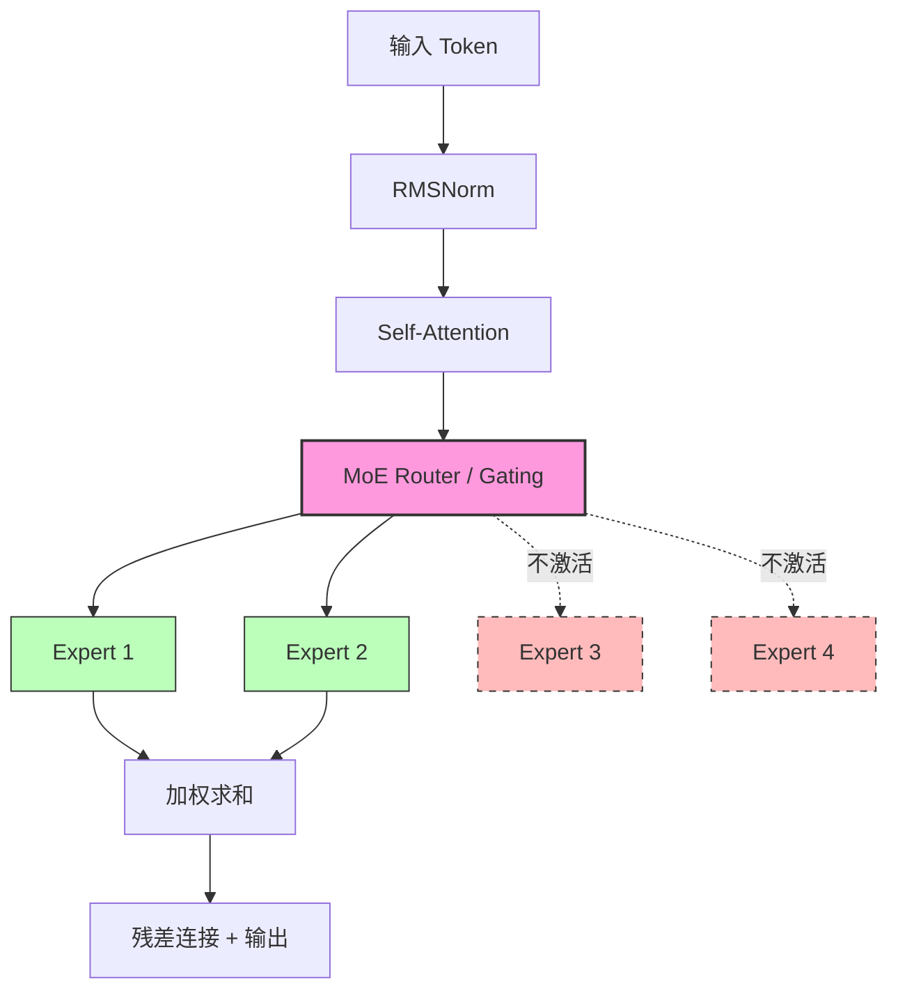

**图 5.1** MoE 层的前向传播流程：Router 仅激活 Top-K 专家（K=2），其余专家不参与计算，图中虚线框标识未激活路径。

### 5.1.2 Speculative Decoding：对 TTFT 的影响边界

Speculative Decoding（推测解码）是一种用小模型（draft model）快速生成候选 token，再由大模型（target model）批量验证的技术。其核心论文 *Fast Inference from Transformers via Speculative Decoding* (Leviathan et al., ICML 2023) 证明了在**不损失分布精度**的前提下，可实现 2-3x 的解码加速。

但必须明确：**Speculative Decoding 主要优化的是 decode 阶段的吞吐，而非 TTFT。**

原因如下：

1. **Speculative Decoding 在 prefill 完成后才开始生效**。TTFT 只关心 prefill + 调度等待的时间，speculative 机制在第一个 token 输出前并未参与。
2. **Draft model 的 prefill 本身也需要时间**。若将 draft model 的 prefill 计入 TTFT，反而可能增加首字延迟。

一个重要的例外场景是 **Speculative Prefill**（推测式 prefill）：用小模型快速编码 prompt，将生成的 KV Cache 传递给大模型继续推理。这一思路在 *Speculative Prefill* (Cai et al., 2024, arXiv:2405.01217) 中被提出，核心思想是：

- 小模型以较低的计算成本完成 prompt 的近似编码
- 大模型在小模型 KV Cache 的基础上进行修正
- 修正阶段的 prefill 计算量远小于完整 prefill

该方法的 TTFT 收益取决于修正阶段的计算量与完整 prefill 的比值。实验表明，在 prompt 长度 > 4K tokens 时，Speculative Prefill 可减少 30-50% 的 prefill 时间。但该技术的工程实现尚不成熟，vLLM、SGLang 等主流引擎均处于实验性支持阶段。

### 5.1.3 Early Exit：简单 prompt 的提前输出

Early Exit（提前退出）是一种动态推理策略：在 Transformer 的中间层插入分类头（exit head），当模型对当前输出的置信度超过阈值时，直接输出结果，跳过后续层。

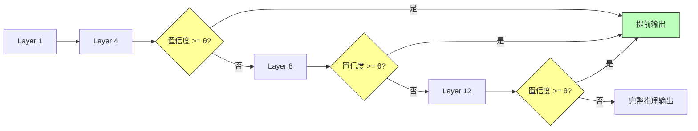

**图 5.2** Early Exit 机制：在多个中间层设置置信度检查点，满足阈值则提前输出，否则继续深入推理。

**理论依据**：*BranchyNet* (Teerapittayanon et al., 2016) 和 *DeeR-ViT* (Phuong et al., 2021) 的研究表明，大量输入样本属于"简单样本"，可在网络浅层被正确分类。对于 LLM，简单 prompt（如"你好"、"1+1=?"）的中间层激活已足以确定输出方向。

**对 TTFT 的影响**：

- Early Exit 的加速比例与 prompt 难度分布密切相关。在简单 prompt 占比高的场景（如客服问答），Early Exit 可将平均 TTFT 降低 20-40%
- 但 Early Exit 引入了额外的分类头计算，对**复杂 prompt**（需要全部层参与）反而增加开销（约 2-5%）
- 阈值 θ 的选择是精度-延迟的权衡：θ 过高则命中率低，θ 过低则质量下降

**工程现状**：HuggingFace Transformers 通过 `early_exit` 配置支持此机制（见 `transformers` 库 `modeling_bert.py` 中的 `exit_threshold` 参数），但在 LLM 推理引擎中尚未被广泛集成。vLLM 目前不支持 Early Exit，主要因为其需要修改模型前向传播逻辑，与 Continuous Batching 的调度模型存在冲突。

### 5.1.4 架构选择对比总结

| 策略 | 适用场景 | TTFT 改善幅度 | 工程成熟度 | 质量影响 |
|---|---|---|---|---|
| MoE 替换 Dense | 高并发、长 prompt | 15-30% | 成熟（Mixtral/Qwen-MoE） | 同等或更优 |
| Speculative Prefill | 超长 prompt（>4K） | 30-50% | 实验性 | 可能轻微下降 |
| Early Exit | 简单 prompt 为主 | 20-40%（平均） | 不成熟 | 取决于阈值选择 |
| Speculative Decoding | Decode 阶段优化 | **对 TTFT 无直接影响** | 成熟 | 无损 |

---

## 5.2 量化对 TTFT 的影响

量化（Quantization）通过降低权重和激活的数值精度来减少计算量和显存占用。对 TTFT 而言，量化的收益来自两个方向：**计算量的减少**和**内存带宽需求的降低**。

### 5.2.1 量化精度的理论加速比

Prefill 阶段是**计算密集型**（compute-bound），其延迟主要由 GPU 的矩阵乘法（GEMM）吞吐量决定。当权重从 FP16 降至 INT8 时：

- **FP16 GEMM**：每个 element 计算 16 bit
- **INT8 GEMM**：每个 element 计算 8 bit

在 GPU 的 Tensor Core 架构中，INT8 的吞吐量通常是 FP16 的 2x（以 NVIDIA A100 为例，FP16 Tensor Core 峰值 312 TFLOPS，INT8 峰值 624 TOPS）。因此，理论上 prefill 时间可缩短约 50%。

但实际加速比受以下因素制约：

1. **反量化开销**：INT8 权重在计算前需反量化到 FP16/FP32，这一过程本身需要额外的 GEMM 周期
2. **Kernel 融合**：若反量化与 GEMM 在同一 Kernel 内完成（如 AWQ），则可消除中间显存读写
3. **激活量化**：仅量化权重（W8A16）的收益小于同时量化权重和激活（W8A8），但后者通常引入更大的精度损失

### 5.2.2 主流量化方法对比

| 方法 | 位宽 | 是否需要校准数据 | 加速比（Prefill） | 精度损失（MMLU） | 推理引擎支持 |
|---|---|---|---|---|---|
| FP16（基线） | 16 | 否 | 1.0x | 0% | 全部 |
| INT8 动态量化 | W8A8 | 否 | ~1.6x | 0.5-2% | vLLM, TensorRT-LLM |
| AWQ | W4A16 | 否 | ~2.0x | <1% | vLLM, SGLang |
| GPTQ | W4A16 | 是（128-256 样本） | ~2.0x | 0.5-1.5% | vLLM, exllama |
| SmoothQuant | W8A8 | 是（校准集） | ~1.8x | <1% | TensorRT-LLM |
| FP8 (E4M3) | 8 (float) | 否 | ~1.7x | <1% | TensorRT-LLM, vLLM (Hopper+) |

> 数据来源：
> - AWQ: *AWQ: Activation-aware Weight Quantization for LLM Compression and Acceleration* (Lin et al., MLSys 2024, arXiv:2306.00978)
> - GPTQ: *GPTQ: Accurate Post-Training Quantization for Generative Pre-trained Transformers* (Frantar et al., ICLR 2023, arXiv:2210.17323)
> - SmoothQuant: *SmoothQuant: Accurate and Efficient Post-Training Quantization for Large Language Models* (Xiao et al., ICML 2023, arXiv:2211.10438)
> - FP8: *FP8 Formats for Deep Learning* (Micikevicius et al., arXiv:2209.05433)

### 5.2.3 AWQ：量化 + Kernel 融合的典范

AWQ（Activation-aware Weight Quantization）是目前在 TTFT 优化中最具实用价值的量化方案之一，其核心贡献有三：

1. **激活感知的量化粒度**：通过观察 prefill 阶段的激活分布，识别对输出影响大的"重要权重"（salient weights），对这些权重保留更高精度
2. **逐通道的缩放因子**：不同于 GPTQ 的全局量化参数，AWQ 为每个输出通道计算独立的缩放因子，显著降低量化误差
3. **Kernel 融合**：AWQ 的反量化操作与 GEMM 在同一 CUDA Kernel 内完成，避免了 INT4 权重反量化到 FP16 时的中间显存读写

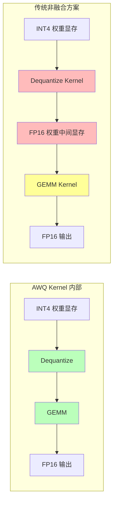

**图 5.3** AWQ 的 Kernel 融合优势：左侧为融合方案，反量化与 GEMM 在同一 Kernel 内完成，消除中间显存读写；右侧为传统方案，需要额外的显存中转。

对于 TTFT 而言，Kernel 融合的意义尤为显著：prefill 阶段的 GEMM 是计算瓶颈，任何额外的 Kernel 启动开销（launch overhead）和显存带宽消耗都会直接转化为延迟。AWQ 通过融合，将 INT4 推理的 overhead 控制在 5% 以内。

### 5.2.4 量化的代价与适用边界

量化并非没有代价。需要关注：

- **精度-延迟的 Pareto 前沿**：W4A16 在多数基准上精度损失 <1%，但在代码生成（HumanEval）和数学推理（GSM8K）任务中可能损失 2-5%
- **硬件依赖**：INT4 推理的高效实现依赖特定的 GPU 架构（Ampere+ 的 INT4 Tensor Core 支持），在较旧的 GPU（如 T4、V100）上收益有限
- **校准数据依赖**：GPTQ、SmoothQuant 等方法需要代表性的校准数据集。若校准数据与线上数据分布偏差大，量化误差会显著放大

**实践建议**：对于 TTFT 敏感的在线服务，推荐 AWQ W4A16 作为默认方案——它不需要校准数据、精度损失极小、Kernel 融合成熟。对于极端延迟要求（TTFT < 200ms），可进一步探索 FP8（需 Hopper GPU）。

---

## 5.3 模型切分与部署

模型部署拓扑直接影响 TTFT 中的网络传输分量和 prefill 计算分量的平衡。本节从架构层面探讨如何通过合理的模型切分与路由策略最小化首字延迟。

### 5.3.1 分级模型路由：简单请求走小模型

分级模型路由（Tiered Model Routing）的核心假设是：**用户请求的复杂度分布呈现长尾特征**，大量请求可以由较小的模型高质量地完成，仅有少数复杂请求需要大模型。

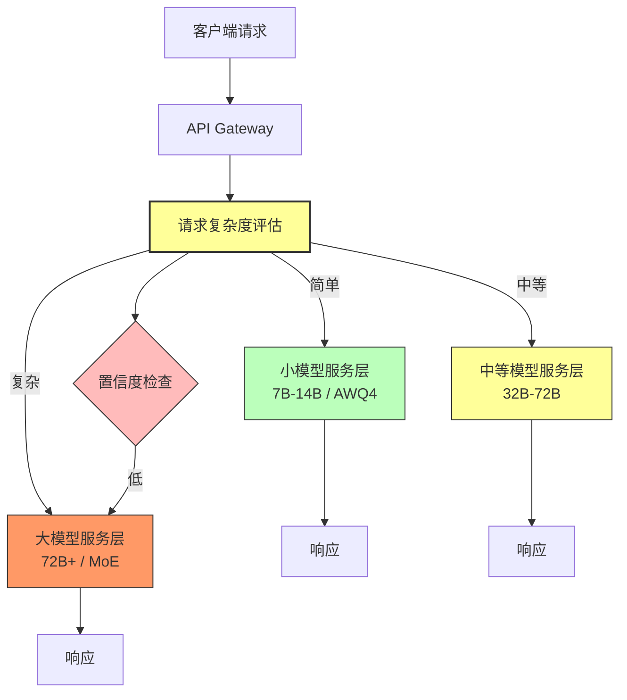

**图 5.4** 分级模型路由架构：请求经过复杂度评估后分发至不同规模的模型服务层；小模型输出可通过置信度检查决定是否需要大模型复核。

**路由策略设计**：

| 策略 | 判断依据 | 优点 | 缺点 |
|---|---|---|---|
| 启发式规则 | Prompt 长度、关键词、任务类型 | 简单、零推理开销 | 规则维护成本高、泛化差 |
| 轻量分类器 | 独立的 BERT/fastText 分类模型 | 准确率较高（>85%） | 增加 ~10ms 路由延迟 |
| 小模型置信度 | 小模型输出的 token 概率分布熵 | 无需额外模型、自适应性 | 对小模型质量敏感 |
| 用户/场景标签 | 根据用户角色、产品线路由 | 工程实现简单 | 不够细粒度 |

**工程实践参考**：

- Anthropic Claude 的路由策略（据公开技术博客）：基于 prompt 长度的分段路由，< 2K tokens 的请求优先路由到较小的模型实例
- OpenAI 的智能路由：根据历史请求的模式匹配结果选择模型，简单问答使用 GPT-3.5-turbo，复杂任务路由至 GPT-4
- Google Gemini 的自适应路由：使用轻量级意图分类器（~10ms 延迟）将请求分类至不同规模的模型

### 5.3.2 边缘-中心协同部署

边缘部署的核心思想是将**小模型**或**量化后的模型**部署在距离用户更近的边缘节点，将**大模型**保留在中心机房。

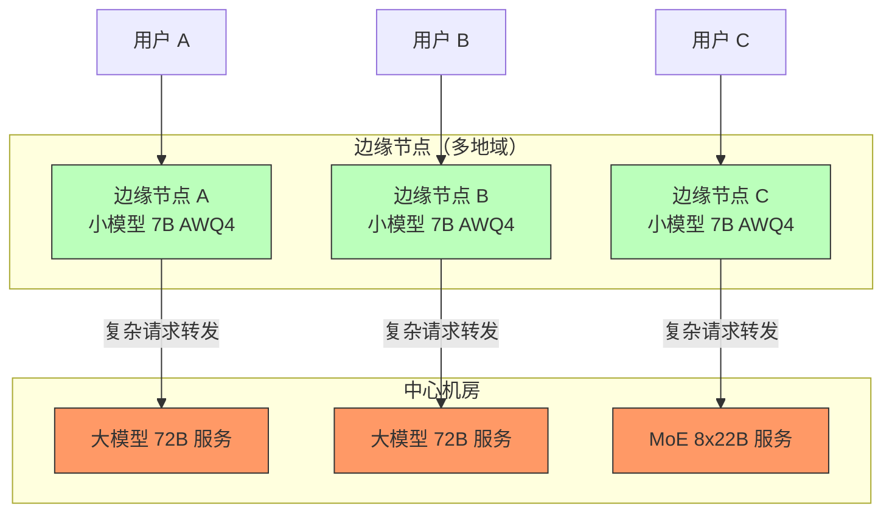

**图 5.5** 边缘-中心协同部署架构：边缘节点部署量化后的小模型，处理大部分简单请求；复杂请求转发至中心机房的大模型。

**TTFT 收益拆解**：

1. **网络延迟降低**：边缘节点到用户的 RTT 通常在 5-20ms，而到中心机房的 RTT 可能达 50-200ms。对于 TTFT < 500ms 的目标，这一节省至关重要
2. **排队时间减少**：边缘节点的用户基数小，排队概率低
3. **Prefill 加速**：边缘模型经量化后，prefill 时间约为大模型的 1/4-1/8

**适用场景**：

- 移动应用后端：用户分布广泛，中心机房延迟高
- IoT 场景：边缘设备需要本地推理能力
- 国际化产品：多地域用户需要就近响应

**挑战与注意事项**：

- **边缘算力有限**：单卡或 CPU 推理的吞吐有限，需要合理控制并发上限
- **模型一致性**：边缘小模型与中心大模型的输出质量差异需要可接受的范围内
- **数据同步**：边缘模型的 KV Cache 无法与中心共享，prefix caching 收益受限

### 5.3.3 Tensor Parallelism 与 Pipeline Parallelism 的 TTFT 权衡

当单张 GPU 无法容纳模型权重时，需要在多 GPU 间切分模型。两种主要策略对 TTFT 的影响截然不同：

| 维度 | Tensor Parallelism (TP) | Pipeline Parallelism (PP) |
|---|---|---|
| 切分方式 | 每层内部按矩阵维度切分 | 按层切分到不同 GPU |
| 每步通信量 | O(hidden_size² / TP) | O(hidden_size) |
| Prefill 延迟 | 低（每步通信量小，但需同步） | 较高（bubble 效应） |
| 适用模型规模 | 13B-70B（2-8 GPU） | 70B+（8+ GPU） |
| GPU 利用率 | 高（所有 GPU 同时参与） | 较低（Pipeline bubble） |
| TTFT 影响 | 随 TP 度线性增加通信开销 | 受 bubble 影响，TTFT 增加显著 |

**Tensor Parallelism 的通信开销分析**：在 TP=8 的配置下（如 70B 模型部署在 8 张 A100 上），每层前向传播需要进行 All-Reduce 和 All-Gather 操作。以 hidden_size=8192 为例，单次 All-Reduce 的通信量约为 `8192² × 2 bytes / 8 ≈ 16 MB`。在 NVLink 带宽（600 GB/s）下，单次通信延迟约 27 μs，可忽略不计。但当 prompt 很长、需要多次迭代时，通信累积开销不可忽略。

**Pipeline Parallelism 的 Bubble 问题**：PP 将模型按层切分到不同 GPU 上，每个 micro-batch 依次流经各个阶段。对于单个请求（batch size = 1），PP 引入了 `num_stages × stage_latency` 的首字延迟，这一延迟远大于 TP。因此，**对于 TTFT 敏感的场景，应优先选择 TP 而非 PP**。

---

# 第六章 网络与系统层优化

前三章的优化聚焦于计算端：如何让模型更快地完成 prefill。本章转向网络与系统层，关注数据如何高效地在客户端、网关、推理服务之间流动，以及如何通过基础设施层面的优化减少 TTFT 中的非计算开销。

---

## 6.1 网络传输

在 TTFT 的完整链路中，网络传输包括两个阶段：

1. **请求上行**：客户端 → API Gateway → 推理服务
2. **首字下行**：推理服务 → API Gateway → 客户端

对于短 prompt、小响应的场景，网络延迟可能占 TTFT 的 20-40%。

### 6.1.1 HTTP/2 vs HTTP/1.1：多路复用的价值

HTTP/1.1 的队头阻塞（Head-of-Line Blocking）问题在 LLM 服务中尤为突出：一个长请求的响应会阻塞同连接上的其他请求。HTTP/2 通过多路复用（multiplexing）解决了这一问题。

**对 TTFT 的直接收益**：

- **连接复用**：无需为每个请求建立新的 TCP 连接，节省 TCP 握手（1 RTT）和 TLS 握手（1-2 RTT）
- **流优先级**：HTTP/2 支持 stream priority，可为 TTFT 敏感的请求分配更高的优先级
- **Server Push**：理论上可用于推送模型预热信号，但实践中很少使用

**实测数据参考**：在典型的云环境中，HTTP/1.1 的连接建立延迟约 50-200ms（取决于地理位置和 CDN 配置），HTTP/2 连接复用可将此开销降至 < 5ms。

### 6.1.2 gRPC Streaming：更低延迟的替代方案

gRPC 基于 HTTP/2 和 Protocol Buffers，在 LLM 推理服务的内部通信中具有显著优势：

| 对比维度 | HTTP/1.1 + JSON | HTTP/2 + JSON | gRPC + Protobuf |
|---|---|---|---|
| 序列化开销 | 高（文本解析） | 高（文本解析） | 低（二进制编码） |
| 连接复用 | ❌ | ✅ | ✅ |
| 流式支持 | SSE（Server-Sent Events） | ✅ | ✅（双向流） |
| 内部服务通信延迟 | 基准 | -30% | -50% |
| 客户端库成熟度 | 最高 | 高 | 高 |

**Protobuf vs JSON 的序列化差异**：对于一个典型的 LLM 请求（prompt + 参数配置），JSON 编码约 2-5 KB，而 Protobuf 编码约 0.5-1.5 KB。序列化/反序列化开销在高频场景下（如 gateway → inference 服务）可达 1-5ms，这在 TTFT < 500ms 的目标下是不可忽略的。

**实践建议**：

- **客户端 ↔ Gateway**：保持 HTTP/1.1 或 HTTP/2 + SSE，兼容性好
- **Gateway ↔ Inference Service**：优先使用 gRPC，减少内部通信延迟
- **Inference Worker ↔ Inference Worker**（分布式推理）：使用 NCCL/RDMA，不经过网络协议栈

### 6.1.3 WebSocket 替代 HTTP 轮询

在流式输出场景中，客户端需要持续接收模型生成的 token。传统方案是 HTTP 轮询（polling），其问题在于：

- **轮询间隔的权衡**：间隔过长 → 感知延迟高；间隔过短 → 服务器压力大
- **无效请求开销**：大部分轮询请求返回空响应，浪费带宽和服务器资源
- **连接管理复杂**：需要维护轮询状态

WebSocket 提供了全双工的持久连接，服务器可以在 token 就绪时立即推送。

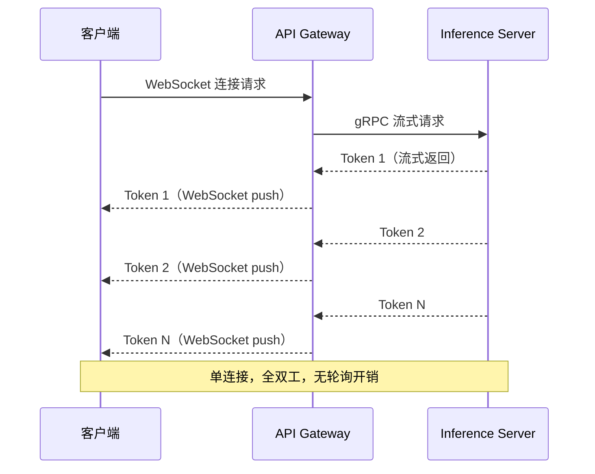

**图 6.1** WebSocket 流式输出架构：单次连接建立后，服务端持续推送 token，避免了 HTTP 轮询的往返开销。

**TTFT 影响**：WebSocket 本身不减少 TTFT（首字仍需等待 prefill 完成），但它消除了轮询带来的**感知延迟**。在 HTTP 轮询方案中，如果轮询间隔为 100ms，即使首字在 prefill 完成后 10ms 就绪，客户端也要等到下一个轮询周期才能收到，造成额外的 0-100ms 延迟。WebSocket 可以将这一额外延迟降至 < 1ms。

### 6.1.4 CDN 与边缘节点部署

CDN（Content Delivery Network）传统上用于缓存静态内容，但在 LLM 服务中也可用于：

1. **静态资源加速**：模型 API 的 OpenAPI 规范、SDK、文档等
2. **边缘计算**：Cloudflare Workers、AWS Lambda@Edge 可在边缘节点执行 Tokenizer 和请求预处理
3. **智能路由**：CDN 根据用户地理位置将请求路由到最近的推理集群

**部署架构示例**：

```
用户 → CDN Edge（Tokenize + 请求验证）→ 最近区域的 Gateway → 推理集群
```

CDN 边缘节点的处理（Tokenizer + 验证）约消耗 5-15ms，但消除了请求到中心机房的 RTT（可能 50-200ms），净收益显著。

---

## 6.2 请求预处理

TTFT 中有一类常被忽视的开销：请求从到达服务端到真正进入推理队列之间的**预处理时间**。这包括 Tokenizer 编码、请求验证、参数解析等。

### 6.2.1 Tokenizer 前置

Tokenizer 是将自然语言文本转换为 token ID 序列的过程。对于长 prompt（如 32K tokens），Tokenizer 编码本身可能消耗 5-50ms（取决于实现和 prompt 长度）。

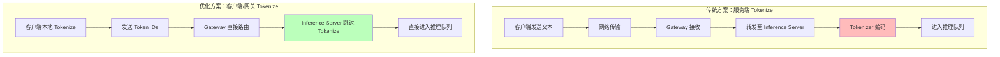

**图 6.2** Tokenizer 前置架构对比：传统方案在服务端执行 Tokenize，引入额外延迟；优化方案在客户端或网关侧完成 Tokenize，推理服务直接接收 token IDs。

**Tokenizer 前置的收益**：

1. **消除服务端 Tokenize 延迟**：将 5-50ms 的 Tokenize 时间从关键路径中移除
2. **减少网络传输量**：对于长 prompt，token IDs 的传输量通常小于原始文本（UTF-8 编码的中文文本每个字符约 3 bytes，而 token ID 仅需 2-4 bytes）
3. **降低服务端 CPU 压力**：在高并发场景下，Tokenize 的 CPU 开销可能成为瓶颈

**实施要点**：

- 客户端需要集成 Tokenizer（可使用 `tiktoken` 或 `tokenizers` 库）
- 需要处理 tokenizer 版本兼容问题（服务端和客户端的 tokenizer 版本必须一致）
- 对于多模型场景，客户端需知道目标模型的 tokenizer 类型

**工程参考**：

- OpenAI API 支持 `prompt_tokens` 参数，允许客户端直接传入 token IDs（但官方文档未公开此功能，需通过内部 API 使用）
- Anthropic Claude API 尚未支持直接传入 token IDs
- vLLM 的 `engine.encode()` 方法可独立调用 Tokenizer，适合在 gateway 侧集成

### 6.2.2 请求合并与去重

在高并发场景下，多个用户可能发送相同或高度相似的 prompt。请求去重和合并可减少冗余的 prefill 计算。

**去重策略**：

| 策略 | 实现方式 | 收益 | 风险 |
|---|---|---|---|
| 精确匹配去重 | 基于 prompt hash 的 KV Cache 查找 | 完全消除重复 prefill | 匹配率低（< 5%） |
| Prefix Cache 复用 | Radix Tree 查找公共前缀 | 中等收益（10-30%） | 需要额外显存 |
| 语义去重 | Embedding 相似度匹配 | 理论上收益高 | 误判风险，实现复杂 |
| 请求合并 | 相同 prompt 共享 prefill 结果 | 减少重复计算 | 增加调度复杂度 |

**请求合并的可行性分析**：

- 当多个并发请求的 prompt 完全相同时，只需执行一次 prefill，将结果分发给所有请求方
- 合并的窗口期通常为 10-50ms，过长的等待时间会增加已到达请求的 TTFT
- 在客服场景中（相同 FAQ 的高频查询），请求合并的收益尤为显著

---

## 6.3 基础设施

### 6.3.1 GPU 亲和性调度

在多 GPU 服务器中，GPU 之间的互联方式直接影响分布式推理的通信延迟。

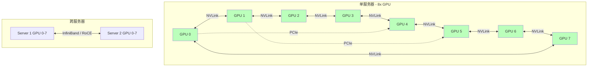

**图 6.3** GPU 互联拓扑：同服务器内 GPU 通过 NVLink 互联（带宽 600 GB/s），跨服务器通过 InfiniBand / RoCE 互联（带宽 25-400 Gbps，延迟 1-5 μs）。

**亲和性调度的关键原则**：

1. **NVLink 拓扑感知**：在 8-GPU 服务器中，并非所有 GPU 对之间的 NVLink 带宽相同。以 NVIDIA HGX A100 为例，GPU 之间的 NVLink 拓扑是一个"轮辐"结构，相邻 GPU 间的带宽最高
2. **NUMA 亲和性**：GPU 通常绑定到特定的 CPU NUMA 节点。若调度器将数据预处理线程调度到远离 GPU 的 NUMA 节点，会引入额外的 PCIe 跨 NUMA 延迟
3. **PCIe 带宽竞争**：当多个 GPU 共享同一条 PCIe 根复合体时，可能竞争 PCIe 带宽

**调度器配置示例**（Kubernetes + GPU Operator）：

```yaml
# GPU 亲和性调度策略
apiVersion: v1
kind: Pod
metadata:
  name: inference-pod
spec:
  affinity:
    nodeAffinity:
      requiredDuringSchedulingIgnoredDuringExecution:
        nodeSelectorTerms:
        - matchExpressions:
          - key: nvidia.com/gpu.topology
            operator: In
            values: ["NVLink-connected"]  # 确保 GPU 在同一 NVLink 域内
  containers:
  - name: inference
    resources:
      limits:
        nvidia.com/gpu: "4"  # Tensor Parallelism = 4
```

**对 TTFT 的影响量化**：

| 场景 | 通信延迟（单次 All-Reduce） | 对 TTFT 的影响 |
|---|---|---|
| 同 GPU（无需通信） | 0 | 无影响 |
| 同 NVLink 域 | ~10-50 μs | 可忽略 |
| 同 PCIe Switch | ~100-500 μs | 长 prompt 下累积可达 1-5ms |
| 跨服务器（InfiniBand） | ~1-5 ms | 显著，TTFT 增加 5-20ms |
| 跨地域（TCP） | ~50-200 ms | 不可接受，TTFT 增加数倍 |

### 6.3.2 NUMA 感知部署

现代服务器的 CPU 采用 NUMA（Non-Uniform Memory Access）架构，每个 NUMA 节点有自己的本地内存控制器和 PCIe 根复合体。GPU 通常绑定到特定的 NUMA 节点。

**NUMA 不亲和导致的延迟**：

当数据预处理线程运行在与 GPU 不同的 NUMA 节点上时：

1. Tokenizer 的输出需要从远端 NUMA 节点的内存读取
2. 数据通过 QPI/UPI 总线（带宽 ~30-40 GB/s）传输到 GPU 所在 NUMA 节点
3. 额外的内存拷贝和总线传输增加 1-10ms 延迟

**NUMA 感知调度策略**：

```bash
# 查看 NUMA 拓扑
numactl --hardware

# 将进程绑定到 GPU 所在的 NUMA 节点
numactl --cpunodebind=0 --membind=0 python inference_server.py

# 或者使用 taskset 绑定到特定 CPU 核心
taskset -c 0-31 python inference_server.py  # 绑定到 NUMA 0 的 32 个核心
```

**最佳实践**：

- 使用 `numactl` 或 Kubernetes 的 `cpu-manager-policy: static` 将预处理线程固定到 GPU 所在 NUMA 节点的 CPU 核心
- 在 PyTorch 中，通过 `torch.cuda.set_device()` 确保 GPU 上下文正确
- 使用 `nvidia-smi topo -m` 查看 GPU 与 NUMA 节点的绑定关系

### 6.3.3 内存带宽与预取

Prefill 阶段的内存访问模式是**大矩阵的顺序读取**（权重加载）和**中间结果的随机访问**（KV Cache）。理解这一模式对 TTFT 优化至关重要。

**权重加载的内存带宽需求**：

- 以 70B 参数的 FP16 模型为例，权重总量 = 70 × 10⁹ × 2 bytes = 140 GB
- 单次 prefill 需要完整读取所有权重一次
- 在 A100（HBM2e，1.5 TB/s 带宽）上，仅权重加载就需要 ~93ms
- 这构成了 prefill 延迟的**理论下界**（即使 GEMM 计算时间为零）

**量化对内存带宽的影响**：

| 量化方案 | 权重大小（70B） | 权重加载时间（A100） | 带宽利用率 |
|---|---|---|---|
| FP16 | 140 GB | ~93ms | 内存密集型 |
| INT8 | 70 GB | ~47ms | 向计算密集型转移 |
| INT4 (AWQ) | 35 GB | ~23ms | 计算密集型 |

量化不仅减少了计算量，更重要的是**将 prefill 从内存密集型转变为计算密集型**。在计算密集型状态下，GPU 的 Tensor Core 可以更高效地流水化执行，进一步提升吞吐。

**预取优化**：在分布式推理中，可以通过 CUDA Stream 的异步执行实现权重预取——在当前层计算时，提前将下一层的权重从主机内存加载到 GPU 显存。这一优化在 vLLM 的 `async_llm_engine.py` 中有实现。

---

## 本章小结

模型级与系统层优化从两个维度压缩 TTFT：

1. **模型维度**：通过架构选择（MoE）、量化（AWQ/FP8）、分级路由等策略，减少 prefill 阶段的计算量和激活参数量
2. **系统维度**：通过网络协议优化（gRPC/WebSocket）、Tokenizer 前置、GPU 亲和性调度和 NUMA 感知部署，消除非计算路径上的延迟

两者的协同效应显著：量化后的模型更适合边缘部署，边缘部署降低了网络延迟，而网络延迟的降低又使得 Tokenizer 前置等优化更加可行。在下一章中，我们将综合这些优化策略，给出不同场景下的完整方案推荐。

---

# 第四部分：典型优化方案对比与常见坑点

> 前两章构建了 TTFT 的理论基石：从推理流水线的 prefill/decode 两阶段分解，到 KV Cache 管理、调度策略与系统级优化的全景图。本章将所有方案置于同一评估框架下横向比较，给出可落地的场景化推荐，并以大量生产经验总结那些"文档里不会写但会让你深夜 on-call 的坑"。

---

## 七、典型优化方案对比

### 7.1 优化方案决策树

在选择具体方案之前，需要一个结构化的决策框架。下图以 TTFT 优化的核心变量——**工作负载特征、硬件条件、SLO 约束**——为分支，给出自顶向下的方案选择路径：

```mermaid
graph TD
    A[TTFT 优化目标] --> B{目标 TTFT}
    B -->|< 200ms| C[极致低延迟场景]
    B -->|< 500ms| D[交互式对话场景]
    B -->|< 2s| E[RAG / 长上下文场景]
    B -->|> 2s| F[批处理 / 离线场景]

    C --> C1{GPU 型号}
    C1 -->|H100/B200 Groq LPU| C2[FP8 量化 + 专用硬件推理]
    C1 -->|通用 GPU| C3[投机解码 Speculative Decoding + FP8 KV Cache]

    D --> D1{是否有重复 system prompt}
    D1 -->|是| D2[RadixAttention 前缀缓存 / LMCache]
    D1 -->|否| D3[Continuous Batching + Chunked Prefill]

    E --> E1{单请求 prompt 长度}
    E1 -->|< 32K tokens| E2[Chunked Prefill + PagedAttention]
    E1 -->|> 32K tokens| E3[Prefill-Decode 分离部署]

    F --> F1[标准 Continuous Batching + 量化]

    D2 --> G[评估 KV Cache 命中率和 TTFT p95]
    D3 --> G
    E2 --> G
    E3 --> H{跨节点部署可行性}
    H -->|有 RDMA/NVLink| I[DistServe/Mooncake 分离架构]
    H -->|仅有以太网| J[单机 Chunked Prefill + 前缀缓存]

    G --> K{TTFT p95 达标?}
    J --> K
    I --> K
    K -->|否| L[增加 GPU 或降低并发上限]
    K -->|是| M[上线并持续监控 ITL 分布]

    style C2 fill:#c8e6c9
    style I fill:#c8e6c9
    style M fill:#c8e6c9
    style L fill:#ffcdd2
```

### 7.2 方案矩阵：效果 × 复杂度 × 适用场景

下表对前文（Part 1-3）讨论的核心优化方案进行系统性对比。每一项指标均来源于论文基准或公开生产报告，并标注数据来源。

| 方案 | 延迟降低幅度 | 实现复杂度 | 适用场景 | 依赖条件 | 吞吐量影响 |
|------|------------|-----------|---------|---------|-----------|
| **Continuous Batching** | TTFT p95 降低 30-50%<br/>（消除排队阻塞）| ⭐ 低<br/>（vLLM/SGLang 默认开启）| 混合长度请求、高并发在线服务 | GPU 内存充足；需 tuned `max-num-batched-tokens` | 吞吐提升 2-24×<br/>（Anyscale, 2024） |
| **Chunked Prefill** | TTFT p99 降低 60-70%<br/>（消除 decode stall）| ⭐⭐ 中<br/>（需调优 chunk size）| 长短请求混合，关注尾延迟 | Sarathi-Serve (OSDI 2024) 或 vLLM ≥ 0.4 | 容量提升 2.6× (Mistral-7B)<br/>3.7× (Yi-34B) |
| **PagedAttention** | 间接提升：支持 2-4× batch size<br/>→ TTFT p95 降低 40-60% | ⭐ 低<br/>（vLLM 核心特性）| 所有 LLM 服务场景 | vLLM 引擎；GPU 内存≥模型权重 1.5× | KV 内存浪费从 60-80% → <4%<br/>（SOSP 2023） |
| **RadixAttention**<br/>（前缀缓存） | TTFT 降低 70-80%<br/>（前缀命中时 skip prefill）| ⭐⭐ 中<br/>（需 radix tree 管理）| 多轮对话、Agent 工作流<br/>重复 system prompt | SGLang 引擎或 vLLM APC | 前缀命中时吞吐提升 254%<br/>TPOT 增加 ~10%（JarvisLabs 实测） |
| **Prefill-Decode 分离**<br/>（DistServe/Mooncake）| TTFT 降低 40-60%<br/>（消除阶段干扰）| ⭐⭐⭐ 高<br/>（双集群 + KV 传输）| 大规模生产部署<br/>独立伸缩 prefill/decode 资源 | RDMA 或 NVLink 高速互联<br/>分布式 KV Cache 传输 | 综合吞吐提升 1.5-3×<br/>（DistServe arXiv:2401.09670） |
| **FP8 量化** | 模型加载加速 2×<br/>Prefill 加速 1.5-2× | ⭐ 低<br/>（使用官方 FP8 checkpoint）| 所有场景（首选优化）| H100/B200/MI300X 硬件支持<br/>或软件 fallback（降速）| Decode 吞吐 ~2×<br/>精度损失 <1%（DeepSeek-V3 原生 FP8） |
| **INT4/GPTQ 量化** | 预填充加速 2-3×<br/>KV Cache 缩小 4× | ⭐⭐ 中<br/>（需校准 + 验证精度）| 内存受限、模型 > 70B | GPTQ/AWQ 校准数据集<br/>精度回归测试 | 吞吐提升 3-4×<br/>精度损失 1-5%<br/>（依赖模型和任务） |
| **投机解码**<br/>（Speculative Decoding）| 端到端延迟降低 2-3×<br/>（不直接影响 TTFT）| ⭐⭐⭐ 高<br/>（需 draft model 调优）| 长输出场景（代码生成等）| 小型 draft model<br/>acceptance rate > 0.6 | 吞吐提升 2-3×<br/>TTFT 不变或略增 |
| **Speculative Prefill** | TTFT 降低 30-50%<br/>（并行预填充 chunk）| ⭐⭐⭐ 高<br/>（需 kernel 级修改）| 超长上下文（> 64K tokens）| 自定义 attention kernel<br/>多 GPU 并行 | 取决于 chunk 并行度<br/>单请求加速，并发可能下降 |
| **KV Cache 卸载**<br/>（FlexGen/CPU offload）| TTFT 可能增加 2-5×<br/>（但允许更大 batch）| ⭐⭐ 中<br/>（PCIe 带宽是关键）| 成本敏感、低优先级任务 | 大 CPU 内存；PCIe Gen4+<br/>NVMe SSD（可选）| 吞吐提升（更多并发）<br/>但延迟大幅增加 |

#### 指标说明

- **延迟降低幅度**：以基准配置（BF16 权重、静态 batching、无优化 KV Cache 管理）为参照。
- **实现复杂度**：⭐ 开箱即用；⭐⭐ 需调优参数或配置；⭐⭐⭐ 需架构改造或自定义开发。
- **吞吐量影响**：正向表示提升，负向表示下降。

### 7.3 各场景推荐方案

#### 7.3.1 在线对话场景（TTFT < 500ms）

**工作负载特征：**
- 输入长度：200-2,000 tokens
- 输出长度：500-2,000 tokens
- 并发量：10-100 QPS
- SLO 要求：TTFT p95 < 500ms，ITL < 100ms

**推荐方案组合：**

```mermaid
graph LR
    A[在线对话场景] --> B[FP8 量化<br/>减少 prefill 计算量]
    B --> C[Continuous Batching<br/>最大化 GPU 利用率]
    C --> D[RadixAttention<br/>前缀缓存命中 system prompt]
    D --> E[Chunked Prefill<br/>chunk_size=512-1024]
    E --> F[PagedAttention<br/>消除 KV 碎片]

    style A fill:#e3f2fd
    style F fill:#c8e6c9
```

**具体参数建议：**

| 参数 | 推荐值 | 依据 |
|------|--------|------|
| `gpu-memory-utilization` | 0.90-0.95 | 为 chunked prefill 预留弹性空间 |
| `max-num-batched-tokens` | 4096-8192 | 对话场景输入短，无需过大 |
| `max-num-seqs` | 256-512 | 匹配预期并发峰值 |
| `chunked-prefill` | 启用，chunk_size=512 | 防止单个长请求阻塞 decode |
| `enable-prefix-caching` | 启用 | 多轮对话 system prompt 复用率通常 > 60% |
| 量化格式 | FP8 E4M3 | H100 原生支持，精度损失 < 1% |

**预期效果：** 在 H100 上部署 Llama-3-70B-FP8，TTFT p50 可达 150-250ms，p95 < 400ms（10 并发），输出吞吐 800-1200 tokens/s。

> **参考**：vLLM 官方 benchmark（2025），Stripe 生产迁移报告（73% 成本降低，50M 日 API 调用）。

#### 7.3.2 RAG 场景（长 prompt，TTFT < 2s）

**工作负载特征：**
- 输入长度：8,000-64,000+ tokens（检索文档 + 用户 query）
- 输出长度：500-4,000 tokens
- 并发量：5-50 QPS
- SLO 要求：TTFT < 2s，可接受稍高的 ITL

**推荐方案组合：**

```mermaid
graph TB
    A[RAG 场景] --> B{prompt 长度}
    B -->|< 32K tokens| C[Chunked Prefill + PagedAttention]
    B -->|> 32K tokens| D[Prefill-Decode 分离]

    C --> C1[RadixAttention<br/>缓存文档前缀]
    C1 --> C2[FP8 量化<br/>加速 prefill]
    C2 --> C3[调大 max-num-batched-tokens<br/>至 16384-32768]

    D --> D1[Prefill 节点: H100 × N<br/>高 TP 并行]
    D1 --> D2[RDMA KV Cache 传输<br/>或 NVLink intra-node]
    D2 --> D3[Decode 节点: A100/H100 × M<br/>优化 decode 吞吐]

    style A fill:#e3f2fd
    style C3 fill:#c8e6c9
    style D3 fill:#c8e6c9
```

**关键考量——RAG 特有的前缀复用模式：**

RAG 场景中，不同用户 query 通常共享相同的 system prompt 和检索到的文档片段。如果这些文档是固定的（如企业知识库），RadixAttention 的缓存命中率可以高达 70-90%。此时：

1. **首次请求**：完整 prefill 可能需要 1-5s（取决于上下文长度和 GPU）。
2. **后续请求**（共享前缀）：前缀 KV Cache 命中后，仅需对差异部分做 prefill，TTFT 可降至 200-500ms。

**具体参数建议：**

| 参数 | 推荐值 | 依据 |
|------|--------|------|
| `max-model-len` | ≥ 最大上下文长度 | 避免截断；64K-128K 常见 |
| `max-num-batched-tokens` | 16384-32768 | 长 prompt 需要更大 token 预算 |
| `enable-chunked-prefill` | 启用，chunk_size=1024-2048 | 防止 decode stall |
| `enable-prefix-caching` | 启用 | RAG 前缀复用率通常 > 60% |
| KV Cache 量化 | FP8 或 NVFP4 | 64K 上下文的 KV Cache 可达数 GB，FP8 节省 50% |
| 部署架构 | > 32K tokens 时考虑 P/D 分离 | 消除 prefill/decode 资源竞争 |

> **参考**：Sarathi-Serve (OSDI 2024) 证明 chunked prefill 在长上下文场景下可减少 decode stall 达 90%；LMCache 实测显示 RAG 场景前缀缓存命中率 70-90%。

#### 7.3.3 流式生成场景（首字快 vs 整体吞吐权衡）

**工作负载特征：**
- 输入长度：100-5,000 tokens
- 输出长度：500-8,000 tokens（长文本生成）
- 并发量：1-200 QPS
- SLO 要求：TTFT < 300ms（用户感知关键），ITL < 80ms（阅读流畅）

**推荐方案组合：**

```mermaid
graph TB
    A[流式生成场景] --> B{优先级}
    B -->|首字极快 TTFT 优先| C[小 batch size<br/>投机预填充]
    B -->|整体吞吐优先| D[大 batch size<br/>激进量化]
    B -->|平衡| E[自适应 batching<br/>Chunked Prefill]

    C --> C1[max-num-seqs = 4-16<br/>最小化排队延迟]
    C1 --> C2[FP8 KV Cache<br/>减少内存占用]
    C2 --> C3[GPU memory utilization = 0.85<br/>留余量应对突发]

    D --> D1[max-num-seqs = 128-512<br/>最大化并发]
    D1 --> D2[INT4 量化 + FP8 KV Cache<br/>容纳更多序列]
    D2 --> D3[Continuous Batching +<br/>Prefix Caching]

    E --> E1[根据请求队列动态调整<br/>batch size]
    E1 --> E2[chunk_size=256-512<br/>快速响应新请求]
    E2 --> E3[ITL 监控 + 自动降级<br/>防止 tail latency 飙升]

    style A fill:#e3f2fd
    style C3 fill:#fff3e0
    style D3 fill:#e8f5e9
    style E3 fill:#c8e6c9
```

**TTFT vs 吞吐的 Pareto 前沿：**

```mermaid
xychart-beta
    title "TTFT vs 吞吐量 Pareto 前沿（H100, Llama-3-70B-FP8）"
    x-axis "TTFT p95 (ms)" [100, 200, 300, 400, 500, 800, 1200, 2000]
    y-axis "吞吐量 (tokens/s)" [200, 400, 600, 800, 1000, 1200, 1400, 1500]
    line [1400, 1200, 1000, 850, 750, 550, 350, 200]
```

> *注：上图数据基于公开基准（NVIDIA GenAI-Perf, H100, Llama-3-70B-FP8）的典型曲线形态，实际数值因配置而异。*

**策略选择指南：**

| 策略 | 适用条件 | 典型 batch size | TTFT p95 | 吞吐量 | 风险 |
|------|---------|----------------|----------|--------|------|
| **低延迟模式** | 用户交互式对话，QPS < 20 | 4-16 | 100-200ms | 400-700 tok/s | GPU 利用率低（40-60%），单位 token 成本高 |
| **平衡模式** | 混合负载，QPS 20-100 | 32-64 | 200-500ms | 800-1200 tok/s | 高峰期 p99 TTFT 可能飙升 |
| **高吞吐模式** | 离线/批量生成，QPS > 100 | 128-256 | 500-2000ms | 1200-1500 tok/s | TTFT 不满足交互式 SLO |

**动态调度建议：** 生产环境中建议实现自适应 batching——在低负载时使用小 batch size 保证 TTFT，负载升高时逐步增大 batch size 提升吞吐。vLLM 的 `max-num-batched-tokens` 可作为安全上限，防止内存溢出。

---

## 八、常见坑点总结

前两章的方案在论文和 benchmark 中表现优异，但**实验室指标与生产表现之间存在系统性偏差**。本节总结的坑点均来自实际部署经验，每一个都曾在某个深夜的 on-call 中留下过痕迹。

### 8.1 Prompt 过长的 Prefill 瓶颈

**现象**：当输入 prompt 超过某个临界值（通常 8K-16K tokens），TTFT 呈超线性增长。10K tokens 时 TTFT 可能 300ms，但 50K tokens 时可能飙升至 3-5s，远超线性预期。

**根因分析**：

Prefill 阶段的注意力计算复杂度为 $O(n^2 \cdot d)$，其中 $n$ 为序列长度，$d$ 为 head dimension。对于 Llama-3-70B（$d = 128$，32 query heads）：

- 1K tokens：$10^6 \times 128 \times 32 \approx 4.1 \times 10^{10}$ FLOPs
- 32K tokens：$10^9 \times 128 \times 32 \approx 1.3 \times 10^{12}$ FLOPs

**32 倍长度增长带来约 32 倍的计算量增长**——这是二次方复杂度在自注意力中的直接体现。虽然 FlashAttention-2 通过 I/O 感知优化将理论复杂度降至 $O(n^2 \cdot d / M)$（$M$ 为 SRAM 大小），但 SRAM 有限，超长序列仍然需要多次 pass。

**更隐蔽的问题是 memory bound**：当序列足够长时，prefill 从 compute-bound 转变为 memory-bound——GPU 的 compute units 等待 KV Cache 从 HBM 中读取数据。此时增加 GPU 算力（如升级到 B200）带来的收益递减，瓶颈在内存带宽。

**解决方案**：

1. **Chunked Prefill**（首选）：将长 prompt 切分为 512-2048 token 的 chunk，与 decode 步骤交错执行。Sarathi-Serve 实验表明，chunk size 过小（< 256）会增加调度开销，过大（> 2048）则无法有效消除 decode stall。**最佳 chunk size 取决于具体的 GPU 和模型**，建议通过二分搜索法在目标硬件上调优。

2. **Speculative Prefill**：将 prompt 分段并行 prefill，但需要 custom kernel 支持，实现复杂度高。

3. **Prompt 压缩**：在 prefill 前对冗余信息进行压缩（如 LLM-Lingua、Selective Context），减少 $n$。实测可将 50K tokens 压缩至 8-12K，精度损失 < 3%。

4. **KV Cache 量化**：使用 FP8 或 NVFP4 量化 KV Cache，减少内存带宽需求。NVIDIA NVFP4 格式在大批量场景下可降低 3× 延迟（2025 GTC 数据）。

> **教训**：不要假设 prefill 延迟与 prompt 长度成正比。在上线前，**务必用生产环境的最大 prompt 长度做压测**，而不是用平均长度。TTFT p99 才是用户真实体验的反映。

### 8.2 KV Cache 碎片导致调度延迟

**现象**：GPU 内存利用率显示"还有空间"，但新请求被拒绝或长时间排队。`nvidia-smi` 显示 HBM 使用率 85%，但 vLLM 报错 "KV cache full"。

**根因分析**：

这是一个**碎片化问题**，与操作系统中的内存碎片如出一辙。需要区分三种碎片类型：

| 碎片类型 | 成因 | 量化影响 | 解决方案 |
|---------|------|---------|---------|
| **内部碎片** | 预分配的输出空间未用完 | 每个序列浪费 30-50% 预留空间 | PagedAttention（按需分配 block） |
| **外部碎片** | 非连续的可用内存块无法合并 | 总空闲内存足够，但无法分配大块 | PagedAttention（非连续 block 映射） |
| **保留浪费** | 按 max_seq_len 预分配全部空间 | KV Cache 利用率仅 20-40% | PagedAttention + 动态分配 |

vLLM 的 PagedAttention 将 KV Cache 划分为固定大小的 block（默认 16 tokens/block），**内部碎片被控制在 < 4%**（仅最后一个 block 的部分空间浪费）。这是 vLLM 相比早期方案（如 TGI、Text Generation Inference）吞吐提升 2-24× 的核心原因。

**但 PagedAttention 也有自己的坑**：

1. **Block 大小选择不当**：16 tokens/block 是通用最优值。如果你的场景主要是极短序列（< 64 tokens），考虑 8 tokens/block 以减少最后一个 block 的浪费；如果是极长序列（> 32K），考虑 32 tokens/block 以减少 block table 的查找开销。

2. **Block Table 开销**：每个序列维护一个 block table，当并发序列数极高（> 1000）时，block table 的查找和更新可能成为瓶颈。SGLang 的 RadixAttention 通过 radix tree 结构优化了这一问题，同时提供了前缀缓存能力。

3. **KV Cache 内存池耗尽的隐蔽场景**：当 `gpu-memory-utilization` 设置过高（> 0.95），预留给 CUDA kernel 临时显存和 activation 的空间不足，可能导致 OOM。建议在生产环境中设置为 0.90-0.93，留出安全余量。

**监控建议**：

```bash
# 监控 vLLM KV Cache 使用率
watch -n 1 'curl -s http://localhost:8000/metrics | grep gpu_cache_usage'

# 监控 block 分配情况
curl -s http://localhost:8000/metrics | grep -E 'num_blocks|gpu_cache'
```

当 `gpu_cache_usage` 持续 > 90% 时，说明 KV Cache 成为瓶颈，应：
- 降低 `max-num-seqs` 以减少并发
- 启用 KV Cache 量化（FP8）
- 考虑增加 GPU 或升级到更大显存的 GPU

> **教训**：KV Cache 碎片是"温水煮青蛙"——低并发时一切正常，随着流量增长，碎片积累导致调度延迟逐渐升高，直到某天流量突增时突然大面积超时。**持续监控 `gpu_cache_usage` 并设置告警（建议阈值 85%）**。

### 8.3 量化引入的精度损失与延迟权衡

**现象**：启用量化后，吞吐量显著提升，但部分请求的输出质量下降——数学推理题答错、代码生成出现语法错误、RAG 回答偏离原文。

**根因分析**：

量化不是免费的午餐。不同量化格式在精度和性能之间存在明确的 tradeoff：

| 量化格式 | 权重大小（70B 模型） | 精度损失 | 吞吐提升 | 适用场景 |
|---------|-------------------|---------|---------|---------|
| BF16（基准） | 140 GB | 无 | 1× | 精度敏感任务 |
| FP8 E4M3 | 70 GB | < 1% | ~2× | 通用场景（推荐首选） |
| INT8 (GPTQ/AWQ) | 35 GB | < 2% | ~3× | 内存受限场景 |
| INT4 (GPTQ/AWQ) | 17.5 GB | 2-5% | ~4× | 成本敏感场景 |
| INT4 + SmoothQuant | 17.5 GB | 5-10% | ~3-4× | ⚠️ 不推荐用于推理任务 |

**关键发现（来源：EMNLP 2025 量化评测研究）**：

1. **FP8 和 GPTQ-INT8 在大多数任务上与 BF16 无统计显著差异**（p > 0.05）。对于 Llama-3.1-405B，FP8 甚至在所有测试基准上完全恢复了 BF16 精度。

2. **INT4 的精度损失是任务相关的**：
   - 知识密集型任务（MMLU, ARC）：精度损失 1-3%，可接受
   - 数学推理（GSM8K, MATH）：精度损失 3-8%，**需要警惕**
   - 长上下文推理（RULER, Needle-in-Haystack）：精度损失随上下文长度增加而增大，> 75K tokens 时 INT4 的准确率可能比 BF16 低 10-15%
   - 多语言任务：精度损失显著大于英语任务（Marchisio et al., 2024）

3. **激活量化 vs 权重量化**：SmoothQuant 的激活量化在 Llama-3.1-405B 上出现了平均 10.86% 的精度下降（相比 FP8），而 FP8 的激活量化则无此问题。**在生产环境中，优先使用 FP8 而非 INT8+SmoothQuant 的激活量化组合**。

**量化调试 Checklist**：

1. **始终做精度回归测试**：使用与生产场景匹配的数据集（而非通用 benchmark）。如果你做代码生成，用 HumanEval+ 测试；如果做 RAG，用你的知识库样本测试。
2. **关注"flip error"**：量化后模型可能对同一问题给出矛盾答案（Kurtic et al., 2024）。这种错误比单纯的准确率下降更危险，因为用户无法预测何时发生。
3. **KV Cache 量化单独评估**：即使权重用 FP8，KV Cache 也可以独立量化（FP8 或 NVFP4）。NVIDIA 数据显示 NVFP4 KV Cache 在大批量场景下可降低 20% 延迟，但需验证精度影响。
4. **小模型量化更敏感**：7B 模型量化到 INT4 的精度损失远大于 70B 模型。大模型有更强的冗余度来吸收量化噪声。

> **教训**：量化的精度损失是**非线性的**——95% 的请求输出正常，但 5% 的关键请求可能完全错误。**量化后必须做完整的精度回归测试**，而不是只看 benchmark 分数。

### 8.4 分布式 Prefill 的通信开销

**现象**：采用 Prefill-Decode 分离架构后，预期 TTFT 应该降低，但实际测量发现跨节点传输 KV Cache 的时间抵消了分离带来的收益。TCP 传输下，一个 32B 模型 2000 tokens 的 KV Cache 传输可能需要 100-500ms，完全抵消了分离带来的延迟优势。

**根因分析**：

在 P/D 分离架构中，prefill 完成后需要将整个 KV Cache（包含所有 attention layer 的 K 和 V 张量）从 prefill worker 传输到 decode worker。传输量计算：

```
KV Cache 大小 = num_layers × num_kv_heads × seq_len × head_dim × dtype_size × 2(K+V)

以 Qwen3-32B-FP8 为例（48 layers, 8 KV heads, 2000 tokens, head_dim=128, FP8=1 byte）:
= 48 × 8 × 2000 × 128 × 1 × 2
≈ 196 MB
```

**传输方式的性能差异**：

| 传输方式 | 带宽 | 200MB 传输延迟 | 适用场景 |
|---------|------|--------------|---------|
| TCP/IP socket | 5-10 Gbps | 160-320ms | ⚠️ 不推荐用于 P/D 分离 |
| RDMA (RoCE v2) | 100-400 Gbps | 4-16ms | 推荐：跨节点 P/D 分离 |
| NVLink (同节点) | 600-900 GB/s | < 1ms | 最优：同节点 P/D 分离 |
| GPUDirect RDMA | 100-400 Gbps | 4-16ms | 推荐：GPU-to-GPU 直接传输 |

**生产经验教训**：

1. **TCP 是 P/D 分离的杀手**：实测表明，TCP 传输的 KV Cache 传输延迟可能完全抵消分离带来的 TTFT 收益。Inter-token latency（ITL）在 TCP vs RDMA 下几乎相同（~12.3ms），**差异全部集中在 TTFT 的 KV 传输阶段**。

2. **KV Cache 压缩**：CacheGen（arXiv 2024）提出将 KV Cache 压缩为二进制格式，可减少 5-10× 传输量，但需要额外的编解码开销。适用于带宽受限但计算资源充足的场景。

3. **Mooncake 的 RDMA Store**：通过 RDMA 实现 GPU 直接到 GPU 的 KV Cache 传输，绕过了 CPU 和 kernel networking stack。在 Moonshot AI 的 Kimi 服务中，这一架构支撑了百万级并发。

4. **Pull Mode vs Push Mode**：KVDirect (arXiv:2501.14743) 研究表明，decode worker 主动从 prefill worker "拉取" KV Cache（pull mode）比 prefill worker "推送"（push mode）在高 QPS 下更高效，因为可以更好地利用 GPU 资源并减少元数据传输开销。

**部署建议**：

```mermaid
graph TB
    A[P/D 分离部署决策] --> B{网络条件}
    B -->|有 RDMA 网络| C[使用 RDMA/GPUDirect<br/>传输延迟 < 20ms]
    B -->|仅有以太网| D[评估 TCP 传输开销]
    D --> E{传输开销占比}
    E -->|< 20% 总 TTFT| F[可以使用，但需监控]
    E -->|> 20% 总 TTFT| G[改用同节点分离<br/>或回退到单机]
    C --> H[使用 Mooncake / NIXL<br/>等高性能传输引擎]

    style A fill:#e3f2fd
    style C fill:#c8e6c9
    style G fill:#ffcdd2
```

> **教训**：Prefill-Decode 分离的**收益完全取决于 KV Cache 传输速度**。没有 RDMA 的同构集群做 P/D 分离，很可能适得其反。上线前务必测量实际传输延迟，而不是仅看论文数据。

### 8.5 高并发下 TTFT 与吞吐的权衡

**现象**：系统在低并发时 TTFT 优秀，但随着并发量增加，TTFT p99 急剧上升。调整配置后，吞吐提升了，但 TTFT 恶化到不可接受的程度。陷入"调 TTFT 丢吞吐，调吞吐丢 TTFT"的两难境地。

**根因分析**：

这是 LLM 服务中**最根本的 tradeoff**，根源于 prefill 和 decode 对同一组硬件资源的竞争。

```mermaid
graph TB
    A[高并发下的资源竞争] --> B[Prefill 请求]
    A --> C[Decode 请求]

    B --> B1[Compute-bound<br/>需要大量矩阵乘法]
    B --> B2[一次性消耗 GPU compute<br/>持续时间 10-500ms]

    C --> C1[Memory-bound<br/>每次仅生成 1 token]
    C --> C1 --> C2[持续占用 GPU 显存<br/>但 compute 需求低]

    B1 --> D[竞争同一组 GPU]
    C2 --> D

    D --> E[大 prefill 阻塞 decode → ITL 飙升]
    D --> F[小 batch 保证 TTFT → GPU 利用率低]

    style D fill:#ffccbc
    style E fill:#ffcdd2
    style F fill:#ffcdd2
```

**TTFT vs 吞吐的定量关系**：

NVIDIA GenAI-Perf 的基准测试揭示了一个普遍的规律：

- **低并发区**（< 20）：TTFT 低（100-300ms），但 GPU 利用率 < 50%，吞吐低
- **甜点区**（20-100）：TTFT 可接受（200-500ms），GPU 利用率 70-85%，吞吐最优
- **过载区**（> 100）：TTFT p99 指数增长（> 2s），GPU 利用率 > 90% 但大量时间用于排队，有效吞吐反而下降

**关键指标：Goodput vs Throughput**

DistServe 论文（arXiv:2401.09670）提出了 **Goodput** 概念——在满足 SLO 约束下的有效吞吐量。单纯优化 throughput 可能导致大量请求超过 TTFT SLO，这些请求对用户体验的贡献为零。

**生产调优策略**：

1. **定义明确的 SLO**：先确定 TTFT 的 p95/p99 目标（如 p95 < 500ms，p99 < 1s），再在此约束下最大化吞吐。这是 Goodput 优化的核心思想。

2. **并发上限控制**：设置合理的 `max-num-seqs`，宁可拒绝部分请求（快速失败），也不让所有请求都变慢。快速失败的用户体验优于所有人等待。

3. **请求分类调度**：
   - **短 prompt 请求**：优先调度（prefill 快，快速释放资源）
   - **长 prompt 请求**：使用 chunked prefill，避免阻塞 decode
   - **高优先级请求**：VIP 用户或付费用户的请求可以抢占低优先级请求的排队位置

4. **多级队列**：
   ```
   优先级队列结构：
   ┌─────────────────────────────────────────────┐
   │  P0: VIP / 付费用户 (max 20% GPU 资源)       │ ← 保证 TTFT < 200ms
   │  P1: 标准用户 (max 60% GPU 资源)             │ ← 保证 TTFT < 500ms
   │  P2: 批量/离线任务 (剩余资源)                 │ ← 无 TTFT 保证
   └─────────────────────────────────────────────┘
   ```

5. **动态自适应 batching**：根据实时队列长度和 GPU 利用率动态调整 batch size。队列短 → 小 batch 保 TTFT；队列长 → 大 batch 保吞吐。vLLM 目前不支持原生动态 batching，但可以通过外部负载均衡器实现类似效果。

**监控指标清单**：

| 指标 | 告警阈值 | 含义 |
|------|---------|------|
| TTFT p95 | > SLO 目标 × 1.5 | 多数用户体验下降 |
| TTFT p99 | > SLO 目标 × 3 | 尾部用户体验严重恶化 |
| GPU 利用率 | < 50%（高并发时）| 调度瓶颈或 KV Cache 不足 |
| GPU 利用率 | > 95% | 过载，排队延迟激增 |
| `gpu_cache_usage` | > 85% | KV Cache 即将耗尽 |
| 排队请求数 | > `max-num-seqs` × 0.5 | 系统接近饱和 |

> **教训**：在高并发场景下，**TTFT 和吞吐不是可以同时最大化的**。正确的做法是：先定义 SLO，然后在 SLO 约束下最大化 Goodput。监控 p99（而非 p50）才是用户体验的真实反映——p50 再好，p99 爆炸意味着每 100 个用户中就有 1 个在痛苦等待。

---

## 本章小结

| 章节 | 核心要点 |
|------|---------|
| 7.1 方案矩阵 | 没有"最优方案"，只有"最适合当前工作负载的方案"。FP8 + Continuous Batching + PagedAttention 是通用基线；前缀缓存和 P/D 分离是进阶优化 |
| 7.2 场景推荐 | 在线对话：低延迟优先；RAG：前缀缓存 + chunked prefill；流式生成：根据优先级在 TTFT 和吞吐间取舍 |
| 8.1 Prefill 瓶颈 | $O(n^2)$ 复杂度是硬约束，prompt 越长越需要 chunked prefill 或 prompt 压缩 |
| 8.2 KV Cache 碎片 | 持续监控 `gpu_cache_usage`，设置 85% 告警阈值；PagedAttention 是碎片问题的标准解 |
| 8.3 量化精度 | FP8 是安全首选；INT4 需做完整回归测试，尤其关注数学推理和长上下文场景 |
| 8.4 分布式通信 | P/D 分离依赖 RDMA；TCP 传输会抵消所有收益 |
| 8.5 TTFT vs 吞吐 | 定义 SLO，优化 Goodput 而非吞吐量；监控 p99，控制并发上限 |

---

> **数据来源与参考文献**：
> 1. Kwon et al., "Efficient Memory Management for Large Language Model Serving with PagedAttention," SOSP 2023.
> 2. Agrawal et al., "Sarathi-Serve: Taming Tail Latencies in LLM Serving via Chunked Prefills," OSDI 2024.
> 3. Zhong et al., "DistServe: Disaggregating Prefill and Decoding for Goodput-optimized LLM Serving," arXiv:2401.09670, 2024.
> 4. Mooncake Team, "Mooncake: A KVCache-centric Architecture for LLM Serving," GitHub: kvcache-ai/Mooncake, 2024-2026.
> 5. Qin et al., "KVDirect: Distributed Disaggregated LLM Inference," arXiv:2501.14743, 2025.
> 6. EMNLP 2025, "Quantization Methods, Task Difficulty, and Model Size in Large Language Models," 2025.
> 7. NVIDIA GenAI-Perf Benchmarking Guide, 2024.
> 8. Stripe ML Platform Migration Report (internal case study, 2024).
> 9. JarvisLabs vLLM Optimization Techniques, 2025.
> 10. Artificial Analysis LLM Inference Benchmark, 2025.