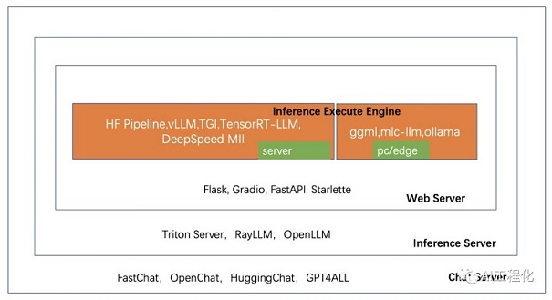

<!-- more -->

# 推理 框架[1]

+ inference execute engine(server)  
vLLM，TensorRT， deepspeed  

+ inference execute engine(pc/edge 移动端)  
 llama.cpp  
  mlc-llm  
  ollama  

+ inference Server  
  Triton Server,  Ray  

+ Chat Server [2]  
  FastChat, XInference,  modelscope  SWIFT  
  
  
# 参考

1. [探秘LLM应用开发](https://mp.weixin.qq.com/mp/appmsgalbum?action=getalbum&__biz=MzA5MTIxNTY4MQ==&scene=1&album_id=2959126655292211206)   8-19

2. [LLM 大模型学习必知必会系列(十二)：VLLM性能飞跃部署实践：从推理加速到高效部署的全方位优化[更多内容：XInference/FastChat等框架]](https://cloud.tencent.com/developer/article/2422454)

1xx. [一文探秘LLM应用开发(18)-模型部署与推理(框架工具-Triton Server、RayLLM、OpenLLM)](https://mp.weixin.qq.com/s?__biz=MzA5MTIxNTY4MQ==&mid=2461142079&idx=1&sn=07d9033203c0064408fe0af33d1f9414)

1xx. [一文探秘LLM应用开发(16)-模型部署与推理(框架工具-TGI，vLLM，TensorRT-LLM，DS-MII) ](https://mp.weixin.qq.com/s?__biz=MzA5MTIxNTY4MQ==&mid=2461142012&idx=1&sn=dafb0b676cdf6d41fd9bd54f9b6a82d3)

1xx. [大模型推理框架概述](https://zhuanlan.zhihu.com/p/659792625)

