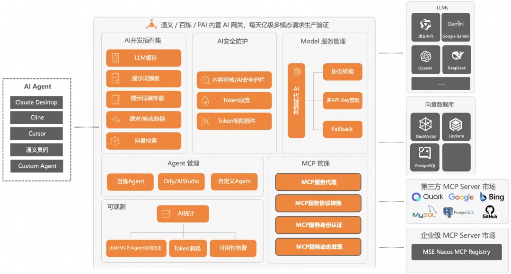

# AI 网关简述
阿里云AI网关和阿里云云原生API网关同属一个内核。

AI 网关的能力主要包括六部分：
+ 模型服务管理：可以代理市面上所有主流的模型托管服务，以及兼容 OpenAI 协议的 LLM 服务和多模态 LLM 服务。在这个模块中包括协议转换、多 API Key 管理、Fallback、多模型切换等多个核心功能。

+ MCP 管理：负责 MCP 服务的代理以及 MCP 服务的策略管理。包括代理原生 MCP 服务，HTTP 服务转 MCP 服务，MCP 服务鉴权认证，和 MSE Nacos 集成实现从 MCP Registry 自动发现 MCP 服务。

+ Agent 管理：负责 Agent 的代理以及 Agent 的策略管理。目前支持代理百炼 Agent，Dify 构建的 Agent（流程），AIStudio 构建的 Agent（流程），自定义 Agent。

+ AI 安全防护：安全防护分为三个层面，一个是输入输出的内容安全防护，另一个是保护下游 LLM 服务的稳定，以及管控 AI 接口消费者。在这个模块中包括内容审核、基于 Token 的限流降级、消费者认证等多个核心功能。

+ AI 插件：AI 网关的灵活扩展机制我们使用插件的形式来实现，目前有很多预置的插件，用户也可以开发自定义插件来丰富 AI 场景流量的管控。比如基于 AI 插件机制我们实现了结果缓存、提示词装饰器、向量检索等能力。

+ AI 可观测：AI 场景的可观测和传统场景的可观测是有很大区别的，监控和关注的指标都是不同的，云原生 AI 网关结合阿里云日志服务和可观测产品实现了贴合 AI 应用业务语义的可观测模块和 AI 观测大盘，支持比如 Tokens 消费观测，流式/非流式的 RT，首包 RT，缓存命中等可观指标。同时所有的输入输出 Tokens 也都记录在日志服务 SLS 中，可供用户做更详细的分析。

# 参考
[企业AI落地实践（三）：使用 AI 网关解决 AI Agent 与 LLM 的交互挑战](https://mp.weixin.qq.com/s/KMNoUy8K2NsqKgPSqJ5xBw)