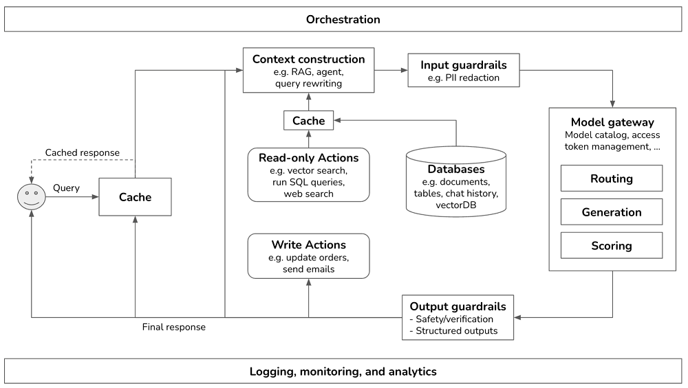

# **Step 2. Put in Guardrails**

**Input guardrails**

**Output guardrails**

**Guardrail tradeoffs**

# **Step 3. Add Model Router and Gateway**

**Router**

**Gateway**

# **Step 4. Reduce Latency with Cache**

**Prompt cache**

**Exact cache**

**Semantic cache**

# **Observability**

### **Metrics**

- **Time to First Token** (TTFT): The time it takes for the first token to be generated.
- **Time Between Tokens** (TBT): The interval between each token generation.
- **Tokens Per Second** (TPS): The rate at which tokens are generated.
- **Time Per Output Token** (TPOT): The time it takes to generate each output token.
- **Total Latency**: The total time required to complete a response.

# 参考

[Building A Generative AI Platform](https://huyenchip.com/2024/07/25/genai-platform.html)

[【译】构建生成式 AI 平台概述](https://minddev.io/blog/2024-09-14-genai-platform)

[聊聊AI应用架构演进](https://mp.weixin.qq.com/s/QtASVIfRJTkfi71Jdst-ZA)