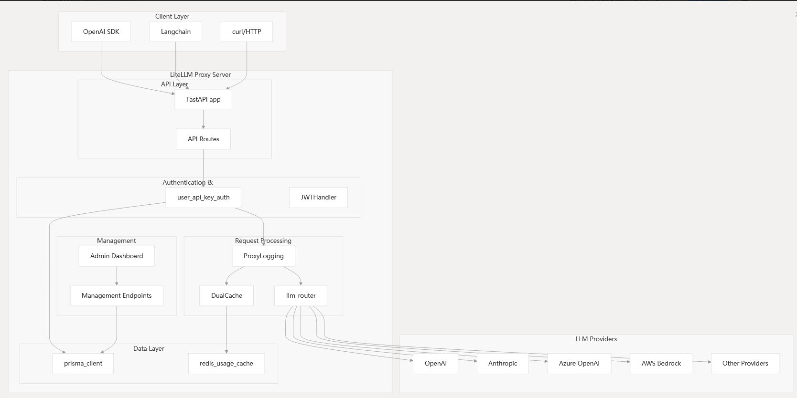

# Arch[1]

# Routing and Load Balancing[2]

# 参考
[快速上手 LiteLLM：打造高效、稳定、面向生产的 LLM 应用程序](https://cloud.tencent.com/developer/article/2522990)  

### code
1. https://deepwiki.com/BerriAI/litellm/3-litellm-proxy  
2. https://deepwiki.com/BerriAI/litellm/3.4-routing-and-load-balancing

https://github.com/BerriAI/litellm  
https://github.com/BerriAI/litellm/blob/c946ae85/litellm/router.py  
https://github.com/BerriAI/litellm/blob/c946ae85/litellm/types/router.py  
https://github.com/BerriAI/litellm/blob/c946ae85/litellm/proxy/proxy_server.py  

### doc
https://docs.litellm.ai/docs/  
https://docs.litellm.ai/docs/routing