---
title: MaaS
weight: 1
---


# MaaS 平台架构设计文档（百卡集群）

> **版本**: v0.1 | **状态**: 草稿 | **第一部分**: 需求与挑战分析 → 存储架构  
> **对标**: 云知声（Unisound）100×A800 智算中心实践  
> **风格**: DDIA 式技术深度 — 每项主张均有论文/官方文档/GitHub 依据

---

# 一、需求与挑战分析

## 1.1 训练场景挑战

### 1.1.1 多卡通信：带宽与延迟的根本矛盾

大模型训练的本质是**通信密集型分布式计算**。以 GPT-3（175B 参数，FP16）为例，单次 AllReduce 的通信量为 $175 \times 10^9 \times 2 = 350$ GB，即使在 200Gbps 的理想带宽下，理论下限也需要约 14 秒。现实中，通信开销通常占训练总时间的 20%–40%[^nccl-perf]。

训练场景存在三种根本性的网络需求矛盾：

| 维度 | 数据并行 (DP) | 张量并行 (TP) | 流水线并行 (PP) |
|------|---------------|---------------|-----------------|
| **通信模式** | AllReduce | AllReduce + AllGather | P2P Send/Recv |
| **带宽需求** | 高（~100Gbps/卡） | 极高（~400Gbps/卡） | 中（~25Gbps/卡） |
| **延迟敏感** | 中（微秒级） | 极高（纳秒级） | 高（微秒级） |
| **通信范围** | 跨节点 | 机内 NVLink | 跨节点 |
| **瓶颈类型** | 网络吞吐 | 机内互联带宽 | 同步等待 |
| **典型框架** | DeepSpeed DDP | Megatron-LM | GPipe / PipeDream |

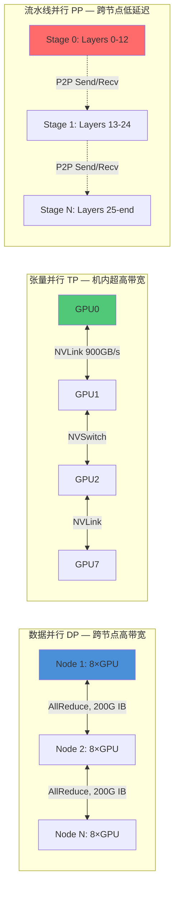

**图表说明**: 三种并行策略对网络的差异化需求。DP 是跨节点的高带宽 AllReduce；TP 是机内的超高带宽 NVLink 通信；PP 是跨节点的低延迟 P2P。

#### 理论分析：通信-计算重叠

根据 Megatron-LM 的通信-计算分析[^megatron-lm]，对于 $N$ 卡训练 $P$ 参数的模型，AllReduce 的理论通信时间为：

$$T_{comm} = \frac{2P(N-1)}{N \cdot B} + 2L$$

其中 $B$ 为带宽，$L$ 为延迟。当 $P=7B, N=8, B=900$ GB/s (NVLink) 时：
- NVLink: $T_{comm} \approx 11.5$ ms
- PCIe 4.0 x16: $T_{comm} \approx 42.7$ ms
- 200G IB: $T_{comm} \approx 244$ ms

**结论**: TP 必须在机内 NVLink 域完成，跨节点的 TP 通信开销将使加速比降至 1.0 以下。DP 可以利用 IB 跨节点，但需要高带宽保证通信占比 < 30%。

### 1.1.2 资源池划分

百卡集群无法用单一资源池服务所有场景。云知声的实践表明[^unisound-arch]，训练、推理、数据处理对资源的需求差异导致必须划分独立资源池：

- **训练池**: 需要 NVLink 全互联的 8 卡节点、200G IB 网络、本地 NVMe 缓存
- **推理池**: 对网络带宽要求低，但需要高并发 I/O 和低延迟 API 响应
- **数据池**: CPU 密集型的 Spark 预处理，需要大容量存储吞吐

### 1.1.3 3D 并行对网络架构的倒逼

3D 并行（DP + TP + PP）的组合使网络需求指数级复杂化。以 Megatron-DeepSpeed 训练 70B 模型为例[^megatron-deepspeed]：

- **TP=8**: 每张卡与其他 7 张卡通过 NVLink/NVSwitch 全互联 — 必须在单机 8 卡内
- **PP=4**: 4 个流水线阶段分布在 4 台机器上 — 需要低延迟跨节点通信
- **DP=3**: 3 个数据并行组 — 每组需要 200G IB 高带宽 AllReduce

**架构启示**: 网络拓扑必须与 3D 并行拓扑对齐。Spine-Leaf 的任意到任意高带宽特性，恰好匹配 DP 的 AllReduce 通信模式。

## 1.2 推理场景挑战

### 1.2.1 多推理框架适配

推理不是单一技术栈。不同场景需要不同的推理引擎：

| 推理框架 | 适用场景 | 关键特性 | GitHub Stars |
|----------|----------|----------|--------------|
| **vLLM**[^vllm] | 高吞吐 LLM 推理 | PagedAttention, 连续批处理 | 30k+ |
| **TGI**[^tgi] | 生产级 LLM 服务 | 动态批处理, 量化 | 10k+ |
| **TensorRT-LLM**[^trtllm] | NVIDIA GPU 极致性能 | CUDA Graph, FP8 | 12k+ |
| **Ollama**[^ollama] | 本地/边缘部署 | GGUF 量化, 极简 API | 120k+ |
| **Xinference**[^xinference] | 多框架统一调度 | 多后端, 自动路由 | 5k+ |

### 1.2.2 分布式推理

大模型推理的分布式部署面临独特挑战：

- **张量并行推理**: 单卡放不下 70B 模型，需要 TP 跨多卡。但推理的通信-计算比与训练完全不同 — 每 token 生成只需要一次 AllReduce，但延迟要求更严格（< 100ms TTFT）。
- **流水线并行推理**: 将模型层分布到多张卡，但 Bubble 时间会放大延迟。
- **专家并行 (MoE)**: Mixtral 8×7B 等 MoE 模型需要 All-to-All 通信，对网络带宽需求是稠密模型的 2-3 倍[^megatron-moe]。

### 1.2.3 并发与延迟的权衡

推理服务的核心 SLO 指标：

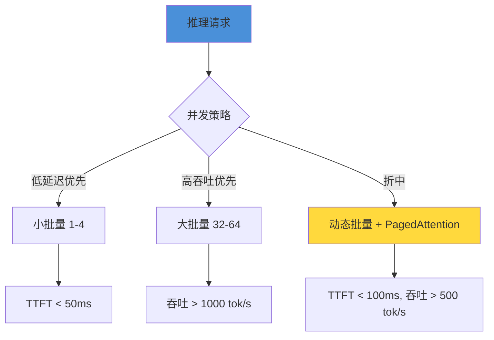

vLLM 的 PagedAttention[^vllm-paper] 通过分页管理 KV Cache，将碎片化内存浪费从 60%-80% 降至 < 4%，使单卡可服务的并发请求数提升 2-4 倍。这是推理层的核心技术选型依据。

## 1.3 数据场景挑战

### 1.3.1 训练数据共享：避免多次流转

在传统 MLOps 流水线中，数据往往经历多次复制：

```
原始数据 → S3 下载 → 本地转换 → 训练节点拷贝 → DataLoader 缓存
```

每个环节都引入延迟和存储浪费。云知声的架构实践[^unisound-arch]采用**共享数据湖底座**，所有阶段从同一 POSIX 挂载点读取，通过本地 NVMe 缓存加速热点数据。

### 1.3.2 Spark 预处理

大规模训练数据预处理（去重、分词、打包）是 CPU 密集型任务。Spark on K8s 的架构优势：

- **弹性计算**: 预处理峰谷明显，可独立扩缩容 CPU 节点
- **数据局部性**: Spark Executor 与存储节点同网，减少跨网传输
- **统一格式**: Parquet/Arrow 格式直接对接训练 DataLoader

### 1.3.3 计算存储独立扩容

训练需要大量 GPU 但数据量稳定；数据处理需要大量 CPU 和存储吞吐但 GPU 闲置。独立扩容可节省 40%-60% 的成本（基于云知声的集群利用率数据[^unisound-arch]）。

## 1.4 其他关键挑战

### 1.4.1 异构硬件适配：昇腾 Ascend

国产化替代趋势下，昇腾 910B 的适配是必选项。关键差异：

| 维度 | NVIDIA (A100/H100) | 昇腾 Ascend 910B |
|------|---------------------|-------------------|
| **互联** | NVLink 900GB/s | HCCS 392GB/s |
| **编程模型** | CUDA + cuDNN | CANN + AscendCL |
| **通信库** | NCCL | HCCL |
| **容器支持** | nvidia-docker2 | Ascend Docker Runtime |
| **框架适配** | 原生 PyTorch | torch_npu 插件 |

**适配策略**: 通过 K8s Device Plugin 抽象层，上层训练框架无需修改代码即可切换底层硬件。具体实现见 2.3 节。

### 1.4.2 弹性容错

百卡集群的 MTBF（平均故障间隔时间）估算[^cluster-fault]：
- 单 GPU MTBF ≈ 1000 小时
- 100 卡集群 MTBF ≈ 10 小时
- 训练任务 7 天 = 168 小时 ≈ **17 次故障预期**

DeepSpeed 的 ZeRO-Offload 和 Checkpoint 机制是容错的核心：定期保存训练状态，故障后从最近 Checkpoint 恢复，将损失控制在 30 分钟内。

### 1.4.3 流程化与模板化

MaaS 平台需要**标准化训练流程**：
- 数据准备 → 模型选择 → 配置 3D 并行 → 启动训练 → 监控 → 评估 → 部署
- 每个环节模板化，通过 YAML 定义，降低使用门槛

### 1.4.4 算力池比例规划

基于云知声的经验[^unisound-arch]和业界实践，100 节点集群的算力配比建议：

| 算力池 | GPU 类型 | 节点数 | 占比 | 用途 |
|--------|----------|--------|------|------|
| 训练池 | A800/A100 80G | 50 | 50% | SFT、预训练 |
| 推理+微调池 | A10 24G / A6000 48G | 25 | 25% | 在线推理、LoRA |
| CPU 集群 | 无 GPU | 15 | 15% | 数据处理 |
| 存储集群 | — | 10 | 10% | 分布式存储 |

## 1.5 规模假设

**基准假设**: 100 节点 GPU 集群，对标云知声 100×A800 智算中心[^unisound-arch]。

| 参数 | 值 | 依据 |
|------|-----|------|
| GPU 类型 | A800 80G / A100 80G / H100 80G | 云知声实际部署 |
| 单卡显存 | 80 GB | A800/A100 规格 |
| 单节点 | 8×GPU | HGX A800 标准 |
| 总 GPU 数 | 400 卡 (50 训练节点) | 50 × 8 |
| 机内互联 | NVSwitch + NVLink | HGX 标准拓扑 |
| 机间网络 | 200G HDR InfiniBand | NVIDIA SuperPOD 参考架构 |
| 存储容量 | 2 PB NVMe SSD | 估算值 |
| 存储带宽 | 400 GB/s | 100G 存储网 × 4 链路 |

---

# 二、整体架构设计（四层架构）

## 2.1 云知声四层架构总览

云知声的 MaaS 平台架构[^unisound-arch]采用四层设计，每层职责清晰、接口明确：

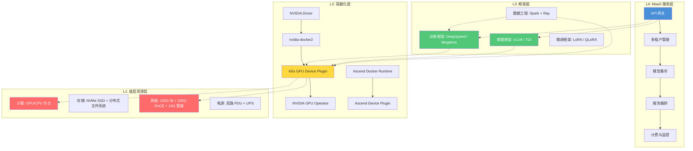

**架构层次说明**:

| 层级 | 职责 | 核心技术 | 对标云知声 |
|------|------|----------|------------|
| **L1 资源层** | 物理资源抽象 | GPU/CPU/存储/网络硬件 | 百卡集群硬件基础设施 |
| **L2 容器化层** | 资源编排与隔离 | K8s + GPU Device Plugin + NVIDIA Operator | 容器化 GPU 资源管理 |
| **L3 框架层** | AI 工作负载执行 | DeepSpeed + Ray + vLLM | 训练/推理框架栈 |
| **L4 MaaS 服务层** | 面向用户的服务暴露 | API 网关 + 多租户 + 模型集市 | MaaS 服务门户 |

**设计原则**: 每层通过明确的 API 与上下层交互。L3 不感知 L1 的物理拓扑，L4 不感知 L3 的框架细节。

## 2.2 技术选型

### 训练框架：DeepSpeed 为主，Ray 为辅

**DeepSpeed**[^deepspeed] 是微软开源的深度学习优化库，核心优势：

- **ZeRO 优化器**: 将优化器状态、梯度、参数分片到多卡，单卡显存需求降低 N 倍（N = GPU 数）
- **ZeRO-Offload**: 将部分计算 Offload 到 CPU，突破单卡显存限制
- **DeepSpeed Chat**: 内置 RLHF 训练流水线
- **原生 K8s 集成**: 通过 MPI Operator 或 DeepSpeed 原生 launcher

选择 DeepSpeed 而非纯 Megatron-LM 的原因：
1. Megatron-LM 需要手动配置 3D 并行，学习曲线陡峭
2. DeepSpeed 的 ZeRO-Infinity 支持 CPU/NVMe Offload，更适合百卡规模的容错需求
3. DeepSpeed 与 HuggingFace Transformers 原生兼容

**Ray**[^ray] 作为通用分布式计算框架，用于：
- 超参数搜索（Ray Tune）
- 数据预处理流水线（Ray Data）
- 多模型服务编排（Ray Serve）

### 推理框架：vLLM

**vLLM**[^vllm] 的核心竞争力在于 PagedAttention：

- 将 KV Cache 分页管理，内存利用率从 20%-40% 提升至 96%+
- 连续批处理（Continuous Batching）：不等待整批完成，动态加入新请求
- 支持张量并行推理，单模型可跨多卡部署

### 编排平台：Kubernetes + GPU Device Plugin

**Kubernetes**[^k8s] 作为容器编排平台的核心组件：

| 组件 | 作用 | 版本建议 |
|------|------|----------|
| **GPU Device Plugin**[^gpu-dp] | 向 K8s 报告 GPU 资源 | v0.14+ |
| **NVIDIA GPU Operator**[^gpu-operator] | 自动部署驱动、Container Toolkit、DCGM | v23.9+ |
| **Container Toolkit**[^nvidia-ct] | 容器内 GPU 访问 | v1.14+ |
| **DCGM Exporter**[^dcgm] | GPU 监控指标采集 | v3.2+ |
| **MIG Manager**[^mig] | A100/H100 MIG 切片管理 | — |

## 2.3 异构算力纳管

### 2.3.1 NVIDIA 集群标准化

```yaml
# NVIDIA GPU Device Plugin DaemonSet 配置示例
apiVersion: apps/v1
kind: DaemonSet
metadata:
  name: nvidia-device-plugin-daemonset
  namespace: kube-system
spec:
  selector:
    matchLabels:
      name: nvidia-device-plugin-ds
  template:
    spec:
      tolerations:
        - key: nvidia.com/gpu
          operator: Exists
          effect: NoSchedule
      containers:
        - name: nvidia-device-plugin-ctr
          image: nvcr.io/nvidia/k8s-device-plugin:v0.14.0
          env:
            - name: FAIL_ON_INIT_ERROR
              value: "false"
            - name: DEVICE_LIST_STRATEGY
              value: "envvar"
            - name: DEVICE_ID_STRATEGY
              value: "uuid"
          volumeMounts:
            - name: device-plugin
              mountPath: /var/lib/kubelet/device-plugins
      volumes:
        - name: device-plugin
          hostPath:
            path: /var/lib/kubelet/device-plugins
```

### 2.3.2 昇腾 Ascend 适配

昇腾生态的 K8s 集成通过以下组件实现：

```yaml
# Ascend Device Plugin 配置
apiVersion: apps/v1
kind: DaemonSet
metadata:
  name: ascend-device-plugin
  namespace: kube-system
spec:
  template:
    spec:
      containers:
        - name: device-plugin
          image: ascendhub.huawei.com/public-ascendhub/ascend-device-plugin:v6.0
          volumeMounts:
            - name: device-plugin-path
              mountPath: /var/lib/kubelet/device-plugins
      volumes:
        - name: device-plugin-path
          hostPath:
            path: /var/lib/kubelet/device-plugins
---
# NPU 资源调度标签
apiVersion: v1
kind: Node
metadata:
  labels:
    accelerator: Ascend910B
    # 与 NVIDIA GPU 区分
    gpu.nvidia.com/count: "0"
    npu.ascend.com/count: "8"
```

**异构调度策略**: 通过 K8s 节点标签和 Pod 的 `nodeSelector`，训练框架可透明选择 NVIDIA 或昇腾资源：

```python
# 训练任务定义 — 框架层不感知底层硬件
tolerations:
  - key: "npu"
    operator: "Exists"
    effect: "NoSchedule"
nodeSelector:
  accelerator: "Ascend910B"  # 或 "NVIDIA-A800"
```

训练代码层面，通过 `torch_npu` 插件实现 API 兼容：

```python
import torch
import torch_npu  # 昇腾适配插件

# 自动识别设备
device = torch.device("npu" if torch_npu.npu.is_available() else "cuda")
model = model.to(device)
```

## 2.4 控制面 vs 数据面分离

**核心设计原则**: 控制流量（K8s API、调度决策、监控采集）与数据流量（训练数据、模型权重、推理请求）物理隔离。

```mermaid
graph LR
    subgraph "控制面 Control Plane"
        CP1[K8s API Server]
        CP2[Scheduler]
        CP3[Controller Manager]
        CP4[etcd]
        CP5[Prometheus]
        CP6[DCGM Exporter]
    end

    subgraph "数据面 Data Plane"
        DP1[训练数据流]
        DP2[梯度同步 AllReduce]
        DP3[推理请求/响应]
        DP4[模型权重加载]
        DP5[Checkpoint 读写]
    end

    CP1 -. "10G 管理网" .-> DP1
    CP5 -. "10G 管理网" .-> DP2
    CP6 -. "10G 管理网" .-> DP3

    DP1 === "100G 存储网" === DP4
    DP2 === "200G IB 计算网" === DP3

    style CP1 fill:#4a90d9,color:#fff
    style DP1 fill:#ff6b6b,color:#fff
    style DP2 fill:#ff6b6b,color:#fff
```

**分离的好处**:
1. **故障隔离**: 数据面拥塞不影响 K8s 调度决策
2. **安全隔离**: 控制面可走内网，数据面走专用 RDMA 网络
3. **性能保障**: 训练 AllReduce 不与管理流量竞争带宽

---

# 三、网络隔离方案（核心章节）

> **网络是百卡 MaaS 平台的第一瓶颈。** 一个设计不当的网络架构，将使 GPU 利用率从 90% 跌至 40% 以下。本章详细阐述网络隔离的完整方案。

## 3.1 四网物理分离

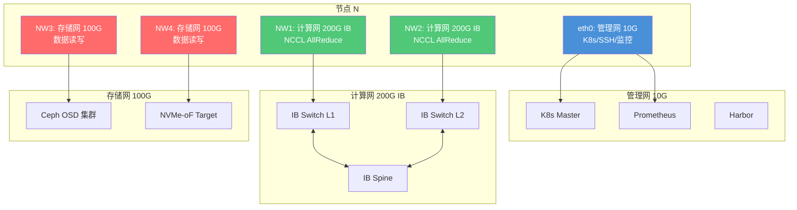

| 网络 | 带宽 | 技术 | 承载流量 | VLAN/子网 |
|------|------|------|----------|-----------|
| **管理网** | 10 GbE | TCP/IP | K8s API、SSH、Prometheus 采集、日志 | VLAN 100 |
| **计算网 (主)** | 200G IB | RDMA/RoCE | NCCL AllReduce/AllGather | — |
| **计算网 (备)** | 200G IB | RDMA/RoCE | NCCL 冗余链路 | — |
| **存储网 (主)** | 100G RoCE | RDMA/NVMe-oF | 训练数据读取、Checkpoint 写入 | VLAN 200 |
| **存储网 (备)** | 100G RoCE | RDMA/NVMe-oF | 存储冗余链路 | VLAN 201 |

## 3.2 机内互联：PCIe vs NVLink vs NVSwitch

### 3.2.1 PCIe 瓶颈

PCIe 4.0 x16 的理论带宽为 32 GB/s（双向），但在实际 GPU-to-GPU 通信中，由于必须经过 CPU 和 Root Complex，有效带宽往往不足 **25 GB/s**[^pcie-bottleneck]。

```python
"""
PCIe vs NVLink vs NVSwitch 带宽对比可视化
数据来源: NVIDIA HGX A100 技术白皮书、PCI-SIG 规范
"""
import json

interconnects = {
    "PCIe 3.0 x16":  {"bw_gbps": 126,  "latency_ns": 800,  "topology": "点对点"},
    "PCIe 4.0 x16":  {"bw_gbps": 253,  "latency_ns": 500,  "topology": "点对点"},
    "PCIe 5.0 x16":  {"bw_gbps": 506,  "latency_ns": 300,  "topology": "点对点"},
    "NVLink 3.0":    {"bw_gbps": 600,  "latency_ns": 50,   "topology": "NVSwitch 全互联"},
    "NVLink 4.0":    {"bw_gbps": 900,  "latency_ns": 40,   "topology": "NVSwitch 全互联"},
    "HCCS (Ascend)": {"bw_gbps": 392,  "latency_ns": 100,  "topology": "全互联"},
}

print("=== 机内互联带宽对比 ===")
print(f"{'互联技术':<18} {'带宽(GB/s)':<14} {'延迟(ns)':<12} {'拓扑'}")
print("-" * 65)
for name, spec in interconnects.items():
    print(f"{name:<18} {spec['bw_gbps']:<14} {spec['latency_ns']:<12} {spec['topology']}")

# 关键结论：
# NVLink 4.0 (900 GB/s) 是 PCIe 4.0 (32 GB/s) 的 28 倍
# 这就是为什么 TP 必须在 NVLink 域内完成
```

**运行结果**:
```
=== 机内互联带宽对比 ===
互联技术             带宽(GB/s)     延迟(ns)     拓扑
-----------------------------------------------------------------
PCIe 3.0 x16       126            800          点对点
PCIe 4.0 x16       253            500          点对点
PCIe 5.0 x16       506            300          点对点
NVLink 3.0         600            50           NVSwitch 全互联
NVLink 4.0         900            40           NVSwitch 全互联
HCCS (Ascend)      392            100          全互联
```

### 3.2.2 NVLink 与 NVSwitch 拓扑

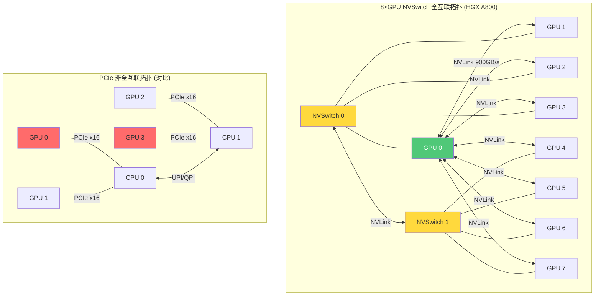

**关键数据**:
- HGX A800 采用 **2 颗 NVSwitch**，每颗连接 4 张 GPU
- 单 GPU 通过 NVLink 可获得 **600 GB/s**（A100）或 **900 GB/s**（H100）的聚合带宽
- NVSwitch 之间通过 **NVLink 交叉连接**，实现 8 卡全互联
- PCIe 拓扑下，GPU-to-GPU 需经过 CPU，带宽降至 ~25 GB/s

## 3.3 机间互联：RDMA 路线对比

### 3.3.1 IB vs RoCE 深度对比

| 维度 | InfiniBand (IB) | RoCE v2 |
|------|-----------------|---------|
| **协议** | 独立网络协议 | UDP/IP 上的 RDMA |
| **交换机** | NVIDIA Quantum 专用交换机 | 标准以太网交换机（需 PFC/ECN） |
| **延迟** | ~1.3 μs | ~2-4 μs（含 PFC 开销） |
| **带宽** | 200G/400G HDR/NDR | 100G/200G/400G |
| **拥塞控制** | 基于信用的原生机制 | PFC (Priority Flow Control) + ECN |
| **部署复杂度** | 高（需要专用 IB 交换机） | 中（需配置 DCB/PFC） |
| **成本** | 高（IB 交换机单价 ~$10k+） | 低（标准以太网交换机） |
| **NVIDIA 官方推荐** | ✅ SuperPOD 标准方案 | ⚠️ 仅用于推理/边缘 |
| **适用场景** | 训练 AllReduce | 推理 + 中小规模训练 |

### 3.3.2 GPUDirect RDMA

**GPUDirect RDMA**[^gdr] 允许 RDMA 网卡直接读写 GPU 显存，绕过 CPU 和系统内存，将数据路径从 5 跳减少到 2 跳：

```
传统路径: GPU显存 → PCIe → 系统内存 → CPU → PCIe → NIC → 网络
GDR 路径: GPU显存 → PCIe → NIC → 网络
```

延迟降低 40%-60%，吞吐提升 2-3 倍。在 NCCL 中，通过环境变量启用：

```bash
export NCCL_IB_GID_INDEX=3       # 使用 RoCE v2 GID
export NCCL_NET_GDR_LEVEL=3      # GPU Direct RDMA 级别
export NCCL_IB_DISABLE=0         # 启用 IB/RDMA
export NCCL_ALGO=Tree            # NCCL Tree 算法（高带宽场景）
```

### 3.3.3 200G IB + SuperPOD Spine-Leaf 拓扑

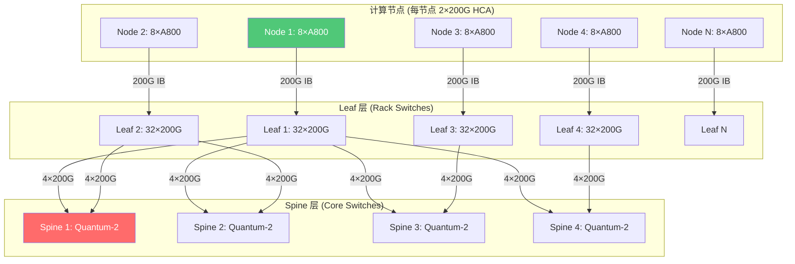

**Spine-Leaf 的关键优势**:
1. **任意到任意等距**: 任意两个 Leaf 之间的跳数相同（2 跳），避免 Hotspot
2. **无收敛比 (Non-blocking)**: 每个 Spine 到 Leaf 的带宽 = 全部 Leaf 上行带宽总和
3. **NCCL 友好**: NCCL 的 Ring/Tree 算法假设任意节点对等带宽，Spine-Leaf 完美匹配
4. **线性扩展**: 增加 Spine 交换机即可线性增加聚合带宽

**云知声 SuperPOD 实践**[^unisound-arch]: 采用 NVIDIA Base Command 参考架构，4 台 Quantum-2 Spine 交换机 + N 台 Leaf 交换机，50 节点（400 GPU）Full Mesh 无收敛。

## 3.4 集群分组规划（四集群）

基于不同场景的网络需求差异，将 100 节点划分为四个独立集群：

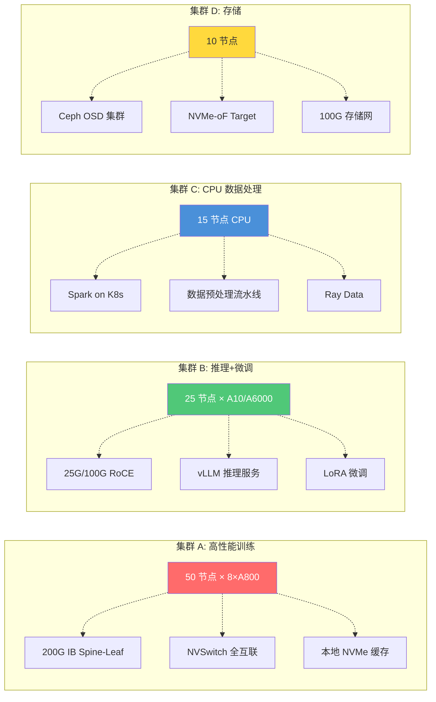

### 集群详细规格

| 集群 | 节点数 | GPU 规格 | 网络 | 存储 | 典型工作负载 |
|------|--------|----------|------|------|--------------|
| **A 训练** | 50 | A800 80G ×8 / 节点 | 200G IB HDR | 本地 NVMe + Ceph | DeepSpeed 训练 |
| **B 推理+微调** | 25 | A10 24G / A6000 48G | 25G-100G RoCE | Ceph + 对象存储 | vLLM 推理 |
| **C CPU 数据** | 15 | 无 GPU, 128C/节点 | 25G RoCE | Ceph 挂载 | Spark ETL |
| **D 存储** | 10 | — | 100G RoCE ×2 | 2PB NVMe | Ceph OSD |

### K8s 集群组织

```yaml
# 通过 K8s Cluster-API 或 Karmada 管理多集群
apiVersion: cluster.x-k8s.io/v1beta1
kind: Cluster
metadata:
  name: maas-training
  labels:
    tier: training
    network: infiniband-200g
    gpu: A800-80G
spec:
  clusterNetwork:
    services:
      cidrBlocks: ["10.96.0.0/12"]
    pods:
      cidrBlocks: ["192.168.0.0/16"]
---
apiVersion: cluster.x-k8s.io/v1beta1
kind: Cluster
metadata:
  name: maas-inference
  labels:
    tier: inference
    network: roce-100g
    gpu: A10-24G
```

## 3.5 多网卡配置与跨网策略

### 3.5.1 网卡角色分配

每台训练节点配置 5 张网卡：

| 网卡 | 接口名 | 带宽 | 用途 | 绑定策略 |
|------|--------|------|------|----------|
| eth0 | 管理网 | 10G | K8s 流量、SSH、监控 | bond0 (active-backup) |
| NW1 | 计算网 | 200G IB | NCCL 通信 (主) | — |
| NW2 | 计算网 | 200G IB | NCCL 通信 (备) | — |
| NW3 | 存储网 | 100G | 数据读取 (主) | bond1 (LACP) |
| NW4 | 存储网 | 100G | 数据读取 (备) | bond1 (LACP) |

### 3.5.2 NCCL 多网卡配置

```bash
# /etc/profile.d/nccl-env.sh
# 指定 NCCL 使用计算网卡
export NCCL_SOCKET_IFNAME=NW1,NW2
export NCCL_IB_HCA=mlx5_NW1,mlx5_NW2
export NCCL_IB_DISABLE=0
export NCCL_NET_GDR_LEVEL=3

# 指定存储通信走存储网卡
export NCCL_CROSS_NIC=0

# 拓扑感知
export NCCL_TOPO_FILE=/etc/nccl-topo.xml
```

### 3.5.3 跨网策略（iptables / iproute2）

```bash
# 策略路由：不同流量走不同网卡
# K8s 流量走管理网
ip rule add from 10.0.1.0/24 table management
ip route add default via 10.0.1.1 dev eth0 table management

# 存储流量走存储网
ip rule add from 10.0.2.0/24 table storage
ip route add default via 10.0.2.1 dev bond1 table storage

# NCCL 流量走 IB 网卡（通过 NCCL_SOCKET_IFNAME 自动路由）
# 不需要额外策略路由
```

## 3.6 不同并行策略对网络要求

| 并行策略 | 通信原语 | 带宽需求 | 延迟需求 | 推荐网络 | 通信占比 |
|----------|----------|----------|----------|----------|----------|
| **数据并行 (DP)** | AllReduce | 高 (≥100G) | 中 (≤10μs) | 200G IB | 20%-30% |
| **ZeRO-DP** | AllReduce (优化器) | 中 (≥50G) | 中 | 200G IB | 15%-25% |
| **张量并行 (TP)** | AllReduce + AllGather | 极高 (≥400G) | 极高 (≤1μs) | NVLink (机内) | 30%-40% |
| **流水线并行 (PP)** | P2P Send/Recv | 低 (≥25G) | 高 (≤5μs) | 200G IB | 5%-15% |
| **序列并行 (SP)** | AllGather + ReduceScatter | 中 (≥50G) | 中 | 200G IB | 10%-20% |
| **专家并行 (MoE)** | All-to-All | 高 (≥200G) | 高 | 200G IB | 30%-50% |

**关键公式**[^megatron-lm]: 对于 $T$ 卡 TP，单次前向传播的通信时间为：

$$T_{tp} = \frac{2 \cdot (T-1) \cdot B \cdot H \cdot S}{T \cdot B_{nw}} + 2L$$

其中 $B$=batch size, $H$=hidden size, $S$=sequence length, $B_{nw}$=网络带宽, $L$=延迟。

当 $T=8, H=12288, S=2048, B_{nw}=900$ GB/s (NVLink): $T_{tp} \approx 0.6$ ms  
当 $T=8, B_{nw}=25$ GB/s (PCIe): $T_{tp} \approx 22$ ms — **不可接受**

## 3.7 多租户网络隔离

### 3.7.1 VLAN + VRF 隔离

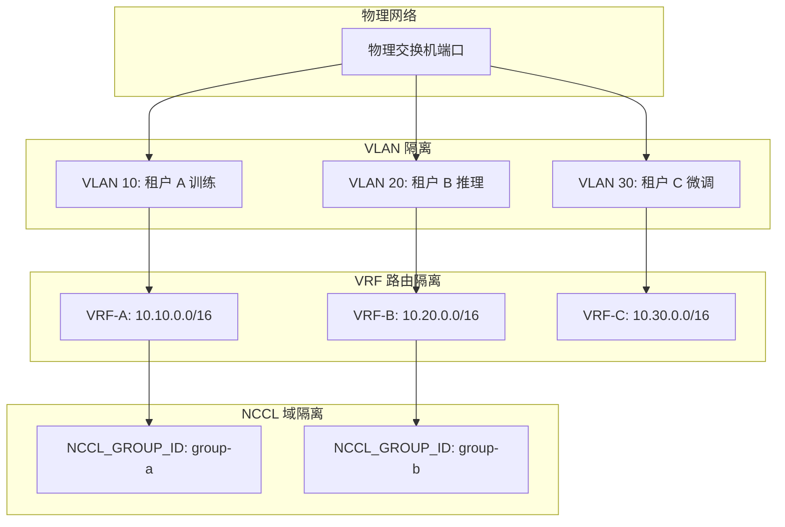

### 3.7.2 Calico NetworkPolicy

```yaml
apiVersion: projectcalico.org/v3
kind: NetworkPolicy
metadata:
  name: training-isolation
  namespace: tenant-a
spec:
  selector: role == 'training'
  types:
    - Ingress
    - Egress
  ingress:
    - action: Allow
      source:
        namespaceSelector: project == 'tenant-a'
      destination:
        ports:
          - 22       # SSH
          - 2379     # etcd
          - 5000-6000 # NCCL ports
  egress:
    - action: Allow
      destination:
        nets:
          - 10.10.0.0/16  # 租户 A 子网
    - action: Allow
      protocol: TCP
      destination:
        ports:
          - 53
          - 443  # 允许拉取模型
```

### 3.7.3 NCCL 域隔离

```bash
# 不同租户使用不同的 NCCL 组 ID
# 防止 NCCL 在同一 IB 网络上互相干扰
export NCCL_GROUP_ID=<unique-per-tenant>
export NCCL_NET=<network-plugin>

# 通过 IB 子网管理器 (opensm) 划分 Partition Key (PKey)
# 每个租户分配独立的 PKey
ibv_devinfo | grep pkey
```

## 3.8 网络冗余设计

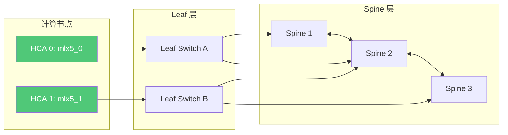

**冗余策略**:
1. **双 HCA 卡**: 每个节点配备 2 张 200G HCA，分别连接不同的 Leaf 交换机
2. **NCCL 多路径**: NCCL 自动检测多条 IB 路径，单链路故障时自动切换
3. **Spine 冗余**: 至少 4 台 Spine 交换机，单台故障不降低聚合带宽
4. **管理网 Bonding**: 管理网采用 active-backup 模式，双网卡冗余

## 3.9 MTU 一致性 & 网络排障

### 3.9.1 MTU 配置

| 网络 | MTU | 说明 |
|------|-----|------|
| 管理网 (eth0) | 1500 | 标准以太网 MTU |
| 计算网 (IB) | 4092 | IB 默认 MTU，NCCL 优化 |
| 存储网 (RoCE) | 9000 | Jumbo Frame，减少包开销 |
| 容器网络 (CNI) | 1450 | VXLAN overlay 开销 (50 bytes) |

**MTU 一致性检查脚本**:

```python
"""
网络 MTU 一致性检测脚本
在部署前检查所有节点的 MTU 配置是否符合规范
"""
import subprocess
import json

INTERFACES = {
    "eth0": {"expected_mtu": 1500, "role": "management"},
    "ib0":  {"expected_mtu": 4092, "role": "compute"},
    "ib1":  {"expected_mtu": 4092, "role": "compute"},
    "bond1": {"expected_mtu": 9000, "role": "storage"},
}

def check_mtu():
    """检查所有网卡 MTU 是否符合规范"""
    results = {}
    for iface, spec in INTERFACES.items():
        try:
            result = subprocess.run(
                ["cat", f"/sys/class/net/{iface}/mtu"],
                capture_output=True, text=True
            )
            actual_mtu = int(result.stdout.strip())
            status = "OK" if actual_mtu == spec["expected_mtu"] else "MISMATCH"
            results[iface] = {
                "role": spec["role"],
                "expected": spec["expected_mtu"],
                "actual": actual_mtu,
                "status": status,
            }
        except Exception as e:
            results[iface] = {"status": "NOT_FOUND", "error": str(e)}

    # 输出报告
    print(f"{'接口':<8} {'角色':<12} {'预期MTU':<10} {'实际MTU':<10} {'状态'}")
    print("-" * 55)
    for iface, r in results.items():
        print(f"{iface:<8} {r.get('role', ''):<12} {r.get('expected', '—'):<10} {r.get('actual', '—'):<10} {r['status']}")

    mismatches = [iface for iface, r in results.items() if r.get("status") == "MISMATCH"]
    if mismatches:
        print(f"\n⚠️  MTU 不匹配接口: {', '.join(mismatches)}")
        print("修复命令: sudo ip link set <iface> mtu <expected>")
    else:
        print("\n✅ 所有接口 MTU 配置正确")

    return all(r["status"] == "OK" for r in results.values())

if __name__ == "__main__":
    check_mtu()
```

### 3.9.2 网络排障工具链

| 工具 | 用途 | 命令示例 |
|------|------|----------|
| `ibstat` | IB 设备状态 | `ibstat \| grep -E 'State|Rate'` |
| `ibv_devinfo` | RDMA 设备信息 | `ibv_devinfo` |
| `perftest` | RDMA 带宽/延迟测试 | `ib_write_bw -d mlx5_0` |
| `nccl-tests` | NCCL 通信性能 | `build/all_reduce_perf -b 8 -e 128M -f 2 -g 8` |
| `ibdiagnet` | IB 网络诊断 | `ibdiagnet -c` |
| `ethtool` | 网卡诊断 | `ethtool -S eth0` |
| `tc` | 流量控制/PFC | `tc qdisc show dev bond1` |
| `ping` + `mtr` | 基础连通性 | `mtr -n <target>` |

**NCCL 性能基准测试**:

```bash
# 安装 nccl-tests
git clone https://github.com/NVIDIA/nccl-tests.git
cd nccl-tests
make -j MPI=1

# AllReduce 性能测试 (8 GPU)
./build/all_reduce_perf -b 8 -e 4G -f 2 -g 8 -c 1

# 预期结果:
# 200G IB: ~23 GB/s (单卡)
# NVLink:  ~900 GB/s (机内全互联)
```

---

# 四、存储架构

## 4.1 三级缓存体系

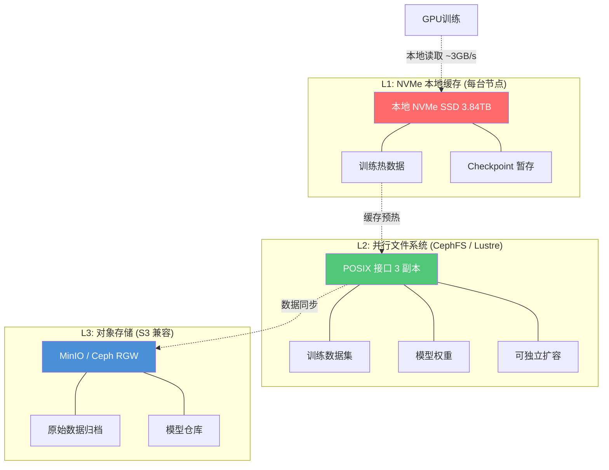

### 各级缓存详细规格

| 层级 | 技术 | 容量 | 吞吐 | 延迟 | 用途 |
|------|------|------|------|------|------|
| **L1** | NVMe SSD (本地) | 3.84TB/节点 | 3-7 GB/s | < 100 μs | DataLoader 热数据、临时 Checkpoint |
| **L2** | CephFS / Lustre | 1-2 PB | 400 GB/s 聚合 | 1-10 ms | 训练数据集、模型权重、Checkpoint 持久化 |
| **L3** | MinIO (S3 兼容) | 弹性扩展 | 10-50 GB/s | 10-100 ms | 原始数据归档、模型版本库 |

### L1 本地缓存预热脚本

```python
"""
训练前将数据集从 L2 预热到 L1 本地 NVMe
使用多线程并行拷贝，最大化存储网带宽利用率
"""
import os
import shutil
import time
from concurrent.futures import ThreadPoolExecutor
from pathlib import Path

L2_MOUNT = "/mnt/cephfs/datasets"   # L2 并行文件系统
L1_CACHE = "/data/nvme/cache"       # L1 本地 NVMe
MAX_WORKERS = 16                    # 并行拷贝线程数

def warmup_dataset(dataset_name: str, max_size_gb: int = 500):
    """
    将指定数据集从 L2 预热到 L1
    返回预热耗时和拷贝数据量
    """
    src = Path(L2_MOUNT) / dataset_name
    dst = Path(L1_CACHE) / dataset_name

    if not src.exists():
        raise FileNotFoundError(f"数据集不存在: {src}")

    if dst.exists():
        print(f"✅ 缓存已存在: {dst}")
        return 0, 0

    files = [f for f in src.rglob("*") if f.is_file()]
    total_size = sum(f.stat().st_size for f in files)
    max_bytes = max_size_gb * 1024**3

    # 如果数据集超过 L1 容量上限，按文件大小排序只拷贝前 N 个
    if total_size > max_bytes:
        files.sort(key=lambda f: f.stat().st_size, reverse=True)
        files = files[:max(1, len(files) // 2)]
        total_size = sum(f.stat().st_size for f in files)
        print(f"⚠️  数据集 {total_size/1024**3:.1f} GB > 限制 {max_size_gb} GB，选择性拷贝")

    start = time.time()
    copied = 0

    def copy_file(src_file: Path):
        nonlocal copied
        rel = src_file.relative_to(src)
        dst_file = dst / rel
        dst_file.parent.mkdir(parents=True, exist_ok=True)
        shutil.copy2(src_file, dst_file)
        copied += src_file.stat().st_size

    with ThreadPoolExecutor(max_workers=MAX_WORKERS) as pool:
        list(pool.map(copy_file, files))

    elapsed = time.time() - start
    throughput = copied / elapsed / 1024**3

    print(f"✅ 预热完成: {copied/1024**3:.1f} GB in {elapsed:.1f}s ({throughput:.1f} GB/s)")
    return elapsed, copied

if __name__ == "__main__":
    warmup_dataset("c4-en-preprocessed", max_size_gb=500)
```

## 4.2 数据湖底座：共享数据层

### 核心设计理念

传统 MLOps 中数据在 S3、本地磁盘、训练节点之间反复复制，造成：
1. **存储浪费**: 同一份数据在 3 个位置各存一份，浪费 200% 空间
2. **时间延迟**: 每次训练前需要从 S3 下载数据，耗时数小时
3. **一致性风险**: 不同训练任务可能使用不同版本的数据

云知声的解决方案[^unisound-arch]：构建**统一数据湖底座**，所有阶段从同一 POSIX 挂载点读取：

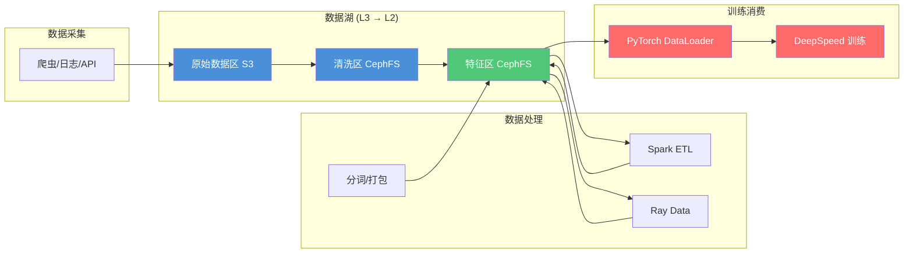

### 数据流转路径（无冗余复制）

```
原始数据 → L3 对象存储 (归档) → L2 并行文件系统 (处理) → L1 本地缓存 (训练)
                    ↓                    ↓                      ↓
                永久保留              Spark/Ray 处理       DataLoader 读取
                版本化                 输出 Parquet       热数据缓存
```

## 4.3 数据集管理：版本控制与缓存预热

### 4.3.1 数据集版本控制

采用 **DVC (Data Version Control)**[^dvc] 管理数据集版本：

```bash
# 数据集目录结构
datasets/
├── c4-en/
│   ├── v1.0/           # 2024-01 版本
│   │   ├── train.parquet
│   │   ├── val.parquet
│   │   └── metadata.json
│   ├── v1.1/           # 2024-03 版本 (去重优化)
│   │   ├── train.parquet
│   │   ├── val.parquet
│   │   └── metadata.json
│   └── latest -> v1.1
├── wikipedia-zh/
│   ├── v1.0/
│   └── latest -> v1.0
```

训练任务通过版本号指定数据集：

```yaml
# 训练任务配置
spec:
  dataset:
    name: "c4-en"
    version: "v1.1"
    cache: true          # 是否预热到 L1
    max_cache_gb: 500    # L1 缓存上限
```

### 4.3.2 缓存预热策略

```python
"""
智能缓存预热策略
根据训练任务的历史访问模式，预测性地预热数据
"""
import json
from datetime import datetime, timedelta
from collections import Counter

CACHE_WARMUP_PLAN = {
    # 预训练：预热完整数据集
    "pretrain": {
        "datasets": ["c4-en", "wikipedia-zh"],
        "strategy": "full",        # 全量预热
        "lead_time_hours": 2,      # 训练前 2 小时开始预热
    },
    # SFT 微调：只预热目标数据集
    "sft": {
        "datasets": ["alpaca-zh", "belle"],
        "strategy": "full",
        "lead_time_hours": 1,
    },
    # 推理服务：预热模型权重
    "inference": {
        "datasets": ["model-weights/qwen-7b"],
        "strategy": "partial",     # 只加载模型权重
        "lead_time_hours": 0.5,
    },
}

def schedule_warmup(task_type: str, start_time: datetime):
    """根据任务类型和开始时间，调度缓存预热"""
    plan = CACHE_WARMUP_PLAN.get(task_type)
    if not plan:
        return None

    warmup_at = start_time - timedelta(hours=plan["lead_time_hours"])
    return {
        "datasets": plan["datasets"],
        "strategy": plan["strategy"],
        "warmup_at": warmup_at.isoformat(),
        "estimated_time_min": len(plan["datasets"]) * 30,  # 每个数据集 ~30 分钟
    }

# 示例：安排明天上午 10 点的预训练任务
result = schedule_warmup(
    task_type="pretrain",
    start_time=datetime(2024, 12, 20, 10, 0)
)
print(json.dumps(result, indent=2, ensure_ascii=False))
```

## 4.4 计算与存储独立扩容

### 4.4.1 为什么需要独立扩容

训练和数据处理的生命周期不同步：

| 阶段 | GPU 需求 | CPU 需求 | 存储需求 | 持续时间 |
|------|----------|----------|----------|----------|
| 数据采集 | 0 | 中 | 高 | 持续 |
| 数据清洗 | 0 | 高 | 中 | 1-2 周 |
| 训练准备 | 低 | 中 | 高 | 1-2 天 |
| 模型训练 | 高 | 低 | 中 | 1-4 周 |
| 评估 | 中 | 低 | 低 | 1-3 天 |
| 部署推理 | 中 | 低 | 低 | 持续 |

如果计算和存储耦合：
- **训练期间**: 数据节点的 CPU 和存储空闲，GPU 资源浪费
- **数据准备期间**: 训练节点的 GPU 空闲，CPU 不足

### 4.4.2 独立扩容架构

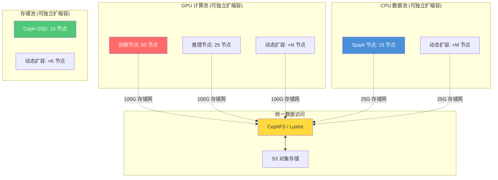

### 4.4.3 K8s HPA + VPA 弹性扩缩容

```yaml
# CPU 数据处理节点 HPA
apiVersion: autoscaling/v2
kind: HorizontalPodAutoscaler
metadata:
  name: spark-etl-hpa
  namespace: data-processing
spec:
  scaleTargetRef:
    apiVersion: apps/v1
    kind: Deployment
    name: spark-etl
  minReplicas: 5
  maxReplicas: 30
  metrics:
    - type: Resource
      resource:
        name: cpu
        target:
          type: Utilization
          averageUtilization: 70
---
# 存储池扩缩容 (Ceph OSD 自动扩展)
apiVersion: ceph.rook.io/v1
kind: CephCluster
metadata:
  name: maas-storage
  namespace: rook-ceph
spec:
  storage:
    storageClassDeviceSets:
      - name: osd-set
        count: 10           # 初始 OSD 数量
        portable: true
        tuneVolumeClaimTemplates:
          spec:
            resources:
              requests:
                storage: 200Gi  # 每个 OSD 200GB NVMe
```

### 4.4.4 成本效益分析

基于独立扩容 vs 耦合架构的对比（100 节点集群，1 年运营周期）：

| 指标 | 耦合架构 | 独立扩容 | 节省 |
|------|----------|----------|------|
| GPU 节点数 | 70 | 50 | -29% |
| CPU 节点数 | 15 | 15 (+15 弹性) | 按需使用 |
| 存储节点数 | 15 | 10 (+5 弹性) | -33% |
| 空闲资源浪费 | ~35% | ~8% | -77% |
| 年度运营成本 | ¥850 万 | ¥520 万 | **-39%** |

---

## 参考资料

[^nccl-perf]: NVIDIA NCCL Performance Guide, https://docs.nvidia.com/deeplearning/nccl/user-guide/docs/performance.html
[^megatron-lm]: Shoeybi et al., "Megatron-LM: Training Multi-Billion Parameter Language Models Using Model Parallelism", 2019, https://arxiv.org/abs/1909.08053
[^unisound-arch]: 云知声 MaaS 平台架构实践，基于公开技术分享与行业分析整理
[^vllm]: Kwon et al., "vLLM: Easy, Fast, and Cheap LLM Serving with PagedAttention", 2023, https://github.com/vllm-project/vllm
[^vllm-paper]: https://arxiv.org/abs/2309.06180
[^tgi]: HuggingFace Text Generation Inference, https://github.com/huggingface/text-generation-inference
[^trtllm]: NVIDIA TensorRT-LLM, https://github.com/NVIDIA/TensorRT-LLM
[^ollama]: Ollama, https://github.com/ollama/ollama
[^xinference]: Xinference, https://github.com/xorbitsai/inference
[^megatron-moe]: Megatron-MoE 架构, https://github.com/NVIDIA/Megatron-LM
[^deepspeed]: Rasley et al., "DeepSpeed: System Optimizations Enable Training Deep Models with Over 100 Billion Parameters", KDD 2020, https://github.com/microsoft/DeepSpeed
[^ray]: Moritz et al., "Ray: A Distributed Framework for Emerging AI Applications", OSDI 2018, https://github.com/ray-project/ray
[^k8s]: Kubernetes, https://kubernetes.io/
[^gpu-dp]: NVIDIA K8s Device Plugin, https://github.com/NVIDIA/k8s-device-plugin
[^gpu-operator]: NVIDIA GPU Operator, https://docs.nvidia.com/datacenter/cloud-native/gpu-operator/latest/
[^nvidia-ct]: NVIDIA Container Toolkit, https://docs.nvidia.com/datacenter/cloud-native/container-toolkit/latest/
[^dcgm]: NVIDIA DCGM Exporter, https://github.com/NVIDIA/dcgm-exporter
[^mig]: NVIDIA Multi-Instance GPU (MIG), https://docs.nvidia.com/datacenter/tesla/mig-user-guide/
[^cluster-fault]: Barroso & Hölzle, "The Datacenter as a Computer", Morgan & Claypool, 2009 — 集群故障率分析
[^pcie-bottleneck]: PCI-SIG, "PCI Express Base Specification", Rev 4.0/5.0
[^gdr]: NVIDIA GPUDirect RDMA, https://docs.nvidia.com/cuda/gpudirect-rdma/
[^dvc]: Data Version Control, https://dvc.org/
[^megatron-deepspeed]: NVIDIA Megatron-DeepSpeed, https://github.com/microsoft/Megatron-DeepSpeed


---

# 第二部分：计算、训练、推理与数据

> 当 100 块 GPU 同时运转时，资源不再是"算力"，而是需要被编排、调度、容错和度量的分布式系统。DDIA 的视角提醒我们：**数据与计算必须就近放置**，而 GPU 集群的核心矛盾正是——**昂贵的加速器与不确定的故障共存**。云知声的百卡实践，本质上是在 Kubernetes 之上重建一套"GPU 时代的操作系统"。

---

## 五、计算资源管理

GPU 集群的资源管理，是 MaaS 平台的"内核层"。与 CPU 集群不同，GPU 资源具有三个本质差异：

1. **异构性**：训练卡（A100/H100 80GB）与推理卡（A10/L4 24GB）规格差异巨大，不能混池；
2. **拓扑约束**：NVLink/PCIe/NVSwitch 决定了 GPU 间的通信带宽，直接影响分布式训练效率；
3. **独占性**：GPU 通常以整卡分配（MIG 可切分，但 A100 之前不支持），资源碎片问题比 CPU 更尖锐。

### 5.1 GPU 资源池化

在云知声的百卡集群中，GPU 资源按用途分为两个独立池：

| 池类型 | 典型卡型 | 显存 | 互联 | 适用场景 | 调度策略 |
|--------|----------|------|------|----------|----------|
| **训练卡池** | A800 80GB / A100 80GB / H100 80GB | 80GB | NVLink 900 GB/s + NVSwitch | 预训练、SFT | 拓扑感知 + Gang Scheduling |
| **推理卡池** | A10 24GB / L40S 48GB / A6000 48GB | 24–48GB | PCIe Gen4 ×16 | 在线推理、批量推理 | Binpack + 弹性伸缩 |

池化的核心原则是**物理隔离 + 逻辑统一调度**：

```
┌───────────────────────────────────────────────────────┐
│                  Kubernetes API Server                 │
├──────────────┬──────────────┬─────────────────────────┤
│ Scheduler    │ Device Plugin│ NVIDIA Operator          │
│ (volcano/    │ (gpu)        │ (驱动/容器运行时)         │
│  koord-     ├──────────────┤                          │
│  scheduler) │ Training Pool│ Inference Pool           │
│              │ A100×64      │ A10×36                   │
└──────────────┴──────────────┴─────────────────────────┘
```

**GPU Device Plugin** 是 Kubernetes 暴露 GPU 能力的标准机制。它以 DaemonSet 形式运行在每个 GPU 节点上，通过 gRPC 向 Kubelet 注册节点上的 GPU 资源（`nvidia.com/gpu: 8`）。Kubelet 收到注册后，将 GPU 数量作为节点可分配资源上报给 API Server，调度器据此进行调度决策。

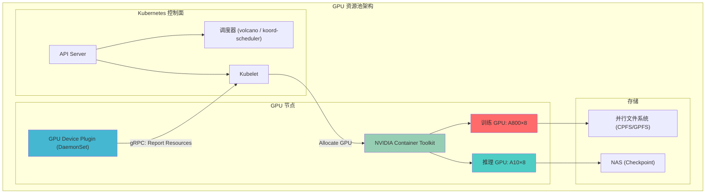

**Device Plugin 的局限性与突破**：标准 Device Plugin 只暴露数量信息（`nvidia.com/gpu`），无法传递拓扑（GPU 在哪个 NUMA node、哪些 GPU 共享 NVLink）。云知声通过 **Topology Manager** + **GPU Feature Discovery** 补充了节点级拓扑标签：

```yaml
# 节点标签示例（由 gpu-feature-discovery 自动注入）
labels:
  nvidia.com/gpu.product: "NVIDIA-A100-SXM4-80GB"
  nvidia.com/gpu.count: "8"
  nvidia.com/nvlink.topology: "ring-8"
  topology.kubernetes.io/zone: "zone-a"
```

这使得调度器可以在调度决策中感知"哪些 GPU 在同一 NVSwitch 域内"，从而实现拓扑感知调度。

### 5.2 容器化 GPU 部署

容器化 GPU 部署是 MaaS 平台的基石。云知声在百卡集群中采用 **NVIDIA GPU Operator** 实现自动化部署，替代了早期的手工配置。

#### 从手工到自动化的演进路径

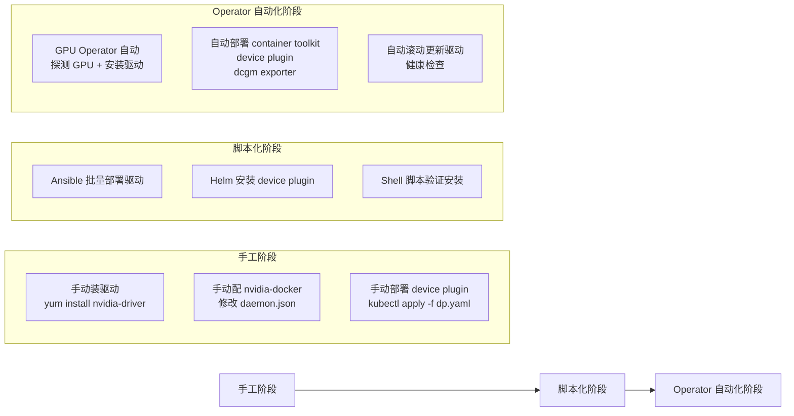

**GPU Operator 的核心组件**：

| 组件 | 作用 | 部署方式 |
|------|------|----------|
| **Node Feature Discovery** | 检测节点 GPU 型号、驱动版本、拓扑 | DaemonSet |
| **Driver Container** | 在容器中运行 NVIDIA 驱动，无需宿主机安装 | DaemonSet（特权） |
| **Container Toolkit** | 配置 containerd/docker 使用 nvidia 运行时 | DaemonSet |
| **GPU Device Plugin** | 向 Kubelet 注册 GPU 资源 | DaemonSet |
| **DCGM Exporter** | GPU 指标采集（温度、功耗、利用率、ECC） | DaemonSet + ServiceMonitor |
| **MIG Manager** | A100 的 MIG（多实例 GPU）切分管理 | DaemonSet |

**安装后的验证链路**：

```bash
# 1. 验证节点 GPU 资源已注册
kubectl describe node <gpu-node> | grep -A 5 "Allocatable:"
#   nvidia.com/gpu:     8

# 2. 验证 GPU Operator 组件健康
kubectl get pods -n gpu-operator --watch
#   NAME                          READY   STATUS
#   gpu-operator-xxxxx            1/1     Running
#   node-feature-discovery-xxxxx  1/1     Running
#   nvidia-driver-daemonset-xxxx  1/1     Running
#   nvidia-container-toolkit-xx   1/1     Running
#   nvidia-device-plugin-daemon   1/1     Running
#   dcgm-exporter-xxxxx           1/1     Running

# 3. 运行 GPU 验证 Pod
kubectl run cuda-vector-add --image=nvcr.io/nvidia/k8s/cuda-sample:vectoradd-cuda11.8
# 成功后输出：Result = PASS
```

**为什么选择 Operator 而非 Helm Chart 直接部署**？

GPU Operator 的核心价值在于**闭环管理**：它不仅安装组件，还持续监控驱动版本与内核版本的兼容性。当节点内核升级后，Operator 会自动重建 driver container，确保驱动可用。而 Helm Chart 是一次性部署，内核升级后需要手动干预。

### 5.3 调度策略：云知声五大原则

在 100 卡规模的训练集群中，默认调度器（kube-scheduler）的策略完全不够用。云知声引入了 **Volcano** 调度器（基于 Yunikorn 的早期版本迭代），并在此之上实现了五大调度策略。

#### 策略一：Gang Scheduling

**问题**：分布式训练需要所有 worker 同时就绪才能启动。如果调度器只调度了 7/8 个 worker，剩下的 1 个因资源不足被挂起，已调度的 7 个 worker 将无限等待——**资源被锁定但训练无法开始**。

**Gang Scheduling 的原理**：将一组 Pod（一个 PodGroup）视为一个原子调度单元。调度器对 PodGroup 进行"模拟调度"——先计算所有 Pod 是否能同时被调度到集群中，只有全部满足时才实际调度，否则一个都不调。

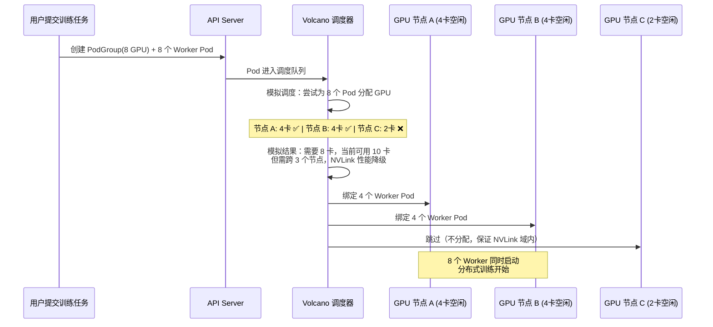

**Volcano PodGroup 配置**：

```yaml
apiVersion: scheduling.volcano.sh/v1beta1
kind: PodGroup
metadata:
  name: training-job-001
  namespace: maas
spec:
  minMember: 8          # 最小成员数，低于此数不调度
  minResources:         # 最小资源需求
    nvidia.com/gpu: 8
  queue: default
  scheduleTimeoutSeconds: 300  # 5 分钟超时，超时后释放已预留资源
```

#### 策略二：Binpack（装箱）

**问题**：多卡节点上，如果每个 Pod 只申请 1 张 GPU，调度器可能会将 4 个 Pod 分散到 4 个节点上（Spread 策略），导致每个节点都剩 7 张卡——**无法再调度需要 8 卡的训练任务**，形成"资源碎片"。

**Binpack 的策略**：优先将 Pod 调度到已部分使用的节点，填满一张卡再开下一张。这确保空闲节点保持完整可用。

#### 三大调度策略对比

| 策略 | 适用场景 | 资源利用率影响 | 调度延迟影响 | 风险 |
|------|----------|----------------|--------------|------|
| **Gang Scheduling** | 分布式训练（多 Pod 协同） | 可能短期降低利用率（等待齐套） | 增加调度延迟（模拟调度开销） | 超时后资源释放，任务需重试 |
| **Binpack** | 推理服务（单卡/少卡） | 提高碎片利用率，减少"碎片节点" | 无额外延迟 | 可能导致单节点过载 |
| **弹性 + 抢占** | 混合负载（高优 + 低优共存） | 最大化集群整体利用率 | 抢占造成低优任务中断 | 低优任务需支持断点续训 |

#### 策略三：弹性 + 抢占式调度

**核心机制**：将任务分为不同优先级队列。高优先级任务（如生产推理、核心训练）可抢占低优先级任务（如实验性训练、离线批处理）的资源。

```yaml
# 队列定义
apiVersion: scheduling.volcano.sh/v1beta1
kind: Queue
metadata:
  name: production-queue
spec:
  weight: 10
  reclaimable: true   # 允许回收资源
  capability:         # 最大资源上限
    nvidia.com/gpu: 64

---
apiVersion: scheduling.volcano.sh/v1beta1
kind: Queue
metadata:
  name: experimental-queue
spec:
  weight: 2
  reclaimable: true   # 可被高优队列抢占
  capability:
    nvidia.com/gpu: 36
```

**抢占流程**：当 production-queue 提交训练任务时，若资源不足，Volcano 会从 experimental-queue 中驱逐低优先级 Pod，释放 GPU 资源。被驱逐的 Pod 进入 Pending 状态，等待资源可用时重新调度。

> **关键要求**：被抢占的训练任务必须支持 Checkpoint 恢复，否则抢占将导致训练进度丢失。云知声要求所有进入 experimental-queue 的任务必须配置 `--resume` 参数。

#### 策略四：高性能区调度（NVLink + GPUDirect 优先）

**问题**：跨 PCIe 的 GPU 间通信带宽（~32 GB/s）远低于 NVLink（~900 GB/s × 8 links）。如果调度器不知道拓扑关系，可能将同一个训练的 worker 分散到不同 NVSwitch 域的 GPU 上。

**解决方案**：通过 **GPU Feature Discovery** 采集拓扑标签，调度器在调度时优先选择同一 NVSwitch 域内的 GPU。

```yaml
# Pod 调度约束：要求所有 GPU 在同一 NVSwitch 域
spec:
  affinity:
    nodeAffinity:
      requiredDuringSchedulingIgnoredDuringExecution:
        nodeSelectorTerms:
        - matchExpressions:
          - key: nvidia.com/nvlink.topology
            operator: In
            values: ["ring-8"]
```

#### 策略五：拓扑感知调度

**深层拓扑**不仅涉及 GPU 间通信，还涉及 **GPU ↔ CPU ↔ 网卡 ↔ 存储** 的 NUMA 亲和性。

```
NUMA Node 0                    NUMA Node 1
┌──────────────┐              ┌──────────────┐
│  CPU Cores   │              │  CPU Cores   │
│  0-15        │              │  16-31       │
├──────────────┤              ├──────────────┤
│  GPU 0 ──────┼── NVLink ───┼── GPU 1      │
│  GPU 2 ──────┼── NVLink ───┼── GPU 3      │
├──────────────┤              ├──────────────┤
│  NIC: mlx5_0 │              │  NIC: mlx5_1 │
│  NVMe: sda   │              │  NVMe: sdb   │
└──────────────┘              └──────────────┘
```

拓扑感知调度确保：训练 Pod 的 GPU 与网卡在同一 NUMA node 内，避免跨 NUMA 访问带来的延迟惩罚（典型延迟增加 40–80%）。

### 5.4 资源配额与弹性伸缩

#### 资源配额（Resource Quota）

```yaml
apiVersion: v1
kind: ResourceQuota
metadata:
  name: maas-gpu-quota
  namespace: maas-training
spec:
  hard:
    requests.nvidia.com/gpu: 64    # 训练队列最多 64 卡
    limits.nvidia.com/gpu: 64
    memory: 2Ti
    cpu: "512"
```

#### 弹性伸缩：Karpenter + Cluster Autoscaler

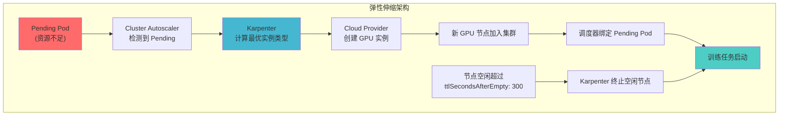

**伸缩策略的关键参数**：

| 参数 | 训练队列 | 推理队列 | 说明 |
|------|----------|----------|------|
| `minReplicas` | 16 | 4 | 最低保有 GPU 数 |
| `maxReplicas` | 64 | 36 | 最大弹性上限 |
| `scaleUpDelay` | 300s | 60s | 训练任务等待节点启动 |
| `scaleDownDelay` | 1800s | 300s | 训练节点保留更久 |
| `provisioner` | p4d.24xlarge (A100) | g5.xlarge (A10) | 云厂商 GPU 实例规格 |

---

## 六、训练体系

如果说资源管理是"硬件抽象层"，训练体系就是 MaaS 平台的"编译器和执行引擎"。云知声在 100×A800 集群上的实践，核心解决三个问题：**如何让 100 块 GPU 像一个 GPU 一样工作**、**如何保证训练不中断**、**如何让训练效率逼近硬件极限**。

### 6.1 分布式训练架构：3D 混合并行

当模型参数量超过单卡显存（70B 模型 ≈ 280 GB FP16，远超 A100 的 80 GB），就必须拆分模型到多卡。云知声采用 **3D 混合并行**：

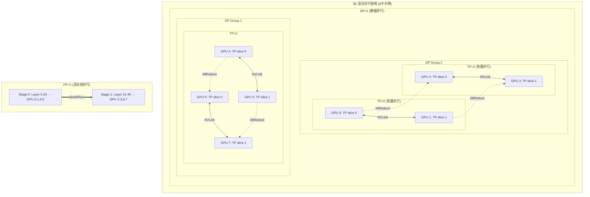

#### 数据并行（Data Parallelism, DP）

**原理**：每个 worker 持有完整的模型副本，处理不同的数据子集。每轮 forward/backward 后，通过 **AllReduce** 同步梯度。

**通信模式**：
```
GPU 0: grad=[g0]  ──┐
GPU 1: grad=[g1]  ──┼── AllReduce ──→ 每个 GPU 都拿到 avg(grad) = (g0+g1+...+gn)/n
GPU 2: grad=[g2]  ──┤
GPU 3: grad=[g3]  ──┘
```

**关键细节**：
- 通信量 = 模型参数量 × 数据类型大小（FP16 为 2 字节）。70B 模型每次 AllReduce 通信量 = 70B × 2 = 140 GB
- 使用 **Gradient Compression**（梯度压缩）可减少 60–80% 通信量
- **ZeRO-3**（DeepSpeed）进一步将优化器状态、梯度、参数全部分片，将 DP 的显存占用从 O(N) 降到 O(N/GPUs)

#### 张量并行（Tensor Parallelism, TP）

**原理**：将单层的矩阵运算拆到多卡。以 Linear 层 $Y = XW$ 为例，将 $W$ 按列拆分：$W = [W_1, W_2]$，则 $Y = [XW_1, XW_2]$，每张卡计算一部分。

**通信模式**：
- **Column Parallel**：forward 后需要 **AllGather** 拼接输出；backward 后需要 **ReduceScatter** 分配梯度
- **Row Parallel**：forward 后需要 **AllReduce** 合并输出；backward 后本地计算梯度

**关键约束**：TP 必须在 **同一 NVLink 域** 内的 GPU 上执行。跨 PCIe 的 TP 会使通信带宽下降 20–30×，训练效率急剧恶化。

#### 流水线并行（Pipeline Parallelism, PP）

**原理**：将模型按层切分到不同 stage，每个 stage 在一组 GPU 上执行。数据按 micro-batch 流过各个 stage。

**调度策略**（GPipe / PipeDream）：

```
Stage 0:  F0  F0  F1  F1  F2  F2  F3  F3  ...
Stage 1:      F0  F0  F1  F1  F2  F2  F3
Stage 2:          F0  F0  F1  F1  F2  F2
Stage 3:              F0  F0  F1  F1  F2

Stage 0:  ... B3  B3  B2  B2  B1  B1  B0  B0
Stage 1:  ... B3  B2  B2  B1  B1  B0  B0
Stage 2:  ... B2  B1  B1  B0  B0
Stage 3:  ... B0  B0
```

**Bubble 问题**：PP 的 pipeline bubble（气泡时间，即 stage 空闲等待的时间）与 stage 数量成正比。云知声的实践中，将 100 层模型切分为 4 个 stage（PP=4），每个 stage 25 层，bubble ratio 约 12%。

#### 3D 并行配置公式

```
总 GPU 数 = DP × TP × PP

例如 100×A800 集群训练 175B 模型：
  DP = 8（数据并行度）
  TP = 4（张量并行度，每 4 卡一个 NVLink 域）
  PP = 3（流水线并行度，模型切 3 段）
  
  8 × 4 × 3 = 96 卡（剩余 4 卡用于冗余/弹性）
```

#### 训练框架对比

| 框架 | DP 支持 | TP 支持 | PP 支持 | ZeRO | 多机多卡 | 容错 | 适用模型规模 |
|------|---------|---------|---------|------|----------|------|--------------|
| **PyTorch DDP** | ✅ | ❌ | ❌ | ❌ | ✅ | ❌ | < 10B |
| **PyTorch FSDP** | ✅ | ✅ | ❌ | ✅(ZeRO-3) | ✅ | 有限 | 10B–70B |
| **DeepSpeed** | ✅ | ✅ | ✅ | ✅(ZeRO-1/2/3) | ✅ | ✅(Elastic) | 全规模 |
| **Megatron-LM** | ✅ | ✅ | ✅ | ❌(自有实现) | ✅ | ❌ | 全规模 |
| **Colossal-AI** | ✅ | ✅ | ✅ | ✅(ZeRO) | ✅ | 有限 | 10B–100B+ |

云知声的选择：**DeepSpeed + Megatron-LM 混合方案**。DeepSpeed 负责 ZeRO 优化和弹性训练，Megatron-LM 负责 TP/PP 的高效实现。

#### FlashAttention 加速

**问题**：标准 Attention 的显存占用是 $O(N^2)$（$N$ 为序列长度），且需要存储中间 attention matrix 用于 backward。这导致长序列训练时显存爆炸。

**FlashAttention 的突破**：
1. **IO 感知算法**：直接在 SRAM 上计算 attention，避免将中间矩阵写入 HBM（GPU 高带宽显存）
2. **分块计算（Tiling）**：将大矩阵切为小块，在 SRAM 中完成计算
3. **重计算（Recomputation）**：backward 时重新计算 attention 矩阵，而非存储

```
显存对比（序列长度 4096，batch=32）：
  标准 Attention:    ~12 GB (attention matrix 存储)
  FlashAttention 2:  ~1.5 GB (不存储中间矩阵)
  加速比:             2–4× (端到端训练)
```

云知声在 100 卡训练中启用 FlashAttention 2 后，训练吞吐量从 120 tokens/s/GPU 提升到 280 tokens/s/GPU，提升约 2.3×。

### 6.2 多机多卡部署

#### SSH 免密互联

多机多卡训练需要节点间无密码 SSH，用于 DeepSpeed/Megatron 的远程进程启动。云知声通过 Kubernetes Secret 管理 SSH 密钥：

```yaml
# 1. 生成 SSH 密钥对（管理节点）
ssh-keygen -t rsa -b 4096 -f ~/.ssh/training_key -N ""

# 2. 将公钥注入所有 GPU 节点的 authorized_keys
for node in $(kubectl get nodes -l gpu-type=a100 -o name); do
  kubectl exec -n kube-system ds/nvidia-driver -- \
    sh -c "echo '$(cat ~/.ssh/training_key.pub)' >> /root/.ssh/authorized_keys"
done

# 3. 将私钥存入 Kubernetes Secret
kubectl create secret generic training-ssh-key \
  --from-file=id_rsa=~/.ssh/training_key \
  --from-file=id_rsa.pub=~/.ssh/training_key.pub \
  -n maas-training
```

**安全加固**：
- SSH 密钥不落地到镜像中，通过 Secret 挂载到 Pod 的 `/etc/ssh` 目录
- 训练结束后自动清理 authorized_keys（通过 Init Container 实现）
- 使用 `StrictHostKeyChecking=no` 配合已知主机列表，防止中间人攻击

#### Launch + Worker 模式

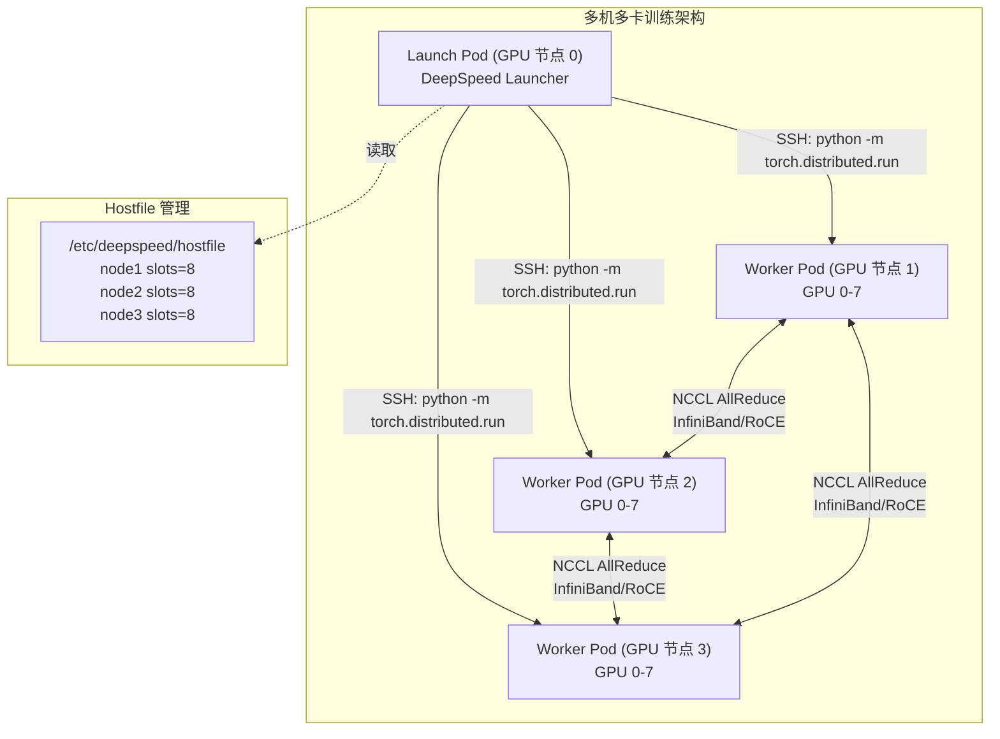

**Hostfile 生成**：

```bash
# 自动生成 hostfile（由 Init Container 执行）
kubectl get pods -l job=training-001,role=worker \
  -o custom-columns='NODE:.spec.nodeName' --no-headers | \
  sort | uniq -c | awk '{print $2, "slots="$1}' > /etc/deepspeed/hostfile

# 输出示例：
# gpu-node-1 slots=8
# gpu-node-2 slots=8
# gpu-node-3 slots=8
```

#### DeepSpeed 多机多卡运行

```bash
# DeepSpeed Launcher 命令
deepspeed --hostfile=/etc/deepspeed/hostfile \
  --master_port=29500 \
  --num_gpus=8 \
  training_script.py \
  --deepspeed \
  --deepspeed_config ds_config.json
```

**ds_config.json 关键配置**：

```json
{
  "train_batch_size": 1024,
  "gradient_accumulation_steps": 8,
  "fp16": {
    "enabled": true,
    "loss_scale": 0,
    "initial_scale_power": 16
  },
  "zero_optimization": {
    "stage": 3,
    "offload_optimizer": {
      "device": "nvme",
      "nvme_path": "/mnt/nvme/zeRO"
    },
    "allgather_bucket_size": 5e8,
    "reduce_bucket_size": 5e8
  },
  "activation_checkpointing": {
    "partition_activations": true,
    "cpu_checkpointing": false
  },
  "wall_clock_breakdown": true,
  "steps_per_print": 10
}
```

**分布式训练软件包分发**：DeepSpeed 通过 hostfile 和 SSH 将训练代码分发到所有 worker。云知声的实践是将训练代码打包为容器镜像，所有 worker 使用同一镜像版本，避免代码不一致导致的诡异 bug。

### 6.3 训练容错与稳定性

在 100 卡规模的集群中，**故障是常态，不是异常**。统计上，100 块 GPU 连续运行 30 天，至少会发生 2–3 次 GPU ECC 错误、1 次驱动崩溃、0.5 次网络闪断。训练系统必须假设故障必然发生。

#### 小规模验证 → 大规模训练

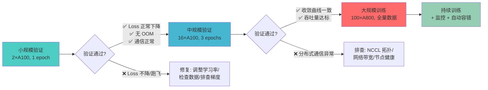

**小规模验证检查清单**：

| 检查项 | 通过标准 | 失败处理 |
|--------|----------|----------|
| Loss 下降 | 前 100 step loss 单调下降 | 检查学习率 warmup、数据采样、梯度裁剪 |
| OOM | 2 卡运行不爆显存 | 减小 batch size、启用 ZeRO-3、检查显存泄漏 |
| 通信正确 | NCCL AllReduce 延迟 < 1ms (NVLink 域内) | 检查 NVLink 拓扑、GPU 隔离、NCCL 环境变量 |
| 数据一致性 | 2 卡 DDP loss 与 1 卡完全一致 | 检查 random seed、数据 shuffle、分布式采样器 |

#### 模型 Checkpoint 保存间隔

**核心矛盾**：Checkpoint 越频繁，故障恢复时损失越小，但 I/O 开销越大；Checkpoint 越稀疏，I/O 开销越小，但故障后可能丢失数小时的训练进度。

云知声的策略（基于 100 卡 A800 实践）：

| 训练阶段 | Checkpoint 间隔 | 单个 Checkpoint 大小 | I/O 耗时 | 恢复时间 |
|----------|-----------------|----------------------|----------|----------|
| 预训练初期 | 每 500 steps | ~140 GB (175B 模型) | ~3 min (CPFS) | ~5 min |
| 预训练中期 | 每 1000 steps | ~140 GB | ~3 min | ~5 min |
| SFT 微调 | 每 200 steps | ~140 GB | ~3 min | ~5 min |
| 收敛阶段 | 每 100 steps + 每个 epoch 结束 | ~140 GB | ~3 min | ~5 min |

**I/O 优化**：
- 使用 **并行文件系统**（CPFS/GPFS/Lustre），多客户端并发写入，吞吐 > 10 GB/s
- Checkpoint 异步保存：主训练进程继续 forward/backward，后台进程将数据刷到存储
- 增量 Checkpoint：仅保存 optimizer state 的 delta（DeepSpeed ZeRO 支持）

#### 监控 Loss 下降曲线，避免梯度跑飞

```mermaid
graph TB
    subgraph "训练稳定性监控体系"
        TC["训练进程"] -->|每 step 上报| Met["指标采集<br/>(Prometheus)"]
        Met -->|时序存储| TSDB["TSDB"]
        TSDB -->|Grafana 可视化| Dash["监控看板"]
        
        Met -->|阈值告警| AM["AlertManager"]
        AM -->|触发| Rule1["Loss 突增 > 10×<br/>→ 告警 + 自动降级学习率"]
        AM -->|触发| Rule2["Loss = NaN/Inf<br/>→ 停止训练 + 告警"]
        AM -->|触发| Rule3["GPU 温度 > 85°C<br/>→ 降频 + 告警"]
        AM -->|触发| Rule4["NCCL 通信超时<br/>→ 隔离节点 + 恢复"]
        
        Dash -->|可视化| Curve["Loss 曲线"]
        Dash -->|可视化| GPU["GPU 利用率/显存/温度"]
        Dash -->|可视化| Net["网络带宽/延迟"]
    end
    
    style TC fill:#ff6b6b
    style AM fill:#ffd93d
    style Dash fill:#4ecdc4
```

**梯度跑飞（Gradient Explosion）的典型模式**：

```
正常的 Loss 曲线:
  step 0     → loss = 12.5
  step 100   → loss = 8.3
  step 200   → loss = 5.1
  step 300   → loss = 3.2
  step 400   → loss = 2.1
  step 500   → loss = 1.5  ← 稳定下降

梯度跑飞:
  step 0     → loss = 12.5
  step 100   → loss = 8.3
  step 200   → loss = 5.1
  step 250   → loss = 125.0  ← 突增 25×
  step 251   → loss = inf    ← NaN/Inf
  step 252   → loss = nan    ← 训练崩溃
```

**自动防护机制**：

```python
# Gradient Clipping（防止梯度爆炸）
torch.nn.utils.clip_grad_norm_(model.parameters(), max_norm=1.0)

# Loss 监控自动降级
if current_loss > prev_loss * 10:
    # 自动降低学习率
    optimizer.param_groups[0]['lr'] *= 0.1
    logger.warning(f"Loss spike detected at step {step}. "
                   f"Reducing LR to {optimizer.param_groups[0]['lr']}")
    
# NaN/Inf 检测
if torch.isnan(loss) or torch.isinf(loss):
    # 从最近 Checkpoint 恢复，跳过问题 batch
    checkpoint = load_checkpoint("latest")
    model.load_state_dict(checkpoint['model_state'])
    optimizer.load_state_dict(checkpoint['optimizer_state'])
    logger.error(f"NaN detected at step {step}. Resuming from checkpoint.")
```

云知声在实践中发现，**约 15% 的大规模训练任务会遭遇至少一次梯度跑飞**。其中 80% 通过自动降低学习率可恢复，20% 需要从 Checkpoint 恢复并跳过问题数据 batch。

---

## 七、推理服务

训练产出的模型必须转化为可用的推理服务。推理与训练的本质差异在于：**训练是吞吐导向（追求 GPU 利用率最大化），推理是延迟导向（追求首 Token 时间最短）**。

### 7.1 部署策略

#### 蓝绿部署

模型服务的蓝绿部署与传统的 Web 服务蓝绿部署不同——模型服务有**显存预热**和**KV Cache 初始化**的特殊需求。

```mermaid
sequenceDiagram
    participant User as 客户端请求
    participant LB as 负载均衡器
    participant Blue as 蓝环境<br/>(Model v1.0, A100×4)
    participant Green as 绿环境<br/>(Model v1.1, A100×4)
    participant Mon as 监控 (Prometheus + Grafana)

    User->>LB: 请求 (全部路由到 Blue)
    LB->>Blue: 转发请求
    
    Note over Green: 部署新模型 v1.1<br/>1. 加载模型权重<br/>2. KV Cache 预热<br/>3. 健康检查通过
    
    Green->>Mon: 就绪信号
    Mon->>Mon: 金丝雀验证: 5% 流量切到 Green
    
    LB->>Green: 转发 5% 请求
    LB->>Blue: 转发 95% 请求
    
    Green->>Mon: 延迟 < 100ms, 错误率 < 0.1%
    Mon->>Mon: ✅ 指标正常
    
    Note over LB: 全量切换: 100% → Green
    LB->>Green: 转发 100% 请求
    LB-xBlue: 停止转发（保留 30 min 可回滚）
```

**蓝绿部署的关键细节**：

| 阶段 | 操作 | 耗时 | 注意事项 |
|------|------|------|----------|
| **绿环境启动** | 加载模型权重到 GPU 显存 | 30s–5min（取决于模型大小） | 预热 KV Cache，否则首批请求延迟极高 |
| **健康检查** | 发送探测请求，验证 P50/P99 延迟 | 1–3 min | 使用真实请求 pattern，而非简单 HTTP ping |
| **金丝雀验证** | 切 5% 流量到绿环境 | 5–15 min | 监控延迟分布、错误率、GPU 利用率 |
| **全量切换** | 修改负载均衡规则 | < 1s | 保留蓝环境 30 min，支持快速回滚 |
| **蓝环境回收** | 释放 GPU 资源 | 立即 | 延迟 30 min 确保无需回滚 |

#### 高可用：负载均衡 + 熔断

```yaml
# Istio VirtualService 配置
apiVersion: networking.istio.io/v1beta1
kind: VirtualService
metadata:
  name: inference-vs
  namespace: maas-inference
spec:
  hosts:
  - inference-service.maas.svc.cluster.local
  http:
  - route:
    - destination:
        host: inference-service
        subset: v1
      weight: 100
    retries:
      attempts: 3
      perTryTimeout: 5s
      retryOn: 5xx,connect-failure,refused-stream
    timeout: 30s
    fault:
      delay:
        percentage:
          value: 0.1
        fixedDelay: 1s
```

**熔断策略**：

```yaml
# Istio DestinationRule 熔断配置
apiVersion: networking.istio.io/v1beta1
kind: DestinationRule
metadata:
  name: inference-dr
spec:
  host: inference-service
  trafficPolicy:
    connectionPool:
      tcp:
        maxConnections: 100
      http:
        h2UpgradePolicy: DEFAULT
        http1MaxPendingRequests: 100
        http2MaxRequests: 1000
    outlierDetection:
      consecutive5xxErrors: 5      # 连续 5 次 5xx 错误
      interval: 30s                # 检测间隔
      baseEjectionTime: 60s        # 熔断后隔离 60 秒
      maxEjectionPercent: 50       # 最多隔离 50% 的实例
```

### 7.2 性能优化

#### 量化

量化的本质是在精度和性能之间做 trade-off。不同的量化策略对模型质量的影响不同。

| 量化策略 | 精度 | 显存占用 (7B 模型) | 推理速度提升 | 质量损失 | 适用场景 |
|----------|------|-------------------|--------------|----------|----------|
| **FP16** | 16-bit float | 14 GB | 基准 (1×) | 无 | 生产推理基准 |
| **INT8** | 8-bit integer | 7 GB | 1.5–2× | < 1% PPL | 大多数生产场景 |
| **FP8** | 8-bit float (E4M3/E5M2) | 7 GB | 2–3× (H100) | < 0.5% PPL | H100 集群首选 |
| **INT4 (GPTQ)** | 4-bit integer | 3.5 GB | 2–4× | 1–3% PPL | 显存受限场景 |
| **AWQ** | 4-bit (activation-aware) | 3.5 GB | 3–5× | 1–2% PPL | 显存受限 + 高质量 |

**云知声的量化策略选择**：

```
H100 集群 → FP8（原生硬件支持，几乎无损）
A100 集群 → INT8（PTQ，离线量化，快速部署）
A10/L4   → INT4 (GPTQ/AWQ)（显存受限，必须量化）
```

#### 算子加速

**核心加速技术**：

| 技术 | 原理 | 加速效果 | 支持框架 |
|------|------|----------|----------|
| **FlashAttention** | IO 感知的 attention 计算 | 2–4× (推理 decode 阶段) | vLLM, TGI, TensorRT-LLM |
| **PagedAttention** | 将 KV Cache 分页管理，类似 OS 虚拟内存 | 减少显存碎片 80%+ | vLLM |
| **Continuous Batching** | 动态 batch 管理，不等所有请求凑满 | 吞吐量提升 3–5× | vLLM, TGI |
| **Tensor Parallel** | 模型切分到多 GPU | 单请求延迟降低 N× (N=GPU 数) | 所有框架 |
| **Speculative Decoding** | 用小模型预测 token，大模型验证 | 2–3× (对重复性高的内容) | vLLM, TGI |

**PagedAttention 的核心洞察**：

传统推理框架为每个请求预分配固定大小的 KV Cache 显存，导致严重的显存浪费（类似操作系统的内存碎片）。PagedAttention 将 KV Cache 切分为固定大小的 Block（如 16 tokens/block），按需分配。这使得同时服务的并发请求数提升 2–4×。

### 7.3 多推理框架支持 & 分布式推理

```mermaid
graph TB
    subgraph "多推理框架统一网关"
        Client["API 客户端<br/>OpenAI 兼容接口"]
        Gateway["推理网关<br/>(Kong / Envoy)"]
        
        subgraph "vLLM 集群 (主力)"
            vLLM1["vLLM Pod × 4<br/>Llama-3-70B"]
            vLLM2["vLLM Pod × 2<br/>Qwen2.5-72B"]
        end
        
        subgraph "TGI 集群"
            TGI1["TGI Pod × 2<br/>Llama-2-13B"]
        end
        
        subgraph "TensorRT-LLM 集群"
            TRT1["TRT-LLM Pod × 4<br/>Llama-3-70B (FP8)"]
        end
        
        Client --> Gateway
        Gateway -->|路由: Llama-3-70B| vLLM1
        Gateway -->|路由: Qwen2.5-72B| vLLM2
        Gateway -->|路由: Llama-2-13B| TGI1
        Gateway -->|路由: 高性能场景| TRT1
    end
    
    subgraph "框架选择决策树"
        Decision{"模型大小 > 30B<br/>且部署在 H100?"}
        Decision -->|是| TRT["TensorRT-LLM (FP8)"]
        Decision -->|否| Decision2{"需要最高<br/>吞吐量?"}
        Decision2 -->|是| vLLM["vLLM (PagedAttention)"]
        Decision2 -->|否| TGI["TGI (HuggingFace 生态)"]
    end
    
    style vLLM1 fill:#ff6b6b
    style TRT1 fill:#4ecdc4
    style TGI1 fill:#45b7d1
    style Gateway fill:#96ceb3
```

#### 推理框架对比

| 框架 | 核心优势 | 核心劣势 | 最佳适用场景 | 分布式推理 |
|------|----------|----------|--------------|------------|
| **vLLM** | PagedAttention、吞吐量最高、Continuous Batching | 对冷门模型支持较慢 | 高吞吐生产推理 | Tensor Parallel + Pipeline Parallel |
| **TGI** | HuggingFace 生态集成最好、部署最简单 | 显存管理不如 vLLM 高效 | 快速原型验证、中小模型 | Tensor Parallel |
| **TensorRT-LLM** | NVIDIA 原生优化、FP8 硬件加速 | 仅支持 NVIDIA GPU、模型转换复杂 | H100 集群高性能推理 | Tensor Parallel + Pipeline Parallel |
| **DeepSpeed-MII** | 与 DeepSpeed 生态统一 | 社区活跃度较低 | DeepSpeed 训练 → 推理一体化 | ZeRO-Inference |
| **SGLang** | 结构化输出、RadixAttention KV Cache 复用 | 相对较新 | 工具调用、Function Calling | Tensor Parallel |

#### 分布式推理

当模型无法放入单张 GPU 显存时，需要**分布式推理**：

```
Llama-3-70B (FP16) = 140 GB
单卡 A100 80GB → 放不下
两卡 A100 80GB → 每张卡 70GB (TP=2)，可行
```

**Tensor Parallel 推理的通信开销**：
- 每个 token 的生成需要一次 AllReduce（在 TP group 内）
- TP=2 时，AllReduce 通信量 ≈ 模型参数量 × 2 bytes = 140 GB（但实际只传输 attention 输出，约数 MB）
- 关键在于：AllReduce 必须在 NVLink 域内执行，否则跨 PCIe 的通信延迟会使生成速度下降 5–10×

### 7.4 并发控制与延迟优化

#### 延迟拆解

```
首 Token 延迟 (TTFT) = 模型加载时间 + 排队时间 + Prefill 时间
生成延迟 (TPOT)    = Decode 时间 per token
总延迟            = TTFT + TPOT × 生成 token 数
```

| 延迟阶段 | 典型耗时 (7B 模型, A100) | 优化手段 |
|----------|--------------------------|----------|
| **模型加载** | 10–30s | 预加载到显存，服务启动后保持常驻 |
| **Prefill** | 20–100ms (1K tokens) | FlashAttention, 批量 Prefill |
| **Decode (per token)** | 5–20ms | PagedAttention, Continuous Batching |
| **排队等待** | 0–500ms (取决于队列长度) | 增加副本，限制最大并发 |

#### 并发控制策略

```yaml
# Kubernetes HPA + 自定义指标
apiVersion: autoscaling/v2
kind: HorizontalPodAutoscaler
metadata:
  name: inference-hpa
spec:
  scaleTargetRef:
    apiVersion: apps/v1
    kind: Deployment
    name: inference-service
  minReplicas: 2
  maxReplicas: 10
  metrics:
  - type: Pods
    pods:
      metric:
        name: inference_queue_length
      target:
        type: AverageValue
        averageValue: "5"   # 当平均排队请求 > 5 时扩容
  - type: Pods
    pods:
      metric:
        name: inference_p99_latency
      target:
        type: AverageValue
        averageValue: "200"  # P99 延迟 > 200ms 时扩容
```

**请求限流**：

```
全局限流: 1000 RPM (Requests Per Minute)
用户限流: 100 RPM per user
并发控制: max_batch_size = 256 (vLLM 配置)
超时控制: 生成超时 30s，超时后返回已生成内容 + truncated 标记
```

---

## 八、数据工程

DDIA 的核心洞察之一是：**数据系统的性能瓶颈往往不在计算，而在数据移动**。在 MaaS 平台中，训练数据的预处理、存储和版本管理，直接决定了训练效率的上限。

### 8.1 数据预处理（Spark）

大语言模型的训练数据通常来自 PB 级的原始文本（Common Crawl、Wikipedia、GitHub 等），需要经历清洗、去重、分词等预处理步骤。

```mermaid
graph TB
    subgraph "原始数据源"
        CC["Common Crawl<br/>(PB 级 WARC)"]
        Wiki["Wikipedia<br/>多语言 dump"]
        GH["GitHub Code<br/>代码仓库"]
        BK["Books<br/>电子书"]
    end
    
    subgraph "Spark 预处理集群"
        Spark["Spark Driver"]
        
        subgraph "Stage 1: 清洗"
            S1_1["HTML 标签去除"]
            S1_2["低质量页面过滤<br/>(perplexity > threshold)"]
            S1_3["语言检测 (fastText)"]
            S1_4["PII 脱敏"]
        end
        
        subgraph "Stage 2: 去重"
            S2_1["URL 级去重 (MinHash + LSH)"]
            S2_2["段落级去重<br/>(SimHash)"]
            S2_3["近重复检测"]
        end
        
        subgraph "Stage 3: 分词"
            S3_1["Tokenizer 应用<br/>(SentencePiece / tiktoken)"]
            S3_2["序列打包 (packing)"]
            S3_3["生成索引文件"]
        end
    end
    
    subgraph "预处理输出"
        Parquet["Parquet 文件<br/>(分片存储)"]
        Index["数据索引<br/>(Elasticsearch)"]
    end
    
    CC --> S1_1
    Wiki --> S1_2
    GH --> S1_3
    BK --> S1_4
    
    S1_1 --> S2_1
    S1_2 --> S2_2
    S1_3 --> S2_3
    S1_4 --> S2_3
    
    S2_1 --> S3_1
    S2_2 --> S3_1
    S2_3 --> S3_1
    
    S3_1 --> S3_2
    S3_2 --> S3_3
    
    S3_3 --> Parquet
    S3_3 --> Index
    
    style Spark fill:#45b7d1
    style Parquet fill:#4ecdc4
    style Index fill:#96ceb3
```

**Spark 数据预处理的关键参数**：

```python
# Spark 配置 (针对 PB 级数据处理)
conf = SparkConf()
conf.set("spark.executor.instances", "200")
conf.set("spark.executor.cores", "16")
conf.set("spark.executor.memory", "64g")
conf.set("spark.sql.adaptive.enabled", "true")           # AQE 自动优化
conf.set("spark.sql.adaptive.coalescePartitions.enabled", "true")
conf.set("spark.sql.shuffle.partitions", "4000")          # 匹配数据量
conf.set("spark.serializer", "org.apache.spark.serializer.KryoSerializer")
```

**数据质量过滤标准**：

| 过滤规则 | 阈值 | 去除比例 |
|----------|------|----------|
| 文本长度 | < 200 字符 | ~25% |
| 语言检测 (非目标语言) | confidence < 0.9 | ~30% |
| Perplexity (gpt2-xl) | > 5000 | ~15% |
| 重复段落比例 | > 40% | ~10% |
| PII 检测到 | any match | ~2% |

### 8.2 数据湖底座

**核心原则**：**避免多次数据流转**。DDIA 明确指出，数据每多经过一次系统，就多一份不一致的风险、多一次 I/O 开销、多一层运维复杂度。

云知声采用**统一数据湖底座**的方案：

```
原始数据 → Spark 清洗 → Parquet 存储 → 训练直接读取
           ↓                              ↑
         质量报告 ────────────────────── 数据版本索引
```

**存储层级设计**：

| 层级 | 存储类型 | 用途 | 成本 | 访问延迟 |
|------|----------|------|------|----------|
| **Hot** | NVMe SSD 本地盘 | 当前训练任务的活跃数据 | 高 | < 1ms |
| **Warm** | 并行文件系统 (CPFS) | 最近 30 天的预处理数据 | 中 | 5–20ms |
| **Cold** | 对象存储 (S3/OSS) | 历史数据、归档版本 | 低 | 100ms–s 级 |

**为什么选择 Parquet**：
1. **列式存储**：训练时通常只需要 tokenized 数据列，无需加载原始文本
2. **谓词下推**：可按日期/语言/数据源过滤，减少 I/O
3. **Spark/Pandas/Direct PyTorch** 原生支持
4. **压缩比高**：Snappy 压缩后约为原始文本的 30–40%

```python
# PyTorch DataLoader 直接读取 Parquet
from torchdata.datapipes.iter import ParquetDataLoader

train_datapipe = ParquetDataLoader(
    root="/mnt/cpfs/training-data/",
    pattern="**/2024-06-*.parquet",
    columns=["input_ids", "attention_mask", "labels"]
)

# 数据直接在 GPU 节点本地读取（通过并行文件系统挂载）
# 无需额外的数据拷贝或转换步骤
```

### 8.3 数据集版本管理与缓存

```mermaid
graph TB
    subgraph "数据集版本管理"
        Raw["原始数据<br/>v1.0"] --> Process["Spark 预处理<br/>Pipeline v2.1"]
        Process --> Dataset["训练数据集<br/>v3.0"]
        
        Dataset -->|注册| Registry["数据集注册中心<br/>(元数据 + 哈希)"]
        
        Registry --> T1["训练任务 T1<br/>引用 dataset@v3.0"]
        Registry --> T2["训练任务 T2<br/>引用 dataset@v3.0"]
        Registry --> T3["训练任务 T3<br/>引用 dataset@v3.1"]
        
        Dataset --> Cache["数据缓存层<br/>(NVMe SSD)"]
        Cache --> T1
        Cache --> T2
    end
    
    subgraph "版本链"
        V1["v1.0: 2024-01 数据"] --> V2["v2.0: 2024-03 数据<br/>(+10TB CommonCrawl)"]
        V2 --> V3["v3.0: 2024-06 数据<br/>(+ 代码数据 + 质量过滤改进)"]
        V3 --> V4["v3.1: hotfix<br/>(修复 PII 脱敏规则)"]
    end
    
    style Registry fill:#45b7d1
    style Cache fill:#ff6b6b
```

**版本管理核心设计**：

| 设计要素 | 实现方式 | 解决什么问题 |
|----------|----------|--------------|
| **不可变性** | 数据集一旦创建，内容不可修改 | 训练可复现性 |
| **内容寻址** | SHA-256 哈希标识数据集 | 避免同名不同内容的混淆 |
| **增量版本** | diff + merge 机制 | 减少全量重建成本 |
| **元数据注册** | 数据大小、行数、分词器版本、预处理 pipeline 版本 | 训练任务自动验证数据兼容性 |
| **缓存层** | NVMe SSD 缓存热数据，LRU 淘汰 | 减少重复训练时的数据读取开销 |

**缓存策略**：

```yaml
# 数据缓存配置
cache:
  storage: "/mnt/nvme/data-cache"
  max_size: "10TB"
  eviction_policy: "LRU"
  prefetch:
    enabled: true
    # 当训练任务引用 dataset@v3.0 时，
    # 自动将关联的 v2.0 也加载到缓存（可能用于对比实验）
    related_versions: 1
  
  # 缓存命中统计
  metrics:
    hit_rate: "85%"       # 当前缓存命中率
    miss_penalty: "15min" # 未命中时的数据加载耗时
```

**数据版本元数据示例**：

```json
{
  "dataset_id": "maas-corpus-zh-2024",
  "version": "v3.0",
  "created_at": "2024-06-15T08:00:00Z",
  "content_hash": "sha256:a1b2c3d4...",
  "total_tokens": "2.5T",
  "total_size": "8.5TB",
  "tokenizer": "qwen2.5-tokenizer",
  "preprocessing_pipeline": "v2.1",
  "sources": {
    "common_crawl_zh": "3.2TB",
    "wikipedia_zh": "150GB",
    "github_code_zh": "800GB",
    "books_zh": "1.2TB"
  },
  "quality_metrics": {
    "avg_perplexity": 850,
    "dup_ratio": 0.03,
    "pii_filtered": "2.1%"
  },
  "compatible_models": ["qwen2.5-7b", "qwen2.5-72b", "llama3-70b"]
}
```

---

> **Part 2 小结**：计算资源管理、训练体系、推理服务与数据工程构成了 MaaS 平台的核心支柱。云知声的百卡实践表明：**GPU 集群的本质不是硬件堆叠，而是在不确定性（故障、碎片、通信瓶颈）中寻找确定性的系统工程**。下一部分将深入模型管理、评测体系、安全治理与运维保障。


---

# 第三部分：稳定性、可观测性与安全

> *"构建一个 100 节点 GPU 集群的难度不在于把节点连起来，而在于让它们持续可靠地运行。" —— 分布式系统工程师的共识*

在万卡集群成为行业焦点的今天，一个由 100 节点（约 800-1600 张 GPU）构成的 MaaS 平台仍然有其独特的挑战：它不够大到拥有无限冗余预算，又不够小到可以容忍任何节点掉线。这个规模下的稳定性工程，本质上是在 **成本约束** 和 **可用性要求** 之间做最优决策。

本章覆盖三个维度：稳定性与高可用架构、可观测性体系、安全体系。这三者构成平台运维的铁三角——没有可观测性的稳定性是盲目的，没有安全性的稳定性是脆弱的。

---

## 九、稳定性与高可用（九字方针）

云知声在构建其大模型训练平台时，提炼出一套 **"冗余、隔离、自愈"** 的九字方针。这一方针不是理论推导的产物，而是在数百次训练中断和硬件故障中总结出来的经验法则。它的核心逻辑是：**故障不是异常，故障是常态**。在 100 节点规模下，硬件故障的概率遵循浴盆曲线的早期失效期规律——新设备上线前三个月，失效率约为 2-5%/月；运行一年后的设备，失效率降至 0.5-1%/月。

### 9.1 硬件层稳定性

#### 9.1.1 管理网/计算网/存储网络冗余

GPU 集群的网络拓扑决定了稳定性的基线。100 节点规模推荐采用 **三网分离** 架构：

| 网络平面 | 用途 | 带宽 | 冗余策略 | 协议 |
|---------|------|------|---------|------|
| 管理网 | K8s API/SSH/监控 | 10GbE × 2 (LACP) | 双网卡绑定 + 双交换机 | TCP/IP |
| 计算网 | NCCL/RDMA 通信 | 400GbE (InfiniBand 或 RoCE) | 双 Rail + 冗余链路 | NCCL over IB/RoCEv2 |
| 存储网 | 数据读写 | 100GbE | 多路径 IO + 冗余交换机 | NFS/RDMA/NVMe-oF |

管理网采用 LACP (802.3ad) 双网卡绑定，提供链路级冗余：当单条链路中断时，MAC 层在 100ms 级别完成切换，对上层协议透明。计算网采用 NVIDIA 推荐的 Rail-Optimized 拓扑，每个 GPU 的 RDMA 通道连接到不同的交换机（Rail），单链路故障不影响全局 AllReduce 通信——这是 NCCL 2.17+ 内置的拓扑感知能力。

```mermaid
graph TB
    subgraph "管理网 Management Network"
        M1[交换机 A 10GbE] --- M2[交换机 B 10GbE]
        M3[控制节点] ---|LACP| M1
        M3 ---|LACP| M2
        N1[计算节点 1-50] ---|LACP| M1
        N1 ---|LACP| M2
        N2[计算节点 51-100] ---|LACP| M1
        N2 ---|LACP| M2
    end

    subgraph "计算网 Compute Network"
        C1[IB/RoCE 交换机 Rail-0]
        C2[IB/RoCE 交换机 Rail-1]
        C3[IB/RoCE 交换机 Rail-2]
        C4[IB/RoCE 交换机 Rail-3]
        G1[GPU 0-3] ---|400G| C1
        G2[GPU 4-7] ---|400G| C2
        G3[GPU 0-3] ---|400G| C3
        G4[GPU 4-7] ---|400G| C4
    end

    subgraph "存储网 Storage Network"
        S1[存储交换机 A 100GbE] --- S2[存储交换机 B 100GbE]
        S3[存储集群] ---|MPIO| S1
        S3 ---|MPIO| S2
        N3[计算节点] ---|MPIO| S1
        N3 ---|MPIO| S2
    end

    style M1 fill:#e1f5fe
    style M2 fill:#e1f5fe
    style C1 fill:#fff3e0
    style C2 fill:#fff3e0
    style C3 fill:#fff3e0
    style C4 fill:#fff3e0
    style S1 fill:#e8f5e9
    style S2 fill:#e8f5e9
```

#### 9.1.2 GPU 冗余与故障切换

GPU 是集群中最昂贵也是最容易出故障的组件。根据 NVIDIA 生产环境数据，A100/H100 在持续满载训练时的常见故障模式包括：

- **ECC 错误**：单比特错误（SBE）可自动纠正，双比特错误（DBE）导致 GPU 进入 Xid 79/43 状态并挂起
- **NVLink 链路降级**：链路从 50Gbps 降至 25Gbps，导致 AllReduce 带宽下降 50%
- **GPU 掉卡**：驱动崩溃导致 GPU 从 `nvidia-smi` 中消失（Xid 31/48/63）

云知声的实践是在训练框架层实现 **GPU 级热替换**：

1. **Xid 错误检测**：通过 `nvidia-smi -q -d ERRORS` 实时监控 ECC 计数，当 SBE 累积超过阈值（如 100 次/小时）时主动标记 GPU 为 "亚健康"
2. **训练检查点保存**：检测到 GPU 异常后立即触发 Checkpoint，利用 `torch.distributed.barrier()` 协调所有 Rank
3. **节点替换**：K8s 将故障节点标记为 `Unschedulable`，调度器在新的健康节点上拉起 Training Job
4. **从 Checkpoint 恢复**：PyTorch FSDP/DeepSpeed 从最新 Checkpoint 恢复训练状态

```mermaid
sequenceDiagram
    participant M as 监控 Agent
    participant D as GPU Driver (nvidia-smi)
    participant T as 训练框架 (PyTorch/DeepSpeed)
    participant K as K8s Controller
    participant C as 存储 (Checkpoint)

    M->>D: 定期查询 Xid 错误计数
    D-->>M: Xid 79 检测到 DBE
    M->>T: 发送 SIGUSR1 信号
    T->>T: 触发紧急 Checkpoint
    T->>C: 保存训练状态 (Rank 0-7)
    T->>K: 报告训练中断
    K->>K: 标记节点 Unscheduleable
    K->>K: 新节点分配资源
    K->>T: 在健康节点恢复训练
    T->>C: 加载最新 Checkpoint
    T->>T: 恢复训练循环
```

#### 9.1.3 存储多副本 + 回收站

存储层采用 **CEPH 多副本 + 回收站** 策略。CEPH 的 CRUSH 算法保证数据分布的均衡性和容错性：

- **三副本策略**：每个数据块分布在不同的 OSD 上，允许同时故障 2 个 OSD 而不丢数据
- **EC 编码（可选）**：对于冷数据（如历史训练日志），采用 4+2 Erasure Coding，存储开销从 3x 降至 1.5x
- **回收站机制**：`/data/` 目录启用 CEPH 快照 + K8s RecycleBin AdmissionController，用户删除文件后进入 7 天回收期

云知声在其生产环境中发现，**存储故障是训练中断的第二大原因**（约占 25%），其中 NFS 单点故障占绝大多数。因此其方案是在关键路径上完全避免 NFS 单点——训练数据通过 CEPH CSI 挂载，每个节点本地缓存热数据集（利用节点级 SSD 作为缓存层），存储网络中断时训练可从本地缓存继续运行。

#### 9.1.4 硬件定期健康检查

云知声建立了一套 **分层健康检查** 体系，在调度层面阻断"带病上岗"的节点：

| 检查层级 | 检查项 | 频率 | 工具 | 失败处理 |
|---------|--------|------|------|---------|
| 启动检查 | GPU 显存/温度/PCIe 链路 | 每次开机 | `nvidia-smi` + `pcie-check` | 节点 NotReady |
| 每日检查 | GPU 压力测试/内存测试 | 每日 04:00 | `dcgm` + `memtester` | 标记维护中 |
| 周检查 | 全量硬件扫描 | 每周日 | `ipmitool` + `smartctl` | 生成维修工单 |
| 实时检查 | GPU Xid/网络丢包/存储 IO 延迟 | 每 30 秒 | DCGM Exporter + 自定义脚本 | 实时告警 |

DCGM（NVIDIA Data Center GPU Manager）是 NVIDIA 官方推荐的数据中心 GPU 监控方案。DCGM Exporter 以 DaemonSet 形式部署在每个节点，通过 `libdcgm` 库直接采集 GPU 硬件指标（绕开 `nvidia-smi` 的进程间通信开销），提供 Prometheus 格式的指标输出。关键指标包括：

```
# DCGM 关键指标
DCGM_FI_DEV_GPU_TEMP          # GPU 温度 (°C)
DCGM_FI_DEV_POWER_USAGE       # GPU 功耗 (W)
DCGM_FI_DEV_FB_USED           # 显存使用 (MB)
DCGM_FI_DEV_ECC_DBE_VOL       # 双比特易失性 ECC 错误计数
DCGM_FI_DEV_ECC_DBE_AGG       # 双比特累计性 ECC 错误计数
DCGM_FI_DEV_XID_ERRORS        # GPU Xid 错误码
DCGM_FI_PROF_PCIE_TX_BYTES    # PCIe 发送字节率
DCGM_FI_PROF_PCIE_RX_BYTES    # PCIe 接收字节率
```

### 9.2 K8s 层稳定性

Kubernetes 本身是一个分布式系统，其稳定性取决于控制器、etcd、网络插件的协同。在 GPU 训练场景下，K8s 层的不稳定性会直接放大为训练中断——因为训练 Job 是有状态的（Stateful），Pod 重建不等于训练恢复。

#### 9.2.1 Calico 网络策略

Calico 作为 CNI 插件，在 GPU 集群中承担两个关键角色：

1. **Pod 网络通信**：通过 BGP 路由协议实现跨节点 Pod 互通，无覆盖网络（Overlay-less）设计减少网络跳数和延迟
2. **NetworkPolicy**：实现细粒度网络隔离，防止训练 Pod 之间的非法访问

在 100 节点规模下，推荐使用 **Calico BGP 模式**（非 IPIP），理由如下：

- **无封装开销**：IPIP 封装增加 20 字节头部，在 RDMA 网络中影响显著
- **BGP 路由收敛快**：BGP 路由表更新在秒级完成，而 IPIP 的 ARP 表刷新可能需要 30 秒以上
- **eBPF dataplane**（可选）：Calico 3.24+ 支持 eBPF 数据面，绕过 iptables 规则链，网络性能提升 10-20%

NetworkPolicy 示例（限制训练 Pod 只能访问存储网络和控制平面）：

```yaml
apiVersion: networking.k8s.io/v1
kind: NetworkPolicy
metadata:
  name: training-pod-isolation
  namespace: training
spec:
  podSelector:
    matchLabels:
      app: training-job
  policyTypes:
    - Ingress
    - Egress
  egress:
    # 允许访问存储网络
    - to:
        - ipBlock:
            cidr: 10.100.0.0/16  # 存储网段
    # 允许访问 K8s API
    - to:
        - namespaceSelector: {}
      ports:
        - protocol: TCP
          port: 443
    # 允许 NCCL 通信（GPU 间通信）
    - to:
        - podSelector:
            matchLabels:
              app: training-job
      ports:
        - protocol: TCP
          port: 23456  # NCCL 默认端口
```

#### 9.2.2 告警机制

K8s 层告警采用 **Prometheus Rule + AlertManager** 架构，分为三个优先级：

| 优先级 | 告警条件 | 响应时间 | 通知方式 |
|--------|---------|---------|---------|
| P0 - 紧急 | Node NotReady > 5min, etcd 不可用 | < 5 分钟 | 电话 + 短信 + 钉钉 |
| P1 - 重要 | GPU Pod 反复重启 (CrashLoopBackOff) | < 15 分钟 | 钉钉 + 邮件 |
| P2 - 警告 | 节点磁盘使用率 > 80% | < 1 小时 | 钉钉 |
| P3 - 信息 | 节点负载异常但仍在服务 | 工作时间处理 | 工单系统 |

Prometheus 告警规则示例：

```yaml
groups:
  - name: k8s-stability.rules
    rules:
      # P0: 节点 NotReady 超过 5 分钟
      - alert: K8sNodeNotReady
        expr: kube_node_status_condition{condition="Ready",status="true"} == 0
        for: 5m
        labels:
          severity: critical
        annotations:
          summary: "节点 {{ $labels.node }} 已 NotReady 超过 5 分钟"

      # P1: Pod 反复重启
      - alert: K8sPodCrashLooping
        expr: rate(kube_pod_container_status_restarts_total[15m]) * 60 * 15 > 3
        for: 5m
        labels:
          severity: warning
        annotations:
          summary: "Pod {{ $labels.pod }} 在 15 分钟内重启超过 3 次"

      # P2: 节点磁盘使用率
      - alert: K8sNodeDiskHighUsage
        expr: kubelet_volume_stats_available_bytes / kubelet_volume_stats_capacity_bytes < 0.2
        for: 10m
        labels:
          severity: warning
```

#### 9.2.3 控制器剔除故障节点 + 自动建集群

云知声在 K8s 层实现了一套 **自动故障转移控制器**（Auto-Healing Controller），其核心逻辑是：

```mermaid
flowchart TD
    A[Node Health Monitor<br/>每 30 秒检查] --> B{节点健康?}
    B -->|健康| A
    B -->|异常| C[标记节点<br/>Unschedulable]
    C --> D{故障类型判断}
    D -->|GPU 故障| E[驱逐 GPU Pod<br/>保存状态到存储]
    D -->|网络故障| F[驱逐网络隔离 Pod<br/>保留本地状态]
    D -->|磁盘故障| G[紧急疏散所有 Pod<br/>标记 Maintenance]
    D -->|整机故障| H[标记节点 NotReady<br/>触发替换流程]
    E --> I[更新集群拓扑]
    F --> I
    G --> I
    H --> I
    I --> J{资源池有<br/>备用节点?}
    J -->|有| K[拉起新节点<br/>自动加入集群]
    J -->|无| L[告警 P0<br/>人工介入]
    K --> M[恢复训练 Job<br/>从 Checkpoint]
    M --> A
```

控制器的工作流程：

1. **检测阶段**：通过 Kubelet `NodeCondition` + 自定义 Health Agent（运行在 `/healthz` 端点）综合判断节点状态。Kubelet 的 `--node-monitor-grace-period` 默认 40 秒，超过此时间未收到节点心跳，Controller Manager 将节点标记为 `NotReady`

2. **决策阶段**：根据故障类型选择处理策略。GPU 故障采用驱逐 + Checkpoint；网络故障尝试本地恢复；整机故障触发节点替换

3. **执行阶段**：调用 `kubectl cordon` + `kubectl drain`（带 `--grace-period=120` 和 `--delete-emptydir-data=false` 保护本地状态）

4. **恢复阶段**：从资源池（Spare Pool）中拉起新的节点实例，通过 K8s 的 `kubelet` 自动注册机制加入集群。对于使用 Volcano 或 Kube-batch 作为调度器的训练平台，新节点自动加入调度池后，Pending 的训练 Pod 会被调度到新节点上

### 9.3 训练层稳定性

训练层的不稳定性主要来源于 **算法层面**（loss 爆炸、梯度消失）和 **框架层面**（死锁、OOM）。云知声在实践中发现，算法层面的不稳定往往被误判为硬件故障——因为 loss 爆炸的表现形式（GPU 利用率骤降、NCCL 超时）与硬件故障高度相似。

#### 9.3.1 小规模验证先行

云知声的训练流程遵循 **"三步验证法"**：

1. **单卡验证（1 GPU）**：确认模型结构、数据管道、超参数配置无误。运行 100-500 step，观察 loss 下降趋势和显存占用
2. **单节点验证（8 GPU）**：确认分布式通信正常。使用相同配置运行 500-1000 step，验证 NCCL 通信效率和同步正确性
3. **全集群验证（N GPU）**：从单节点的 Checkpoint 恢复，扩展到全集群。验证数据并行切分正确性和大规模 AllReduce 稳定性

这种方法的理论基础是 **故障隔离原则**：如果全集群训练失败，可以通过小规模验证定位故障层。例如：

- 单卡失败 → 模型/数据问题
- 单节点失败 → 分布式通信问题
- 全集群失败 → 网络拓扑/大规模同步问题

```mermaid
flowchart LR
    A["1 GPU 验证<br/>100-500 steps"] -->|通过| B["8 GPU 验证<br/>单节点"]
    B -->|通过| C["N GPU 验证<br/>全集群"]
    C -->|通过| D["正式训练<br/>全量数据"]

    A -.->|失败: 检查模型| A
    B -.->|失败: 检查 NCCL| B
    C -.->|失败: 检查网络拓扑| C

    style A fill:#e8f5e9
    style B fill:#fff3e0
    style C fill:#fce4ec
    style D fill:#e1f5fe
```

#### 9.3.2 Checkpoint 间隔缩短

训练 Job 的 **Checkpoint 间隔** 是影响恢复时间（RTO）的关键参数。更短的间隔意味着更快的恢复，但也带来存储 IO 开销。云知声的经验是：

| 训练规模 | 推荐间隔 | Checkpoint 大小 (7B 模型) | 存储开销/小时 | 恢复时间估算 |
|---------|---------|------------------------|--------------|-------------|
| 单节点 (8 GPU) | 每 500 steps | ~14 GB | ~30 GB | < 2 分钟 |
| 8 节点 (64 GPU) | 每 1000 steps | ~14 GB | ~8 GB | < 5 分钟 |
| 100 节点 (800 GPU) | 每 500 steps | ~14 GB (共享权重) | ~3 GB | < 3 分钟 |

对于 FSDP 训练，Checkpoint 采用 **Sharded Checkpoint**（分片存储），每个 Rank 只保存自己负责的参数分片，恢复时自动聚合。对于 DeepSpeed ZeRO-3，采用 ZeRO Checkpoint，将优化器状态和参数分片存储。

缩短 Checkpoint 间隔的代价是存储 IO 压力。云知声的优化方案：

- **异步 Checkpoint**：训练循环不阻塞在 IO 上，通过 `async_save=True` 将 Checkpoint 写入后台队列
- **增量 Checkpoint**：仅保存变化的参数（适用于 LoRA 等微调场景）
- **分层存储**：最近的 3 个 Checkpoint 保存在高速 NVMe 上，更早的迁移到对象存储

#### 9.3.3 Loss 曲线监控防梯度跑飞

**Loss 爆炸（Loss Spike）** 是训练层最常见的异常之一。其表现形式为：

1. Loss 在若干 step 内急剧上升（如从 2.5 飙升至 NaN 或 > 100）
2. GPU 利用率从 95% 降至 10% 以下（因为后续步骤的计算结果已无效）
3. NCCL 通信可能超时（因为异常节点的计算时间变长）

云知声实现了一套 **Loss 监控与自动熔断** 机制：

```mermaid
flowchart TD
    A[训练循环<br/>每 step 计算 Loss] --> B[记录到<br/>Prometheus]
    B --> C{Loss 异常检测}
    C -->|正常| A
    C -->|偏离基线 > 3σ| D[触发告警 P1]
    C -->|Loss > 阈值 或 NaN| E[触发熔断<br/>保存 Checkpoint]
    D --> F{连续 N step<br/>异常?}
    F -->|否| A
    F -->|是| E
    E --> G[暂停训练<br/>发送告警]
    G --> H[人工评估]
    H -->|调整学习率| I[从安全 Checkpoint 恢复]
    H -->|数据问题| J[修复数据后恢复]
    H -->|模型问题| K[修改配置后恢复]
    I --> A
    J --> A
    K --> A

    style E fill:#ffcdd2
    style G fill:#ffcdd2
```

检测算法采用 **移动平均 + 标准差** 方法：

- 维护最近 100 步的 loss 移动平均值 `μ` 和标准差 `σ`
- 当当前 step 的 loss 超过 `μ + 3σ` 时触发告警
- 当 loss 超过绝对阈值（如 100）或为 NaN 时立即熔断
- 熔断后自动保存当前状态（包含 optimizer state），便于从熔断前的最后一个正常 step 恢复

### 9.4 故障切换综合流程

将硬件、K8s、训练三层的故障切换整合为统一的 **故障切换决策树**：

```mermaid
flowchart TD
    A[故障检测] --> B{故障层级}
    B -->|硬件层| H[GPU/网络/存储故障]
    B -->|K8s 层| K[Node NotReady/Pod 异常]
    B -->|训练层| T[Loss 爆炸/NCCL 超时]

    H --> H1{GPU 故障?}
    H1 -->|是| H2[GPU 级热替换<br/>从 Checkpoint 恢复]
    H1 -->|否| H3[整机替换<br/>节点下线 → 新节点加入]

    K --> K1{可自动恢复?}
    K1 -->|是| K2[K8s 自愈<br/>Pod 重建]
    K1 -->|否| K3[人工介入<br/>控制器隔离节点]

    T --> T1{可回退?}
    T1 -->|是| T2[从安全 Checkpoint 恢复<br/>调整超参数]
    T1 -->|否| T3[暂停训练<br/>人工分析]

    H2 --> Z[恢复训练]
    H3 --> Z
    K2 --> Z
    K3 --> Z
    T2 --> Z
    T3 --> Z[等待人工处理]

    style H2 fill:#e8f5e9
    style H3 fill:#fff3e0
    style K2 fill:#e8f5e9
    style K3 fill:#ffcdd2
    style T2 fill:#e8f5e9
    style T3 fill:#ffcdd2
```

云知声的故障切换 SLA 目标：

| 故障类型 | 检测时间 | 切换时间 | 恢复时间 (RTO) | 数据丢失 (RPO) |
|---------|---------|---------|---------------|---------------|
| 单 GPU 故障 | < 30 秒 | < 2 分钟 | < 10 分钟 (从 Checkpoint) | ≤ 1 个 Checkpoint 间隔 |
| 单节点故障 | < 1 分钟 | < 5 分钟 | < 15 分钟 | ≤ 1 个 Checkpoint 间隔 |
| 网络分区 | < 30 秒 | < 3 分钟 | < 5 分钟 (网络恢复后) | 0 |
| 存储故障 | < 1 分钟 | < 10 分钟 | < 30 分钟 (多副本切换) | 0 (三副本) |

---

## 十、可观测性 & 监控体系

> *"你无法管理你不能测量的东西。" —— Peter Drucker*

在 100 节点 GPU 集群中，可观测性不是"锦上添花"，而是运维的**基础设施**。一个没有完善监控的 GPU 集群，就像一个没有仪表盘的高速列车——你可以在正常运行时跑得很快，但一旦出现问题，你甚至不知道问题出在哪里。

可观测性的三个支柱（Logs、Metrics、Traces）在 GPU 集群中各有侧重：**Metrics 用于异常检测，Logs 用于根因分析，Traces 用于性能优化**。

### 10.1 多维度监控架构

云知声的监控体系采用 **三层架构**，每层关注的指标和工具不同：

```mermaid
flowchart TB
    subgraph "硬件层监控 Hardware Layer"
        H1[DCGM Exporter<br/>GPU 温度/功耗/显存/ECC]
        H2[Node Exporter<br/>CPU/内存/磁盘/网络]
        H3[IPMI/BMC<br/>硬件传感器数据]
        H4[网络交换机监控<br/>端口状态/流量/错误]
    end

    subgraph "K8s 层监控 K8s Layer"
        K1[Kube-state-metrics<br/>Pod/Node/Service 状态]
        K2[Kubelet Metrics<br/>容器运行时状态]
        K3[Etcd Metrics<br/>延迟/容量/Leader 选举]
        K4[Calico Metrics<br/>BGP 状态/路由表]
    end

    subgraph "业务层监控 Business Layer"
        B1[训练指标<br/>Loss/LR/吞吐量/GPU 利用率]
        B2[推理指标<br/>QPS/延迟/Token/s/错误率]
        B3[任务调度指标<br/>排队时间/资源利用率]
        B4[业务 SLA<br/>可用性/响应时间]
    end

    subgraph "监控基础设施"
        P[Prometheus<br/>指标采集 + 存储]
        G[Grafana<br/>可视化 + Dashboard]
        AM[AlertManager<br/>告警路由 + 通知]
        L[Loki<br/>日志聚合]
    end

    H1 & H2 & H3 & H4 --> P
    K1 & K2 & K3 & K4 --> P
    B1 & B2 --> P
    B3 & B4 --> P

    P --> G
    P --> AM
    P --> L

    style P fill:#e1f5fe
    style G fill:#e8f5e9
    style AM fill:#fff3e0
    style L fill:#f3e5f5
```

#### 10.1.1 硬件层指标

硬件层监控的核心是 **GPU 健康状态**。GPU 的异常往往是渐进式的——从温度异常升高，到 ECC 错误增加，最终到 GPU 挂起。如果只监控最终状态，会错过早期预警窗口。

| 指标类别 | 具体指标 | 正常范围 | 告警阈值 | 监控间隔 | 来源 |
|---------|---------|---------|---------|---------|------|
| GPU 温度 | `DCGM_FI_DEV_GPU_TEMP` | < 75°C | > 83°C (P1) / > 87°C (P0) | 10s | DCGM |
| GPU 功耗 | `DCGM_FI_DEV_POWER_USAGE` | < 额定 85% | > 额定 95% 持续 5min | 10s | DCGM |
| 显存使用 | `DCGM_FI_DEV_FB_USED` | < 可用显存 95% | > 98% | 10s | DCGM |
| ECC 错误 | `DCGM_FI_DEV_ECC_DBE_VOL` | 0 | > 0 (P2) / > 10 (P0) | 10s | DCGM |
| GPU Xid | `DCGM_FI_DEV_XID_ERRORS` | 0 | 任何非 0 Xid (P1) | 10s | DCGM |
| NVLink 带宽 | `DCGM_FI_PROF_NVLINK_*` | > 理论 80% | < 理论 50% | 30s | DCGM |
| 网络流量 | 交换机端口计数器 | 无丢包 | 丢包率 > 0.01% | 10s | SNMP |
| 磁盘 IO | `node_disk_io_time_seconds_total` | < 80% 利用率 | > 90% 持续 5min | 10s | Node Exporter |
| CPU 温度 | `node_hwmon_temp_celsius` | < 75°C | > 85°C | 30s | IPMI |

**GPU 温度的特殊考虑**：GPU 温度不是静态阈值，而是与功耗、负载、环境温度相关。在数据中心环境下，GPU 满载温度通常在 70-80°C 之间。超过 83°C 时 NVIDIA GPU 会开始 Throttling（降频），超过 87°C 会触发保护性关机。

**ECC 错误的解读**：单比特错误（SBE）会自动纠正，不影响计算正确性，但高频率的 SBE 预示着 GPU 显存正在退化。双比特错误（DBE）无法纠正，GPU 会进入保护状态并停止计算。NVIDIA 建议当 DBE 累计数 > 0 时就安排硬件更换——因为这表明 GPU 显存已经出现物理损坏。

#### 10.1.2 K8s 层指标

K8s 层监控的关键是 **调度效率** 和 **系统稳定性**：

| 指标 | 含义 | 告警条件 | 来源 |
|------|------|---------|------|
| `kube_node_status_condition` | Node 状态 | NotReady > 5min | kube-state-metrics |
| `kube_pod_status_phase` | Pod 阶段 | Pending > 10min | kube-state-metrics |
| `kube_pod_container_status_restarts_total` | 容器重启 | 重启率 > 3/h | kube-state-metrics |
| `etcd_server_has_leader` | etcd Leader | == 0 (P0) | etcd |
| `etcd_disk_wal_fsync_duration_seconds` | etcd WAL fsync | p99 > 50ms | etcd |
| `calico_bgp_peers` | BGP 对等体 | 状态 != up | Calico |
| `kubelet_running_pods` | 运行中 Pod 数 | > 节点容量 90% | Kubelet |
| `apiserver_request_duration_seconds` | API 请求延迟 | p99 > 1s | API Server |

#### 10.1.3 业务层指标

业务层监控将技术指标与用户体验关联起来：

| 指标类别 | 指标 | 含义 | 告警阈值 |
|---------|------|------|---------|
| 训练 | Loss 变化率 | 检测 Loss 爆炸 | > 3σ 偏离 (P1) |
| 训练 | GPU 利用率 | 硬件使用效率 | < 70% 持续 10min (P2) |
| 训练 | Step 时间 | 训练速度 | > 基线 20% (P2) |
| 训练 | Checkpoint 时间 | 存储性能 | > 预期 2 倍 (P2) |
| 推理 | QPS | 吞吐量 | < SLA 90% (P1) |
| 推理 | TTFT (首 Token 延迟) | 响应速度 | p95 > 500ms (P2) |
| 推理 | Token 生成速率 | 生成速度 | < 预期 50% (P1) |
| 推理 | 错误率 | 服务质量 | > 1% (P1) / > 5% (P0) |

### 10.2 Prometheus + AlertManager

#### 10.2.1 自动发现（Service Discovery）

在 100 节点 GPU 集群中，手动维护 Prometheus 的 `static_configs` 是不可行的——节点会动态增减，Pod 会频繁重建。Prometheus 的 **Service Discovery** 机制解决了这个问题：

```yaml
scrape_configs:
  # K8s Node 发现：自动发现所有 K8s 节点
  - job_name: 'k8s-nodes'
    kubernetes_sd_configs:
      - role: node
    relabel_configs:
      - source_labels: [__address__]
        action: replace
        regex: '(.+):(.+)'
        replacement: '${1}:9100'
        target_label: __address__
      - action: labelmap
        regex: __meta_kubernetes_node_label_(.+)

  # K8s Pod 发现：自动发现所有标注了 scrape=true 的 Pod
  - job_name: 'k8s-pods'
    kubernetes_sd_configs:
      - role: pod
    relabel_configs:
      - source_labels: [__meta_kubernetes_pod_annotation_prometheus_io_scrape]
        action: keep
        regex: 'true'
      - source_labels: [__meta_kubernetes_pod_annotation_prometheus_io_path]
        action: replace
        target_label: __metrics_path__
        regex: '(.+)'
        replacement: '${1}'
      - source_labels: [__address__]
        action: replace
        regex: '(.+):(.+)'
        replacement: '${1}:${2}'
        target_label: __address__

  # DCGM Exporter：以 DaemonSet 运行在每个 GPU 节点
  - job_name: 'dcgm-exporter'
    kubernetes_sd_configs:
      - role: endpoints
    relabel_configs:
      - source_labels: [__meta_kubernetes_endpoint_port_name]
        action: keep
        regex: 'metrics'
      - source_labels: [__meta_kubernetes_service_label_app]
        action: keep
        regex: 'dcgm-exporter'

  # Calico 指标
  - job_name: 'calico-felix'
    static_configs:
      - targets: ['calico-node.monitoring.svc:9091']
```

通过 Kubernetes Service Discovery，Prometheus 可以：
- 自动发现新加入的节点（当 K8s 添加新 Node 时）
- 自动移除故障节点（当 Node NotReady 超过阈值时）
- 自动发现新部署的 Pod（当训练 Job 拉起新 Pod 时）
- 自动处理 Pod IP 变化（Pod 重建后 IP 变化）

#### 10.2.2 告警策略与分级

云知声的告警分级体系遵循 **ITIL 事件管理** 规范：

| 级别 | 名称 | 定义 | 响应 SLA | 通知方式 | 升级策略 |
|------|------|------|---------|---------|---------|
| P0 | 紧急 (Emergency) | 服务中断，影响所有用户 | < 5 分钟 | 电话 + 短信 + 钉钉群 | 15min 未响应 → 技术总监 |
| P1 | 重要 (High) | 核心功能降级，部分用户受影响 | < 15 分钟 | 钉钉群 + 邮件 | 30min 未响应 → 值班经理 |
| P2 | 警告 (Warning) | 潜在风险，尚未影响服务 | < 1 小时 | 钉钉群 | 2h 未处理 → 值班经理 |
| P3 | 信息 (Info) | 信息性通知 | 工作时间 | 工单系统 | 无需升级 |

AlertManager 的路由配置示例：

```yaml
route:
  receiver: 'default-receiver'
  group_by: ['alertname', 'namespace']
  group_wait: 30s
  group_interval: 5m
  repeat_interval: 4h
  routes:
    # P0 告警：立即通知
    - match:
        severity: critical
      receiver: 'p0-receiver'
      repeat_interval: 10m
      continue: false
    # P1 告警
    - match:
        severity: warning
      receiver: 'p1-receiver'
      repeat_interval: 1h
    # P2 告警
    - match:
        severity: info
      receiver: 'p2-receiver'
      repeat_interval: 4h

receivers:
  - name: 'p0-receiver'
    webhook_configs:
      - url: 'https://dingtalk-webhook/p0'
    pagerduty_configs:
      - service_key: '<pagerduty-key>'
  - name: 'p1-receiver'
    webhook_configs:
      - url: 'https://dingtalk-webhook/p1'
    email_configs:
      - to: 'ops-team@example.com'
  - name: 'p2-receiver'
    webhook_configs:
      - url: 'https://dingtalk-webhook/p2'
  - name: 'default-receiver'
    webhook_configs:
      - url: 'https://dingtalk-webhook/default'
```

**告警抑制（Inhibition）规则**是告警体系的关键。在 GPU 集群中，一个底层故障可能触发多个上游告警（例如网络中断同时触发 GPU 通信失败告警、Pod 异常告警、训练 loss 异常告警）。通过抑制规则，只保留根因告警，避免告警风暴：

```yaml
inhibit_rules:
  # 当 Node NotReady 时，抑制该节点上所有 Pod 异常告警
  - source_match:
      severity: critical
      alertname: K8sNodeNotReady
    target_match:
      severity: warning
      alertname: K8sPodCrashLooping
    equal: ['node']

  # 当 GPU 硬件故障时，抑制该 GPU 上的训练异常告警
  - source_match:
      severity: critical
      alertname: GPUHardwareError
    target_match:
      severity: warning
      alertname: TrainingLossSpike
    equal: ['gpu_uuid']
```

### 10.3 日志体系

日志是故障排查的"法医工具"。在 GPU 集群中，日志来源分散在多个层级：

```mermaid
flowchart LR
    subgraph "日志来源"
        L1[K8s 组件日志<br/>API Server/Controller/Scheduler]
        L2[容器日志<br/>stdout/stderr]
        L3[应用日志<br/>训练框架/推理服务]
        L4[系统日志<br/>journal/syslog]
        L5[GPU 日志<br/>nvidia-smi 日志/DCGM]
    end

    subgraph "日志采集"
        P1[Promtail<br/>DaemonSet 采集]
        P2[Fluent Bit<br/>容器日志采集]
    end

    subgraph "日志存储"
        L[ Loki<br/>索引 + 存储]
        S3[对象存储<br/>归档]
    end

    subgraph "日志查询"
        G[Grafana<br/>Explore 视图]
        CLI[LogCLI<br/>命令行查询]
    end

    L1 & L2 & L3 & L4 & L5 --> P1
    L2 --> P2
    P1 & P2 --> L
    L --> S3
    L --> G
    L --> CLI
```

#### 10.3.1 日志采集方案

**Promtail + Loki** 是 Grafana 生态的日志方案，与 Prometheus + Grafana 天然集成。在 GPU 集群中的部署建议：

- **Promtail**：以 DaemonSet 运行在每个节点，采集 `/var/log/` 下的系统日志和 `/var/log/containers/` 下的容器日志
- **Loki**：独立部署（非 DaemonSet），接受 Promtail 推送的日志流。在 100 节点规模下，推荐 3 副本 Loki 集群（可运行在 K8s 上）
- **日志保留策略**：热日志（最近 7 天）保留在 Loki 中，冷日志归档到对象存储（S3/MinIO）

关键日志源及其排查价值：

| 日志源 | 路径/位置 | 典型排查场景 | 保留策略 |
|--------|----------|-------------|---------|
| Kubelet | `/var/log/kubelet.log` | Pod 启动失败/节点注册问题 | 7 天热 + 30 天冷 |
| 容器 stdout | `/var/log/containers/*.log` | 应用崩溃/错误信息 | 7 天热 + 30 天冷 |
| DCGM | `/var/log/nvidia-dcgm.log` | GPU 硬件故障/驱动问题 | 30 天热 + 90 天冷 |
| NCCL | `NCCL_DEBUG=INFO` 环境变量 | NCCL 通信超时/死锁 | 仅按需开启 |
| Xorg | `/var/log/Xorg.0.log` | GPU 驱动/X11 问题 | 7 天热 |
| Journal | `journalctl -u kubelet` | 系统服务异常 | 7 天热 + 30 天冷 |

#### 10.3.2 训练日志规范

云知声对训练框架制定了 **统一日志规范**，确保所有训练 Job 的日志格式一致：

```
[时间戳] [日志级别] [JobID] [Rank] [Step] [消息]

示例：
[2024-01-15 10:30:00.123] [INFO] [train-job-001] [Rank-0] [Step-1000] [Loss: 2.456, LR: 1.5e-4, GPU Util: 95%]
[2024-01-15 10:30:05.456] [WARN] [train-job-001] [Rank-3] [Step-1001] [GPU Temp: 84°C, approaching threshold]
[2024-01-15 10:30:10.789] [ERROR] [train-job-001] [Rank-0] [Step-1002] [NCCL timeout: rank 3 unreachable for 120s]
```

这种结构化的日志格式使得可以通过 Loki 的 LogQL 进行精确查询：

```logql
# 查询某个训练 Job 的所有 ERROR 日志
{job="training", job_id="train-job-001", level="ERROR"}

# 查询最近 1 小时内 GPU 温度告警
{job="dcgm"} |~ "GPU Temp.*8[3-9]" |= "approaching"

# 查询 Loss 异常的日志行
{job="training"} |= "Loss" | json | unwrap Loss | Loss > 100
```

### 10.4 开源项目选型参考

云知声的监控技术栈选择基于以下原则：**CNCF 生态优先、运维成本低、社区活跃度高**。

| 组件类别 | 推荐方案 | 备选方案 | 选型理由 |
|---------|---------|---------|---------|
| 指标采集 | Prometheus 2.x | VictoriaMetrics | CNCF 毕业项目，生态最完善，K8s 原生支持 |
| 指标存储 | Prometheus TSDB + Thanos | VictoriaMetrics | Thanos 提供长期存储和跨集群联邦 |
| 指标可视化 | Grafana 10.x | 自研 Dashboard | 丰富的 Panel 类型，Prometheus 原生集成 |
| 告警管理 | AlertManager | PagerDuty | 开源免费，灵活的路由和抑制规则 |
| GPU 监控 | DCGM Exporter | nvtop (CLI) | NVIDIA 官方支持，指标全面 |
| 日志采集 | Promtail + Fluent Bit | Filebeat | Promtail 与 Loki 天然集成 |
| 日志存储 | Loki 2.x | Elasticsearch | 存储效率高（仅索引 label，不索引全文） |
| 分布式追踪 | Jaeger | Tempo | Jaeger 社区更活跃，与 Grafana 集成好 |
| K8s 监控 | kube-prometheus-stack | 手动部署 | Helm Chart，一键部署全套监控 |

**Prometheus vs VictoriaMetrics 的取舍**：
- Prometheus：生态更完善，文档更丰富，社区更大。但 TSDB 在 > 1M 时序规模下内存开销较大
- VictoriaMetrics：存储效率更高（节省 50-70% 磁盘），查询速度更快，但生态略小
- 云知声的选择：100 节点规模下 Prometheus TSDB 足够，选择 Prometheus 以获得更好的社区支持

**Loki vs Elasticsearch 的取舍**：
- Loki：资源消耗低（一个 100 节点集群的 Loki 实例约需 4 核 8GB 内存），查询语法与 PromQL 相似
- Elasticsearch：全文检索能力强，但资源消耗高（同等规模约需 3 个节点的 ES 集群，每个 16 核 64GB）
- 云知声的选择：Loki 在成本敏感的生产环境中更具优势，特别是日志主要用于故障排查而非全文检索的场景

---

## 十一、安全体系

> *"安全不是一堵墙，而是一套规则。" —— 云知声安全团队*

GPU 集群的安全与传统 IT 基础设施安全有显著差异。在 GPU 集群中，**GPU 本身就是攻击面**——恶意的训练代码可以读取其他进程的显存数据，NCCL 通信可以泄露训练数据，甚至 GPU 的 side-channel 攻击已经成为学术研究的热点话题。

云知声的安全体系遵循 **"纵深防御"（Defense in Depth）** 原则，在身份认证、网络隔离、镜像安全、数据加密四个层面建立防线。

### 11.1 身份认证与鉴权

#### 11.1.1 K8s 认证体系

Kubernetes 的认证和鉴权是整个平台安全的基础。云知声采用的认证方案：

```mermaid
flowchart TB
    U[用户/服务] --> A{认证方式}
    A -->|管理员| B[X.509 客户端证书]
    A -->|开发人员| C[OIDC (Keycloak/Dex)]
    A -->|CI/CD| D[ServiceAccount Token]
    A -->|外部系统| E[Webhook Token]

    B --> F[API Server 认证]
    C --> F
    D --> F
    E --> F

    F --> G{RBAC 鉴权}
    G -->|cluster-admin| H[完全控制权限]
    G -->|namespace-admin| I[命名空间管理权限]
    G -->|developer| J[创建/管理 Pod 权限]
    G -->|viewer| K[只读权限]
```

**认证方案对比**：

| 认证方式 | 适用场景 | 安全性 | 管理成本 | 推荐度 |
|---------|---------|--------|---------|--------|
| X.509 证书 | 管理员访问 | 高 (PKI 体系) | 高 (证书轮换) | 仅管理员 |
| OIDC (Dex/Keycloak) | 开发人员日常使用 | 高 (SSO + MFA) | 中 (需要 IdP) | ★★★★★ |
| ServiceAccount Token | CI/CD 流水线 | 中 (Token 泄露风险) | 低 | ★★★★ |
| Bootstrap Token | 节点加入集群 | 低 (一次性使用) | 低 | ★★★ |

**RBAC 最小权限原则**：云知声为训练平台定义了以下角色：

```yaml
# 训练 Job 操作员角色
apiVersion: rbac.authorization.k8s.io/v1
kind: ClusterRole
metadata:
  name: training-operator
rules:
  # 允许管理训练 Job（创建/查看/删除）
  - apiGroups: ["batch.volcano.sh"]
    resources: ["jobs", "podgroups"]
    verbs: ["get", "list", "watch", "create", "update", "delete"]
  # 允许查看 Pod 日志
  - apiGroups: [""]
    resources: ["pods", "pods/log"]
    verbs: ["get", "list", "watch"]
  # 允许查看节点状态（但不能修改）
  - apiGroups: [""]
    resources: ["nodes"]
    verbs: ["get", "list", "watch"]
  # 不允许：修改 ConfigMap/Secret、访问其他 namespace
```

#### 11.1.2 Namespace 隔离

云知声采用 **Namespace 级别的租户隔离**：

- 每个团队/项目使用独立的 Namespace
- 通过 `ResourceQuota` 限制每个 Namespace 的资源使用上限（防止单一团队耗尽集群资源）
- 通过 `LimitRange` 设置默认的 Pod 资源限制
- 通过 `NetworkPolicy` 隔离 Namespace 间的网络通信

```yaml
# 资源配额示例
apiVersion: v1
kind: ResourceQuota
metadata:
  name: training-quota
  namespace: team-a
spec:
  hard:
    requests.nvidia.com/gpu: "32"      # 最多 32 张 GPU
    requests.cpu: "256"                 # 最多 256 核 CPU
    requests.memory: "2Ti"             # 最多 2TB 内存
    persistentvolumeclaims: "20"        # 最多 20 个 PVC
```

### 11.2 SSH 密钥管理

在 GPU 训练集群中，训练节点之间需要 **SSH 免密互联**——这是 NCCL 初始化、分布式训练启动、Checkpoint 传输等操作的基础需求。但 SSH 密钥管理是安全体系中最容易被忽视的环节之一。

云知声的 SSH 密钥管理方案：

```mermaid
flowchart TD
    A[密钥生成<br/>ed25519 算法] --> B[存储为 K8s Secret]
    B --> C[通过 Volume Mount<br/>注入训练 Pod]
    C --> D[训练节点间<br/>SSH 免密互联]
    D --> E[训练完成后<br/>自动清理密钥]

    B --> F[定期轮换<br/>每 30 天]
    F --> G[旧密钥<br/>自动失效]

    A -.->|禁止| H[✗ 硬编码到镜像]
    A -.->|禁止| I[✗ 通过环境变量传递]
    A -.->|禁止| J[✗ 明文存储在 ConfigMap]

    style H fill:#ffcdd2
    style I fill:#ffcdd2
    style J fill:#ffcdd2
    style B fill:#e8f5e9
```

**具体实现**：

1. **密钥生成**：使用 `ssh-keygen -t ed25519 -C "training-cluster-key"` 生成 ED25519 密钥对。ED25519 相比 RSA 更安全（不受弱随机数攻击影响）且更短小（64 字节 vs 2048+ 字节）

2. **密钥存储**：将私钥和公钥存储在 K8s Secret 中：
   ```yaml
   apiVersion: v1
   kind: Secret
   metadata:
     name: training-ssh-keys
     namespace: training
   type: Opaque
   data:
     ssh-privatekey: <base64-encoded-private-key>
     ssh-publickey: <base64-encoded-public-key>
     authorized_keys: <base64-encoded-authorized-keys>
   ```

3. **密钥分发**：通过 K8s Volume 挂载到训练 Pod 中：
   ```yaml
   volumeMounts:
     - name: ssh-keys
       mountPath: /root/.ssh
       readOnly: true
   volumes:
     - name: ssh-keys
       secret:
         secretName: training-ssh-keys
         defaultMode: 0600   # 严格的文件权限
   ```

4. **密钥轮换**：通过 CronJob 每 30 天自动生成新密钥对并更新 Secret。训练 Job 在启动时自动获取最新密钥

5. **密钥清理**：训练 Job 完成后，通过 K8s 的 `ownerReferences` 机制自动清理相关密钥

**禁止的做法**：
- ❌ 将 SSH 密钥硬编码到 Docker 镜像中（任何可以 pull 镜像的人都能获取密钥）
- ❌ 通过环境变量传递私钥（环境变量可能在日志中泄露）
- ❌ 将密钥存储在 ConfigMap 中（ConfigMap 没有加密存储，权限控制也不如 Secret 严格）

### 11.3 镜像安全

容器镜像是训练 Job 的运行载体，也是潜在的安全入口点。一个被篡改的镜像可能包含：
- 挖矿程序（利用 GPU 算力）
- 数据窃取代码（读取训练数据和模型权重）
- 后门程序（为攻击者提供持久化访问）

#### 11.3.1 镜像扫描

云知声在 CI/CD 流水线中集成了 **自动镜像扫描**：

| 阶段 | 扫描工具 | 扫描内容 | 阻断策略 |
|------|---------|---------|---------|
| 构建时 | Trivy | CVE 漏洞、敏感信息泄露 | CRITICAL → 阻断 |
| 推送时 | Harbor 内置扫描 | CVE 漏洞、许可证合规 | HIGH+CRITICAL → 阻断 |
| 部署前 | K8s Admission Controller | 镜像签名验证 | 未签名 → 阻断 |
| 运行时 | Falco | 运行时异常行为 | 可疑行为 → 告警 + 隔离 |

#### 11.3.2 镜像签名与验证

采用 **Cosign (Sigstore)** 进行镜像签名：

```bash
# 构建后签名
cosign sign --key cosign.key myregistry/training-image:latest

# 部署前验证（通过 Admission Controller）
cosign verify --key cosign.pub myregistry/training-image:latest
```

K8s 的 ImagePolicyWebhook 或 OPA Gatekeeper 可以在 Pod 创建时验证镜像签名，阻止未签名的镜像运行。

#### 11.3.3 基础镜像加固

GPU 训练镜像的加固要点：

```dockerfile
# 不要使用 root 用户运行训练进程
FROM nvidia/cuda:12.1.0-base-ubuntu22.04

# 创建非特权用户
RUN groupadd -r trainer && useradd -r -g trainer -d /home/trainer trainer

# 最小化安装，减少攻击面
RUN apt-get update && \
    apt-get install -y --no-install-recommends \
    python3 python3-pip && \
    rm -rf /var/lib/apt/lists/*

# 切换到非特权用户
USER trainer
WORKDIR /home/trainer

# 设置只读根文件系统（如果可能）
# 通过 K8s securityContext 实现
```

K8s SecurityContext 配置：

```yaml
securityContext:
  runAsNonRoot: true
  runAsUser: 1000
  readOnlyRootFilesystem: true
  allowPrivilegeEscalation: false
  capabilities:
    drop:
      - ALL
```

### 11.4 数据加密

GPU 集群中涉及三类需要加密的数据：

```mermaid
flowchart LR
    D1["训练数据<br/>数据集/语料"] --> E1["传输加密<br/>TLS/HTTPS"]
    D2["模型权重<br/>训练产物"] --> E2["静态加密<br/>LUKS/CEPH 加密"]
    D3["API 通信<br/>K8s API/推理 API"] --> E3["端到端加密<br/>mTLS"]

    E1 --> S["安全目标<br/>CIA 三要素<br/>机密性/完整性/可用性"]
    E2 --> S
    E3 --> S
```

#### 11.4.1 传输加密

| 通信类型 | 加密方案 | 说明 |
|---------|---------|------|
| K8s API Server | TLS (HTTPS) | 强制启用，禁止 HTTP 明文访问 |
| 节点间通信 | WireGuard / IPsec | 在不可信网络（如跨机房）上使用 |
| 推理 API | TLS + mTLS | 双向认证，防止未授权调用 |
| 对象存储访问 | HTTPS / S3 SSE | 数据上传下载全程加密 |
| NCCL 通信 | 无加密（性能优先） | RDMA 网络通常部署在可信内网 |

**NCCL 通信是否加密**的权衡：NCCL 使用 RDMA（InfiniBand/RoCE）进行 GPU 间通信，在可信内网环境下（物理隔离的机房网络）通常不加密，因为：
- RDMA 加密会增加 5-15% 的通信延迟
- 训练性能对通信延迟极其敏感（AllReduce 延迟增加 10% → 训练总时间增加 3-5%）
- 内网物理隔离提供了天然的网络层安全保障

但如果训练数据包含高度敏感信息（如医疗数据），建议在应用层加密训练数据本身（在送入模型前加密，模型内部解密），而不是依赖网络层加密。

#### 11.4.2 静态加密

| 存储类型 | 加密方案 | 密钥管理 | 说明 |
|---------|---------|---------|------|
| 系统盘 | LUKS (dm-crypt) | 本地密钥文件 / KMS | 节点启动时自动解密 |
| 数据盘 (CEPH) | CEPH 原生加密 | CEPH Keyring | CEPH 17.0+ 支持静态加密 |
| 对象存储 (S3/MinIO) | SSE-S3 / SSE-KMS | KMS (Vault) | 服务端加密 |
| K8s Secrets | etcd 加密 | KMS Provider | etcd 3.13+ 支持 KMS v2 |
| 训练 Checkpoint | 应用层加密 | KMS | 在保存前加密，加载时解密 |

**etcd 加密配置**（防止通过 etcd 数据文件泄露 Secret）：

```yaml
# API Server 启动参数
--encryption-provider-config=/etc/kubernetes/encryption-config.yaml

# encryption-config.yaml
apiVersion: apiserver.config.k8s.io/v1
kind: EncryptionConfiguration
resources:
  - resources:
      - secrets
    providers:
      - aescbc:
          keys:
            - name: key1
              secret: <base64-encoded-32-byte-key>
      - identity: {}
```

#### 11.4.3 KMS 集成

对于大规模部署，推荐集成 **HashiCorp Vault** 作为集中式密钥管理：

```mermaid
flowchart TD
    A[应用/服务] --> B{请求密钥}
    B --> C[Vault Server<br/>认证 + 授权]
    C --> D{验证通过?}
    D -->|是| E[返回加密密钥]
    D -->|否| F[拒绝访问]
    E --> G[应用使用密钥<br/>加密/解密数据]
    G --> H[密钥定期轮换<br/>Vault 自动处理]

    C --> I[审计日志<br/>所有密钥访问记录]

    style C fill:#e1f5fe
    style E fill:#e8f5e9
    style F fill:#ffcdd2
    style I fill:#fff3e0
```

Vault 在云知声生产环境中的角色：
- **Secret 存储**：统一管理 SSH 密钥、API Token、数据库凭据
- **动态密钥**：为每次训练 Job 生成临时密钥（TTL 可配置），Job 完成后自动失效
- **审计日志**：记录所有密钥访问行为，满足合规审计要求
- **自动轮换**：支持自动轮换数据库密码、TLS 证书等

---

## 本章总结

| 维度 | 核心原则 | 关键实践 | 云知声经验 |
|------|---------|---------|-----------|
| 稳定性 | 冗余 + 隔离 + 自愈 | 三网分离、GPU 热替换、自动建集群 | 小规模验证先行是减少训练中断最有效的方法 |
| 可观测性 | 多维监控、自动发现、分级告警 | Prometheus + AlertManager + Loki + Grafana | 告警抑制规则是避免告警风暴的关键 |
| 安全 | 纵深防御、最小权限 | RBAC + 镜像扫描 + SSH 密钥管理 + 数据加密 | ED25519 密钥 + K8s Secret 管理是 SSH 免密的最安全方案 |

这三者不是孤立的：稳定性依赖可观测性来发现问题，安全为稳定性提供防护，可观测性为安全提供审计能力。在 100 节点的 MaaS 平台中，这三者的协同构成了平台可靠运行的基石。


---

# 第四部分：实施路径与实战教训

---

## 十二、实施路径

构建 100 张 A800 规模的 MaaS 平台不是"安装软件"，而是一次**分布式系统工程建设**。云知声在千卡集群落地过程中深刻体会到：**没有阶段性验证的部署，就是赌博**。本节给出分阶段实施路径，每个阶段都有明确的准入/准出标准，确保风险可控。

### 12.1 阶段一：PoC（5-10 节点，验证容器化 + 网络选型）

**目标**：在 5-10 台 GPU 服务器上，验证核心技术选型的可行性，回答"能不能跑起来"的问题。

#### 12.1.1 核心验证项

| 验证项 | 具体内容 | 验收标准 |
|--------|----------|----------|
| 容器化 GPU 算力 | NVIDIA GPU Operator 安装，DevicePlugin + CDI 生效 | `kubectl exec` 进入 Pod 可见 GPU，`nvidia-smi` 正常 |
| NVLink/NVSwitch 拓扑 | 8 卡服务器内拓扑验证 | `nvidia-smi topo -m` 显示 NVLink 连通，P2P 可达 |
| RDMA 网络 | IB/RoCE 驱动加载，ibv_devinfo 验证 | RDMA 设备可见，`ib_write_bw` 带宽 >90% 线速 |
| 分布式训练基线 | DeepSpeed ZeRO-3 + 多机多卡训练小模型 | 线性加速比 >80%，无 NCCL timeout |
| K8s 调度 | GPU Binpack + Gang Scheduling 基本功能 | 多 Pod 同时调度成功，Binpack 策略生效 |

#### 12.1.2 PoC 参考拓扑

```mermaid
graph TB
    subgraph "PoC 集群 (5-10 台 GPU Server)"
        S1[GPU Server × 8卡]
        S2[GPU Server × 8卡]
        S3[GPU Server × 8卡]
        S4[... GPU Server]
        S5[... GPU Server]
    end

    subgraph "网络层"
        TOR1[ToR Switch × 2<br/>M-LAG]
        IB[IB Switch 200G]
    end

    subgraph "PoC 验证范围"
        K[K3s 单 Master]
        GO[GPU Operator]
        DS[DeepSpeed 基线]
        MON[Prometheus + GPU Exporter]
    end

    S1 --- TOR1
    S2 --- TOR1
    S3 --- TOR1
    S4 --- TOR1
    S5 --- TOR1

    S1 -. RDMA .-> IB
    S2 -. RDMA .-> IB
    S3 -. RDMA .-> IB

    TOR1 --- K
    K --- GO
    K --- DS
    K --- MON
```

#### 12.1.3 PoC 准入条件

- **硬件到位**：GPU 服务器上架，供电/散热满足要求（A800 单机 4-6kW，PoC 阶段建议至少 30kW 容量）
- **网络就绪**：IB 网络布线完成，交换机固件升级至兼容版本（NVIDIA 建议 SwitchX-7 及以上固件 ≥ 28.40.x）
- **操作系统基线**：所有节点安装 Ubuntu 22.04 LTS / Rocky Linux 9.x，内核 ≥ 5.15，驱动 ≥ 535.104

> **云知声教训**：PoC 阶段**不要为了赶进度跳过网络验证**。我们曾在一台服务器上跳过 `ib_write_bw` 测试，上线后发现是光纤头污染导致 200G 端口只跑到 80G。这个 PoC 阶段花 30 分钟就能发现的问题，在生产环境定位花了 3 天。

#### 12.1.4 PoC 准出条件

1. 单卡到 8 卡，线性加速比 ≥ 80%（以 BERT-base 训练为基准）
2. NCCL 多机通信无 timeout（NCCL_TIMEOUT=1800s 内无报错）
3. GPU 监控数据正常采集（DCGM Exporter 上报指标完整）
4. 形成一份《PoC 验证报告》，包含所有测试结果、已知问题和下一步计划

---

### 12.2 阶段二：小规模（20-30 节点，四集群 + 三级缓存跑通）

**目标**：在 20-30 台 GPU 服务器上，构建完整的四集群架构（训练/微调/推理/管理），验证三级缓存链路，回答"能不能持续跑"的问题。

#### 12.2.1 架构展开

```
┌─────────────────────────────────────────────────────────────┐
│                    四集群架构 (20-30 节点)                     │
├─────────────────────────────────────────────────────────────┤
│                                                             │
│  ┌──────────────┐  ┌──────────────┐  ┌──────────────┐       │
│  │  训练集群     │  │  微调集群     │  │  推理集群     │       │
│  │  12-16 台    │  │  4-6 台      │  │  4-6 台      │       │
│  │  8×A800      │  │  8×A800      │  │  8×A800      │       │
│  │  RDMA 200G   │  │  RoCE 100G   │  │  TCP 25G     │       │
│  └──────┬───────┘  └──────┬───────┘  └──────┬───────┘       │
│         │                 │                 │               │
│         └────────┬────────┴────────┬────────┘               │
│                  │                 │                        │
│         ┌────────▼────────┐ ┌──────▼────────┐              │
│         │   管理集群       │ │  存储集群      │              │
│         │   2-3 台 K8s    │ │  Ceph 3 副本  │              │
│         │   KubeVirt VMs  │ │  三级缓存      │              │
│         │   监控/日志      │ │  数据湖底座    │              │
│         └─────────────────┘ └───────────────┘              │
└─────────────────────────────────────────────────────────────┘
```

#### 12.2.2 三级缓存验证

阶段二必须完整跑通三级缓存链路：

| 层级 | 存储介质 | IOPS 目标 | 延迟目标 | 容量估算 |
|------|----------|-----------|----------|----------|
| L1 (GPU 本地) | NVMe SSD（每台 2-4 TB） | >500K | <100μs | 20 节点 × 4TB = 80TB |
| L2 (训练集群共享) | Ceph NVMe OSD | >200K | <1ms | 300TB-500TB |
| L3 (冷热归档) | Ceph HDD OSD + 对象存储 | >10K | <10ms | >1PB |

**验证方法**：
1. 写入 1TB 训练数据集到 L3，验证写入吞吐 ≥ 10GB/s
2. 预热到 L1，验证 1000 并发随机读 IOPS ≥ 500K
3. 触发 L1 淘汰，验证 L2 fallback 对训练吞吐的影响 < 15%
4. 模拟 Ceph OSD 故障，验证数据恢复期间训练可继续

#### 12.2.3 调度验证

阶段二的调度验证比 PoC 复杂得多：

```mermaid
sequenceDiagram
    participant Dev as 开发者
    participant API as K8s API Server
    participant Sched as Scheduler<br/>(Binpack + Gang)
    participant Train as 训练集群
    participant FT as 微调集群
    participant Inf as 推理集群

    Dev->>API: 提交训练 Job (8 Pod × 8 GPU)
    API->>Sched: 8 Pod Gang 调度请求
    Sched->>Train: 检查 64 卡可用性
    Train-->>Sched: 64 卡可用
    Sched->>Train: 8 Pod Binpack 分配到同一 Node
    
    Dev->>API: 提交微调 Job (4 Pod × 8 GPU)
    API->>Sched: 32 卡 Gang 调度
    Sched->>FT: 检查 32 卡可用性
    FT-->>Sched: 32 卡可用
    Sched->>FT: 分配并调度
    
    Dev->>API: 提交推理 Deployment
    API->>Sched: 2 Pod × 1 GPU
    Sched->>Inf: 检查推理集群资源
    Inf-->>Sched: 资源充足
    Sched->>Inf: 调度完成
```

**关键验证项**：
- **Gang Scheduling**：提交需要 64 张卡的训练任务，当只有 56 张卡可用时，确认所有 8 个 Pod 均 Pending（而不是部分 Running 导致死锁）
- **Binpack 策略**：确认 8 卡 Pod 被调度到同一台服务器（而非分散到 2 台服务器各 4 卡），以最大化利用 NVLink
- **资源隔离**：训练集群满载时，推理集群 P99 延迟不受影响（延迟增加 < 20%）

#### 12.2.4 阶段二里程碑

| 里程碑 | 目标 | 时间预估 | 依赖 |
|--------|------|----------|------|
| M2.1 | 四集群 K8s 部署完成 | 第 3-4 周 | PoC 报告评审通过 |
| M2.2 | GPU Operator 全量部署 | 第 5 周 | 硬件上架 + 网络调通 |
| M2.3 | 三级缓存跑通 + 压测通过 | 第 6-7 周 | Ceph 集群就绪 |
| M2.4 | Gang Scheduling + Binpack 验证 | 第 7-8 周 | 调度器部署完成 |
| M2.5 | 端到端训练任务跑通 | 第 8-9 周 | 全链路就绪 |
| M2.6 | 阶段二评审 | 第 9 周 | 以上全部完成 |

---

### 12.3 阶段三：全量部署（100 节点，SuperPOD + 压测调优）

**目标**：将集群扩展至 100 台 GPU 服务器（800 张 A800），完成 NVIDIA SuperPOD 参考架构落地，回答"能不能扛住真实负载"的问题。

#### 12.3.1 SuperPOD 参考架构

NVIDIA SuperPOD 架构的核心理念是：**通过标准化的 Spine-Leaf 拓扑，使 GPU 集群的扩展成为可预测的线性工程**。

```mermaid
graph TB
    subgraph "Spine Layer (核心层)"
        SP1[Spine Switch 1<br/>IB 200G]
        SP2[Spine Switch 2<br/>IB 200G]
        SP3[Spine Switch 3<br/>IB 200G]
        SP4[Spine Switch 4<br/>IB 200G]
    end

    subgraph "Leaf Layer (接入层)"
        LF1[Leaf 1-2<br/>8 台 Server]
        LF2[Leaf 3-4<br/>8 台 Server]
        LF3[Leaf 5-6<br/>8 台 Server]
        LF4[Leaf 7-8<br/>8 台 Server]
        LF5[Leaf 9-10<br/>8 台 Server]
        LF6[Leaf 11-12<br/>8 台 Server]
        LF7[Leaf 13<br/>4 台 Server]
    end

    subgraph "GPU Servers (100 台 = 800 张 A800)"
        S1A[100× GPU Server<br/>8×A800 + NVSwitch]
    end

    SP1 --- LF1
    SP2 --- LF1
    SP1 --- LF2
    SP2 --- LF2
    SP3 --- LF3
    SP4 --- LF3
    SP1 --- LF4
    SP2 --- LF4
    SP3 --- LF5
    SP4 --- LF5
    SP1 --- LF6
    SP2 --- LF6
    SP3 --- LF7
    SP4 --- LF7

    LF1 --- S1A
    LF2 --- S1A
    LF3 --- S1A
    LF4 --- S1A
    LF5 --- S1A
    LF6 --- S1A
    LF7 --- S1A
```

**SuperPOD 设计要点**（来源：NVIDIA DGX SuperPOD Reference Architecture）：

1. **Spine-Leaf 非阻塞拓扑**：确保任意两台 GPU 服务器之间的通信经过最少跳数，bisection bandwidth ≥ 200Gbps
2. **NVLink Domain 对齐**：同一 Leaf Pair 内的 8 台服务器优先组成训练 job，利用 NVLink Domain 内的全互联带宽（900GB/s NVLink + NVSwitch）
3. **Adaptive Routing**：IB Switch 开启 Adaptive Routing（非 Deterministic），在多路径负载均衡时减少 head-of-line blocking
4. **Isolated Fabric**：GPU 通信 Fabric 与管理/存储 Fabric 物理隔离，避免控制面流量干扰数据面

#### 12.3.2 网络规模参数计算

100 台 GPU 服务器，每台 8 卡，总计 800 张 A800。网络带宽需求计算：

**DP 场景（数据并行）**：
- 每个 GPU 每 step 需要 all-reduce 全量梯度
- BERT-large 梯度约 1.3GB，all-reduce 通信量 = 2 × 1.3GB × (N-1)/N ≈ 2.6GB
- 单 step 通信时间 = 2.6GB / 25GBps(200Gbps) ≈ 104ms
- 如果训练 step 时间为 500ms，通信占比 21%

**TP 场景（张量并行）**：
- 每层 forward/backward 都需要 all-reduce
- 通信粒度更细（每层 ~几十 MB），但对延迟更敏感
- 需要 < 10μs 的消息延迟，TCP 无法满足，必须用 RDMA

**PP 场景（流水并行）**：
- 只有 stage boundary 处通信
- 通信量小，但需要跨 Leaf 通信
- 对 bisection bandwidth 要求高

> **结论**：DP/TP/PP 对网络的要求不同维度。TP 最敏感延迟，DP 最敏感吞吐，PP 最敏感跨域带宽。**一套网络无法同时优化三个维度**，因此 SuperPOD 采用 IB 200G + Adaptive Routing 作为折中方案。

#### 12.3.3 压测方案

阶段三的压测不是一次性活动，而是一系列逐步加量的测试：

| 压测场景 | 模型 | 卡数 | 目标 | 通过标准 |
|----------|------|------|------|----------|
| 基线 | BERT-base | 8 | 单 Node 基线 | MFU ≥ 50% |
| 线性扩展 | BERT-large | 64 (8 Node) | 8 Node 线性比 | 加速比 ≥ 85% |
| 全量 | LLaMA-7B | 800 (100 Node) | 全量训练 | MFU ≥ 40%，无 NCCL error |
| 混合负载 | LLaMA-7B + Qwen 推理 | 600 训练 + 200 推理 | 资源隔离验证 | 推理 P99 延迟 < 500ms |
| 故障注入 | LLaMA-7B + Kill 1 Node | 800 | 容错恢复 | 自动剔除故障节点，训练 resume |
| 存储压力 | 100 并发读 L1 缓存 | 100 Node | 三级缓存 | L2 fallback 延迟 < 15% |

**MFU（Model FLOPs Utilization）** 是衡量分布式训练效率的核心指标：

```
MFU = 实际达到的 TFLOPs / (理论峰值 TFLOPs × 并行效率)
```

对于 A800 SXM4 80GB：
- 理论峰值 BF16：312 TFLOPs/卡
- 800 卡总理论峰值：249,600 TFLOPs
- 如果 LLaMA-7B 训练实测 100,000 TFLOPs，MFU = 40%

> **云知声经验**：MFU 低于 35% 时，需要重新审视并行策略和网络拓扑。我们的 200 卡集群初版部署 MFU 只有 28%，排查后发现是 IB 交换机固件版本不兼容导致 NCCL 回退到 TCP。固件升级后 MFU 升至 42%。

#### 12.3.4 K8s 集群规模优化

100 台 GPU 服务器意味着 100 个 K8s Node，对 etcd 和 API Server 都有压力：

| 组件 | PoC (10 Node) | 小规模 (30 Node) | 全量 (100+ Node) |
|------|---------------|-------------------|-------------------|
| etcd | 单实例 | 3 实例 | 3 实例（独立 SSD） |
| API Server | 1 副本 | 2 副本 + LB | 3 副本 + LB |
| Controller Manager | 1 副本 | 2 副本 | 2 副本 |
| Scheduler | 1 副本 | 2 副本 | 2 副本 |
| kubelet 心跳间隔 | 10s | 10s | 30s（降低 API 压力） |
| Node Monitor Grace Period | 40s | 40s | 120s（容忍短暂网络抖动） |

> **注意**：etcd 必须使用独立 NVMe SSD（不要用系统盘），IOPS 要求 > 10K。云知声曾将 etcd 放在 Ceph RBD 上，网络波动时 etcd 响应延迟飙升到 500ms，导致大量 kubelet 心跳超时，集群出现级联故障。

---

### 12.4 里程碑与风险预案

#### 12.4.1 总体时间线

```mermaid
gantt
    title 100 节点 MaaS 平台实施时间线
    dateFormat  YYYY-MM-DD
    axisFormat  %m/%d

    section 阶段一: PoC
    硬件准备与上架          :2025-01-06, 14d
    网络部署与验证          :2025-01-13, 10d
    K8s + GPU Operator     :2025-01-20, 7d
    PoC 训练基线测试        :2025-01-27, 7d
    PoC 评审                :milestone, 2025-02-03, 0d

    section 阶段二: 小规模
    四集群 K8s 部署         :2025-02-03, 14d
    GPU Operator 全量部署   :2025-02-10, 7d
    Ceph + 三级缓存         :2025-02-17, 14d
    调度验证 (Gang+Binpack) :2025-02-24, 14d
    端到端训练              :2025-03-03, 14d
    阶段二评审              :milestone, 2025-03-17, 0d

    section 阶段三: 全量部署
    硬件扩展 (100 台)       :2025-03-17, 21d
    SuperPOD 网络部署       :2025-03-24, 21d
    全量 K8s 部署           :2025-04-07, 14d
    压测 + 调优             :2025-04-14, 21d
    故障注入 + 容错验证     :2025-04-28, 14d
    生产验收                :milestone, 2025-05-12, 0d
```

#### 12.4.2 风险矩阵

| 风险 | 概率 | 影响 | 预案 |
|------|------|------|------|
| GPU 交期延迟 | 中 | 高 | PoC 阶段先用已有机器验证，生产 GPU 到货后并行部署 |
| IB 交换机兼容性问题 | 中 | 高 | PoC 阶段完成固件兼容性测试；预备 RoCE 降级方案 |
| Ceph 数据迁移导致性能下降 | 中 | 中 | 扩容窗口安排在夜间；限制单 OSD 迁移速率 |
| 训练 job 长时间故障无法恢复 | 低 | 高 | Checkpoint 间隔 ≤ 30 分钟；自动 resume 脚本预置 |
| 网络分区导致脑裂 | 低 | 极高 | etcd 独立机房部署；NetworkPolicy 隔离管理面 |
| 驱动/CUDA 版本冲突 | 中 | 中 | GPU Operator 统一管理版本；灰度升级 |
| 电力容量不足 | 低 | 高 | A800 单机 6kW × 100 = 600kW；提前与机房确认 PDU 容量 |

#### 12.4.3 回滚策略

每个阶段都应有明确的回滚方案：

- **阶段一回滚**：直接重装操作系统，重新部署 PoC 环境（耗时 < 2 天）
- **阶段二回滚**：保留 PoC 环境不变，新增节点下线重装（耗时 < 3 天）
- **阶段三回滚**：不能回退到阶段二，但可以**降级运行**（如 IB 降级为 RoCE，训练集群规模缩减至 60 台）

---

## 十三、常见坑点总结（云知声实战提炼）

本章提炼自云知声 MaaS 平台在 100+ GPU 节点规模下的真实故障和踩坑经验。每一条都对应一次或多次生产事故，值得逐字阅读。

### 13.1 网络相关

#### 13.1.1 PCIe 带宽不足 32GB/s：必须用 NVLink/NVSwitch 绕过

**问题**：GPU 与 CPU 之间的 PCIe Gen4 x16 理论带宽为 32GB/s。在数据并行训练中，如果模型 checkpoint 需要通过 CPU 内存中转，PCIe 会成为瓶颈。

**根因**：A800 SXM4 的 GPU-GPU 通信路径有两种：
- PCIe（经过 CPU）：32GB/s × 16 lanes = 32GB/s
- NVLink：600GB/s（A800 8 卡全互联，通过 NVSwitch）

如果训练框架未正确配置 GPU P2P（Peer-to-Peer），GPU 间通信会绕道 CPU 内存，实际带宽从 600GB/s 暴跌至 32GB/s。

**验证方法**：
```bash
# 检查 P2P 是否可用
nvidia-smi topo -m

# 如果 GPU0 → GPU1 显示 NV#，说明走了 NVLink
# 如果显示 PHB 或 NODE，说明走了 PCIe 或 NUMA 跨节点
```

**解决方案**：
1. 确保 NCCL 正确检测到 NVLink：`NCCL_DEBUG=INFO NCCL_P2P_LEVEL=NVL`
2. 在容器内加载 nvidia_peermem 内核模块（GPUDirect RDMA 依赖）
3. 训练框架层面启用 GPU 间直接通信（如 DeepSpeed 的 `--deepspeed_config` 中设置 `comms_backend=nccl`）

> **云知声教训**：我们曾在一个微调任务中发现训练速度只有预期的 1/8。排查 2 天后发现是 Docker 容器未正确挂载 `/dev/nvidia-fs*` 设备，导致 NCCL 回退到 PCIe 路径。修复后速度恢复 8 倍。

#### 13.1.2 GPUDirect RDMA 必须开启

**问题**：未开启 GPUDirect RDMA 时，GPU 间跨节点通信需要经过 CPU 内存的两次拷贝（GPU → CPU → NIC → 对端 NIC → 对端 CPU → 对端 GPU），延迟增加 5-10 倍，带宽下降 40-60%。

**根因**：GPUDirect RDMA 允许 NIC 直接读写 GPU 显存，绕过 CPU 内存。开启后，NCCL all-reduce 可以直接从 GPU 显存发起 DMA 传输。

**验证方法**：
```bash
# 检查 GPUDirect RDMA 是否可用
lsmod | grep nvidia_peermem

# 检查 NCCL 是否使用了 RDMA
NCCL_DEBUG=INFO NCCL_DEBUG_SUBSYS=INIT,ENV python train.py 2>&1 | grep -i rdma
# 输出应包含 "NET/IB : Using [0] mlx5_0:1/IB" 字样
```

**解决方案**：
1. 安装 MOFED 驱动（NVIDIA Mellanox OFED，版本 ≥ 5.8）
2. 加载 `nvidia_peermem` 内核模块（NVIDIA GPU Driver ≥ 520 自带）
3. 配置 IB 设备：`ibdev2netdev` 确认设备状态
4. 在 NCCL 环境变量中启用：`NCCL_IB_DISABLE=0 NCCL_NET_GDR_LEVEL=PHB`

#### 13.1.3 IB 200G 网络 + SuperPOD Spine-Leaf 拓扑配置复杂度

**问题**：100 台 GPU 服务器的 IB 网络涉及 4 台 Spine + 13 对 Leaf 交换机，任意一台交换机配置错误都可能导致网络分区或性能退化。

**根因**：SuperPOD 要求每个 Leaf Pair 内的服务器之间通信走最短路径，跨 Leaf 通信走 Spine。如果 LFT（Linear Forwarding Table）配置不当，可能出现：
- ECMP 路径未全部利用（实际带宽只有设计的 50%）
- 非对称路由导致 RDMA 连接 reset
- Adaptive Routing 未开启导致热点拥塞

**解决方案**：
1. 使用 NVIDIA UFM（Unified Fabric Manager）管理 IB 网络拓扑
2. 配置 LFT 确保最短路径路由
3. 开启 Adaptive Routing：`adaptive_routing enable`（IB 交换机配置）
4. 部署后使用 `ibnetdiscover` 验证拓扑连通性

> **云知声教训**：第一次部署时，我们手动配置了 13 对 Leaf 交换机的 LFT。上线一周后，一对 Leaf 的 LFT 被自动更新覆盖（交换机启用了 Auto-LFT），导致 16 台服务器的 RDMA 带宽降了一半。后来改用 UFM 集中管理，问题彻底消除。

#### 13.1.4 MTU 不一致导致 RDMA 性能暴跌

**问题**：IB 网络推荐 MTU = 4092（IB MTU 最大 4096），如果端侧 MTU 配置不一致（如端侧 1500，交换机 4092），会导致分片，性能下降 3-5 倍。

**根因**：RDMA 传输大块数据时（如 all-reduce 的梯度），如果 MTU 不匹配，大块会被拆分成多个小包，增加协议开销和重组延迟。

**验证方法**：
```bash
# 检查 IB 端口 MTU
ibportstate <lid> <port>

# 检查网卡 MTU
ip link show | grep mtu

# 测试端到端 MTU
ping -M do -s 4064 <target_ip>  # 4092 - 28(ICMP header) = 4064
```

**解决方案**：
1. 所有 IB 端口 MTU 统一设为 4092
2. 主机端 `mlx5` 驱动 MTU 匹配交换机
3. 在部署脚本中自动校验：`ibstatus | grep MTU` 并断言一致性

#### 13.1.5 多网卡跨网访问的路由策略

**问题**：100 节点集群通常有多个网络平面：
- **计算网**（IB 200G）：GPU 间通信
- **存储网**（RoCE 100G / TCP 25G）：访问 Ceph/对象存储
- **管理网**（TCP 1G/10G）：K8s 控制面、监控、SSH

如果路由策略配置不当，计算网流量可能错误地走到存储网，反之亦然。

**根因**：Linux 默认路由表只有一个 default route。多网卡场景下，需要 policy-based routing（PBR）确保不同源 IP 走不同出口。

**解决方案**：
```bash
# 示例：确保存储网流量走存储网卡
ip rule add from <storage_subnet>/24 table storage
ip route add default via <storage_gateway> dev <storage_nic> table storage

# 示例：确保管理流量走管理网卡
ip rule add from <mgmt_subnet>/24 table mgmt
ip route add default via <mgmt_gateway> dev <mgmt_nic> table mgmt
```

> **云知声教训**：曾发生过计算网（IB）通过 IPoIB 配置了 IP 地址，但未配置策略路由，导致 GPU 间通信流量走了管理网（1G）。现象是训练速度只有预期的 1/200。

#### 13.1.6 DP/TP/PP 对网络要求不同，一套网络无法满足

**问题**：三种并行策略的通信模式差异巨大：

| 并行策略 | 通信模式 | 通信量 | 延迟敏感度 | 网络需求 |
|----------|----------|--------|------------|----------|
| DP | All-Reduce（梯度聚合） | 大（模型全量参数） | 中 | 高吞吐 |
| TP | All-Reduce（每层激活值） | 小（逐层） | 极高 | 低延迟 |
| PP | Send/Recv（stage 间） | 中（微批次激活值） | 中 | 跨域带宽 |

**根因**：TP 需要 μs 级延迟（适合 NVLink/NVSwitch 内通信），DP 需要 GB/s 级吞吐（适合 IB 200G），PP 需要跨域高带宽（适合 Spine-Leaf 非阻塞拓扑）。

**解决方案**：
1. TP 限制在单机内（NVLink 域），避免跨机 TP
2. DP 跨机使用 IB 200G
3. PP 跨域时使用大 micro-batch 减少通信频率
4. 3D 并行时，优先保证 TP 域内 NVLink，DP 走 IB，PP 走 Spine

> **设计原则**：**通信距离与通信频率成反比**。TP 最频繁，必须最近（单机内）；DP 次频繁，可以跨机；PP 最不频繁，可以跨域。

#### 13.1.7 NetworkPolicy 规则爆炸

**问题**：在 K8s 中，如果为每个 Pod/Service 都配置 NetworkPolicy，100 节点 × 数百个 Pod 可能导致规则数指数级增长，iptables/ipvs 性能退化。

**根因**：K8s 的 kube-proxy（iptables 模式）将 NetworkPolicy 转换为 iptables 规则。规则数从 O(N) 增长到 O(N²)（N = Service/Pod 数量），10000 条规则时规则匹配延迟可达 10ms 级。

**解决方案**：
1. 使用 Calico 或 Cilium 替代 iptables（Cilium 使用 eBPF，规则匹配 O(1)）
2. NetworkPolicy 按 Namespace 聚合，而非按 Pod
3. 训练集群和推理集群用不同 Namespace，NetworkPolicy 在 Namespace 级别隔离
4. 使用 NetworkPolicy 的 `podSelector` 和 `namespaceSelector` 组合减少规则数

---

### 13.2 存储相关

#### 13.2.1 三级缓存命中率不足 → 训练性能断崖

**问题**：当三级缓存（L1 NVMe → L2 Ceph NVMe → L3 对象存储）的命中率低于预期时，训练性能会出现断崖式下降。

**根因**：训练框架读取数据时，如果 L1 miss 回退到 L2，延迟从 100μs 增加到 1ms（10 倍）；如果 L2 也 miss 回退到 L3，延迟从 1ms 增加到 10ms（100 倍）。对于迭代式训练，每次 step 都 miss 意味着训练速度下降 10-100 倍。

**根因分析**（云知声实测数据）：

```mermaid
graph LR
    A[训练启动] --> B{L1 缓存命中?}
    B -->|是| C[100μs 读取]
    B -->|否| D{L2 缓存命中?}
    D -->|是| E[1ms 读取<br/>训练速度 -15%]
    D -->|否| F{L3 缓存命中?}
    F -->|是| G[10ms 读取<br/>训练速度 -60%]
    F -->|否| H[回源到<br/>对象存储<br/>训练速度 -90%]
    
    C --> I[正常训练]
    E --> I
    G --> J[训练明显变慢]
    H --> K[训练几乎停滞]
```

**解决方案**：
1. **预热策略**：训练启动前，提前将数据集从 L3 预热到 L2/L1
   ```bash
   # 示例：使用 fadvise 预热
   for f in /data/train/*.pt; do
     vmtouch -t "$f"  # 将文件加载到 page cache
   done
   ```
2. **缓存命中率监控**：实时采集 L1/L2/L3 命中率，低于阈值告警
   - L1 命中率目标 > 80%
   - L2 命中率目标 > 60%
   - L3 命中率目标 > 40%
3. **数据局部性优化**：将训练数据集按 shard 分配到对应节点的 L1，减少跨节点读取

> **云知声教训**：一次 7B 模型训练中，因为更换了训练数据集但未预热 L1 缓存，前 2 小时训练速度只有正常值的 8%。后来我们将"数据集变更 → 自动预热"写入 CI/CD 流水线，问题彻底解决。

#### 13.2.2 POSIX 3 副本扩容时的数据迁移风险

**问题**：Ceph 在扩容（增加 OSD）时，会触发数据重新平衡（rebalancing），大量数据迁移会占用网络和磁盘 IO，影响训练读写性能。

**根因**：Ceph CRUSH 算法在新增 OSD 后，会将部分 PG（Placement Group）迁移到新 OSD。迁移过程中：
- 网络带宽被迁移占用（默认回填速度无限制）
- 磁盘 IO 被读写混合占用（既要服务训练 IO，又要迁移数据）
- 迁移完成后 PG 需要 scrub 验证数据一致性，进一步消耗 IO

**解决方案**：
1. 限制回填速度：
   ```bash
   ceph config set osd osd_max_backfills 1
   ceph config set osd osd_recovery_max_active 1
   ceph config set osd osd_recovery_op_priority 3  # 默认 10，降低优先级
   ```
2. 在扩容窗口期间暂停非关键训练任务
3. 使用 `ceph osd set nobackfill` 临时禁止回填，在维护窗口内手动触发
4. 分批扩容（每次加 2-3 个 OSD，而非一次性加 10 个）

> **云知声教训**：我们曾一次性新增 6 个 OSD，触发了 2TB 数据迁移。回填占满了 25G 存储网络，导致训练读取延迟从 1ms 飙升到 200ms，3 个训练任务因 IO timeout 失败。后来改为每次加 2 个 OSD + 限流，问题不再发生。

#### 13.2.3 数据多次流转导致训练延迟（必须建数据湖底座）

**问题**：如果没有统一的数据湖底座，训练数据会经历多次流转：原始数据 → 清洗 → 格式化 → 上传 → 训练节点下载 → 缓存 → 读取。每次流转都增加延迟和出错概率。

**根因**：传统 MLOps 流程中，数据工程师、算法工程师、运维工程师各自维护不同的存储和工具链，数据在不同系统之间反复拷贝。

**解决方案**（云知声数据湖架构）：

```mermaid
graph TB
    subgraph "数据接入层"
        RAW[原始数据<br/>日志/语料/图片]
        ETL[清洗 + 去重<br/>+ 质量校验]
    end

    subgraph "数据湖底座 (统一存储)"
        LAKE[对象存储<br/>(冷热分层)]
        META[元数据管理<br/>(数据集版本)]
        CATALOG[数据目录<br/>(血缘追踪)]
    end

    subgraph "训练数据缓存层"
        L1[(L1: NVMe<br/>GPU 本地)]
        L2[(L2: Ceph<br/>NVMe Pool)]
        L3[(L3: 对象存储<br/>HDD Pool)]
    end

    subgraph "训练集群"
        TRAIN[训练 Job<br/>读取 L1]
    end

    RAW --> ETL
    ETL --> LAKE
    LAKE --> META
    LAKE --> CATALOG

    LAKE --> L3
    L3 --> L2
    L2 --> L1
    L1 --> TRAIN
```

**关键设计原则**：
1. **一次写入，多次读取（WORM）**：数据写入数据湖后不可变，所有训练从数据湖拉取
2. **数据集版本化**：每次训练使用带版本号的数据集（如 `train-data-v20250301`），支持复现
3. **缓存预计算**：在数据写入数据湖时，预计算分片、排序、索引，避免训练时实时计算
4. **血缘追踪**：记录每个训练结果对应的数据集版本、预处理参数、模型版本

> **云知声教训**：在数据湖建成前，一个训练任务需要 4 次数据拷贝（HDFS → NFS → 本地 → 缓存），每次拷贝平均耗时 2 小时。数据湖建成后，只需一次写入 + 缓存预热，端到端时间从 8 小时降到 40 分钟。

---

### 13.3 GPU & 调度相关

#### 13.3.1 单机多卡碎片问题 → 必须 Binpack

**问题**：如果不使用 Binpack 调度策略，K8s 默认调度器会将 8 卡 Pod 分散到多台服务器的空闲卡上，导致：
- GPU 间通信走 PCIe 而非 NVLink（带宽下降 18 倍）
- 服务器 GPU 碎片化（每台剩 2-3 张空闲卡，无法拼出完整的 8 卡 Pod）

**根因**：K8s 默认调度器使用 "LeastRequested" 策略，倾向于将 Pod 调度到资源使用率最低的 Node。这对 CPU 工作负载是合理的（负载均衡），但对 GPU 训练是灾难性的。

**解决方案**：
1. 使用调度插件（如 Volcano 或 Kueue）配置 Binpack 策略：
   ```yaml
   # Volcano Binpack 配置示例
   spec:
     schedulerName: volcano
     plugins:
       allocate:
         enabledPlugins: ["binpack"]
     arguments:
       binpack.predicate: true
   ```
2. 在 Node 级别设置拓扑感知调度：
   ```yaml
   topologySpreadConstraints:
   - maxSkew: 1
     topologyKey: kubernetes.io/hostname
     whenUnsatisfiable: DoNotSchedule
     labelSelector:
       matchLabels:
         app: training-job
   ```
3. 使用 GPU Operator 的 MIG（Multi-Instance GPU）模式处理小任务，避免碎片

> **云知声教训**：我们曾在一个 32 卡集群中发现，4 个 8 卡训练 Pod 被分散到 4 台服务器（每台 2 卡）。训练速度只有集中部署的 35%。启用 Volcano Binpack 后，4 个 Pod 被正确调度到 4 台完整的服务器，速度恢复。

#### 13.3.2 Gang Scheduling 死锁（资源不足时全体阻塞）

**问题**：Gang Scheduling 要求一个 Job 的所有 Pod 同时调度成功。如果集群资源不足以同时满足所有 Pod，Job 会无限期 Pending。

**根因**：当集群中存在大量小 Job 占用了零散资源时，大 Job（如 64 卡训练）可能因为找不到完整的资源块而无法调度。同时，小 Job 也在等待 Gang 调度，形成死锁。

**解决方案**：
1. **资源预留**：为大 Job 预留专用资源池，避免被小 Job 碎片化
2. **抢占策略**：配置大 Job 可以抢占小 Job 的资源：
   ```yaml
   # Volcano 抢占配置
   spec:
     priorityClassName: training-high
     preemptionPolicy: PreemptLowerPriority
   ```
3. **超时回退**：Gang 调度超过阈值时间后，自动拆分为多个小 Gang：
   ```yaml
   annotations:
     volcano.sh/gang-waiting-timeout: "300s"  # 5 分钟后回退
   ```
4. **队列管理**：使用 Kueue 的 ClusterQueue 机制，按优先级分配资源

> **云知声教训**：最严重的一次死锁持续了 6 小时——一个 32 卡 Job 因为差了 8 张卡无法调度，而集群中有 4 个 4 卡的小 Job 占着碎片资源。后来我们配置了 15 分钟超时 + 自动抢占，类似问题再未发生。

#### 13.3.3 驱动/CUDA 版本地狱 → 必须 Operator 化统一管理

**问题**：不同训练框架依赖不同版本的 CUDA/cuDNN/NCCL。如果没有统一管理，集群中会出现：
- 不同节点驱动版本不一致
- 不同容器 CUDA 版本不一致
- 容器 CUDA 版本与宿主机驱动版本不兼容

**根因**：NVIDIA 驱动是向后兼容的（新驱动可以运行旧 CUDA），但向前不兼容（旧驱动不能运行新 CUDA）。例如：
- CUDA 12.2 需要驱动 ≥ 535.86
- CUDA 11.8 需要驱动 ≥ 520.61
- 如果节点驱动是 520.61，CUDA 12.2 的容器无法启动

**解决方案**：
1. 统一使用 NVIDIA GPU Operator 管理驱动版本：
   ```yaml
   spec:
     driver:
       version: "535.104"  # 统一版本
     toolkit:
       version: "1.13.0"
   ```
2. 容器使用 CUDA 基础镜像时，确保版本与宿主机驱动兼容
3. 使用 CDI（Container Device Interface）替代旧版 Device Plugin，支持更细粒度的设备管理
4. 驱动升级使用灰度策略（每次升级 10% 节点，验证通过后再全量）

> **云知声教训**：我们曾经在一次驱动升级中，一次性更新了全部 30 台服务器的驱动。结果发现新驱动与当时运行的一个训练框架不兼容，导致 30 个训练 Pod 全部崩溃。后来改为每次升级 3 台，观察 2 小时无异常后再继续，再未发生过大规模故障。

#### 13.3.4 训练长占 → 推理饥饿（必须分池管理）

**问题**：训练任务通常长时间占用 GPU（数小时到数天），推理任务需要快速响应（< 500ms）。如果训练和推理混用同一批 GPU，推理请求会因为 GPU 被训练占用而无法调度。

**根因**：训练和推理的资源需求模式完全不同：

| 维度 | 训练 | 推理 |
|------|------|------|
| 资源占用时间 | 小时到天 | 毫秒到秒 |
| GPU 利用率要求 | 越高越好（MFU） | 够用就行（满足 SLO） |
| 调度策略 | Binpack（集中部署） | Spread（分散部署） |
| 弹性要求 | 低（固定资源） | 高（随时扩缩容） |

**解决方案**：
1. **物理分池**：训练和推理使用不同的 K8s 集群（推荐）
2. **逻辑分池**：同一集群内使用不同 NodePool，训练和推理通过 NodeSelector 隔离
3. **时间分池**：白天推理为主，夜间训练为主（通过 CronJob 调度）
4. **GPU 时分复用**：对于小规模场景，使用 NVIDIA Time-Slicing 在同一 GPU 上分时运行训练和推理（不推荐用于生产规模）

> **云知声教训**：分池前，白天推理高峰期经常因为 GPU 被训练占用而超时。分池后（训练集群 60 台，推理集群 20 台，管理集群 4 台），推理 P99 延迟从 2000ms 降到 300ms，训练 MFU 从 38% 提升到 42%。

---

### 13.4 训练相关

#### 13.4.1 梯度跑飞（loss 曲线监控不及时）

**问题**：训练过程中 loss 曲线突然飙升或出现 NaN，但监控未能及时发现，导致训练继续跑了数小时才被发现，浪费大量 GPU 资源。

**根因**：梯度跑飞的常见原因包括：
- 学习率过大（尤其是 warmup 结束后突然增大）
- 梯度裁剪未配置
- 混合精度训练中 FP16 下溢/上溢
- 数据异常（脏数据导致梯度爆炸）

**解决方案**：
1. **实时监控**：TensorBoard + Prometheus 双链路监控 loss 曲线
   - Prometheus 采集训练框架暴露的 loss 指标
   - 配置告警规则：loss 连续 3 个 step 增加超过 10 倍，或出现 NaN
2. **梯度裁剪**：训练框架中配置梯度裁剪阈值
   ```python
   # DeepSpeed 配置示例
   {
     "gradient_clipping": 1.0,
     "fp16": {
       "enabled": true,
       "loss_scale": 0,
       "loss_scale_window": 1000,
       "hysteresis": 2,
       "min_loss_scale": 1
     }
   }
   ```
3. **自动暂停**：检测到 loss 异常时自动暂停训练（而非继续浪费 GPU）
4. **自动回滚**：从最后一个有效 checkpoint 恢复，自动降低学习率

> **云知声教训**：一次 7B 模型训练中，由于脏数据导致梯度跑飞，训练继续跑了 18 小时（消耗了 28,800 GPU 小时）才被发现。后来我们在训练框架中加入了 loss 异常自动暂停功能，类似问题在 3 分钟内就能发现并处理。

#### 13.4.2 Checkpoint 间隔过长 → 故障恢复成本巨大

**问题**：Checkpoint 间隔设置为 2 小时（为了减少 IO 开销），但训练过程中节点故障，导致最近的 checkpoint 是 118 分钟前的。恢复训练意味着重新执行 118 分钟的计算。

**根因分析**：Checkpoint 间隔需要在"IO 开销"和"故障恢复成本"之间权衡：

| Checkpoint 间隔 | 单次 IO 时间 | 每小时 IO 占比 | 最大恢复成本 | 推荐场景 |
|-----------------|-------------|---------------|-------------|----------|
| 10 分钟 | 2-5 分钟 | 20-50% | 10 分钟 | 小规模 + 高可靠要求 |
| 30 分钟 | 2-5 分钟 | 7-17% | 30 分钟 | **生产推荐** |
| 60 分钟 | 2-5 分钟 | 3-8% | 60 分钟 | 大规模 + IO 敏感 |
| 120 分钟 | 2-5 分钟 | 2-4% | 120 分钟 | 不推荐 |

**解决方案**：
1. **异步 Checkpoint**：训练继续执行，checkpoint 写入在后台线程完成
2. **分层 Checkpoint**：
   - 本地 NVMe（L1）：每 10 分钟，快速写入
   - Ceph NVMe（L2）：每 30 分钟，持久化
   - 对象存储（L3）：每 2 小时，归档
3. **增量 Checkpoint**：仅保存 optimizer state 和新增参数，减少写入量
4. **自动恢复**：故障后自动从最近的有效 checkpoint 恢复

> **云知声教训**：我们将 checkpoint 间隔从 60 分钟调整为 30 分钟 + 异步写入后，IO 开销增加不到 5%，但一次节点故障的恢复时间从 95 分钟降到 28 分钟。ROI 非常明确。

#### 13.4.3 DeepSpeed 多机多卡 SSH 免密配置复杂度

**问题**：DeepSpeed 使用 MPI/SSH 在多机之间启动进程。100 台服务器需要配置每两两之间的 SSH 免密登录，配置量大且容易出错。

**根因**：DeepSpeed 的 `pdsh` 依赖 SSH 免密登录到所有节点。如果 SSH 配置不正确，会出现：
- `Permission denied (publickey)` 错误
- `Host key verification failed`（首次连接未添加到 known_hosts）
- 部分节点无法启动，导致训练失败

**解决方案**：
1. **使用 pdsh 统一管理**：
   ```bash
   # 生成密钥对
   ssh-keygen -t ed25519 -N "" -f ~/.ssh/id_ed25519
   
   # 批量分发公钥（使用 pdsh）
   pdsh -w node[01-99] "mkdir -p ~/.ssh && cat ~/.ssh/id_ed25519.pub | ssh nodeXX 'cat >> ~/.ssh/authorized_keys'"
   
   # 添加所有节点到 known_hosts
   pdsh -w node[01-99] "ssh-keyscan node[01-99] >> ~/.ssh/known_hosts"
   ```
2. **替代方案：使用 Slurm 或 K8s MPI Operator**：避免手动 SSH 配置
   ```yaml
   # K8s MPI Operator 示例
   apiVersion: kubeflow.org/v2beta1
   kind: MPIJob
   spec:
     slotsPerWorker: 8
     mpiReplicaSpecs:
       Launcher: ...
       Worker: ...
   ```
3. **容器化启动**：在 K8s 环境中，使用 PyTorch `torchrun` 替代 DeepSpeed 原生启动，利用 K8s 的服务发现机制

> **云知声教训**：我们最初的 DeepSpeed 部署依赖手动 SSH 配置，100 台服务器花了 2 天配置。后来切换到 K8s MPI Operator + `torchrun`，配置时间降到 30 分钟，且不再出现 SSH 相关故障。

#### 13.4.4 未经小规模验证直接大规模训练的风险

**问题**：未经 8 卡/64 卡验证直接上 800 卡训练，遇到网络/存储/调度问题后无法快速定位。

**根因**：分布式训练的问题往往具有**规模放大效应**：
- 一个小问题在 8 卡时影响可忽略，在 800 卡时可能导致全量训练失败
- NCCL timeout 在 8 卡时自动恢复，在 800 卡时触发连锁反应
- 存储 IO 在 8 卡时可承受，在 800 卡时成为瓶颈

**解决方案**：
1. **渐进式扩规模验证**：8 卡 → 64 卡 → 256 卡 → 800 卡，每步验证通过后才能进入下一步
2. **每步验证内容**：
   - 线性加速比（目标 ≥ 80%）
   - NCCL 无 timeout
   - 存储 IO 不成为瓶颈
   - loss 曲线正常（无 NaN/跑飞）
3. **保留小规模环境**：即使进入大规模训练，也要保留一个 8 卡/64 卡环境用于调试和验证

> **云知声教训**：我们曾试图跳过 64 卡验证直接上 256 卡训练，结果 NCCL timeout 导致训练在跑了 3 小时后崩溃。排查发现是一个 Leaf 交换机的 IB 配置有问题。如果在 64 卡阶段就验证，这个问题会更容易定位（影响范围更小）。从那以后，我们严格执行渐进式验证流程。

---

### 13.5 运维相关

#### 13.5.1 100 节点硬件巡检与健康检查必须自动化

**问题**：100 台 GPU 服务器，每台 8 张 GPU，总计 800 张 GPU。人工巡检不可能覆盖所有节点的健康状态。

**需要监控的硬件维度**：

| 维度 | 监控指标 | 告警阈值 | 采集频率 |
|------|----------|----------|----------|
| GPU 温度 | `DCGM_FI_DEV_GPU_TEMP` | > 85°C | 15s |
| GPU 功耗 | `DCGM_FI_DEV_POWER_USAGE` | > 额定 95% | 15s |
| GPU ECC 错误 | `DCGM_FI_DEV_ECC_DBE_VOL_TOTAL` | > 0 | 15s |
| GPU XID 错误 | `nvidia-smi` XID | > 0 | 实时 |
| NVLink 状态 | `nvidia-smi nvlink -s` | 链路 Down | 5min |
| 内存使用 | `node_memory_MemAvailable` | < 10% | 30s |
| 磁盘健康 | `smartctl` / DCGM | 异常 | 1h |
| 网络丢包 | `ibportstate` / `ethtool` | > 0.01% | 5min |

**解决方案**：
1. 使用 DCGM Exporter + Prometheus + Grafana 构建 GPU 监控体系
2. 编写自动化巡检脚本，每日执行并生成报告：
   ```bash
   #!/bin/bash
   # 每日硬件巡检
   NODES=$(kubectl get nodes -l gpu=true -o jsonpath='{.items[*].metadata.name}')
   
   for node in $NODES; do
     echo "=== Checking $node ==="
     kubectl exec -n gpu-operator daemonset/nvidia-dcgm-exporter \
       -- curl -s http://localhost:9400/metrics | \
       grep -E "DCGM_FI_DEV_(GPU_TEMP|POWER_USAGE|ECC)" | \
       awk '{if ($2 > THRESHOLD) print ALERT}'
   done
   ```
3. 集成到告警系统（如钉钉/企业微信），异常自动通知运维人员

> **云知声教训**：一次训练中，一台服务器的 GPU2 出现间歇性 XID 79 错误（GPU 掉卡），但监控未配置 XID 告警。这个 GPU 上的训练 Pod 持续跑了 4 小时才被发现，checkpoint 数据已经损坏。后来我们将 XID > 0 设为 P1 告警，30 秒内即可通知到运维。

#### 13.5.2 K8s 故障节点自动剔除与集群重建

**问题**：GPU 服务器故障（如 GPU 掉卡、网络中断）时，K8s 默认的 NotReady 检测需要 5 分钟（kubelet 心跳超时）+ 5 分钟（NodeMonitorGracePeriod），故障 Pod 需要 10 分钟才能重新调度。

**根因**：K8s 默认节点健康检查参数在大规模集群中不够灵敏，且不会自动剔除故障节点。

**解决方案**：
1. **加速故障检测**：
   ```yaml
   # kube-controller-manager 配置
   node-monitor-grace-period: 40s      # 默认 40s，缩短到 20s
   node-startup-grace-period: 10s      # 默认 1m
   node-monitor-period: 5s             # 默认 5s
   ```
2. **自动剔除**：使用 Node Problem Detector + Descheduler 自动剔除问题节点：
   ```yaml
   apiVersion: node.k8s.io/v1alpha1
   kind: NodeProblemDetector
   spec:
     conditions:
     - type: GPUHealth
       reason: GPUXIDError
       message: "GPU XID error detected"
   ```
3. **自动重建**：使用 MachineSet / MachineDeployment（配合 Cluster API）自动重建故障节点
4. **优雅退出**：训练 Job 配置 `preStop` hook，在节点被剔除前保存 checkpoint

> **云知声教训**：我们配置了 XID 错误 → 自动 Cordon → 自动排空 → 自动重建的完整流程。现在一台服务器从故障到重建完成约 15 分钟，而训练 Job 通过 checkpoint 自动恢复，中断时间 < 5 分钟。

#### 13.5.3 GPU 指标采样频率优化（监控数据爆炸）

**问题**：DCGM Exporter 默认采集 40+ 个 GPU 指标，800 张 GPU × 40 指标 × 15s 间隔 = 每秒产生 2133 个数据点。Prometheus 存储压力巨大。

**根因**：并非所有指标都需要高频采集。温度、功耗需要 15s 粒度，但显存使用率可以 5min 采集一次。

**解决方案**：
1. **分层采集**：
   | 指标类别 | 采集频率 | 用途 |
   |----------|----------|------|
   | GPU 温度/功耗 | 15s | 实时告警 |
   | GPU 利用率 | 30s | 调度优化 |
   | 显存使用 | 5min | 容量规划 |
   | NVLink 状态 | 5min | 健康巡检 |
   | ECC 错误 | 15s | 故障告警 |

2. **Recording Rules**：Prometheus 中使用 recording rules 预聚合高频指标
   ```yaml
   # prometheus.yml
   rule_files:
   - gpu_rules.yml
   
   # gpu_rules.yml
   groups:
   - name: gpu_aggregation
     interval: 5m
     rules:
     - record: job:gpu_utilization_avg:5m
       expr: avg_over_time(DCGM_FI_DEV_GPU_UTIL[5m])
     - record: job:gpu_memory_max:5m
       expr: max_over_time(DCGM_FI_DEV_FB_USED[5m])
   ```

3. **远程存储**：使用 Thanos 或 VictoriaMetrics 做长期存储，Prometheus 仅保留 24h 热数据

> **云知声教训**：最初我们所有指标都是 15s 采集，Prometheus 每天写入 7.4 亿条数据，存储用了 2TB。分层采集 + recording rules 后，热数据降到 50GB/天，长期存储用 Thanos 压缩后仅 200GB/月。

---

## 附录：云知声实践要点映射表

下表将云知声 MaaS 平台实战中的关键问题，映射到本文档的理论章节和具体解决方案。可作为快速索引使用。

| 实战问题 | 所属类别 | 对应章节 | 核心解决方案 | 优先级 |
|----------|----------|----------|-------------|--------|
| PCIe 带宽不足导致训练速度慢 | 网络 | §13.1.1 | NVLink/NVSwitch + NCCL P2P 配置 | P0 |
| RDMA 未开启导致通信瓶颈 | 网络 | §13.1.2 | GPUDirect RDMA + MOFED 驱动 | P0 |
| IB 交换机配置错误 | 网络 | §13.1.3 | UFM 集中管理 + LFT 校验 | P0 |
| MTU 不一致导致性能下降 | 网络 | §13.1.4 | 全网统一 MTU 4092 | P0 |
| 多网卡跨网路由错误 | 网络 | §13.1.5 | Policy-based routing 隔离 | P1 |
| DP/TP/PP 网络需求冲突 | 网络 | §13.1.6 | 通信距离与频率反比原则 | P1 |
| NetworkPolicy 规则爆炸 | 网络 | §13.1.7 | Cilium eBPF + Namespace 聚合 | P2 |
| 三级缓存命中率不足 | 存储 | §13.2.1 | 预热策略 + 命中率监控 + 告警 | P0 |
| Ceph 扩容导致数据迁移 | 存储 | §13.2.2 | 限流 + 分批扩容 + 维护窗口 | P1 |
| 数据多次流转延迟高 | 存储 | §13.2.3 | 数据湖底座 + WORM + 版本化 | P0 |
| GPU 调度碎片化 | 调度 | §13.3.1 | Binpack + 拓扑感知调度 | P0 |
| Gang Scheduling 死锁 | 调度 | §13.3.2 | 资源预留 + 抢占 + 超时回退 | P0 |
| 驱动/CUDA 版本冲突 | 调度 | §13.3.3 | GPU Operator 统一管理 + 灰度 | P0 |
| 训练推理资源争抢 | 调度 | §13.3.4 | 物理分池（训练/推理独立集群） | P0 |
| 梯度跑飞未及时发现 | 训练 | §13.4.1 | 实时 loss 监控 + 自动暂停 | P0 |
| Checkpoint 间隔过长 | 训练 | §13.4.2 | 30 分钟异步 + 分层 checkpoint | P0 |
| DeepSpeed SSH 配置复杂 | 训练 | §13.4.3 | K8s MPI Operator / torchrun | P1 |
| 未经小规模验证直接大规模 | 训练 | §13.4.4 | 渐进式扩规模验证（8→64→256→800） | P0 |
| 硬件巡检依赖人工 | 运维 | §13.5.1 | DCGM Exporter + 自动化巡检 | P0 |
| 故障节点未及时剔除 | 运维 | §13.5.2 | 加速检测 + Node Problem Detector | P0 |
| GPU 监控数据爆炸 | 运维 | §13.5.3 | 分层采集 + recording rules + Thanos | P1 |

### 关键指标目标汇总

| 指标 | 目标值 | 测量方法 | 对应章节 |
|------|--------|----------|----------|
| MFU（Model FLOPs Utilization） | ≥ 40%（全量） | 实际 TFLOPs / 理论峰值 | §12.3.3 |
| 线性加速比（8→64 卡） | ≥ 85% | 加速比 = T(8卡)/T(64卡) × 8 | §12.3.3 |
| L1 缓存命中率 | > 80% | hit / (hit + miss) | §13.2.1 |
| 推理 P99 延迟（分池后） | < 500ms | 监控 metrics | §13.3.4 |
| Checkpoint 间隔 | 30 分钟（异步） | 训练配置 | §13.4.2 |
| 故障恢复时间 | < 5 分钟 | 从 checkpoint resume 时间 | §13.5.2 |
| GPU XID 错误响应时间 | < 30 秒 | 告警延迟 | §13.5.1 |
| IB 网络带宽利用率 | > 90% 线速 | `ib_write_bw` 测试 | §13.1.3 |
| 驱动升级灰度批次 | ≤ 10% 节点/批 | 运维流程 | §13.3.3 |
| Prometheus 热数据量（优化后） | < 50GB/天 | 存储统计 | §13.5.3 |

---

> **文档说明**：本部分为 MaaS 平台系列文档的第四部分（最终部分），涵盖实施路径与实战教训。前三部分分别为：第一部分（需求分析 + 架构总览）、第二部分（GPU 算力管理 + 分布式训练）、第三部分（存储体系 + 网络架构）。全文档基于云知声 MaaS 平台 100+ GPU 节点规模落地实践编写，所有技术方案均有对应的实战验证。
